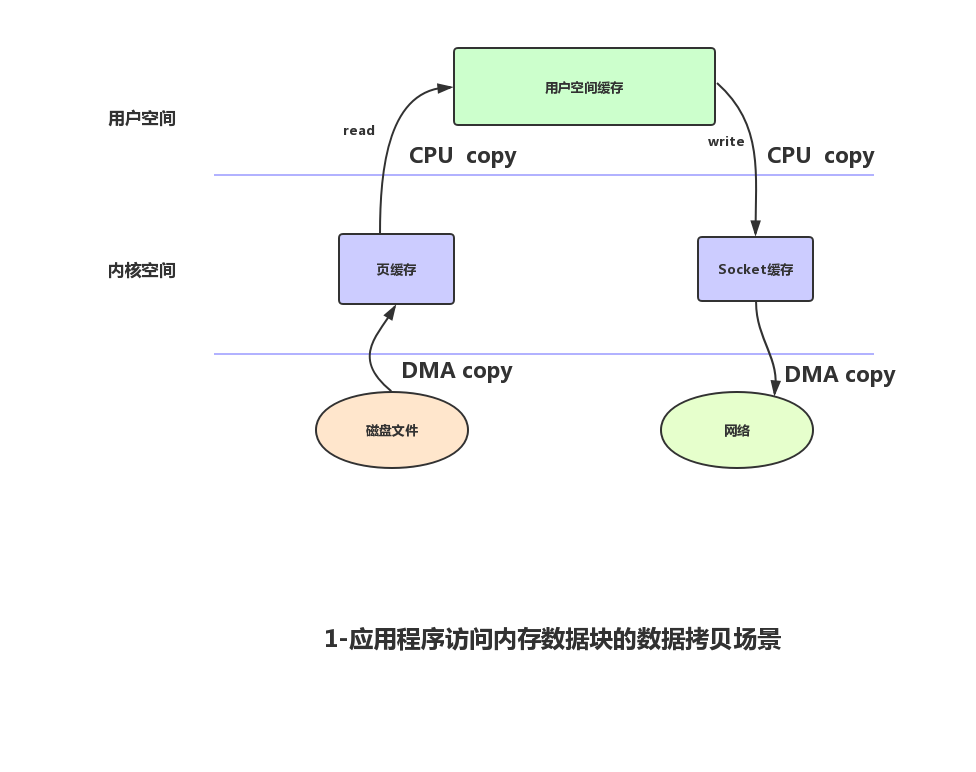
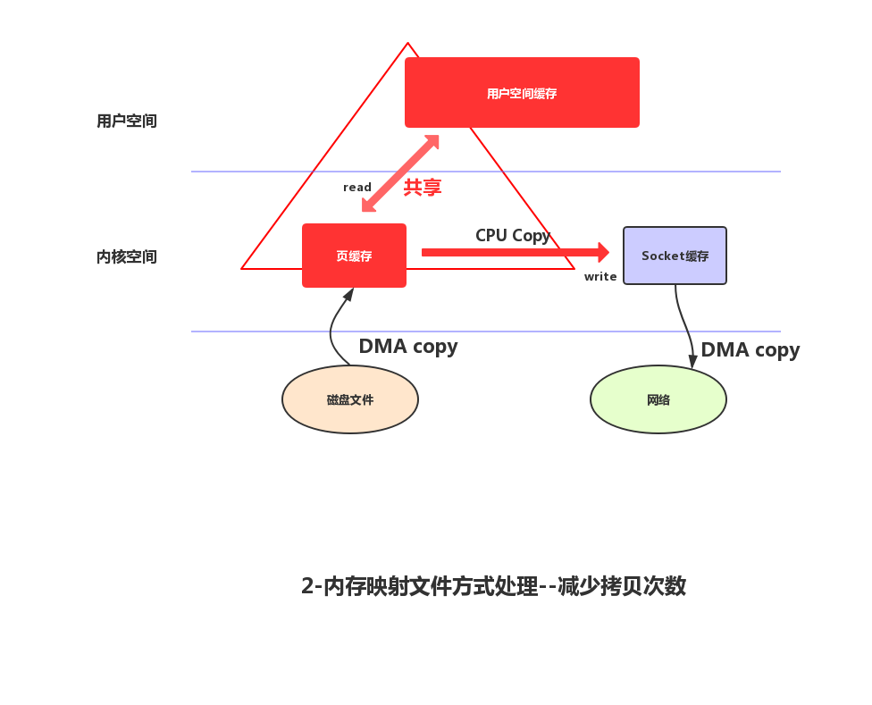

# 零拷贝

零拷贝主要的任务就是避免CPU将数据从一块存储拷贝到另外一块存储，主要就是利用各种零拷贝技术，避免让CPU做大量的数据拷贝任务，减少不必要的拷贝，或者让别的组件来做这一类简单的数据传输任务，让CPU解脱出来专注于别的任务。这样就可以让系统资源的利用更加有效。

以下是正常的读取数据传输到网络中去的数据拷贝场景：


在这个场景中，共产生了四次数据拷贝。即使使用了DMA来处理了与硬件的通讯，CPU仍然需要处理两次数据拷贝，与此同时，在用户态与内核态也发生了多次上下文切换，无疑也加重了CPU负担。
在此过程中，我们没有对文件内容做任何修改，那么在内核空间和用户空间来回拷贝数据无疑就是一种浪费，而零拷贝主要就是为了解决这种低效性。

如何减少内核空间和用户空间来回拷贝次数呢？

## 让数据不经过用户空间

使用内存映射文件mmap，使用mmap操作时，磁盘的数据会拷贝到内核空间，操作系统会把映射过的这段内核区与应用程序共享，如此一来，就不需要把内核缓冲区的数据内容往用户空间拷贝。写数据时，操作系统直接将内存缓冲区的数据拷贝到Socket缓冲区中，这一切都发生在内核空间中，看图：




Java内存映射类： ```java.nio.MappedByteBuffer```, 该类的实例通过```java.nio.channels.FileChannel.map```获取。


- 扩展资料 ： https://www.jianshu.com/p/fad3339e3448