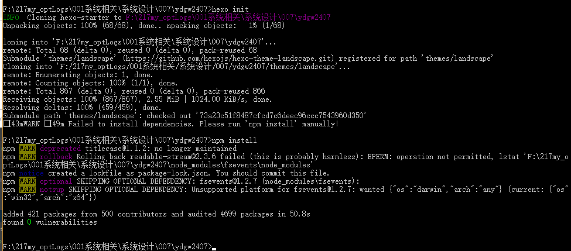
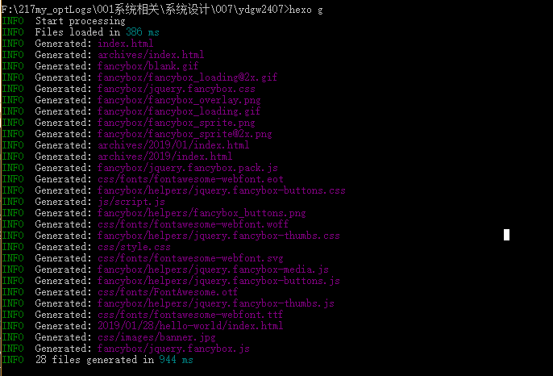
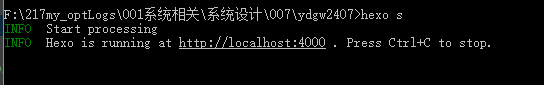
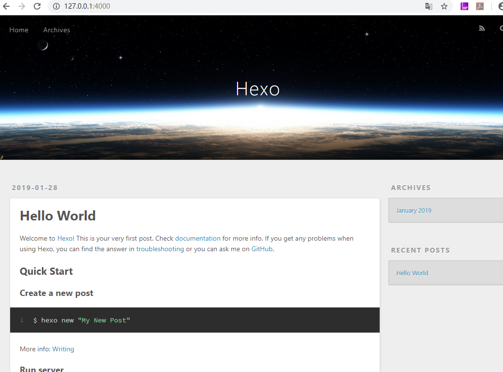
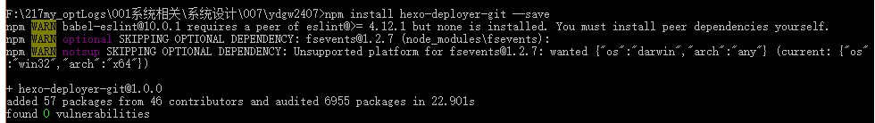
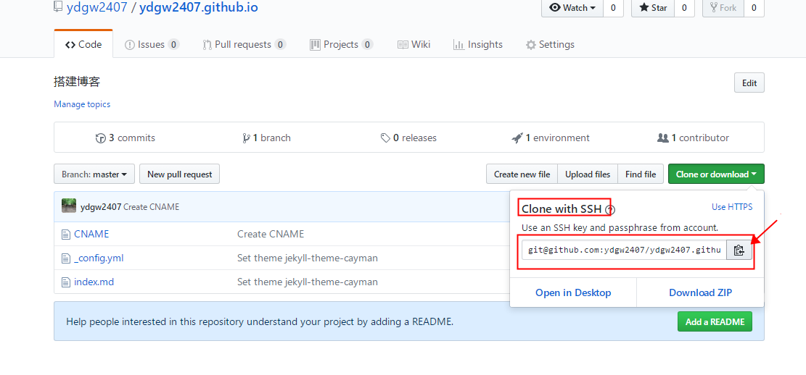

## 基于Github+Hexo从零开始搭建个人博客(下)


### 找一个空目录使用Hexo初始化

空目录执行：
```
hexo init
npm install
```




### 生成静态文件

```
hexo g
或者
hexo generate
```



### 启动服务预览

```
hexo s
或者
hexo server
```



在浏览器输入：127.0.0.1:4000，即可看到：



### 变更默认的Hexo 主题

您 可以在 https://hexo.io/themes/index.html 进行主题的挑选更换。
下载好后放在```themes```文件夹内，同时在 ```_config.yml``` 中进行配置变更就好了。

这里采用了主体： https://blinkfox.github.io/2018/09/28/qian-duan/hexo-bo-ke-zhu-ti-zhi-hexo-theme-matery-de-jie-shao/
可参见使用说明。

在根目录的themes目录下执行：

```
git clone https://github.com/blinkfox/hexo-theme-matery.git
```

原来有一个主题为：landscape，克隆完成后可以看到一个新的主题：hexo-theme-matery。

#### 修改 _config.yml

修改根目录下的配置文件 ```_config.yml``` ，替换：

```yaml
# Extensions
## Plugins: https://hexo.io/plugins/
## Themes: https://hexo.io/themes/
theme: landscape
```

变更为：

```yaml
# Extensions
## Plugins: https://hexo.io/plugins/
## Themes: https://hexo.io/themes/
theme: hexo-theme-matery

```

#### 使主题生效

重新生成文件，并启动服务：

```
hexo clean
hexo g
hexo s
```

再刷新浏览器可以看到崭新的页面：


### 配置SSH Key

如何配置SSH Key，请参考 Pro Git 教程：https://git-scm.com/book/zh/v2/%E6%9C%8D%E5%8A%A1%E5%99%A8%E4%B8%8A%E7%9A%84-Git-%E7%94%9F%E6%88%90-SSH-%E5%85%AC%E9%92%A5

一般是： ssh-keygen -t rsa -C "your_email@youremail.com"
再打开生成的公钥.pub 将内容复制到Github上去。

回到Github账户资料，找到 ```settings ---> SSH and GPG keys```。


### 部署到Github

要将服务部署到Github上去，需要安装Hexo提供的一个插件。

#### 安装 hexo-deployer-git

在根目录下执行(不是git bash里)：

```
npm install hexo-deployer-git --save
```



#### 修改配置文件的发布地址

获取SSH地址：


```_config.yml``` 文件的发布方式需要修改：

```yaml
# Deployment
## Docs: https://hexo.io/docs/deployment.html
deploy:
  type:

```
修改为：

```yaml

# Deployment
## Docs: https://hexo.io/docs/deployment.html
deploy:
  type: git
  repo: git@github.com:ydgw2407/ydgw2407.github.io.git
  branch: master
  

```


#### 部署到Github

套路式命令：

```shell
# 清楚缓存
hexo clean
# 生成文件
hexo g
# 部署到服务上
hexo d
```


### 恭喜！访问成功！

浏览器输入：https://ydgw2407.github.io/，出现界面：


### 保存代码

将本地主目录推送到远程其他分支，保存代码。

因为发布的分支选的是master，所以每次发布都会影响，所以我们选择将所有的代码上传到其他分支。

比如我们新建一个分支 prd，以后都在prd分支上修改，新建文章，发布的时候会发布到master分支上，这样一来，编写与发布互不干扰了。


