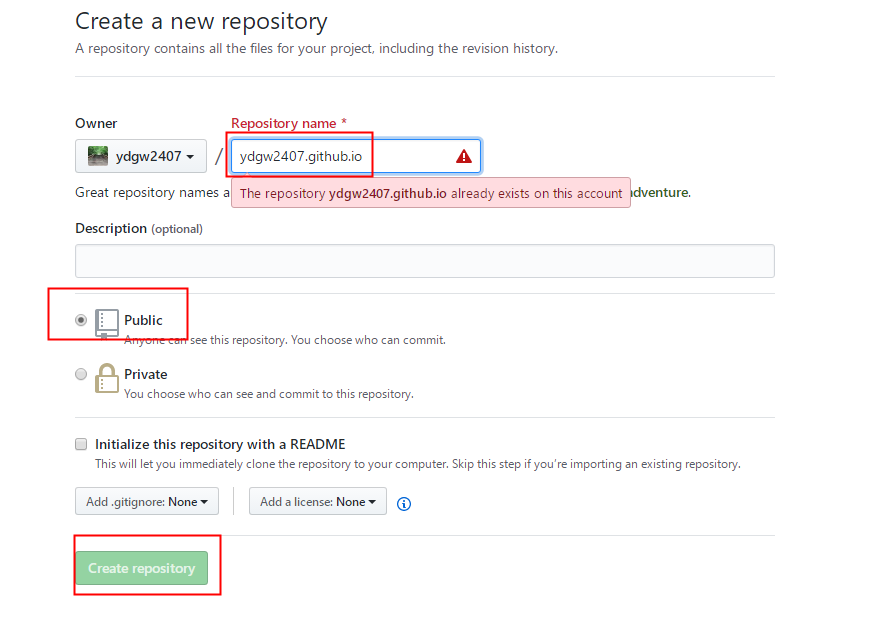
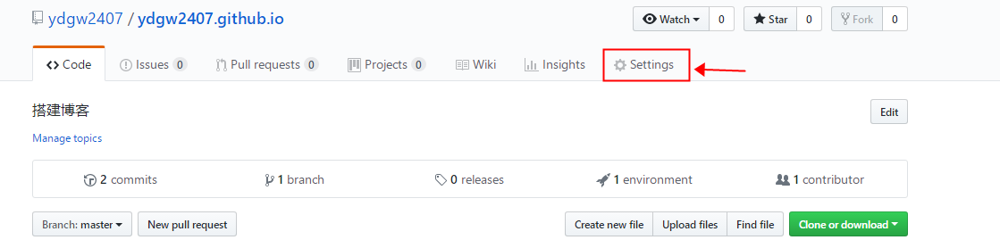
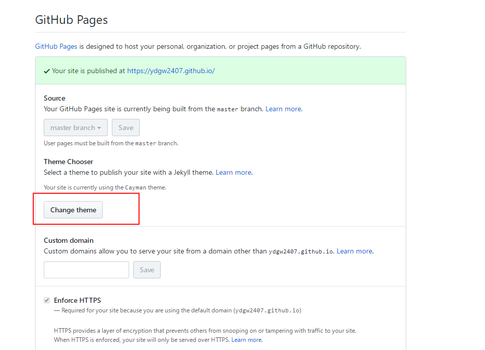
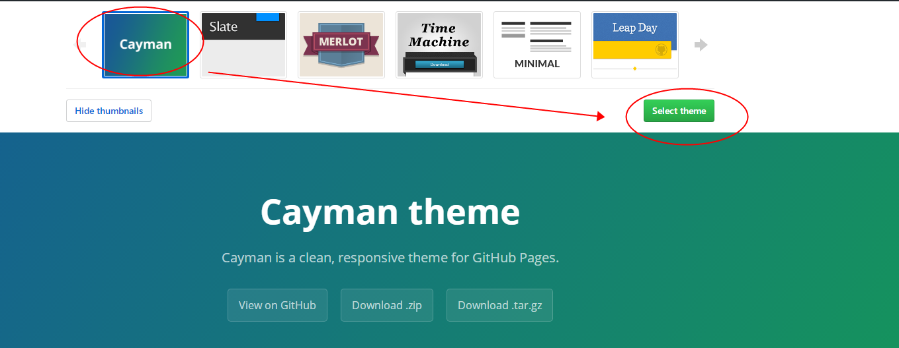
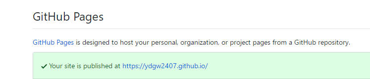
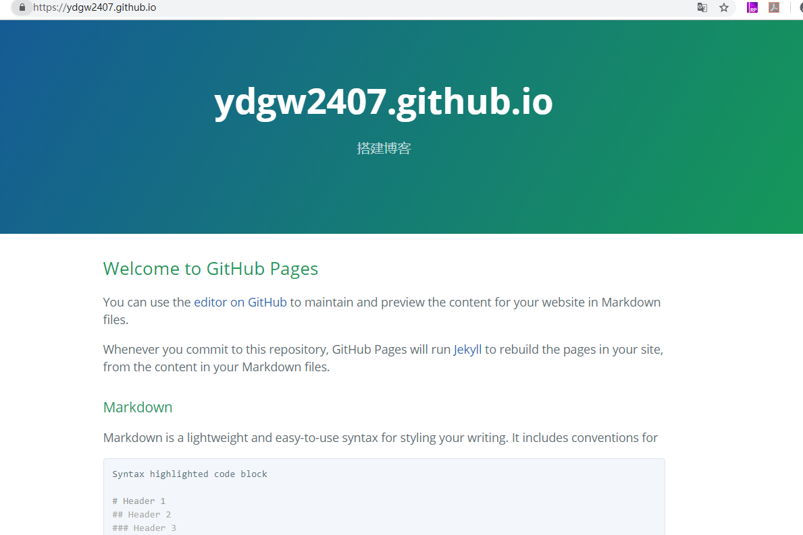
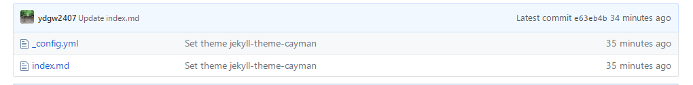
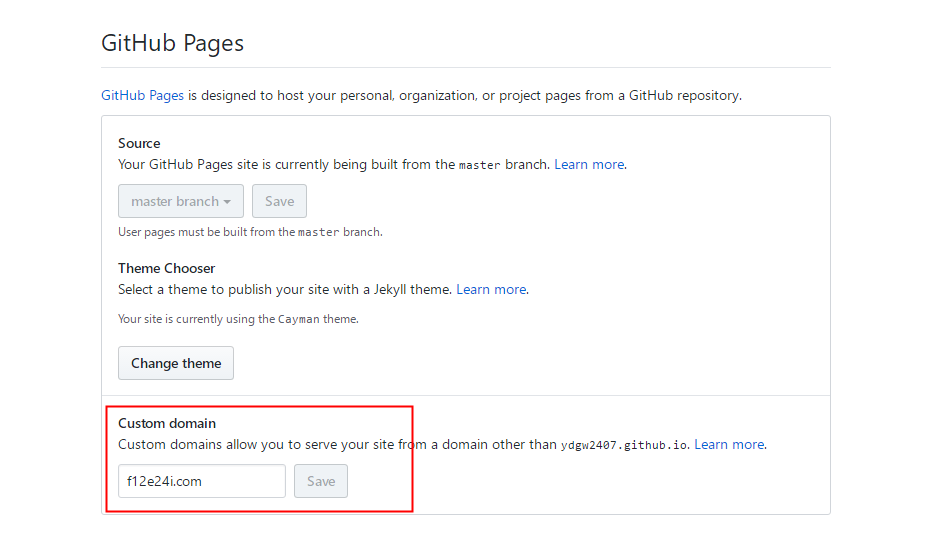
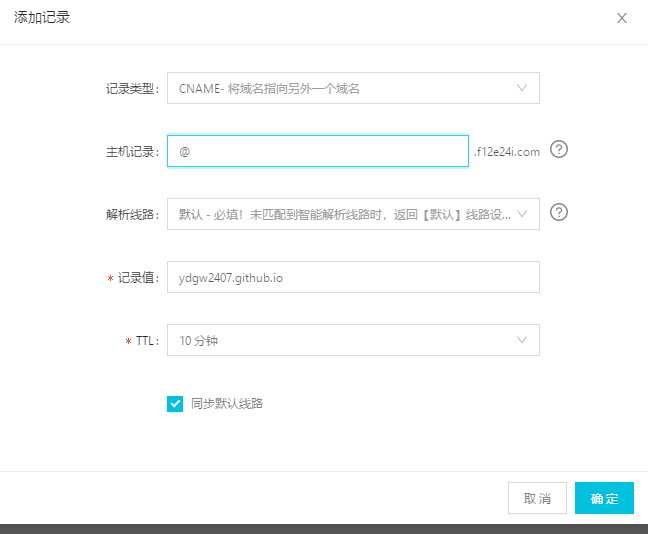
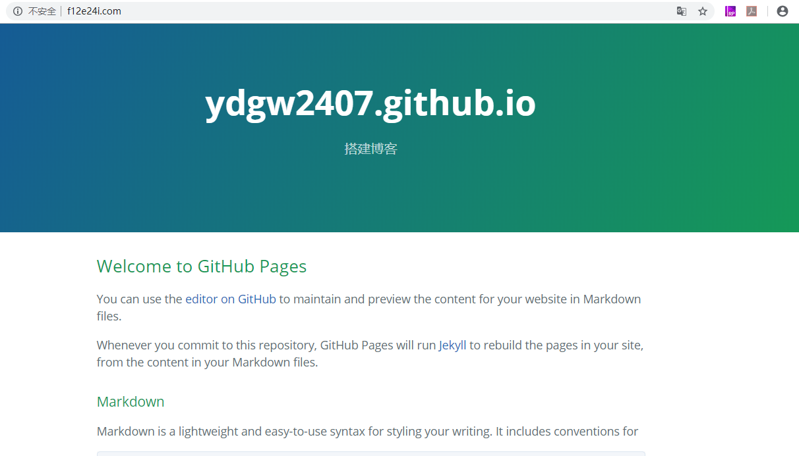

## 基于Github+Hexo从零开始搭建个人博客(上)

### Github 准备工作

#### 打开 Github 官网， https://github.com/，申请注册一个账号。

#### 创建一个名为【账户名.github.io】的仓库

假设账号是： ```ydgw2407```，则建立博客仓库名为：```ydgw2407.github.io```。

- 1.创建仓库

将仓库属性选择为公开的：public。



- 2.设置仓库的github页面属性

进入仓库，点击 ```settings``` 选项，下拉到 **GitHub Pages** 相关选项。
点击设置主题： ```Change theme``` 按钮，选择默认的主题 Cayman，点击选择：```Select theme```








回到仓库的主页（即仓库--->settings，刚才的Github Pages页面），可以看到提示，页面设置成功了：




您就可以在浏览器输入： https://ydgw2407.github.io/，访问了：



- 3.设置页面完成后，可以看到该仓库生成了2个文件：



### 初始化后的页面文件

#### _config.yml 配置文件

该配置文件仅含一行代码，指定了页面使用的主题，也就是我们在前面指定的：cayman。
从主题命名可以看到，该页面是基于 [jekyll](https://jekyllrb.com/) 的, jekyll的中文网站是：https://www.jekyll.com.cn/。

```yaml
theme: jekyll-theme-cayman
```


#### index.md 首页

该文件描述了初始化后的 Github pages 页面展示的内容。


### 绑定域名

用户可以选择去域名服务商购买域名，这里使用阿里云购买的域名：



绑定域名后，可以看到项目根目录下增加了一个 ```CNAME``` 的文件，打开可以看到是我们刚才绑定的域名：

```
f12e24i.com
```

### 在域名服务端将域名解析到 account.github.io

添加域名解析，添加： 

- 记录类型：**CNAME**
- 主机记录： **@**
- 记录值： **ydgw2407.github.io**
- TTL ： 默认10分钟即可



过一会刷新下，就可以看到解析完成。

### 域名解析成功

域名解析成功后，就可以使用你的域名访问页面了。



