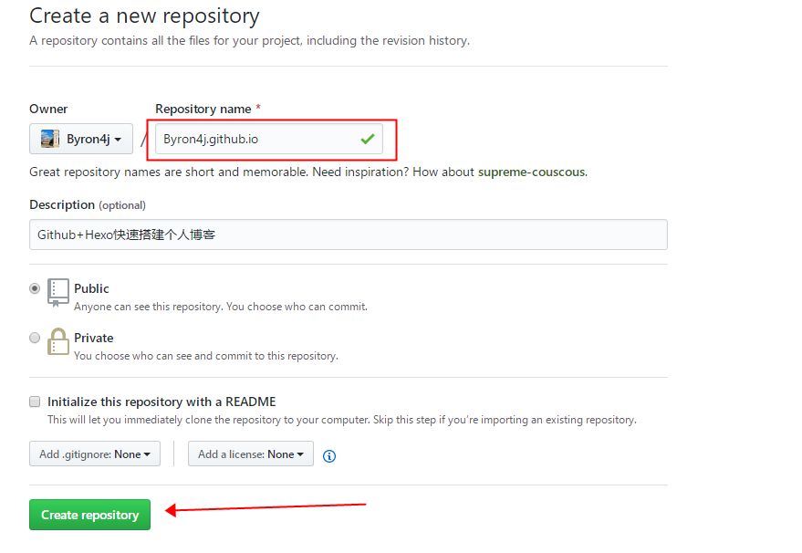
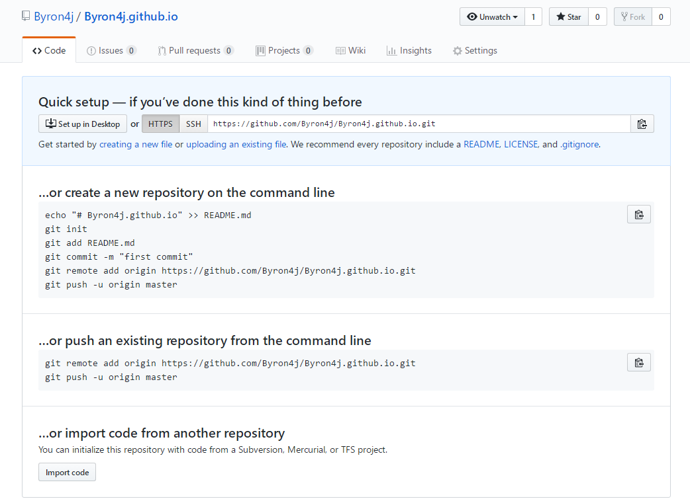
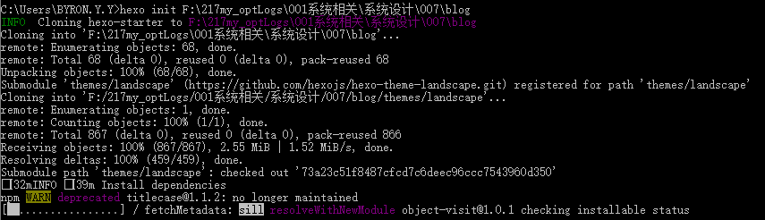
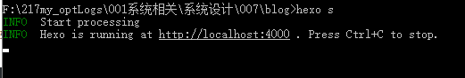
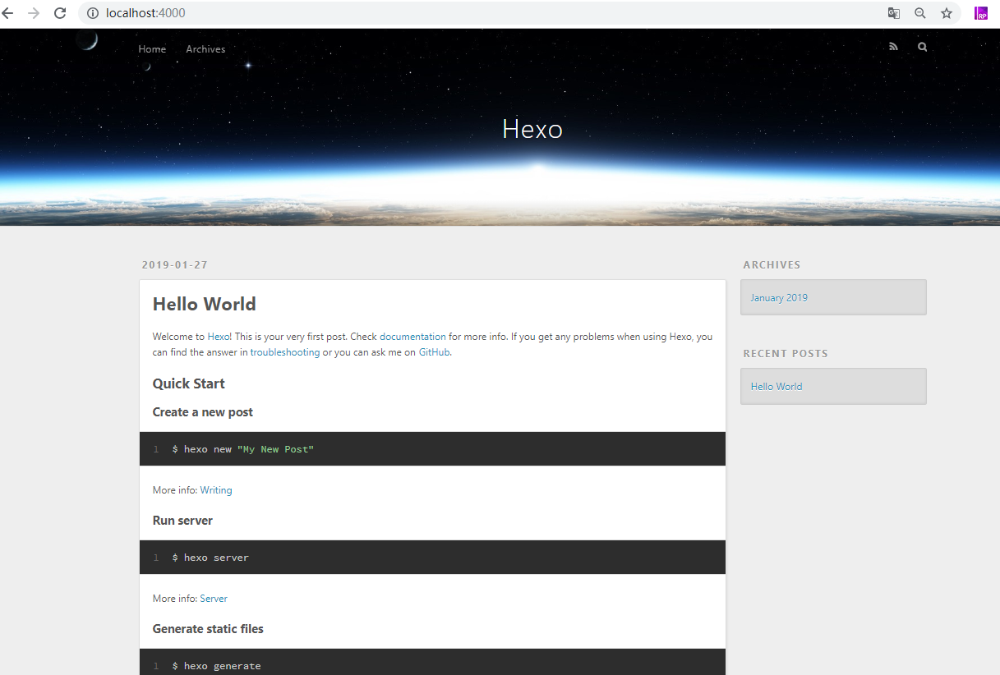
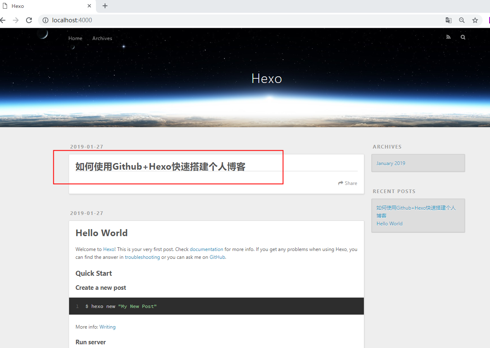
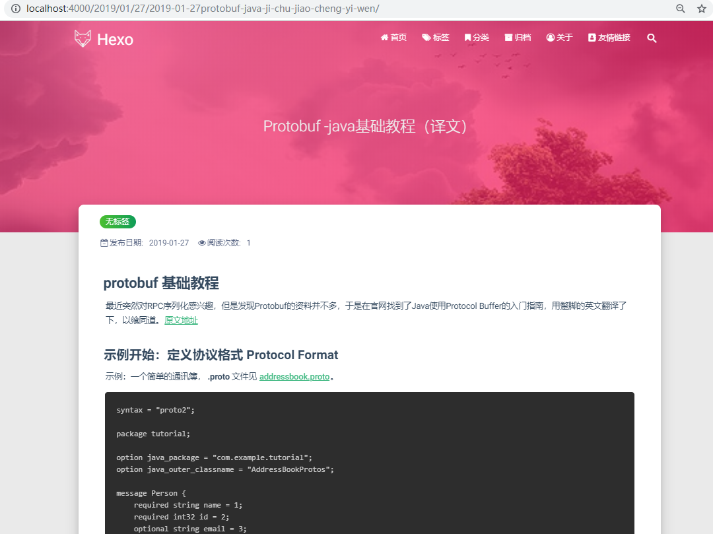

## 如何使用Github+Hexo快速搭建个人博客

假设道友已经都是git熟练使用者了，这里不再详细介绍git相关知识。
git还未入门的可以查看[Git常用核心命令](https://blog.csdn.net/zixiao217/article/details/82931096)
或者访问[Pro Git（中文版）](https://gitee.com/progit/) get 更多知识点。
### 在Github新建仓库，取名 account.github.io

这里的 account 是您的在Github上的账户名。



也可以直接用命令创建仓库：

```shell
echo "# Byron4j.github.io" >> README.md
git init
git add README.md
git commit -m "first commit"
git remote add origin https://github.com/Byron4j/Byron4j.github.io.git
git push -u origin master
```

或者将已经存在的仓库覆盖：

```shell
git remote add origin https://github.com/Byron4j/Byron4j.github.io.git
git push -u origin master
```




### 安装Node.js

Hexo基于Node.js，所以您还需要安装Node.js。Node.js的官网下载地址： http://nodejs.cn/download/，选择适合您操作系统的安装程序包。


### 安装Hexo

Hexo 官方网址： https://hexo.io/zh-cn/。
Hexo使用文档参考：https://hexo.io/zh-cn/docs/。

使用 npm 安装 Hexo(演示是在windows-64环境下)：

```nodejs
npm install -g hexo-cli
```

安装结果如下：

```batch
C:\Users\BYRON.Y.Y>npm install -g hexo-cli
C:\Users\BYRON.Y.Y\AppData\Roaming\npm\hexo -> C:\Users\BYRON.Y.Y\AppData\Roaming\npm\node_modules\hexo-cli\bin\hexo
npm WARN rollback Rolling back readable-stream@2.3.6 failed (this is probably harmless): EPERM: operation not permitted, rmdir 'C:\Users\BYRON.Y.Y\AppData\Roaming\npm\node_modules\hexo-cli\node_modules\fsevents'
npm WARN optional SKIPPING OPTIONAL DEPENDENCY: fsevents@1.2.7 (node_modules\hexo-cli\node_modules\fsevents):
npm WARN notsup SKIPPING OPTIONAL DEPENDENCY: Unsupported platform for fsevents@1.2.7: wanted {"os":"darwin","arch":"any"} (current: {"os":"win32","arch":"x64"})

+ hexo-cli@1.1.0
added 225 packages from 431 contributors in 60.523s
```

### 如何使用 Hexo

指定一个空目录初始化hexo所需文件：

命令：
```shell
hexo init 目录名(要求是空目录)
```

```batch
C:\Users\BYRON.Y.Y>hexo init F:\217my_optLogs\001系统相关\系统设计\007\blog
INFO  Cloning hexo-starter to F:\217my_optLogs\001系统相关\系统设计\007\blog
Cloning into 'F:\217my_optLogs\001系统相关\系统设计\007\blog'...
remote: Enumerating objects: 68, done.
remote: Total 68 (delta 0), reused 0 (delta 0), pack-reused 68
Unpacking objects: 100% (68/68), done.
Submodule 'themes/landscape' (https://github.com/hexojs/hexo-theme-landscape.git) registered for path 'themes/landscape'
Cloning into 'F:/217my_optLogs/001系统相关/系统设计/007/blog/themes/landscape'...
remote: Enumerating objects: 1, done.
remote: Counting objects: 100% (1/1), done.
remote: Total 867 (delta 0), reused 0 (delta 0), pack-reused 866
Receiving objects: 100% (867/867), 2.55 MiB | 1.52 MiB/s, done.
Resolving deltas: 100% (459/459), done.
Submodule path 'themes/landscape': checked out '73a23c51f8487cfcd7c6deec96ccc7543960d350'
INFO  Install dependencies
npm WARN deprecated titlecase@1.1.2: no longer maintained
npm notice created a lockfile as package-lock.json. You should commit this file.
npm WARN optional SKIPPING OPTIONAL DEPENDENCY: fsevents@1.2.7 (node_modules\fsevents):
npm WARN notsup SKIPPING OPTIONAL DEPENDENCY: Unsupported platform for fsevents@1.2.7: wanted {"os":"darwin","arch":"any"} (current: {"os":"win32","arch":"x64"})

added 421 packages from 500 contributors and audited 4699 packages in 72.178s
found 0 vulnerabilities

INFO  Start blogging with Hexo!
```




新建完成后，生成如下目录文件：

```batch
C:\Users\BYRON.Y.Y>dir /B F:\217my_optLogs\001系统相关\系统设计\007\blog
.gitignore
node_modules
package-lock.json
package.json
scaffolds
source
themes
_config.yml
```


### hexo 项目的文件说明

#### _config.yml 是配置信息

网站的 配置 信息，您可以在此配置大部分的参数。
应用程序的信息。[EJS](http://embeddedjs.com/), [Stylus](http://learnboost.github.io/stylus/) 和 [Markdown](http://daringfireball.net/projects/markdown/) renderer 已默认安装，您可以自由移除。
更多关于该文件的说明可以参考：https://hexo.io/zh-cn/docs/configuration。

#### scaffolds 模板文件

[模板](https://hexo.io/zh-cn/docs/writing)文件夹，当您新建文章时，hexo会根据模板来创建新的文件。

Hexo的模板是指在新建的markdown文件中默认填充的内容。例如，如果您修改scaffold/post.md中的Front-matter内容，那么每次新建一篇文章时都会包含这个修改。

#### source 

资源文件夹是存放用户资源的地方。除 _posts 文件夹之外，开头命名为 _ (下划线)的文件 / 文件夹和隐藏的文件将会被忽略。Markdown 和 HTML 文件会被解析并放到 public 文件夹，而其他文件会被拷贝过去。

#### themes

[主题](https://hexo.io/zh-cn/docs/themes)文件夹。Hexo 会根据主题来生成静态页面。


### 浏览博客雏形

进入hexo项目目录中，使用如下命令开启博客服务：

```shell
hexo s
```



浏览器中访问：http://localhost:4000。



至此，代表着博客已经完成搭建了，剩下的工作就是不断完善了。

### 使用Hexo写文章

在项目目录下使用如下命令可以创建一片新的文章：

```shell
hexo new [layout] <title>
```

您可以在命令中指定文章的布局（layout），默认为 post，可以通过修改 _config.yml 中的 default_layout 参数来指定默认布局。

#### 布局（Layout）

Hexo 有三种默认布局：post、page 和 draft，它们分别对应不同的路径，而您自定义的其他布局和 post 相同，都将储存到 source/_posts 文件夹。

|布局|路径|
|----|----|
|post|source/_posts|
|page|source|
|draft|source/_drafts|

#### 文件名称

Hexo 默认以标题做为文件名称，但您可编辑 ```new_post_name``` 参数来改变默认的文件名称，举例来说，设为 :```year-:month-:day-:title.md``` 可让您更方便的通过日期来管理文章。

我们修改配置文件new_post_name的值后，新建一篇文章：

```shell
F:\217my_optLogs\001系统相关\系统设计\007\blog>hexo new post 如何使用Github+Hexo快速搭建个人博客
INFO  Created: F:\217my_optLogs\001系统相关\系统设计\007\blog\source\_posts\2019-01-27-如何使用Github-Hexo快速搭建个人博客.md
```

再刷新浏览器页面，可以看到新增了一篇文章：




#### 草稿

刚刚提到了 Hexo 的一种特殊布局：```draft```，这种布局在建立时会被保存到 ```source/_drafts``` 文件夹，您可通过 ```publish``` 命令将草稿移动到 ```source/_posts``` 文件夹，该命令的使用方式与 ```new``` 十分类似，您也可在命令中指定 ```layout``` 来指定布局。

```shell
hexo publish [layout] <title>
```

草稿默认不会显示在页面中，您可在执行时加上 ```--draft``` 参数，或是把 ```render_drafts``` 参数设为 true 来预览草稿。

我们把配置参数设置一下: render_drafts.

```yaml
#render_drafts: false
render_drafts: true
```

#### 模版（Scaffold）

在新建文章时，Hexo 会根据 scaffolds 文件夹内相对应的文件来建立文件，例如：

```
hexo new photo "My Gallery"
```

在执行这行指令时，Hexo 会尝试在 scaffolds 文件夹中寻找 photo.md，并根据其内容建立文章，以下是您可以在模版中使用的变量：

|变量|描述|
|----|----|
|layout|布局|
|title|标题|
|date|文件建立日期|

### 导入文章

您可以将已写好的 ```.md``` 导入到 ```_posts``` 目录里，完成文章的导入。


### 扉页 Front-matter

扉页 front-matter 是文件最上方以 ```---``` 分隔的区域，用于指定个别文件的变量，示例：

```

---
layout: photo
title: My Gallery
date: 2019-01-27 11:52:58
tags:
---

```

以下是预先定义的参数，您可以在模板中使用这些参数值并加以利用：

|参数|描述|默认值|
|----|----|----|
|layout|布局||
|title|文章标题||
|date|建立日期|yyyy-MM-dd HH:mm:ss 格式|
|updated|更新日期||
|comments|开启文章的评论功能|true|
|tags|标签(不适用于分页)||
|categories|分类（不适用于分页）||
|permalink|覆盖文章网址||

#### 分类和标签

只有文章支持分类和标签，您可以在 Front-matter 中设置。在其他系统中，分类和标签听起来很接近，但是在 Hexo 中两者有着明显的差别：分类具有顺序性和层次性，也就是说 Foo, Bar 不等于 Bar, Foo；而标签没有顺序和层次。

```
categories:
- Diary
tags:
- PS3
- Games
```

>**分类方法的分歧**
>
>如果您有过使用WordPress的经验，就很容易误解Hexo的分类方式。WordPress支持对一篇文章设置多个分类，而且这些分类可以是同级的，也可以是父子分类。但是Hexo不支持指定多个同级分类。下面的指定方法：
>
>categories:
>- Diary
>- Life
>
>会使分类Life成为Diary的子分类，而不是并列分类。因此，有必要为您的文章选择尽可能准确的分类。


#### JSON Front-matter

除了YAML格式外，还支持json格式的扉页.
只要将 ```---``` 代换成 ```;;;``` 即可

```
,,,
"title": "Hello World",
"date": "2013/7/13 20:46:25"
;;;

```

### 部署到服务器上去

Hexo 提供了快速方便的一键部署功能，让您只需一条命令就能将网站部署到服务器上。

```
hexo deploy
```

在开始之前，您必须先在 _config.yml 中修改参数，一个正确的部署配置中至少要有 type 参数，例如：

```
deploy:
  type: git
```

您可同时使用多个 deployer，Hexo 会依照顺序执行每个 deployer:

```
deploy:
- type: git
  repo:
- type: heroku
  repo:
```


```yaml
deploy:
  type: git
  repo: <repository url> #https://bitbucket.org/JohnSmith/johnsmith.bitbucket.io
  branch: [branch] #published
  message: [message]
```


#### 安装 hexo-deployer-git

```
npm install hexo-deployer-git --save
```


更多关于部署的信息参考：https://hexo.io/zh-cn/docs/deployment。


### Hexo 主题

您 可以在 https://hexo.io/themes/index.html 进行主题的挑选更换。
下载好后放在```themes```文件夹内，同时在 ```_config.yml``` 中进行配置变更就好了。

这里采用了主体： https://blinkfox.github.io/2018/09/28/qian-duan/hexo-bo-ke-zhu-ti-zhi-hexo-theme-matery-de-jie-shao/
可参见使用说明。


### 展示成型的博客

