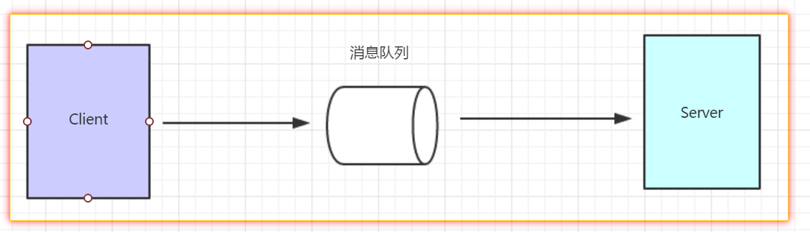
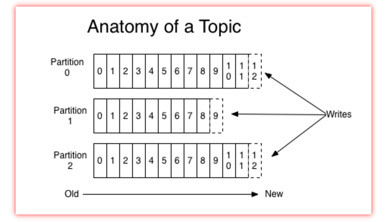
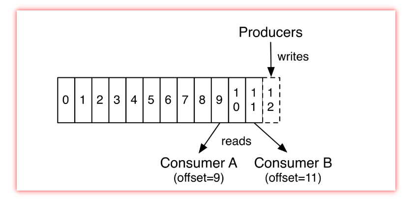
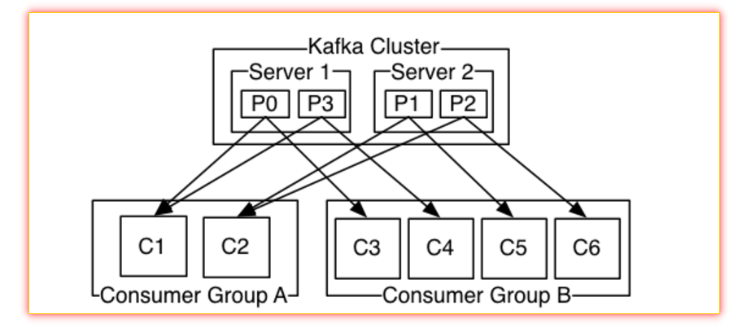
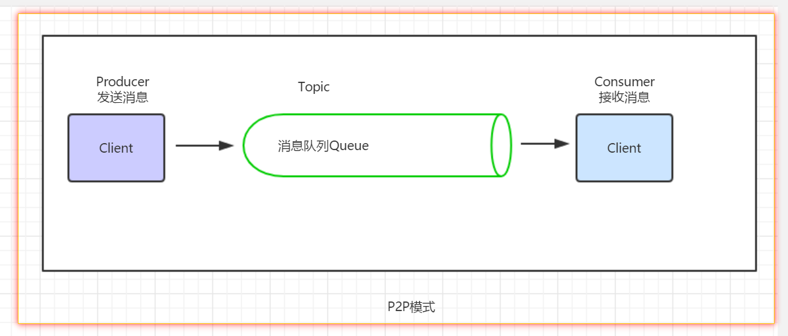
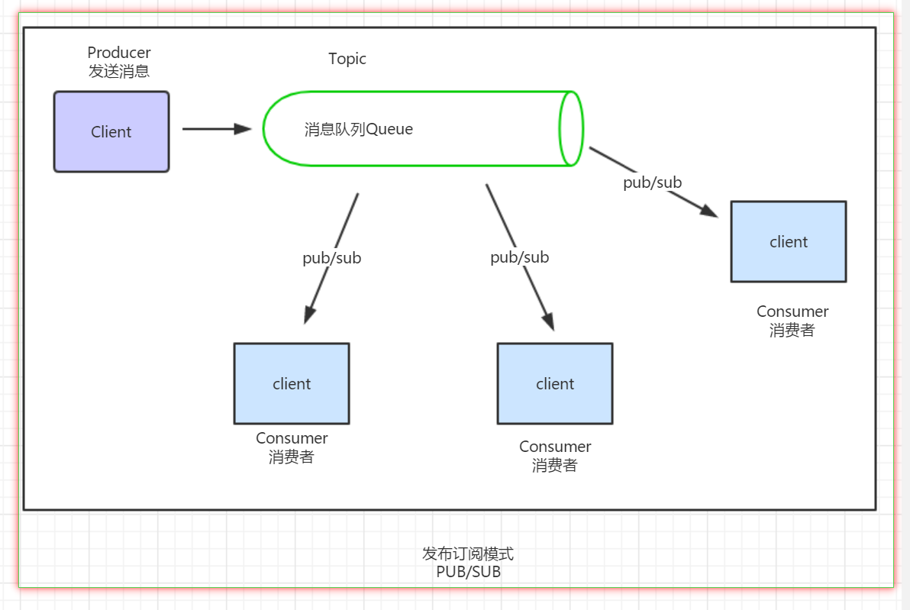
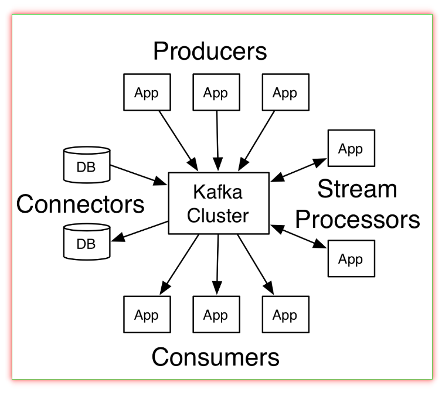
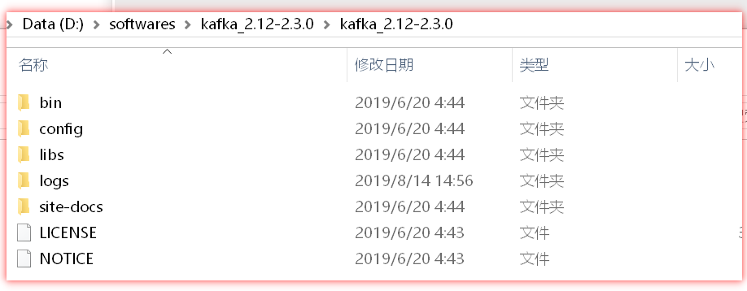

# Kafka 登堂入室

- [ ] 理解消息队列
- [ ] 认识kafka
- [ ] kafka核心概念
- [ ] kafka结构
- [ ] 安装启动kafka
- [ ] 使用kafka


# 消息队列

## 知识要点

- 背景、问题的产生
- 消息队列应运而生
- 消息队列的特点


### 2.1 背景、问题的产生

传统单体应用逐渐被```SOA架构```、```微服务```体系架构所替代，如此一来系统数目爆炸级增长，原来在一个系统之间的数据交互演变成跨系统、跨区域。

如何来解决数据信息的传输呢？使用Rest Api进行HTTP通信？ 还是采用Web Service ？

- `HTTP Rest` 通信
  - 传输双方需要维护各自的接口url，需要编写大量的对接服务
  - 如果一方存在变更，另一方不得不被动的改变迭代上线，影响生产的稳定性
  - 除了同步接口方式，不得不为了保证数据的完整性，采取一套异步机制
  - 如此一来，双方在主要业务流程之外，还需要对数据的传输花费大量的人力来维护，本末倒置
- `Web Service` 传输
  - Web Service  仅仅将HTTP的方式包装了一个服务注册地，使得调用双方无需关注真实地址
  - 但是并没有从根本上将调用双方解耦，业务还是受到双方服务调用的限制


### 2.2 消息队列应运而生

为了应对数据在错综复杂的大型项目中传输困难问题，消息队列应运而生。

==消息队列(Message Queue)可以理解是一个容器，用于存放数据==。生产者可以将数据传输到消息队列中，消费者再从消息队列中获取需要的数据信息，这样，生产者、消费者互相解耦。

- 原来的交互


- 使用消息队列后




使用消息队列后，交互双方进行了解耦；并且减少了交互次数。


因为消费者大都数时候仅仅需要关注数据本身，所以其设计往往具有高吞吐性能，这使得我们在进行一些特定场景比如电商大促、秒杀场景的时候就可以采用消息队列进行“削峰填谷”。


### 2.3 消息队列的特点

消息队列需要支持服务双方调用解耦、应对高并发场景，一般具有以下特点：

- 数据持久化存储
  - 未免数据丢失，消息队列应该可以提供配置方式选择将数据进行持久化
- 读写快
  - 消息队列需要支撑“削峰填谷”，应对海量数据交互，要求设计合理，内部读写数据快
  - 一般采用==“零拷贝技术”==、==mmap==技术等：可以参见 [RocketMQ](https://github.com/apache/rocketmq) 技术实现要点。
- 集群部署
  - 要实现高可用，MQ应该支持集群部署，能实现故障转移
- 水平扩展
  - 应该支持水平扩展，通过增加服务器提高集群的可用性、性能
- [支持事务消息]
  - 可选的特性：如 RocketMQ 实现了该特性。


# 认识kafka

## 知识要点

- 认识kafka
- kafka的应用场景

### 2.1 认识kafka

kafka是一个消息队列产品，拥有高吞吐、水平扩展的特性，但是对于业务性数据支持不强，一般使用它做日志消息处理平台使用。

kafka用于构建实时的数据管道或者应用。可以水平扩展、具有容错机制、非常快速，并且已经在数以千计的公司生产环境中使用了。

kafka由Scala和Java编写。Kafka是一种高吞吐量的分布式发布订阅消息系统。

### 2.2 kafka的应用场景

> kafka可以处理消费者在网站中的所有动作流数据。 这些数据通常是由于吞吐量的要求而通过处理日志和日志聚合来解决。 对于像Hadoop一样的日志数据和离线分析系统，但又要求实时处理的限制，这是一个可行的解决方案。Kafka的目的是通过Hadoop的并行加载机制来统一线上和离线的消息处理，也是为了通过集群来提供实时的消息。

谁在使用kafka：


# kafka核心概念

## 知识要点

- kafka相关概念
- 深入理解kafka核心概念

### 2.1 kafka相关概念

- `Topic`

  - kafka存储数据记录的结构单元

- `数据记录`

  - 每一个数据记录由一个 key、value、timestamp 组成

- `Producer` 消费者

  - 可以发布流式记录到一个或者多个kafka topic 的应用

- `Consumer` 消费者

  - 订阅一个或者多个topic的应用并且可以处理这些流式记录数据

- `Stream `流

  - 扮演流式处理器，可以从一个或者多个topic中消费一个输入流，并且产生一个输出流到一个或者多个topic，可以将输入流转换为输出流

- `Connector` 连接器

  - 允许构建、运行一个可重用的生产者或者消费者，用以连接到kafka的topic。例如一个关系型数据库的连接器可以捕获一个表的变更情况。
  - 可以关注[RocketMQ Connector](https://github.com/apache/rocketmq-externals)生态项目。

  

  

### 2.2 深入理解kafka核心概念

  kafka的一些核心概念需要我们重点掌握。

- Topics 和Logs
- 分布式 Distribution
- 地理复制 Geo-Replication
- 生产者 Producer
- 消费者 Consumer
- 多租户 Multi-tenancy
- 可靠性的保证 Guarantees


#### 2.2.1 Topics 和Logs

Topic 是kafka中记录发布数据消息的类别或者名称；

Topic可以存在多个订阅者；

对于每一个Topic，kafka集群会维护一个分区的日志log：



每一个分区都是有序的，不可变的序列，他会被连续的追加到——结构化的**commit log**中。

分区中的每一个记录都会被分配一个序列id编号——***offset***,在每个分区中是唯一的。

kafka集群会持久化保存所有发布的消息记录，不论是否被消费过都会持久化存储——可以配置滞留时间（retention）。例如，如果滞留策略设置为2天，2天内可以存储并被消费掉，超过这个时间将会被回收丢弃，释放空间。对于数据的大小而言，kafka的性能实际上是稳定的，所以存储数据很长时间都不是问题，为什么？因为kafka是顺序写数据，分区会记录offset，所以存储很多数据和少量数据差异不大（当然不要太大了哦）。




实际上，每一个消费者保留的元数据是该消费者在日志中的偏移量或者位置。

该偏移量由消费者控制：通常消费者在读取记录时会线性地推进偏移量，但事实上，由于该位置由消费者控制，所以它可以按照自己喜欢的任何顺序来消费记录。例如，一个消费者可以重置一个旧的顺序offset去处理旧数据或者跳到前面去消费更“及时”的数据。


这个特性意味着kafka中的消费者非常的“随意”——他们可以来去自如而不会对集群或者其他的消费者影响。例如，你可以使用命令行工具“tail”到任意的topic的尾部而不需要变更那些已经被消费者消费国过的topic。


分区在log服务中有几个作用。第一个是，允许log被扩展到适合单个服务器的大小，每一个独立的的分区必须符合托管它的server服务器，但是一个topic会有多个分区，所以它可以处理任意数量的数据。第二个是，它们可以作为并行机制的单元——或多或少是这样。


#### 2.2.2 分布式 Distribution

日志的分区被分布式地存储在kafka集群中，每一个server处理数据和分区共享请求。每一个分区都会通过一个可配置的server编号被复制，用于容错处理。


每一个分区都有一个server，扮演“leader”的角色，0个或者多个server扮演“follers”角色。

leader 负责处理该分区的所有的读、写请求；

followers 被动的复制leader的数据。

如果leader挂了，followers中的其中一个会自动成为新的leader。

每个server都是它的分区的leader或者是其他分区的follower，所以这样可以保持集群的负载均衡。


#### 2.2.3 地理复制 Geo-Replication

kafka 镜像制造者提供了集群的地理复制功能。通过MirrorMaker，消息可以跨多个数据中心或云区域复制。

你可以在 active/passive 场景中备份或者恢复时使用这个功能。


#### 2.2.4 生产者 Producer

生产者是发布消息数据到topic的角色。

生产者负责选择将数据记录分配到topic的哪一个分区。

可以通过简单的负载均衡算法如轮询或者其它方式来实现。


#### 2.2.5 消费者 Consumer

消费者需要通过一个消费者组名（Consumer group）来标志它们，每一个被发布到topic的数据记录都会被被订阅的消费组中的一个消费者消者消费。消费者实例可以在不同的进程中或者不同的机器中。


如果所有的消费者实例都有一个相同的消费者组名，数据记录将会通过负载均衡机制到消费者实例中被消费。

如果所有的消费者实例都是不同的消费者组名，没一个数据记录都会被广播到其他所有的消费者实例中去。




1个2个server的kafka集群主机，且有4各分区，2个消费者组。消费者组A有2个消费者，组B有4个消费者实例。


大都数情况下，topic一般只会有少部分消费者组，每一个都叫做“逻辑订阅者”。

每个组都由很多消费者实例组成，可扩展以及容错。

这也是发布-订阅的语义，只不过订阅的是一个消费者集群而不是单个的进程。


kafka中消费方式的实现是在消费实例上划分日志中的分区，以便每个实例在任何时间点都是分区“公平份额”的唯一消费方。这个消费者组的关系的过程是由kafka协议动态维护的。如果新的消费者实例加入到组中，就会从其他的消费者那里接管一些分区；如果实例挂了，它的分区将会分发给剩下的实例。


kafka只提供了分区内的顺序有效记录，而不是在topic的多个分区中有序。

对于大多数应用来说，针对分区内排序或者按key划分数据的能力就够用了。但是，如果你想让一个topic全部有序，那需要将topic全放在一个分区里面，这意味着在消费组中仅仅有一个消费者去处理该topic。


#### 2.2.6 多租户 Multi-tenancy

kafka可以部署为多租户的解决方案，是通过决定让哪些topic可以生产、消费数据来配置的。

同样也支持配额限制，管理员可以在请求上定义和实施配额，以控制客户端使用的代理资源。


#### 2.2.7 可靠性的保证 Guarantees

一个高可用的kafka提供了以下得保证：

- 生产者发送消息到特定的topic分区是顺序追加的。
  - 如果记录 M1、M2先后被同一个生产者发送，那么 M1 的offset 会比 M2 的小，且先于 M2 在log中出现。
- 一个消费者实例也是按顺序查看log中存储的消息记录的
- 对于一个复制因子（replication factor）为N的topic，我们可以容忍 N-1 个server挂掉，而不会丢失任何commited log中的数据。

# kafka结构

## 知识要点

- kafka内部原理
- kafka结构图
- kafka 集群示意图

### 2.1 kafka消息模式

kafka支持两种消息模式：

- p2p模式（队列模式 Queuing）
- 发布订阅模式（publish-subscribe）

#### 2.1.1 点对点p2p模式（队列模式 Queuing）：

在点对点模式中，一群消费者会从一个server中读取数据，每一个数据会被消费者中的一个给处理。

该模式允许你将数据的处理分发到多个消费者实例中，这可以让你扩展你的消费过程。

但是，在该模式下如果一旦一个消费者处理过后，数据就丢失了。



#### 2.1.2 发布订阅模式（publish-subscribe）：

在发布订阅模式中，数据记录会被广播到所有的消费者中。

也因而缺失了处理过程的可扩展性，因为每个消息都会到每个订阅者中。



但是 kafka 的消费者组概念涵盖了这两个模式。

对于一个queue，消费者组允许你将处理划分为多个进程（消费者组的成员）。

对于publish-subscribe，kafka 允许你广播消息到多个消息组。

kafka模型的优点使得每一个topic都拥有这两种特性——可以扩展处理进程、也可以有多个订阅者——也就没必要去选择其中一个。


一个传统的queue在server上顺序保存数据记录，如果多个消费者从队列中消费数据，则server会按存储的顺序分发记录。尽管server是按顺序分发数据的，但是数据记录是异步地到达消费者中的，所以有可能不是按原来的顺序到达不同的消费者中的。这意味着在并行消费的过程中，失去了原有的顺序表现形式。消息系统通常使用“独占消费者”的概念来解决这个问题，只允许一个进程从queue中进行消费，但是这意味着失去了并行处理的功效。


kafka在这一点做的比较好，通过一个并行概念——==分区partition==——在topic中来实现。

kafka提供了一群消费者进程处理的顺序保证、负载均衡，这是通过在topic中分配分区给消费组中的消费者来做到的，每个分区partition都只会被消费组中的一个消费者给消费。这样做就能确保消费者是按分区的存储顺序进行消费的。尽管有很多分区，这样还是能保持很多消费者实例的负载均衡。==但是请注意，在消费者组中不能存在比分区还多的消费者实例，多余的消费者实例将不会参与消费处理==。


### 2.2 kafka结构图




### 2.3 kafka 集群示意图


# 安装启动kafka

## 知识要点

- 下载安装kafka
- 启动kafka
- 启动

### 2.1 下载安装kafka

kafka控制脚本在基于Unix的系统和windows平台中是不同的，在windows中是在`bin\windows`目录下而不是`bin/`目录，并且脚本扩展名为`.bat`。

先下载kafka，在官网推荐的mirror下载地址下载 ： https://www.apache.org/dyn/closer.cgi?path=/kafka/2.3.0/kafka_2.12-2.3.0.tgz，然后解压。

解压后的目录：




### 2.2 启动kafka

Kafka 使用Zookeeper，所以你首先需要启动Zookeeepr（后文简称ZK）服务（没有使用过Zookeeper的朋友可以点击这里参考[入门教程](https://mp.weixin.qq.com/mp/homepage?__biz=MzI0MjYwOTAwMg==&hid=5&sn=b733717c9c2a780798f058cfbb09cead)）。

也可以使用kafka中打包好的，一个单节点Zookeeper实例 来使用。

类unix平台使用已经打包好的Zk：

```bash
> bin/zookeeper-server-start.sh config/zookeeper.properties
```

windows平台：

```powershell
.\bin\windows\zookeeper-server-start.bat .\config\zookeeper.properties
```

这样就启动了一个单机的ZK实例。


现在可以启动kafka服务了。

类unix平台:

```shell
> bin/kafka-server-start.sh config/server.properties
```

windows平台：

```powershell
.\bin\windows\kafka-server-start.bat .\config\server.properties
```


# 使用kafka

## 知识要点

- 创建topic
- 生产者发行消息
- 消费者消费消息
- 集群部署

### 2.1 使用kafka


开始使用kafka,以下命令均在kafka根目录下执行。

#### 2.1.1 创建一个topic

- 创建 topic

我们使用单个分区、一个副本来创建一个叫做"test" 的topic。

```shell
> bin/kafka-topics.sh --create --bootstrap-server localhost:9092 --replication-factor 1 --partitions 1 --topic test
```

或者在windows平台使用：

```powershell
.\bin\windows\kafka-topics.bat --create --bootstrap-server localhost:9092 --replication-factor 1 --partitions 1 --topic test
```


- 查看 topic

```shell
> bin/kafka-topics.sh --list --bootstrap-server localhost:9092
test
```

或者在windows平台：

```powershell
.\bin\windows\kafka-topics.bat --list --bootstrap-server localhost:9092
test
```

#### 2.1.2 发送一些消息数据

kafka有一个客户端可以从文件或者控制台获取输入作为消息传递给kafka集群。默认情况下，每个行会作为一个单独的消息发送。

```shell
> bin/kafka-console-producer.sh --broker-list localhost:9092 --topic test
This is a message
This is another message
```

windows平台：

```powershell
.\bin\windows\kafka-console-producer.bat --broker-list localhost:9092 --topic test
>This is a message
>This is another message
```

#### 2.1.4 启动一个消费者

kafka也有控制台命令操作消费者，可以转出消息作为输出流：

```shell
> bin/kafka-console-consumer.sh --bootstrap-server localhost:9092 --topic test --from-beginning
This is a message
This is another message
```

windows平台：

```powershell
.\bin\windows\kafka-console-consumer.bat --bootstrap-server localhost:9092 --topic test --from-beginning
This is a message
This is another message
```

如果你是在2不同的命令行窗口打开的，现在可以在第一个producer窗口继续输入信息，然后就会在另一个consumer窗口输出打印到控制台了...

所有的命令行工具都有可选项；不使用任何参数运行命令行则会展示一些帮助信息给你。


#### 2.1.5 启动多个broker的集群kafka

到目前为止我们已经拥有了一个单例的broker，但是这不太好玩。

对于kafka，一个单例的broker仅仅是一个节点规模为1的集群，所以对于启动更多的broker实例，并不会有什么太大的变化。但是对于更好的理解这一点，我们将我们的集群增加到3个节点。


- 首先拷贝我们的 `config/server.properties`

  - 拷贝两次，并且重命名为 ` config/server-1.properties`、` config/server-2.properties`

- 然后修改配置文件的key如下值，其余的保持不变

  - ` config/server-1.properties`:

    - ```properties
      broker.id=1
      listeners=PLAINTEXT://:9093
      log.dirs=/tmp/kafka-logs-1
      ```

  - ` config/server-2.properties`

    - ```properties
      broker.id=2
      listeners=PLAINTEXT://:9094
      log.dirs=/tmp/kafka-logs-2
      ```

==broker.id==属性是在集群中唯一且永久的名称。我们需要覆盖端口以及log的目录，因为我们当前是准备在当前机器运行这些节点。


现在我们启动这两个新的节点、使用新的配置文件：

```powershell
> bin/kafka-server-start.sh config/server-1.properties &
...
> bin/kafka-server-start.sh config/server-2.properties &
...
```

windowd平台：

```powershell
 .\bin\windows\kafka-server-start.bat .\config\server-1.properties

.\bin\windows\kafka-server-start.bat .\config\server-2.properties
```


现在我们来创建一个新的topic使用复制因子为3：

```shell
> bin/kafka-topics.sh --create --bootstrap-server localhost:9092 --replication-factor 3 --partitions 1 --topic my-replicated-topic
```

windows平台;

```powershell
.\bin\windows\kafka-topics.bat --create --bootstrap-server localhost:9092 --replication-factor 3 --partitions 1 --topic my-replicated-topic
```


OK，现在我们已经有一个集群了，但是我们如何知道每个broker在干什么呢？  可以使用 “describe topics” 命令可以查看：

```shell
> bin/kafka-topics.sh --describe --bootstrap-server localhost:9092 --topic my-replicated-topic
Topic:my-replicated-topic       PartitionCount:1        ReplicationFactor:3     Configs:segment.bytes=1073741824
        Topic: my-replicated-topic      Partition: 0    Leader: 2       Replicas: 2,1,0 Isr: 2,1,0
```

windows平台：

```powershell
.\bin\windows\kafka-topics.bat --describe --bootstrap-server localhost:9092 --topic my-replicated-topic
Topic:my-replicated-topic       PartitionCount:1        ReplicationFactor:3     Configs:segment.bytes=1073741824
        Topic: my-replicated-topic      Partition: 0    Leader: 2       Replicas: 2,1,0 Isr: 2,1,0
```

关于输出的结果我们来解释下：

- 第一行给出了关于所有分区的概括，每一个额外的行给出了每一个分区的信息。因为我们的这个topic仅仅有一个分区所以只有一行。
- ==leader== 节点负责该分区所有的的读、写操作。每一个节点都有可能作为该分区的随机选举后的leader。
- ==replicas== 副本是复制该分区日志的节点的列表，无论他们是领导者还是当前活动的节点。
- ==isr== 是一组同步副本。是replicas的子集，当前是活动的并且和leader同步的。


我们也可以使用同样的命令查看原来的test这个topic：

```powershell
.\bin\windows\kafka-topics.bat --describe --bootstrap-server localhost:9092 --topic test

Topic:test      PartitionCount:1        ReplicationFactor:1     Configs:segment.bytes=1073741824
        Topic: test     Partition: 0    Leader: 0       Replicas: 0     Isr: 0
```

无需意外，因为原来的test这个topic没有副本仅仅在server 0中。


==容错测试==

- 关闭一个节点，再查看状态

  - ```shell
    > ps aux | grep server-1.properties
    7564 ttys002    0:15.91 /System/Library/Frameworks/JavaVM.framework/Versions/1.8/Home/bin/java...
    > kill -9 7564
    ```

  - windows平台：

    - ```powershell
      wmic process where "caption = 'java.exe' and commandline like '%server-1.properties%'" get processid
      ProcessId
      20384
      
      taskkill /pid 20384 /f
      成功: 已终止 PID 为 20384 的进程。
      ```

- 现在集群关系可能变更了，我们来看看第二个topic的状态，发现又一个节点已经没有保持同步状态了：

  - ```powershell
     .\bin\windows\kafka-topics.bat --describe --bootstrap-server localhost:9092 --topic my-replicated-topic
    Topic:my-replicated-topic       PartitionCount:1        ReplicationFactor:3     Configs:segment.bytes=1073741824
            Topic: my-replicated-topic      Partition: 0    Leader: 2       Replicas: 2,1,0 Isr: 2,0
    ```

- 但是消息还是可以进行发送消费的


# 总结

kafka是一个消息队列，主要用于流式数据处理，可以利用它做实时分析、离线分析日志系统平台。

kafka的相关概念： 

* topic
* producer
* consumer
* partition
* broker