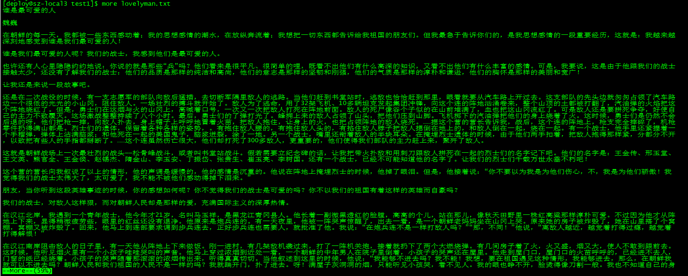

# Linux 基础

### Linux 启动流程

Linux 启动时会看到很多启动信息。
一般 Linux 启动分为5个阶段：
- 内核的引导 Boot
- 运行 init
- 系统初始化
- 建立终端
- 用户登陆系统

><i>init程序的类型</i>：
>
>**SysV**: init, CentOS 5 之前，配置文件： /etc/inittab
>
>**Upstart**: init, Cent OS 6, 配置文件： /etc/inittal,/etc/init/*.conf
>
>**Systemd**: systemd, Cent OS 7,配置文件： /use/lib/systemd/system、/etc/systemd/system

### Linux 常见的rc的含义

在linux中经常会碰到 bashrc,rc.d,rc.local等带有rc的文件或目录，一般都是启动时需要加载的。

- 英文原义：RC （runcom，run command）
- 中文释义：含有程序（应用程序甚至操作系统）启动指令的脚本文件 
- 注　　解：这一文件在操作系统启动时会自动执行，它含有要运行的指令（命令或其它脚本）列表。

真正的rc启动脚本实际上都是放在/etc/rc.d/init.d/目录下。
而这些rc启动脚本有着类似的用法，它们一般能接受start、stop、restart、status等参数。

### 用户登陆方式

一般来说，用户的登录方式有三种：
- （1）命令行登录
- （2）ssh登录
- （3）图形界面登录


Linux 的账号验证程序是 login，login 会接收 mingetty 传来的用户名作为用户名参数。
然后 login 会对用户名进行分析：如果用户名不是 root，且存在 /etc/nologin 文件，login 将输出 nologin 文件的内容，然后退出。
这通常用来系统维护时防止非root用户登录。只有/etc/securetty中登记了的终端才允许 root 用户登录，如果不存在这个文件，则 root 用户可以在任何终端上登录。
/etc/usertty文件用于对用户作出附加访问限制，如果不存在这个文件，则没有其他限制。


### Linux 文件属性

Linux 是一种典型的多用户系统，不同的用户处于不同的地位，拥有不同的权限。
为了保护系统的安全性，Linux系统对不同的用户访问同一文件（包括目录）的权限做了不同的规定。

在 Linux 中，可以使用 **ls -l** 命令来显示一个文件的属性以及文件所属的用户和组。如：


```shell
ls -l
total 23028
-rw-rw-r--  1 deploy deploy        2 Dec 25 21:54 10
-rw-rw-r--  1 deploy deploy        0 Dec 18 16:48 6
-rw-rw-r--  1 deploy deploy    97119 Dec 20 23:52 arthas-boot.jar
-rw-rw-r--  1 deploy deploy      461 Dec 18 20:49 awkvars.out
-rw-rw-r--  1 deploy deploy        5 Dec 27 12:36 emp.awk
-rw-r--r--  1 deploy deploy       81 Dec 17 16:12 emp.data
-rw-r--r--  1 deploy deploy       23 Dec 29 12:35 hello.txt
-rw-rw-r--  1 deploy deploy    43379 Dec 28 12:27 index.html
-rw-r--r--  1 deploy deploy   109230 Dec 18 14:52 loan.txt
drwxr-xr-x  4 deploy deploy     4096 Jan  9 16:17 lua-5.3.0
-rw-rw-r--  1 deploy deploy   278045 Jan  6  2015 lua-5.3.0.tar.gz
drwxr-xr-x  4 deploy deploy     4096 Mar 18  2015 luarocks-2.2.1
-rw-rw-r--  1 deploy deploy   114431 Oct 31 04:52 luarocks-2.2.1.tar.gz
drwxr-xr-x 19 deploy deploy     4096 Dec 28 14:18 Python-3.7.2
-rw-rw-r--  1 deploy deploy 22897802 Dec 24 11:42 Python-3.7.2.tgz
```
在 Linux 中第一个字符代表这个文件时目录、文件或链接文件等等。

- 为 **d** 表示是目录
- 为 **-** 表示是文件
- 为 **l** 表示是链接文件（link file）
- 为 **b** 表示为装置文件里面的可供储存的接口设备（可随机存取装置）
- 为 **c** 表示为装置文件里面的串行端口设备，例如键盘、鼠标（一次性读取装置）


接下来的字符中，且均为 **rwx** 的三个参数的组合，其中 **r** 表示可读，**w** 表示可写， **x** 表示可执行。
这三个权限的位置不会改变，如果没有权限，就会出现减号 **-**。


#### Linux 文件属性和属组

对于文件来说，它都有一个特定的所有者，也就是对该文件具有所有权的用户。
同时，在 Linux 系统中，用户是按组分类的，一个用户属于一个或多个组。
文件所有者以外的用户又可以分为文件所有者的同组用户和其他用户。

因此，Linux 系统按文件所有者、文件所有者同组用户和其它用户来规定了不同的文件访问权限。

```shell
ls -l
total 64
drwxr-xr-x 2 root  root  4096 Feb 15 14:46 cron
drwxr-xr-x 3 mysql mysql 4096 Apr 21  2014 mysql
```

在上面实例中，mysql 文件是一个目录文件，属主和属组都为 mysql，属主有可读、可写、可执行的权限；
与属主同组的其他用户有可读和可执行的权限；其它用户也有可读和可执行的权限。

对于 root 用户，一般情况下，文件的权限对其不起作用。

#### 更改文件属性

##### 1. chgrp 更改文件属组

> chgrp [-R] 属组名 文件名

- **-R** ： 递归更改文件属组，就是在更改某个目录文件的属组时，如果加上 **-R** 的参数，那么该目录下的所有文件的属组都会更改。


##### 2. chown 更改文件属主，也可以同时更改文件属组

>chown [-R] 属主名 文件名
>
>chown [-R] 属主名:属组名 文件名

进入 /root 目录（~）将install.log的拥有者改为bin这个账号：

```shell
[root@www ~] cd ~
[root@www ~]# chown bin install.log
[root@www ~]# ls -l
-rw-r--r--  1 bin  users 68495 Jun 25 08:53 install.log
```

将install.log的拥有者与群组改回为root：

```shell
[root@www ~]# chown root:root install.log
[root@www ~]# ls -l
-rw-r--r--  1 root root 68495 Jun 25 08:53 install.log
```

##### chmode: 更改文9个属性

Linux 文件属性有2中设置方法，一种是数字，一种是符号。
Linux 文件的基本权限有9个。分别是owner/group/others三种身份各有自己的read/write/execute权限。
文件权限字符为 -rwxrwxrwx 这九个权限是三个三个一组的。其中，我们可以使用数字来代表各个权限，个权限的分数对照表如下：

- r:  4
- w:  2
- x:  1

每种身份各自的三个权限分数是需要累加的。 例如 -rwxrwx--- 分数则为：

- owner: rwx = 4+2+1 = 7
- group: rwx = 4+2+1 = 7
- others:--- = 0+0+0 = 0

所以该文件的权限数字就是770了。

变更权限的指令chmod语法是这样的：

>chmod [-R] xyz 文件或目录

选项与参数：
- xyz: 就是刚刚提到的数字类型的权限属性，为 rwx 属性数值的相加。
- -R ： 进行递归的持续变更，亦即连同次目录下的所有文件都会变更

实例，将 .hashrc 文件的所有权限都设定为启用，则命令如下：

```shell
[root@www ~]# ls -al .bashrc
-rw-r--r--  1 root root 395 Jul  4 11:45 .bashrc

# 777表示 -rwxrwxrwx 的权限符号表示
[root@www ~]# chmod 777 .bashrc     
[root@www ~]# ls -al .bashrc
-rwxrwxrwx  1 root root 395 Jul  4 11:45 .bashrc
```


**符号类型改变文件权限**

还有一个改变权限的方法，从之前的介绍中我们可以发现基本上就9个权限分别是：

- owner
- group
- others

那么我们可以用 **u**、**g** 和 **o** 来代表三种身份的权限！

如果我们要将文件设置为 **-rwxr-xr--** ，可以使用 **chmod u=rwx,g=rx,o=r 文件名**  来设定：

```shell
[deploy@sz-local3 lff]$ ll hello.txt 
-rwxrwx--- 1 deploy deploy 23 Dec 29 12:35 hello.txt
[deploy@sz-local3 lff]$ chmod u=rwx,g=rwx,o=rwx hello.txt 
[deploy@sz-local3 lff]$ ll hello.txt 
-rwxrwxrwx 1 deploy deploy 23 Dec 29 12:35 hello.txt
```

拿掉全部人的可执行权限：

```shell
[deploy@sz-local3 lff]$ ll hello.txt 
-rwxrwxrwx 1 deploy deploy 23 Dec 29 12:35 hello.txt
[deploy@sz-local3 lff]$ chmod a-x hello.txt 
[deploy@sz-local3 lff]$ ll hello.txt 
-rw-rw-rw- 1 deploy deploy 23 Dec 29 12:35 hello.txt
```

更多实例：
```shell
[deploy@sz-local3 lff]$ ll hello.txt 
-rw-rw-rw- 1 deploy deploy 23 Dec 29 12:35 hello.txt

[deploy@sz-local3 lff]$ chmod a+rwx hello.txt 
[deploy@sz-local3 lff]$ ll hello.txt 
-rwxrwxrwx 1 deploy deploy 23 Dec 29 12:35 hello.txt

[deploy@sz-local3 lff]$ chmod u-x,g-x,o-x hello.txt 
[deploy@sz-local3 lff]$ ll hello.txt 
-rw-rw-rw- 1 deploy deploy 23 Dec 29 12:35 hello.txt
```


### Linux 文件与目录管理

#### 处理目录的常用命令

- ls： 列出目录
- cd ： 切换目录
- pwd ： 显示当前目录
- mkdir ： 创建一个新的目录
- rmdir ： 删除一个空目录
- cp ： 复制文件或目录
- rm ： 移除文件或目录
- mv ： 移动文件或目录，或修改文件与目录的名称

可以使用 **man [命令]** 来查看各个命令的使用文档，如： man cp等。

##### ls （列出目录）

>ls [optional] 目录名称

选项与参数：

- -a : 全部的文件，连同隐藏（开头为 . 的文件）一起列出来
- -d ： 仅仅列出目录本身，而不是列出目录内的文件内容
- -l ：长数据串列出，包含文件的属性与权限等数据

##### cd （切换目录）

cd 是 Change Directory 的缩写。

>cd [相对路径或绝对路径]

##### pwd (显示当前所在的目录)

>pwd [-P]

- **-P** : 显示出确实的路径，而非使用连接路径

##### mkdir （创建新目录）

>mkdir [-mp] 目录名称

选项参数：
- -m : 配置文件的权限！直接配置，无需使用默认权限。
- -p ： 帮助你直接将所需要的目录（包含上一级目录递归创建）

```shell
[deploy@sz-local3 lff]$ mkdir test #创建目录test
[deploy@sz-local3 lff]$ ls
10  arthas-boot.jar  emp.awk   hello.txt   loan.txt   lua-5.3.0.tar.gz  luarocks-2.2.1.tar.gz  Python-3.7.2.tgz  tmpDir
6   awkvars.out      emp.data  index.html  lua-5.3.0  luarocks-2.2.1    Python-3.7.2           test
[deploy@sz-local3 lff]$ mkdir test1/test2/test3  #创建连接目录，失败
mkdir: cannot create directory `test1/test2/test3': No such file or directory
[deploy@sz-local3 lff]$ mkdir -p  test1/test2/test3  #加上-p参数后，创建连接目录OK
[deploy@sz-local3 lff]$ ls
10  arthas-boot.jar  emp.awk   hello.txt   loan.txt   lua-5.3.0.tar.gz  luarocks-2.2.1.tar.gz  Python-3.7.2.tgz  test1
6   awkvars.out      emp.data  index.html  lua-5.3.0  luarocks-2.2.1    Python-3.7.2           test              tmpDir
```


**实例：** 创建权限为 **rwx--x--x** 的目录：

```shell
[deploy@sz-local3 test1]$ mkdir test2
[deploy@sz-local3 test1]$ ll
total 4
drwxrwxr-x 2 deploy deploy 4096 Jan 15 19:55 test2
[deploy@sz-local3 test1]$ mkdir -m 711 test7  # 指定权限 rwx--x--x
[deploy@sz-local3 test1]$ ll
total 8
drwxrwxr-x 2 deploy deploy 4096 Jan 15 19:55 test2
drwx--x--x 2 deploy deploy 4096 Jan 15 19:56 test7
```

##### rmdir （删除空的目录）

>rmdir [-p] 目录名称

选项参数：

- -p : 连同上一级（空的）目录也一起删除

```shell
# 创建连接目录
[deploy@sz-local3 test1]$ mkdir -p tst1/tst2/tst3/tst4   
[deploy@sz-local3 test1]$ ls
tst1

# 使用 rmdir 命令尝试删除，无法删除存在内容的目录 
[deploy@sz-local3 test1]$ rmdir tst1
rmdir: failed to remove `tst1': Directory not empty
[deploy@sz-local3 test1]$ rmdir -p tst1
rmdir: failed to remove `tst1': Directory not empty
# 使用 rmdir -p 删除上一级空目录
[deploy@sz-local3 test1]$ rmdir -p tst1/tst2/tst3/tst4
```

**注意：** rmdir 仅能删除空的目录，使用 rm 命令可以来删除非空目录。

##### cp （复制文件或目录）

>cp [-adfilprsu] 来源 目标

选项与参数：
- -a : 相当于 -pdr。
- -d ： 若来源为连接属性（link file），则复制连接档属性而非文件本身
- -f ： 为强制的意思，若目标文件已经存在且无法开启，则移除后再尝试一次
- **-i** ： 若目标档已存在，在覆盖时会先询问动作的进行
- -l ： 进行硬式连结(hard link)的连结档创建，而非复制文件本身；
- **-p** ： 连同文件的属性一同复制过去，而非使用默认属性
- **-r** ： 递归复制，用于目录的复制行为
- -s ： 复制成为符号链接档，即快捷方式
- -u ： 若目标比源旧才升级目标档

```shell
[deploy@sz-local3 test1]$ ll
total 0
-rwxrwxrwx 1 deploy deploy 0 Jan 15 20:21 hello.txt
[deploy@sz-local3 test1]$ cp hello.txt hello2.txt
[deploy@sz-local3 test1]$ ll
total 0
-rwxrwxr-x 1 deploy deploy 0 Jan 15 20:26 hello2.txt    #默认属性
-rwxrwxrwx 1 deploy deploy 0 Jan 15 20:21 hello.txt
[deploy@sz-local3 test1]$ cp -p hello.txt hello3.txt    #连同属性赋值
[deploy@sz-local3 test1]$ 
[deploy@sz-local3 test1]$ ll
total 0
-rwxrwxr-x 1 deploy deploy 0 Jan 15 20:26 hello2.txt
-rwxrwxrwx 1 deploy deploy 0 Jan 15 20:21 hello3.txt
-rwxrwxrwx 1 deploy deploy 0 Jan 15 20:21 hello.txt
```

##### rm （移除文件或目录）

>rm [-fir] 文件或目录

选项与参数：
- -f  ： 忽略不存在的文件，不会出现警告信息
- -i ： 互动模式，在删除前会询问使用者是否动作
- -r ： 递归删除。

```shell
[deploy@sz-local3 test1]$ ls
hello2.txt  hello3.txt  hello.txt

[deploy@sz-local3 test1]$ rm -i hello.txt 
rm: remove regular empty file `hello.txt'? n  #取消删除
[deploy@sz-local3 test1]$ ls
hello2.txt  hello3.txt  hello.txt
[deploy@sz-local3 test1]$ rm -i hello.txt 
rm: remove regular empty file `hello.txt'? y #确认删除
[deploy@sz-local3 test1]$ ls
hello2.txt  hello3.txt
[deploy@sz-local3 test1]$ rm -f hello2.txt 
[deploy@sz-local3 test1]$ ls
hello3.txt
[deploy@sz-local3 test1]$ rm -rf hello3.txt 
[deploy@sz-local3 test1]$ ls
```

##### mv （移动文件与目录，或修改名称）

>mv [-fiu] 源文件 目标文件

选项与参数：
- -f : 强制。如果目标文件已经存在，不会询问，直接覆盖。
- -i ：若目标文件已存在，则询问是否覆盖。
- -u ： 若目标文件已存在，且源比较新，才会升级。

```shell
[deploy@sz-local3 test1]$ cat hello.txt 
hello
[deploy@sz-local3 test1]$ cat boy.txt 
boy
[deploy@sz-local3 test1]$ mv hello.txt boy.txt   # 将hello.txt命名为boy.txt，原来的boy.txt没了
[deploy@sz-local3 test1]$ ls
boy.txt  tmpdir
[deploy@sz-local3 test1]$ cat boy.txt 
hello
[deploy@sz-local3 test1]$ mv boy.txt tmpdir/
[deploy@sz-local3 test1]$ ls
tmpdir
[deploy@sz-local3 test1]$ cd tmpdir/
[deploy@sz-local3 tmpdir]$ ls
boy.txt

[deploy@sz-local3 test1]$ echo 'hello' > hello.txt
[deploy@sz-local3 test1]$ echo 'boy' > boy.txt
[deploy@sz-local3 test1]$ mv -i hello.txt boy.txt #提示是否覆盖已存在的boy.txt文件
mv: overwrite `boy.txt'? 
```

### Linux 文件内容查看

Linux 系统中使用以下命令来查看文件的内容：

- cat : 由第一行开始显示内容
- tac ： 从最后一行开始显示，可以看出 tac 是 cat 的倒写
- nl ： 显示的时候，顺道输出行号
- more ： 一页一页的显示文件
- less ： 与 more 类似，但是比more更好的是，less可以往前翻页
- head ： 只看头几行
- tail ： 只看尾几行

#### cat 由第一行开始显示文件内容

>cat [-AbEnTv]

选项与参数：
- -A ： 相当于 -vET 的组合项，可列出一些特殊字符而不是空白而已
- -b ： 列出行号，仅针对非空白行做行号显示，空白行不标行号
- -E ： 将结尾的断行字节$显示出来
- -n ： 列出行号，连同空白行也会有行号，与 -b 选项不同
- -T ： 将tab键以 ^| 显示出俩
- -v ： 列出一些看不出来的特殊字符

#### tac 和cat相反


QuickSortTest.java 的内容如下：

```java
package org.byron4j.cookbook.algrithms;

import org.junit.Test;

public class QuickSortTest {
    @Test
    public void test(){
        int[] arr = new int[]{6, 2, 4, 1, 5, 9};
        QuickSort.sortCore(arr, 0, 5);
        for (int i : arr) {
            System.out.println(i);
        }
    }
}

```

示例如下：
```shell
[deploy@sz-local3 test1]$ cat QuickSortTest.java 
package org.byron4j.cookbook.algrithms;

import org.junit.Test;

public class QuickSortTest {
    @Test
    public void test(){
        int[] arr = new int[]{6, 2, 4, 1, 5, 9};
        QuickSort.sortCore(arr, 0, 5);
        for (int i : arr) {
            System.out.println(i);
        }
    }
}
[deploy@sz-local3 test1]$ 
[deploy@sz-local3 test1]$ 
[deploy@sz-local3 test1]$ tac QuickSortTest.java 
}
    }
        }
            System.out.println(i);
        for (int i : arr) {
        QuickSort.sortCore(arr, 0, 5);
        int[] arr = new int[]{6, 2, 4, 1, 5, 9};
    public void test(){
    @Test
public class QuickSortTest {

import org.junit.Test;

package org.byron4j.cookbook.algrithms;
```


#### nl 显示行号查看内容

>nl [-bnw] 文件

选项与参数：
- -b : 指定行号指定的方式，主要有两种： 
    - -b a：表示不论是否为空行，也同样列出行号（类似 cat -n）；
    - -b t：如果有空行，空的那一行不要列出行号（默认值）
- -n ：列出行号表示的方法，有三种：
    - -n ln ： 行号在屏幕的最左方显示
    - -n rn ： 行号在行号栏位的最右方显示
    - -n rz ： 行号在行号栏位的最右方显示，且补足0
- -w ： 行号栏位的占用的位数

实例,分别展示了行号在行号栏位的展示位置：
```shell
[deploy@sz-local3 test1]$ nl -nln QuickSortTest.java 
1       package org.byron4j.cookbook.algrithms;
2     
3       import org.junit.Test;
4     
5       public class QuickSortTest {
6           @Test
7           public void test(){
8               int[] arr = new int[]{6, 2, 4, 1, 5, 9};
9               QuickSort.sortCore(arr, 0, 5);
10              for (int i : arr) {
11                  System.out.println(i);
12              }
13          }
14      }
[deploy@sz-local3 test1]$ nl -nrn QuickSortTest.java 
     1  package org.byron4j.cookbook.algrithms;
     2
     3  import org.junit.Test;
     4
     5  public class QuickSortTest {
     6      @Test
     7      public void test(){
     8          int[] arr = new int[]{6, 2, 4, 1, 5, 9};
     9          QuickSort.sortCore(arr, 0, 5);
    10          for (int i : arr) {
    11              System.out.println(i);
    12          }
    13      }
    14  }
[deploy@sz-local3 test1]$ nl -nrz QuickSortTest.java 
000001  package org.byron4j.cookbook.algrithms;
000002
000003  import org.junit.Test;
000004
000005  public class QuickSortTest {
000006      @Test
000007      public void test(){
000008          int[] arr = new int[]{6, 2, 4, 1, 5, 9};
000009          QuickSort.sortCore(arr, 0, 5);
000010          for (int i : arr) {
000011              System.out.println(i);
000012          }
000013      }
000014  }

```


#### more 一页一页的翻动

lovelyman.txt 摘录了魏巍的《谁是最可爱的人？》文章。下面以此为例演示：



使用了 ``` more lovelyman.txt ``` 查看文件内容，一页后显示了当前所占文件内容的比例。
在 more 这个程序的运行过程中，你有几个按键可以按的：
- 空白键 ： 代表向下翻一页
- Enter ： 代表向下翻一行
- /str ： 代表这个显示的内容当中，向下搜寻str这个关键字
- :f ： 立刻显示出文档名以及当前显示的行数
- q ： quit，表示立刻离开more，不再显示该文件内容
- b 或 ctrl-b ： 代表往回翻页，但是这只对文件有用，对管道无用

#### less 一页一页翻动

>less 文件

less 运行时可以输入的命令有：
- 空白键 ： 向下翻一页
- pagedow ： 向下翻一页
- pageup ： 向上翻一页
- /str : 向下搜寻str
- ?str : 向上搜寻str
- n ： 重复前一个搜寻（与/或？相关）
- N ： 反向的重复前一个搜寻（与/或？相关）
- q ： 离开less这个程序

#### head 去除文件前面几行

>head [-n 行数] 文件

```shell
[deploy@sz-local3 test1]$ head -n 5 QuickSortTest.java 
package org.byron4j.cookbook.algrithms;

import org.junit.Test;

public class QuickSortTest {
```

#### tail 取出文件后面几行

>tail [-n 行数] 文件

- -n : 后面接数字，代表显示几行的意思
- -f ：表示持续侦测后面所接的档名，要等到按下ctrl-c才会结束tail的侦测

```shell
[deploy@sz-local3 test1]$ tail -n 5 QuickSortTest.java 
        for (int i : arr) {
            System.out.println(i);
        }
    }
}
```


