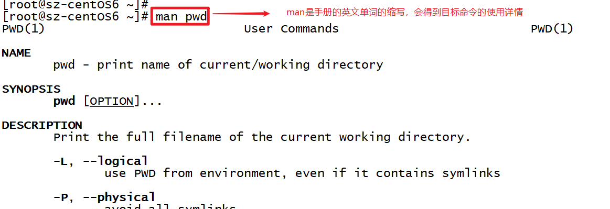
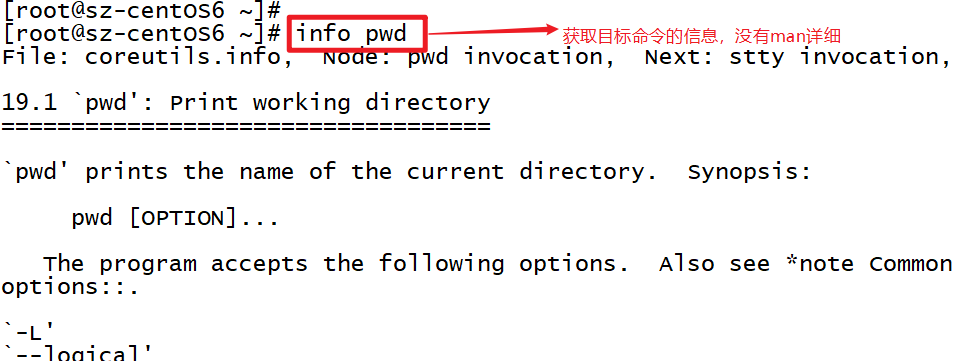
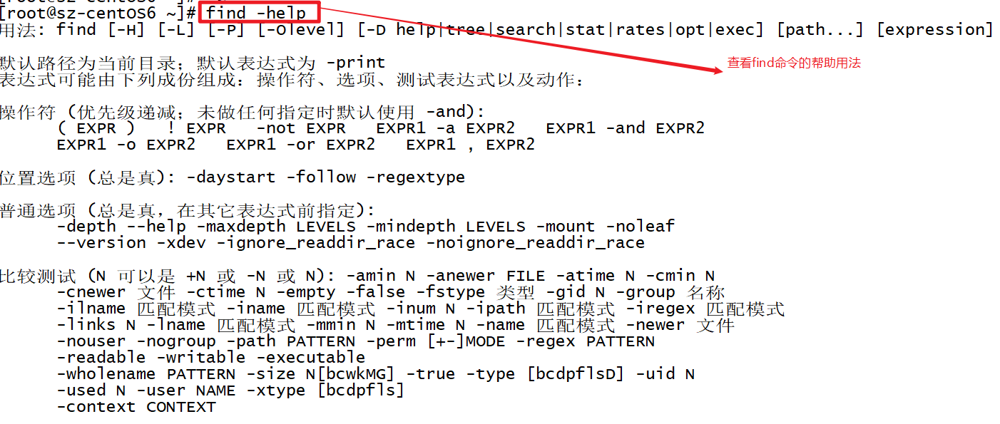
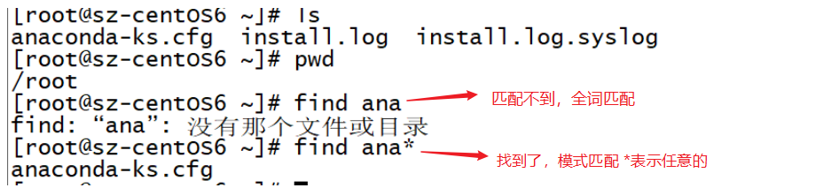
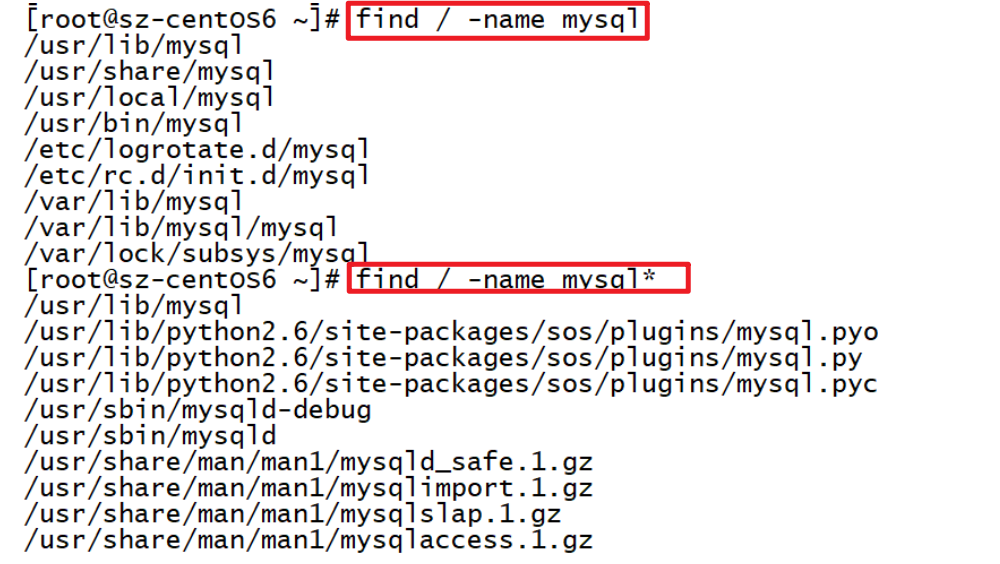
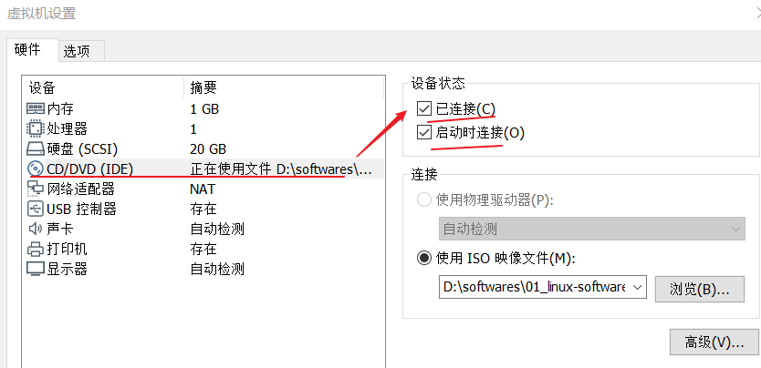
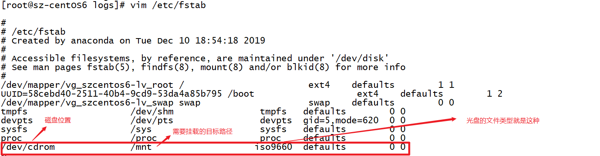
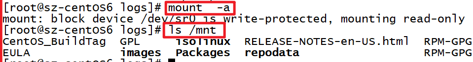
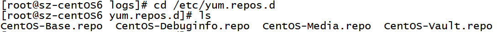
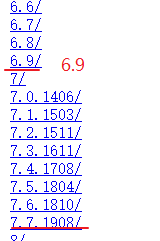

## 扩展-Linux操作命令【不要求，学有余力可以了解】

## 查看命令的使用方法，或者查看命令的说明

- `man 命令`  ：  

  

- `info 命令 `

  

- `命令 -help`   :   如果该方式不能使用，则建议使用man或者info。

  

## `!$`

`!$` 表示获取==上一条命令的最后一个参数==

- 示例：

  ```shell
  #前一条命令
  mv /root/apache-tomcat-8.5.32.tar.gz /usr/local/tomcat
  # 使用 !$   ，则等效于  cd /usr/local/tomcat
  cd !$
  ```

  - 场景： 如果用于前面命令的参数表较长的时候，后面的命令又要用到时，则可以很方便

## `find`

 find 命令用于查找信息

- 语法： ` find  [PATH]  [表达式]`  ；  默认路径为当前目录；

- 示例：

  

- `find / -name mysql` : 表示在根目录/下面按名字全文匹配mysql
- `find / -name mysql*` : 表示在根目录/下面按名字模式匹配mysql开头的任意资源

- 结果比较如下：

## `yum` 

yum和rpm有些类似，也是用于包管理的命令，但是它可以解决包之间的依赖关系，rpm则是独立的包，yum下载安装包时可以把相关的包也一同下载安装好。==yum 命令后面加上 -y 可以减少交互（即全部默认同意）==。可以**==自动处理依赖性关系，并且一次安装所有依赖的软体包==**

>**Yum（全称为 Yellow dog Updater, Modified）是一个在Fedora和RedHat以及CentOS中的Shell前端软件包管理器。基于RPM包管理，能够从指定的服务器自动下载RPM包并且安装，可以自动处理依赖性关系，并且一次安装所有依赖的软件包，无须繁琐地一次次下载、安装。**

- 几个常用的命令：==clean、install、list、search、update、upgrade、remove==

- clean ： 清空缓存文件； yum会将下载下来的 包文件rpm和头文件header存盘在 本地机器的硬盘 缓存中,这个将占用 硬盘空间, 可以将这些内容清除掉, 以释放磁盘空间:

  `yum clean headers`: // 释放头文件
  `yum clean packages`: // 清除包文件
  `yum clean all `: // 清除所有

- `yum install 包` ： 会从指定的yum源安装指定的包；（yum源有点类似于包的地址，想象一下maven的仓库）
- `yum list`  ： 会列出当前可用的安装包
- `yum search 包`： 可以搜索指定的包
- `yum update`：升级所有包同时也升级软件和系统内核  【如不是很明确要升级，则**慎用**该命令】
- `yum upgrade`：只升级所有包，不升级软件和系统内核
- `yum remove 包` ： 移除指定的包

- ```shell
  yum list all                ##列出所有安转包
  yum list installed          ###列出已经安装的
  yum list available          ###列出没有安装的
  yum remove software         ###卸载软件
  yum install software        ###安装软件
  yum search 关键字            ###搜索与关键字相关的软件
  yum whatprovides 文件        ###搜索包含此文件的包
  yum reinstall software      ###从新安装软件
  yum localinstall 第三方软件  ##安装该软件并解决依赖关系
  yum info software           ###查询软件信息
  yum groups list             ###列出软件组
  yum groups install          ###安装组
  yum groups remove           ###卸载组
  yum groups info             ###查看组信息
  ```

## 查看系统版本：

- `cat /etc/redhat-release `
- `uname -a`

## ==挂载本地磁盘==

需要注意，在虚拟机上做以下设置才行(`虚拟机`--》`设置`)：

- 

-  **vim**  **/etc/fstab**  **#在文档最后，添加以下内容：**

  **/dev/cdrom** 			      **/mnt**			  **iso9660	 defaults        0 0**

- **mount -a**
- **ls /mnt/**   **#如果查看到该目录下有内容，则说明磁盘已经挂载成功**






## 【多学一招-配置yum源】

### 配置本地yum源

- yum 源一般配置在 ==**/etc/yum.repos.d**== 目录，可以cd进去；yum源配置文件必须以==.repo== 结尾（可以理解是一个仓库的意思，有点类似maven的仓库镜像地址）

  

- 通过命令`cat CentOS-Base.repo` 可以查看系统的基本yum源文件里面配置了好一些yum源：

  ```shell
  [base]
  name=CentOS-$releasever - Base
  mirrorlist=http://mirrorlist.centos.org/?release=$releasever&arch=$basearch&repo=os
  #baseurl=http://mirror.centos.org/centos/$releasever/os/$basearch/
  gpgcheck=1
  gpgkey=file:///etc/pki/rpm-gpg/RPM-GPG-KEY-CentOS-6
  
  #released updates 
  [updates]
  name=CentOS-$releasever - Updates
  mirrorlist=http://mirrorlist.centos.org/?release=$releasever&arch=$basearch&repo=updates
  #baseurl=http://mirror.centos.org/centos/$releasever/updates/$basearch/
  gpgcheck=1
  gpgkey=file:///etc/pki/rpm-gpg/RPM-GPG-KEY-CentOS-6
  
  .....
  ```

- 这里要说明一下参数的含义

  - **`[base]`** : 是id，在该服务器必须是唯一的； 这里配置了很多如base、updates
  - **`name`**=CentOS-$releasever - Base ： name属性表示取名
  - **`baseurl`** 属性：**yum源的路径,提供方式包括FTP(ftp://...)、HTTP(http://...)、本地(==file:///==...**                        **光盘挂载目录所在的位置）**
  - **enabled** 属性： 为1表示启用yum源，为0表示禁用
  - **gpgcheck ** 属性：为1，表示使用公钥检验rpm包的正确性；为0则不校验
  - **gpgkey** 属性： 指定进行rpm校验的公钥文件地址

- 首先需要挂载磁盘、挂在镜像(挂载磁盘参考上面的知识点)

  - 检查虚拟光驱中有加载镜像
    - `mount /devcdrom /mnt`
    - `ls /mnt`

- 在 `/etc/yum.repos.d`  目录创建一个自己的文件：  CentOS6==.repo==

  - 插入以下内容：

    ```shell
    [CentOS6]
    name=CentOS6
    baseurl=file:///mnt
    enable=1
    gpgcheck=0
    gpgkey=file:///etc/pki/rpm-gpg/RPM-GPG-KEY-CentOS-6
    ```

    

### 配置网络yum源

网络yum源的配置是使用网络上的资源，所以需要下载，比如可以使用阿里的镜像：https://developer.aliyun.com/mirror/centos?spm=a2c6h.13651102.0.0.53322f701oDDMo

#### 1. 备份本地基本yum源

```shell
mv /etc/yum.repos.d/CentOS-Base.repo /etc/yum.repos.d/CentOS-Base.repo.backup
```

#### 2.下载新的 CentOS-Base.repo 到 /etc/yum.repos.d/

```shell
wget -O /etc/yum.repos.d/CentOS-Base.repo http://mirrors.aliyun.com/repo/Centos-6.repo
# 该命令表示下载将路径：http://mirrors.aliyun.com/repo/Centos-6.repo 表示的文件下载好后保存到/etc/yum.repos.d/CentOS-Base.repo文件中，其实就是覆盖了原来的这个文件
```

**==wget== 命令表示下载文件 ，==-O== 将wget下载的文件，保存到指定的位置，保存时可以重新起一个名字，或者直接写一个要保存的路径，这样还用原来的文件名。**

#### 3.查看

此时可以使用命令**vim** **/etc/yum.repos.d/CentOS-Base.repo**查看，内容已经发生改变了：

```shell
[base]
name=CentOS-$releasever - Base - mirrors.aliyun.com
failovermethod=priority
baseurl=http://mirrors.aliyun.com/centos/$releasever/os/$basearch/
        http://mirrors.aliyuncs.com/centos/$releasever/os/$basearch/
        http://mirrors.cloud.aliyuncs.com/centos/$releasever/os/$basearch/
gpgcheck=1
gpgkey=http://mirrors.aliyun.com/centos/RPM-GPG-KEY-CentOS-6

#released updates
[updates]
name=CentOS-$releasever - Updates - mirrors.aliyun.com
failovermethod=priority
baseurl=http://mirrors.aliyun.com/centos/$releasever/updates/$basearch/
        http://mirrors.aliyuncs.com/centos/$releasever/updates/$basearch/
        http://mirrors.cloud.aliyuncs.com/centos/$releasever/updates/$basearch/
gpgcheck=1
gpgkey=http://mirrors.aliyun.com/centos/RPM-GPG-KEY-CentOS-6
```

这里有几个变量要说明下：

- **$releasever**  表示系统的版本
  - 等于  **cat /etc/centos-release**  得到的值：  `CentOS release 6.5 (Final)`
- **$basearch**  表示位数：32机器：   `i386` 、   64位机器： `x86_64`

#### 4. 替换

==如果下载后不能使用==，则修改一下里面的 `$releasever`值全部替换为阿里云镜像对应的版本的最新值:

- **http://mirrors.aliyun.com/centos/**  找到centos6，找到最新的值`6.9`进行替换；如果是centos7的话可以换成`7.7.1908`。

  

快速替换的方式：

```shell
sed -i  's/$releasever/6.9/g' /etc/yum.repos.d/CentOS-Base.repo
# 该sed命令意思是  在/etc/yum.repos.d/CentOS-Base.repo文件中全部(g)搜索并替换$releasever为6.9
```

#### 5. 查看是否生效

- **yum clean all**   :  **清空一下yum缓存**
-  **yum list**   :  **查看列表**

### yum报错的常用注意事项

**1、确定光盘是否链接，光盘是否挂载**

**2、配置文件中格式是否正确，字母，符号有没有少写,挂载点和配置文件中设置的是否一致**

**3、网络源需要联网，操作和RPM类似，只是会自动安装依赖项**

