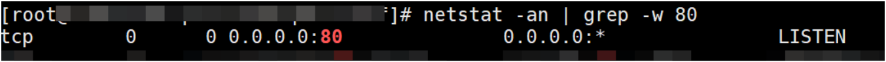
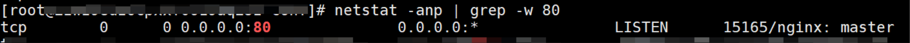

## 常用快捷键

linux常用操作快捷键：
Tab： 命令补全/路径补全/文件名补全，一次tab是补全，两次tab，列出相关信息。
Ctrl+C： 强制结束当前的进程。干了一半不想干了想反悔就Ctrl+C。
Ctrl+D： 发送一个exit信号，每次当我们有“退出”的意思的时候，就可以使用这个。比如SSH登录到另一个机器，想退出就Ctrl+D。
Ctrl+A： 移动到命令行首。
Ctrl+E： 移动到命令行尾。
Ctrl+U ：从当前光标所在位置向前清除命令。
Ctrl+W： 从当前光标所在位置向前清除一个单词。
上下箭头： 上下翻看命令的输入记录，如果历史记录太多翻起来太慢，就用history显示出来然后再复制粘贴。


## 系统监控命令

### **查看端口占用情况**

查看80端口是否已经打开

```shell
netstat -an | grep -w 80 其中的-w表示按单词匹配，以免匹配到8080端口
```



查看80端口被什么进程占用

```shell
netstat -anp | grep -w 80
```



