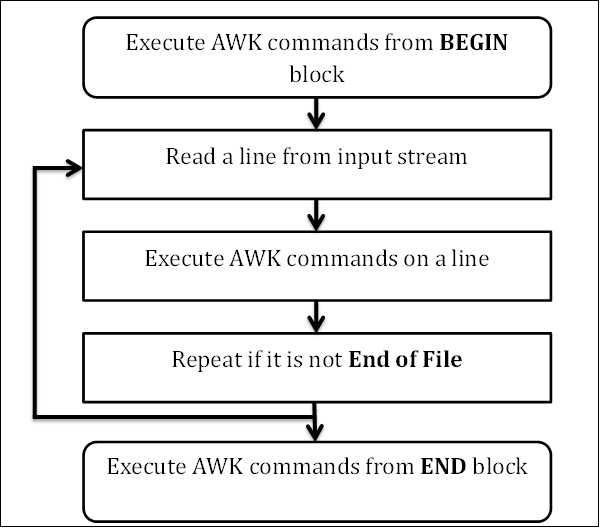

[AWK入门指南](https://awk.readthedocs.io/en/latest/chapter-one.html)


### 安装AWK

```shell
# 使用yum安装
yum install gawk

# 安装后检查是否安装ok
which awk
## 一般输出安装路径是在： /bin/awk
```


### AWK 起步示例

假设存在一个文件 emp.data，其中包含员工的姓名、薪资（美元/小时）以及小时数，一个员工一行数据,其内容如下:

```shell
Beth	4.00	0
Dan	3.75	0
kathy	4.00	10
Mark	5.00	20
Mary	5.50	22
Susie	4.25	18
```

如果想打印出 工作时长超过0小时的员工姓名和工资(薪资乘以时间)，以下命令可以完成: 

```shell
awk '$3>0 {print $1, $2*$3}'  emp.data

```

得到如下输出：

```shell
kathy 40
Mark 100
Mary 121
Susie 76.5
```

**<font color=red>该命令告诉系统执行括号内的awk程序，从输入文件 emp.data 获取所需要的数据。引号内的部分是个完整的awk程序，包含单个 模式-动作 语句。模式 $3>0 用于匹配第三列大于0的输入行，动作： </font>**
```{print $1, $2*$3}```
打印每个匹配行的第一个字段、第二个字段与第三个字段的乘积。

还可以打印没有工作过的员工姓名：
```shell
awk '$3==0 {print $1}'  emp.data
```
将会输出：
```shell
Beth
Dan
```

### AWK程序的结构

回过头来看一下上述命令。**引号之间的部分是awk编程语言写就的程序**。 每个awk程序都是 **一个或多个 模式-动作** 语句的序列：

**pattern {pattern}**
**pattern {pattern}**
**...**

awk 的基本操作是一行一行的扫描输入，搜索匹配任意程序中模式的行。 词语“匹配”的准确意义是视具体的模式而言，对于模式 $3>0 来说，意思是“条件为真”。
每个模式依次测试每个输入行。对于匹配到行的模式，其对应的动作（也许包含多步）得到执行，然后读取下一行并继续匹配，直到所有的输入读取完毕。

| 模式        | 动作           | 
| ------------- |:-------------:| 
| $3==0       | {print $1}| 


模式-动作 语句中的 模式或动作（但不是两者同时省略）都可以省略。如果某个模式没有动作，例如：

```$3==0```

那么模式匹配到的每一行都会被打出来。输出如下：
```
Beth    4.00    0
Dan     3.75    0
```

如果是没有动作的模式，例如：
```{print $1}```
则会打印第一列，输出如下：
```
Beth
Dan
kathy
Mark
Mary
Susie
```

**<font color=red>由于模式和动作两者任一都是可选的，所以需要使用大括号包围动作用以区分其他模式。</font>**

### 执行 awk 程序

执行awk程序有多种，可以输入如下形式的命令行：
```awk 'program codes' inputfiles```
从而在每个指定的输入文件上执行这个program。例如：
```awk '$3==0 {print $1}' file1 file2```
打印 file1 和 file2 文件中第三列为0的每一行的第一个字段。

也可以省略命令行中的输入文件，仅仅输入：
```awk 'program codes' ```
在这种情况下，awk 将会应用于你在终端接着输入的任意数据行，直到你输入一个文件结束信号（Unix系统上为control-d）。示例：
```
awk '$3>0 {print $1}'
Mary 20 1000   #输入该行回车
Mary  # 计算机输出，匹配到了信息
Belly 30 3000  #继续输入改行
Belly #计算机输出
```

**注意事项：** 命令行中的程序是用单引号包围着的。这会防止shell解释程序中$这样的字符，也允许程序的长度超过一行。
**当程序比较长的时候，可以将程序写入到一个文件**，以下命令行：
```awk -f programfile optional list of input files```

其中 [-f](#) 选项指示 awk 从指定文件中获取程序。可以使用任意文件名替换 programfile。

#### awk 的错误提示

如果你的 awk 程序存在错误， awk 会给你一些诊断信息。例如，如果你打错了大括号，如下所示：

```awk '$3==0 [print $1}' emp.data```
会提示如下错误：
```
awk: $3==0 [print $1}
awk:       ^ syntax error
awk: $3==0 [print $1}
awk:                ^ syntax error
```

### 简单输出

<font color=red> awk中仅仅只有两种类型  **数值**、 **字符** 构成的字符串</font>。通常情况下，一个字段是一个不包含任何空格或制表符的连续字符序列。
当前输入的 行中的第一个字段被称作 $1，第二个是 $2，以此类推。 整个行的内容被定义为 $0。 每一行的字段数量可以不同。

大都数情况下，我们仅仅只是打印出其中每一行的某些字段，或者也还需要做一些计算。

#### 打印每一行

如果一个动作没有任何模式，这个动作针对所有输入的行进行操作。 **<font color=red>print </font>** 语句用来打印（输出）当前输入的行。
所以 ```{print}``` 等效于 ```{print $0}```

#### 打印特定行

```{print $1,$3}``` 将输出：

```
Beth 0
Dan 0
kathy 10
Mark 20
Mary 22
Susie 18
```

**在 print 语句中被逗号分隔的表达式，在默认情况下他们将会用一个空格分割来输出。** 每一行print生成的内容都会以一个换行符作为结束。但这些默认行为都可以自定义。

#### NF，字段数量

AWK 会对当前输入的行有多少字段进行计数，并且将当前行的字段数量存储在一个内建的称为 NF 的变量中。因此
```{print NF,$1,$NF}``` 会打印出 每一行的字段数量、第一个字段的值、最后一个字段的值。
输出：
```
3 Beth 0
3 Dan 0
3 kathy 10
3 Mark 20
3 Mary 22
3 Susie 18
```

#### 打印行号

awk 提供了另一个内建变量， NR。他存储了当前已经读取了多少行的计数。可以使用 NR和$0给emp.data的每一行加上行号：
```{print NR,$0}```
输出如下：
```
1 Beth  4.00    0
2 Dan   3.75    0
3 kathy 4.00    10
4 Mark  5.00    20
5 Mary  5.50    22
6 Susie 4.25    18
```

#### 在输出中添加内容

还可以在字段中间或者计算的值中间打印输出想要的内容：
```{print "total pay for", $1, "is", $2*$3}```
输出如下：
```
total pay for Beth is 0
total pay for Dan is 0
total pay for kathy is 40
total pay for Mark is 100
total pay for Mary is 121
total pay for Susie is 76.5
```

### 高级输出

print 语句可用于快速而简单的输出。若要严格按照你所想的格式化输出，则需要使用 **printf** 语句。

#### 字段排队
printf 语句格式如下：

><font color=green>printf(format, value1, value2, ..., valueN)</font>

其中 format 是字符串，包含要逐字打印的文本，穿插在 format 之后的每个值该如何打印的规格。一个规格是一个 % 符，后面跟着一些字符，用来控制一个 value 的格式。因此，有过少个 value 要打印，在 fromat 中就要有多少个 % 规格。
打印每个员工的总薪酬：
```{printf("total pay for %s is $%.2f\n", $1, $2*$3)}```
输出如下：
```shell
awk '{printf("total pay for %s is $%.2f\n", $1, $2*$3)}'  emp.data
total pay for Beth is $0.00
total pay for Dan is $0.00
total pay for kathy is $40.00
total pay for Mark is $100.00
total pay for Mary is $121.00
total pay for Susie is $76.50
```

#### 排序输出

以薪酬递增的方式输出每一行：

```awk '{printf("%6.2f  %s\n", $2*$3, $0)}'  emp.data | sort```

将awk的输出通过管道传给 **<font color=red>sort </font>**命令，输出如下：

```
  0.00  Beth    4.00    0
  0.00  Dan     3.75    0
100.00  Mark    5.00    20
121.00  Mary    5.50    22
 40.00  kathy   4.00    10
 76.50  Susie   4.25    18
```

#### 选择

awk 的模式适用于为进一步的处理从输入中选择相关的数据行。由于不带动作的模式会打印所有匹配的行，所以很多awk程序仅仅包含一个模式。本节将给出一些有用的模式示例。

#####  通过对比选择
使用一个对比模式来选择每小时赚5美元或更多的员工记录，亦即第二个字段大于等于5的行：
```$2>=5```

```shell
awk '$2>=5'  emp.data
Mark    5.00    20
Mary    5.50    22
```

#### 通过计算选择

```shell
awk '$2*$3>50 {printf("$%.2f for %s\n", $2*$3, $1)}'  emp.data
$100.00 for Mark
$121.00 for Mary
$76.50 for Susie
```

#### 通过文本内容选择

除了数值测试，还可以选择包含特定单词或短语的输入行。这个程序会打印所有第一个字段为 Susie 的行：

```$1=="Susie"```

操作符 == 用于测试相等性。 也可以使用正则表达式的模式查找包含任意任意字母组合，单词或短语的文本。如以下可以匹配到任意位置包含Susie的行：
```/Susie/```

```shell
awk '/Susie/'  emp.data
Susie   4.25    18
```

#### 模式组合

可以使用括号和逻辑操作符号与&&、或||，以及 非! 对模式进行组合。
```$2>=4||$3>=20```
会打印第二个字段大于等于4或者第三个字段大于等于20的行：
```shell
awk '$2>=4||$3>=20'  emp.data
Beth    4.00    0
kathy   4.00    10
Mark    5.00    20
Mary    5.50    22
Susie   4.25    18
```

#### BEGIN 与 END

特殊模式 BEGIN 用于匹配第一个输入文件的第一行之前的位置。END 则用于匹配处理过的最后一个文件的最后一行的位置。

这个程序使用 BEGIN 来输出一个标题：
```
BEGIN {print "Name RATE HOURS"; print ""}
    {print}
```

```shell
awk 'BEGIN {print "Name RATE HOURS"; print ""}
{print}' emp.data

## 输出如下：

Name RATE HOURS

Beth    4.00    0
Dan     3.75    0
kathy   4.00    10
Mark    5.00    20
Mary    5.50    22
Susie   4.25    18
```

**注意事项：** 

- >awk 可以在一行上放多个语句，步过要使用分号;进行分隔。

- >普通的 print 是打印当前输入行， print "" 则会打印一个空行。


#### AWK 工作流图



AWK 是按一行一行地读取输入的。
- 1.首先执行 **BEGIN** 块
- 2.从输入中读取一行
- 3.在这次读取的这一行中执行 AWK 命令
- 4.如果文件还没有读取完毕，则重复步骤2、3
- 5.执行 **END** 块中的 awk 命令

#### 使用 AWK 进行计算

一个动作就是一个以新行或者分号分隔的语句序列。

##### 计数

```
$3 > 15 {emp = emp + 1}
END {print emp, "employees worked more than 15 hours"}
```

```shell
awk '$3 > 15 {emp = emp + 1}
> END {print emp, "employees worked more than 15 hours"}' emp.data

## 输出结果：
3 employees worked more than 15 hours
```

用作数字的 awk 变量的默认初始值为0， 所以不需要初始化 emp。创建一个变量emp初始值为0，如果读入的那一行的第三个字段大于15，则emp在自身值的基础上自增1，读完最后一行后输出存在多少个员工工作时长超过15个小时的语句。

##### 求和与平均值

为计算员工数目，可以使用内置变量 NR，保存了当前位置读取的行数；在所有输入的结尾它的值就是所读行的总行数。

```END {print NR, "employees"}```

```shell
awk 'END {print NR, "employees"}'  emp.data

## 输出结果为：
6 employees
```

如下是一个使用 NR 来计算薪酬均值的程序：

```shell
awk '{pay = pay + $2*$3}
> END {print NR, "employees"
> print "total pay is", pay
> print "average pay is", pay/NR
> }' emp.data

## 输出结果为：
6 employees
total pay is 337.5
average pay is 56.25
```

#### 处理文本

awk 的优势之一是能像大多数语言处理数字一样方便地处理字符串。 awk 可以保存数字也可以保存字符。找出时薪最高的员工:

```
$2 > maxrate { maxrate = $2; maxemp = $1 }
END { print "highest hourly rate:", maxrate, "for", maxemp }
```

```shell
 awk '$2 > maxrate { maxrate = $2; maxemp = $1 }
> END { print "highest hourly rate:", maxrate, "for", maxemp }' emp.data

## 输出结果为：
highest hourly rate: 5.50 for Mary
```

```shell
awk '{names = names $1 " "}                    
END {print names}' emp.data

## 输出结果：
Beth Dan kathy Mark Mary Susie 
```

#### 打印最后一个输入行

虽然在 END 动作中 NR 还保留着它的值， 但 $0 没有。

```
{last = $0}
END {print last}
```

```shell
awk '
> {last = $0}
> END {print last}' emp.data

## 输出结果：
Susie   4.25    18
```


### AWK 内置函数

前面已经看到 awk 内置变量用来保存某些频繁使用的数量， NF 表示所在行的总列数， NR 表示当前是第多少行...
还有内置函数用来计算其他有用的数值。除了 平方根、对数、随机数此类的算术函数外，还有操作文本的函数。其中之一是 length 用于计算一个字符串的长度。

```shell
awk '{print $1, length($1)}'  emp.data

## 输出结果：
Beth 4
Dan 3
kathy 5
Mark 4
Mary 4
Susie 5
```

#### 行、单词以及字符的计数

使用 length、NF、NR来统计输入中行、单词以及字符的数量。为了简便，将每个字段看作一个单词。

```shell
awk ' { nc = nc + length($0) + 1
>       nw = nw + NF
>     }
> END { print NR, "lines,", nw, "words,", nc, "characters" }' emp.data

## 输出结果为：
6 lines, 18 words, 82 characters
```

因为 $0 不会包含行末的换行符，所以另外加了个1。

#### AWK 控制语句

awk 为选择提供了一个 if-else 语句， 以及为循环提供了几个语句，它们仅在动作中使用。

##### if-else 语句

如下是一个计算时薪超过6美元的员工总薪酬与平均薪酬。它使用一个 if 来防范零除问题。

```shell
$2 > 6 { n = n+1; pay = pay + $2*$3 }
END {
    if(n > 0)
        print n, "employees, total pay is", pay,
               "average pay is", pay/n
    else
        print "no employees are paid more than $6/hour"
        
}

```

```shell
awk '$2 > 6 { n = n+1; pay = pay + $2*$3 }
> END {
>     if(n > 0)
>         print n, "employees, total pay is", pay,
>                "average pay is", pay/n
>     else
>         print "no employees are paid more than $6/hour"
>         
> }' emp.data

## 输出结果为：
no employees are paid more than $6/hour
```

**注意事项：** 我们可以使用一个逗号将一个长语句截断为多行来书写.

##### while 语句

```
{
    i = 1
    while ( i <=3 ){
        # while 循环体(这一行是注释内容)
        printf("\t%.2f\n", $1*(1+$2)^i)
        i = i + 1
    }
}
```

while 后面是圆括号，里面是布尔表达式。 循环体是条件后大括号包围的语句。 ^ 是指数操作符。 # 后面是注释。

演示1000美元，利率为6%与12%，5年的复利分别是如何增长的：

```
awk '
> {
>     i = 1
>     while ( i <=5 ){
>         # while 循环体(这一行是注释内容)
>         printf("\t%.2f\n", $1*(1+$2)^i)
>         i = i + 1
>     }
> }
> ' 
1000 .06 5
        1060.00
        1123.60
        1191.02
        1262.48
        1338.23
1000 .12 5
        1120.00
        1254.40
        1404.93
        1573.52
        1762.34
```

##### for 语句

使用for循环实现上述例子：

```shell
awk '
> {
>     for( i = 1; i <= $3; i = i+1 ){
>         printf("\t%.2f\n", $1*(1+$2)^i)
>     }
> }
> '
1000 .06 5
        1060.00
        1123.60
        1191.02
        1262.48
        1338.23
1000 .12 5
        1120.00
        1254.40
        1404.93
        1573.52
        1762.34
```

#### 数组

awk 为存储一组相关的值提供了数组，虽然数组给予了awk很强的能力，但是在这里我们仅仅展示一个简单的例子。
第一个动作将输入行存为数组 line 的连续元素；
**第一行放在line[1]，第二行放在line[2]**。 END 动作使用一个while语句从后往前打印数组中的输入行：

```awk
# 反转-按行逆序打印输入

{line[NR] = $0}

END {
        i = NR
        while(i > 0){
            print line[i]
            i = i-1
        }
}

```

```awk
awk '
> {line[NR] = $0}
> 
> END {
>         i = NR
>         while(i > 0){
>             print line[i]
>             i = i-1
>         }
> }' emp.data

# 输出结果为：
Susie   4.25    18
Mary    5.50    22
Mark    5.00    20
kathy   4.00    10
Dan     3.75    0
Beth    4.00    0
```

#### --dump-variables 操作查看全局变量

-dump-variables[=file] 操作可以打印全局变量到文件中，默认是“awkvars.out”文件。

```awk
awk --dump-variables ''

# 查看文件awkvars.out 
cat awkvars.out 

ARGC: number (1)
ARGIND: number (0)
ARGV: array, 1 elements
BINMODE: number (0)
CONVFMT: string ("%.6g")
ERRNO: number (0)
FIELDWIDTHS: string ("")
FILENAME: string ("")
FNR: number (0)
FS: string (" ")
IGNORECASE: number (0)
LINT: number (0)
NF: number (0)
NR: number (0)
OFMT: string ("%.6g")
OFS: string (" ")
ORS: string ("\n")
RLENGTH: number (0)
RS: string ("\n")
RSTART: number (0)
RT: string ("")
SUBSEP: string ("\034")
TEXTDOMAIN: string ("messages")

```


#### --help 操作可以寻得帮助

```awk
awk --help
# 输出信息如下：

Usage: awk [POSIX or GNU style options] -f progfile [--] file ...
Usage: awk [POSIX or GNU style options] [--] 'program' file ...
POSIX options:          GNU long options:
        -f progfile             --file=progfile
        -F fs                   --field-separator=fs
        -v var=val              --assign=var=val
        -m[fr] val
        -O                      --optimize
        -W compat               --compat
        -W copyleft             --copyleft
        -W copyright            --copyright
        -W dump-variables[=file]        --dump-variables[=file]
        -W exec=file            --exec=file
        -W gen-po               --gen-po
        -W help                 --help
        -W lint[=fatal]         --lint[=fatal]
        -W lint-old             --lint-old
        -W non-decimal-data     --non-decimal-data
        -W profile[=file]       --profile[=file]
        -W posix                --posix
        -W re-interval          --re-interval
        -W source=program-text  --source=program-text
        -W traditional          --traditional
        -W usage                --usage
        -W use-lc-numeric       --use-lc-numeric
        -W version              --version

To report bugs, see node `Bugs' in `gawk.info', which is
section `Reporting Problems and Bugs' in the printed version.

gawk is a pattern scanning and processing language.
By default it reads standard input and writes standard output.

Examples:
        gawk '{ sum += $1 }; END { print sum }' file
        gawk -F: '{ print $1 }' /etc/passwd
```

#### --version 查看版本信息

```awk
awk --version
# 输出结果如下:

GNU Awk 3.1.7
Copyright (C) 1989, 1991-2009 Free Software Foundation.

This program is free software; you can redistribute it and/or modify
it under the terms of the GNU General Public License as published by
the Free Software Foundation; either version 3 of the License, or
(at your option) any later version.

This program is distributed in the hope that it will be useful,
but WITHOUT ANY WARRANTY; without even the implied warranty of
MERCHANTABILITY or FITNESS FOR A PARTICULAR PURPOSE.  See the
GNU General Public License for more details.

You should have received a copy of the GNU General Public License
along with this program. If not, see http://www.gnu.org/licenses/.
```

#### -v 操作

**-v**  操作允许给一个变量分配值。允许在程序执行之前分配。

```awk
awk -v name=LFF 'BEGIN {printf("username=%s\n", name)}'

# 输出结果为：
username=LFF
```

#### --lint 操作提示信息

**--lint** 操作允许输出检查信息，比如当参数提供错误，会将警告信息当作错误。

```awk
awk --lint '' /bin/ls

# 输出结果为：
awk: warning: empty program text on command line
awk: warning: source file does not end in newline
awk: warning: no program text at all!
```

#### 正则匹配

匹配输入行中包含字符a的行，全部输出。
```shell
awk '/a/ {print $0}'  emp.data

# 输出结果为：
Dan     3.75    0
kathy   4.00    10
Mark    5.00    20
Mary    5.50    22
```

打印输入行中包含字符a的行数：

```shell
awk '/a/ {++cnt} END {print "匹配的行数为:", cnt}' emp.data

# 输出结果为:
匹配的行数为: 4
```


#### 内置变量

##### ARGC ：命令行中提供的参数个数

``shell
awk 'BEGIN {print "Arguments =", ARGC}' One Two Three Four
Arguments = 5
``

##### ARGV 表示命令行入参构成的数组，索引是 0~ARGC-1

```shell
 awk 'BEGIN { 
>    for (i = 0; i < ARGC - 1; ++i) { 
>       printf "ARGV[%d] = %s\n", i, ARGV[i] 
>    } 
> }' one two three four

# 输出结果为：
ARGV[0] = awk
ARGV[1] = one
ARGV[2] = two
ARGV[3] = three
```

##### CONVFMT 

表示数字的转换格式。默认值是 **%.6g**。

```
awk 'BEGIN { print "Conversion Format =", CONVFMT }'

#输出：
Conversion Format = %.6g
```


##### ENVIRON 环境变量  

```shell
awk 'BEGIN { print ENVIRON["USER"] }'

# 输出当前用户
deploy
```

我们可以借助env命令查看linux服务器上的全部环境变量：

```shell
env

# 查看当前服务器上的所有环境变量
HOSTNAME=sz-local3
TERM=vt100
SHELL=/bin/bash
HISTSIZE=1000
SSH_CLIENT=10.89.4.224 53217 22
QTDIR=/usr/lib64/qt-3.3
OLDPWD=/data/app
QTINC=/usr/lib64/qt-3.3/include
SSH_TTY=/dev/pts/0
GREP_OPTTIONS=--color=always
USER=deploy
LS_COLORS=rs=0:di=01;34:ln=01;36:mh=00:pi=40;33:so=01;35:do=01;35:bd=40;33;01:cd=40;33;01:or=40;31;01:mi=01;05;37;41:su=37;41:sg=30;43:ca=30;41:tw=30;42:ow=34;42:st=37;44:ex=01;32:*.tar=01;31:*.tgz=01;31:*.arj=01;31:*.taz=01;31:*.lzh=01;31:*.lzma=01;31:*.tlz=01;31:*.txz=01;31:*.zip=01;31:*.z=01;31:*.Z=01;31:*.dz=01;31:*.gz=01;31:*.lz=01;31:*.xz=01;31:*.bz2=01;31:*.tbz=01;31:*.tbz2=01;31:*.bz=01;31:*.tz=01;31:*.deb=01;31:*.rpm=01;31:*.jar=01;31:*.rar=01;31:*.ace=01;31:*.zoo=01;31:*.cpio=01;31:*.7z=01;31:*.rz=01;31:*.jpg=01;35:*.jpeg=01;35:*.gif=01;35:*.bmp=01;35:*.pbm=01;35:*.pgm=01;35:*.ppm=01;35:*.tga=01;35:*.xbm=01;35:*.xpm=01;35:*.tif=01;35:*.tiff=01;35:*.png=01;35:*.svg=01;35:*.svgz=01;35:*.mng=01;35:*.pcx=01;35:*.mov=01;35:*.mpg=01;35:*.mpeg=01;35:*.m2v=01;35:*.mkv=01;35:*.ogm=01;35:*.mp4=01;35:*.m4v=01;35:*.mp4v=01;35:*.vob=01;35:*.qt=01;35:*.nuv=01;35:*.wmv=01;35:*.asf=01;35:*.rm=01;35:*.rmvb=01;35:*.flc=01;35:*.avi=01;35:*.fli=01;35:*.flv=01;35:*.gl=01;35:*.dl=01;35:*.xcf=01;35:*.xwd=01;35:*.yuv=01;35:*.cgm=01;35:*.emf=01;35:*.axv=01;35:*.anx=01;35:*.ogv=01;35:*.ogx=01;35:*.aac=01;36:*.au=01;36:*.flac=01;36:*.mid=01;36:*.midi=01;36:*.mka=01;36:*.mp3=01;36:*.mpc=01;36:*.ogg=01;36:*.ra=01;36:*.wav=01;36:*.axa=01;36:*.oga=01;36:*.spx=01;36:*.xspf=01;36:
MAIL=/var/spool/mail/deploy
PATH=/usr/lib/jdk1.7.0_76/bin:/usr/lib64/qt-3.3/bin:/data/app/node-v4.2.4-linux-x64/bin:/usr/lib/jdk1.7.0_76/bin:/usr/local/bin:/bin:/usr/bin:/usr/local/sbin:/usr/sbin:/sbin:/home/deploy/bin
PWD=/data/app/lff
JAVA_HOME=/usr/lib/jdk1.7.0_76
LANG=en_US.UTF-8
HISTCONTROL=ignoredups
SHLVL=1
HOME=/home/deploy
LOGNAME=deploy
QTLIB=/usr/lib64/qt-3.3/lib
CVS_RSH=ssh
CLASSPATH=/usr/lib/jdk1.7.0_76/lib:/usr/lib/jdk1.7.0_76/lib:
SSH_CONNECTION=10.89.4.224 53217 10.193.1.27 22
LESSOPEN=||/usr/bin/lesspipe.sh %s
G_BROKEN_FILENAMES=1
_=/bin/env
```


##### FILENAME 表示当前文件

```shell
awk 'END {print FILENAME}' emp.data

# 输出结果为：
emp.data
```

##### FS 表示文件分隔符

FS 表示文件分割符，默认是空白字符。也可以使用 **-F** 命令行变更。

```shell
awk 'BEGIN {print "FS = " FS}' | cat -vte

# 输出结果为：
FS =  $
```


##### NF 表示当前行的字段（列数）

##### NR 表示当前读到的行数

##### RLENGTH 

表示匹配函数 **match** 到的字符串的长度。

```shell
awk '
BEGIN {
       if(match("One Two Three", "re")){
          print RLENGTH
       }
}'

# 匹配到了Three中的re，输出结果为：
2
```

##### RSTART 表示第一个**match**函数匹配到的字符串中的位置

```
awk '
BEGIN {
       if(match("One Two Three There", "re")){
          print RSTART 
       }
}'

# 从O开始，到Three的r，位置处于11，输出结果为：
11
```

##### $0 表示全部的输入记录
##### $n 表示第n列(第n个字段)，以文件分隔符分隔，默认是空白字符。


##### ARGIND 表示当前处理的 ARGV 的索引值

##### PROCINFO 表示进程相关信息

```shell
awk 'BEGIN {print PROCINFO["pid"]}'
5142
```

#### 运算符操作

#####  自增符操作

```shell
awk 'BEGIN {print ++a}'
# 先自增，输出结果为：
1
# 后自增，输出结果为：
awk 'BEGIN {print a++}'
0
```

#####  自减符操作

```shell
awk 'BEGIN {print --a}'
-1
awk 'BEGIN {print a--}'
0
```

##### +=、 -=、 *=、/=、%=、 ^=、**=操作

```shell
awk 'BEGIN {print cnt+=10; print cnt}'
10
10

awk 'BEGIN {cnt=10 ;print cnt*=10; print cnt}'
100
100

awk 'BEGIN {cnt=10 ;print cnt-=10; print cnt}'
0
0
awk 'BEGIN {cnt=10 ;print cnt/=10; print cnt}'
1
1
awk 'BEGIN {cnt=10 ;print cnt%=10; print cnt}'
0
0
awk 'BEGIN {cnt=10 ;print cnt^=10; print cnt}'
10000000000
10000000000
awk 'BEGIN {cnt=10 ;print cnt**=10; print cnt}'
10000000000
10000000000
```

##### 关系运算符

- ==
- !=
- <
- <=
- &gt;
- &gt;=

##### 逻辑运算符

- &&
- ||
- !

##### 三目运算符

- ? :

##### 字符串连接符

空白字符是字符串连接符

```shell
awk 'BEGIN {a="hello, "; b="world!"; c= a b; print(c)}'

# 输出连接结果
hello, world!
```

##### 数组关系操作符

**for in** 操作常用于遍历数组。

```shell
awk '
> BEGIN { arr[1] = "a"; arr[2] = "b"; arr[3] = "c";  
> for(i in arr){
>     print("a[", i, "]=", arr[i])
> }
> }'

# 遍历输出数组元素：
a[ 1 ]= a
a[ 2 ]= b
a[ 3 ]= c

```

##### 正则表达式操作符

- 点符**.** ： 匹配任意单个字符

示例：

```shell
echo -e "cat\nbat\nfun\nfin\nfan" | awk '/f.n/'

fun
fin
fan
```

- **^**符：匹配开头

匹配 **The** 开头的字符串：

```shell
echo -e "This\nThat\nThere\nTheir\nthese" | awk '/^The/'

There
Their
```

- **$**符：匹配结尾

匹配 **n** 结尾的字符串：

```shell
echo -e "knife\nknow\nfun\nfin\nfan\nnine" | awk '/n$/'

fun
fin
fan
```

- **[]** 符 ：匹配字符集多选一

匹配 Call 或者 Tall：

```shell
echo -e "Call\nTall\nBall" | awk '/[CT]all/'
 
Call
Tall
```


- 排除匹配

使用^排除，匹配不是 Call且不是Tall的字符串：

```shell
echo -e "Call\nTall\nBall" | awk '/[^CT]all/'

Ball
```


- 可选匹配

匹配 Call 或者 Tall

```shell
echo -e "Call\nTall\nBall\nSmall\nShall" | awk '/Call|Ball/'

Call
Ball
```

- **？** 符号 ：0 或 1次匹配

```shell
echo -e "Colour\nColor" | awk '/Colou?r/'

Colour
Color
```

- \* 符号： 表示0或多个匹配

```shell
echo -e "ca\ncat\ncatt" | awk '/cat*/'

ca
cat
catt
```

- **()** 分组匹配

```shell
echo -e "Apple Juice\nApple Pie\nApple Tart\nApple Cake" | awk 
   '/Apple (Juice|Cake)/'
   
Apple Juice
Apple Cake
```


#### 数组

```shell
awk 'BEGIN {
   fruits["mango"] = "yellow";
   fruits["orange"] = "orange"
   print fruits["orange"] "\n" fruits["mango"]
}'

orange
yellow
```


##### **delete**  删除数组元素

```shell
awk 'BEGIN {
   fruits["mango"] = "yellow";
   fruits["orange"] = "orange";
   delete fruits["orange"];
   for(i in fruits){print fruits[i]}
}'

# 删除orange后，只剩下yello
yellow

```

##### 多维数组

```shell
100   200   300
400   500   600
700   800   900
```

array[0][0] 存储 100，array[0][1] 存储 200。
**正确的语法是 array["0,0"] = 100**

```shell
awk 'BEGIN {
   array["0,0"] = 100;
   array["0,1"] = 200;
   array["0,2"] = 300;
   array["1,0"] = 400;
   array["1,1"] = 500;
   array["1,2"] = 600;

   # print array elements
   print "array[0,0] = " array["0,0"];
   print "array[0,1] = " array["0,1"];
   print "array[0,2] = " array["0,2"];
   print "array[1,0] = " array["1,0"];
   print "array[1,1] = " array["1,1"];
   print "array[1,2] = " array["1,2"];
}'
```

#### 字符串函数

##### index(str, substr) 
子串 substr 出现在字符串 str 中的开始位置，从1开始计数。

```shell
awk 'BEGIN {print index("Hello", "ll")}'
3
```

##### gsub(regex, sub, string)

正则匹配 regex，将其替换为 sub指定的内容， string是所选的字符串。

```shell
awk 'BEGIN { str = "Hello,World！"; gsub("World", "Lily", str); print str}'
Hello,Lily！
```

##### match(str, regex)

匹配则返回regex在str中的起始位置，否则返回0表示没有匹配到。

```shell
awk 'BEGIN {str = "Hello,world!"; ret = match(str, "wo"); print str, ret}'
Hello,world! 7
```

##### split(str, arr, regex)

将 str 按 regex 匹配拆分，得到的每个拆分作为元素保存在 arr 数组中。

```shell
awk 'BEGIN {str = "Hello,Hellokitty"; split(str, arr, ",");  
for(ele in arr){
    print arr[ele]
}}'

Hello
Hellokitty
```


##### strtonum(str)
 
 将字符串强转成数值类型， str开头是0的话会转为八进制， 是0x或0X开头的话会转为十六进制。
 
 ```shell
  awk 'BEGIN {
 >    print "Decimal num = " strtonum("123")
 >    print "Octal num = " strtonum("0123")
 >    print "Hexadecimal num = " strtonum("0x123")
 > }'
 Decimal num = 123
 Octal num = 83
 Hexadecimal num = 291
 ```
 
##### substr(str, start, l)
 
 获取字串，从字符串 str 中的 start位置开始截取长度为 ***L*** 的字符串。
 
 ```shell
 awk 'BEGIN {str = "nihaoya!"; print substr(str, 1, 2)}'
 ni
 ```
 
##### tolower(str) 
 将字符串 str 小写化。
 
 ```shell
 awk 'BEGIN{ print tolower("HeLLo")}'
 hello
 ```
 
##### toupper(str) 
  将字符串 str 大写化。
  
  ```shell
  awk 'BEGIN{ print toupper("HeLLo")}'
  HELLO
  ```
 
 
 
#### 时间函数

##### systime() 
获取自 1970-01-01 00:00:00 至今的unix时间戳

```shell
awk 'BEGIN {print systime()}'
1545742584
```

##### mktime(datespec)

将指定的日期格式串转换为时间戳，datespec 格式是 YYYY mm dd HH MM SS

```shell
awk 'BEGIN {print mktime("2018 12 25 21 07 00")}'
1545743220
```

##### strftime(format, timestamp)
将时间戳 timestamp 转换成指定格式format的字符串

```shell
 awk 'BEGIN {
>    print strftime("Time = %m/%d/%Y %H:%M:%S", systime())
> }'
Time = 12/25/2018 21:11:09
```

#### 位操作函数

##### and 

按位与

```shell
awk 'BEGIN {
   num1 = 10
   num2 = 6
   printf "(%d AND %d) = %d\n", num1, num2, and(num1, num2)
}'

# 输出结果为：
(10 AND 6) = 2
```


##### lshift(num, size)
将num按位左移size位数, 左移一位相当于乘以2

```shell
awk 'BEGIN {print lshift(10, 1)}'
20
```

##### rshift(num, size)
将num按位右移size位数, 右移一位相当于除以2

```shell
awk 'BEGIN {print rshift(10, 1)}'
5
```


##### or 按位或

```shell
awk 'BEGIN {
   num1 = 10
   num2 = 6
   printf "(%d OR %d) = %d\n", num1, num2, or(num1, num2)
}'

# 输出结果为：
(10 OR 6) = 14
```

##### xor 异或

```shell
awk 'BEGIN {
   num1 = 10
   num2 = 6
   printf "(%d XOR %d) = %d\n", num1, num2, xor(num1, num2)
}'

# 输出结果为：
(10 XOR 6) = 12
```

### 自定义函数

语法形式:

```shell
function function_name(argument1, argument2, ...) { 
   function body
}
```

示例：

```shell
# Returns minimum number
function find_min(num1, num2){
   if (num1 < num2)
   return num1
   return num2
}
# Returns maximum number
function find_max(num1, num2){
   if (num1 > num2)
   return num1
   return num2
}
# Main function
function main(num1, num2){
   # Find minimum number
   result = find_min(10, 20)
   print "Minimum =", result
  
   # Find maximum number
   result = find_max(10, 20)
   print "Maximum =", result
}
# Script execution starts here
BEGIN {
   main(10, 20)
}
```

#### 输出转移操作


##### 重定向数据到文件
我们还可以将数据导入到文件中。在 **print** 或者 **printf** 后增加重定向的文件语句。
语法：
>print data > outputfile

将数据 data 写入到 outputfile，如果 outputfile 不存在则创建。当指定重定向时，文件 output 会清除所有内容，然后写入数据。顺序写操作则不会提前清除文件内容，只是追加。

```shell
# 将 "Old data" 写入 message.txt 文件中，没有则创建 message.txt 文件。
echo "Old data" > message.txt
# 查看文件内容
cat message.txt 
# 输出结果：
Old data
```

然后执行：
```shell
awk 'BEGIN {print "Hello,World!" > "message.txt"}'
cat message.txt 
# 文件的旧内容清楚了，内容已经被替换
Hello,World!
```


##### 追加内容到文件中

>print DATA >> output-file

```shell
echo "Old data" > /tmp/message.txt
cat /tmp/message.txt
# 查看文件内容
Old data

# 追加内容到文件中
awk 'BEGIN { print "Hello, World !!!" >> "/tmp/message.txt" }'
cat /tmp/message.txt

#  输出内容：
Old data
Hello, World !!!
```

##### 管道 pipe

可能需要发送输出数据到其它程序，通过管道而不是文件。
这种转移方式会打开一个管道命令，并且会通过管道将数据项通过管道传到另一个进程去执行命令。
转移参数是一个 awk 表达式。 

管道的语法如下：

>print items | command

示例：使用 **tr** 命令将小写转换为大写

```shell
awk 'BEGIN { print "hello, world !!!" | "tr [a-z] [A-Z]" }'
HELLO, WORLD !!!
```

更过关于 **tr** 的使用方法，可以使用 tr --help 查看帮助信息。


##### 双向通信

awk 可以通过 **|&** 跟外部进程通信。


```shell
awk 'BEGIN {
>    cmd = "tr [a-z] [A-Z]"
>    print "hello, world !!!" |& cmd
>    close(cmd, "to")
>    
>    cmd |& getline out
>    print out;
>    close(cmd);
> }'
HELLO, WORLD !!!
```

说明：
- 第一条语句，**cmd="tr [a-z] [A-Z]"** ，是我们建立双向通信的命令。
- 接下来的语句，print 命令提供输入到 **tr** 命令。 这里的 **|&** 表示双向通信。
- 第三条语句，**close(cmd,"to")** ，在完成执行后，关闭 **to** 进程。
- **cmd |& getline out** 借助getline函数将结果输出 到 out 变量中。
- 最后打印out，并使用**close**函数关闭命令。

#### 整齐打印

```shell
awk 'BEGIN { printf "Hello\nWorld\n" }'

# 输出结果为：
Hello
World
```

##### 水平tab间隔打印

```shell
awk 'BEGIN { printf "Sr No\tName\tSub\tMarks\n" }'

Sr No   Name    Sub Marks
```

##### 垂直tab打印

```shell
awk 'BEGIN { printf "Sr No\vName\vSub\vMarks\n" }'

# 输出结果为：
Sr No
     Name
         Sub
            Marks

```

##### 回车打印
```shell
awk 'BEGIN { printf "Field 1\rField 2\rField 3\rField 4\n" }'

输出：
Field 4
```

##### 换页打印

```shell
awk 'BEGIN { printf "Sr No\fName\fSub\fMarks\n" }'
Sr No
     Name
         Sub
            Marks
```


##### 格式说明符

- %c ： 表示一个单个字符

```shell
awk 'BEGIN { printf "ASCII value 65 = character %c\n", 65 }'
ASCII value 65 = character A
```

- %d and %i : 表示十进制的整数

```shell
awk 'BEGIN { printf "Percentags = %d\n", 80.66 }'

输出结果为：
Percentags = 80
```

- %e and %E ： 科学记数法

```shell
awk 'BEGIN { printf "Percentags = %E\n", 80.66 }'

输出结果为：
Percentags = 8.066000e+01
```

- %f : 浮点数

```shell
awk 'BEGIN { printf "Percentags = %f\n", 80.66 }'

输出结果为：
Percentags = 80.660000
```

- %s ： 表示字符串

```shell
awk 'BEGIN { printf "Name = %s\n", "Sherlock Holmes" }'

输出结果为：

Name = Sherlock Holmes
```

- %nd : 指定宽度打印

```shell

awk 'BEGIN { 
   num1 = 10; num2 = 20; printf "Num1 = %10d\nNum2 = %10d\n", num1, num2 
}'

# 输出结果为：
Num1 =         10
Num2 =         20
```


### AWK 概览

AWK 是一种解释性编程语言。是专门为处理文本而设计的。名字是来自于设计者的名字 —— Alfred Aho, Peter Weinberger, and Brian Kernighan.

#### AWK 的类型

- AWK ： AT&T 实验室
- NAWK ：AWK 的新的改进版本
- GAWK ： GNU AWK。 所有GNU/Linux发行版都是GAWK。它与AWK和NAWK完全兼容。

#### AWK 的典型应用场景

- 文本处理
- 生成格式化的文本报告
- 处理算术操作
- 处理字符串操作

#### AWK 环境
描述如何在 GNU/Linux 系统中安装 AWK 环境。

##### 安装包管理器

一般情况下， AWK 默认在大都数 GNU/Linux 系统中都是安装发行的。
你可以使用 **which** 命令，检查awk在系统中是否安装好了。
如果没有安装 awk， 可以按如下命令借助 高级安装包 APT安装 AWK：

```shell
sudo apt-get update
sudo apt-get install gawk
```

```shell
yum install gawk

# 查看
which awk

# 输出结果为：
/bin/awk
```

从源代码中安装：
- wget http://ftp.gnu.org/gnu/gawk/gawk-4.1.1.tar.xz
- tar xvf gawk-4.1.1.tar.xz
- ./configure
- make
- make check
- sudo make install
- which awk