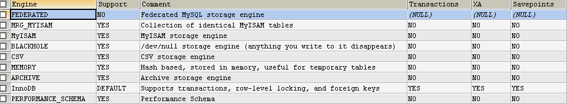

# InnoDB存储引擎


## 知识要点

- [ ] InnoDB 简介
- [ ] InnoDB 和 ACID 模型
- [ ] InnoDB 多版本
- [ ] InnoDB 架构
- [ ] InnoDB 在内存的结构
- [ ] InnoDB 在磁盘的结构
- [ ] InnoDB 锁和事务模型
- [ ] InnoDB 配置
- [ ] InnoDB 表和页压缩
- [ ] InnoDB 行格式
- [ ] InnoDB 磁盘I/O和文件空间管理
- [ ] InnoDB 和在线DDL
- [ ] InnoDB 启动操作和系统变量
- [ ] InnoDB INFORMATION_SCHEMA 表
- [ ] InnoDB 集成MySQL性能模式
- [ ] InnoDB 监控
- [ ] InnoDB 备份和恢复
- [ ] InnoDB和MySQL复制
- [ ] InnoDB memcached 插件
- [ ] InnoDB 故障追踪


## InnoDB 简介

### 知识要点

- [ ] 使用InnoDB表的好处
- [ ] InnoDB表的最佳实践
- [ ] 验证InnoDB是否是默认的存储引擎
- [ ] InnoDB的测试和基准测试

InnoDB 是通用的存储引擎，在高可用和高性能之间做了折中。在MySQL8.0中，InnoDB是默认的存储引擎。除非你需要配置一个不一样的存储引擎，则在```create table```语句时添加```ENGINE=存储引擎```来指定其他的存储引擎。


### 使用InnoDB表的好处

- DML 操作遵循 ACID 模型，拥有事务特性如：commit、rollback和崩溃恢复等特性以保护用户的数据。

- 行级锁和oracle风格的一致性读增强了多用户的并发和性能。

- InnoDB 表讲数据排列在磁盘上，以便根据主键优化查询。每一个InnoDB表都拥有一个主键叫做--聚集索引，使用主键查询的时候会组织使用最小化I/O。

- 为了维护数据完整性，InnoDB支持外键约束。通过外键，insert、update、delete 操作都会被检查，以确保在不同表中不会产生不一致的数据。

#### InnoDB存储引擎特性

<div class="table-contents">
<table frame="box" rules="all" summary="Features supported by the InnoDB storage engine."><colgroup><col width="60%"><col width="40%"></colgroup><thead><tr><th scope="col">Feature</th>
<th scope="col">Support</th>
</tr></thead><tbody><tr><td scope="row"><span class="bold"><strong>B-tree indexes</strong></span></td>
<td>Yes</td>
</tr><tr><td scope="row"><span class="bold"><strong>Backup/point-in-time recovery</strong></span> (Implemented in the server, rather than in the storage engine.)</td>
<td>Yes</td>
</tr><tr><td scope="row"><span class="bold"><strong>Cluster database support</strong></span></td>
<td>No</td>
</tr><tr><td scope="row"><span class="bold"><strong>Clustered indexes</strong></span></td>
<td>Yes</td>
</tr><tr><td scope="row"><span class="bold"><strong>Compressed data</strong></span></td>
<td>Yes</td>
</tr><tr><td scope="row"><span class="bold"><strong>Data caches</strong></span></td>
<td>Yes</td>
</tr><tr><td scope="row"><span class="bold"><strong>Encrypted data</strong></span></td>
<td>Yes (Implemented in the server via encryption functions; In MySQL 5.7 and later, data-at-rest tablespace encryption is supported.)</td>
</tr><tr><td scope="row"><span class="bold"><strong>Foreign key support</strong></span></td>
<td>Yes</td>
</tr><tr><td scope="row"><span class="bold"><strong>Full-text search indexes</strong></span></td>
<td>Yes (InnoDB support for FULLTEXT indexes is available in MySQL 5.6 and later.)</td>
</tr><tr><td scope="row"><span class="bold"><strong>Geospatial data type support</strong></span></td>
<td>Yes</td>
</tr><tr><td scope="row"><span class="bold"><strong>Geospatial indexing support</strong></span></td>
<td>Yes (InnoDB support for geospatial indexing is available in MySQL 5.7 and later.)</td>
</tr><tr><td scope="row"><span class="bold"><strong>Hash indexes</strong></span></td>
<td>No (InnoDB utilizes hash indexes internally for its Adaptive Hash Index feature.)</td>
</tr><tr><td scope="row"><span class="bold"><strong>Index caches</strong></span></td>
<td>Yes</td>
</tr><tr><td scope="row"><span class="bold"><strong>Locking granularity</strong></span></td>
<td>Row</td>
</tr><tr><td scope="row"><span class="bold"><strong>MVCC</strong></span></td>
<td>Yes</td>
</tr><tr><td scope="row"><span class="bold"><strong>Replication support</strong></span> (Implemented in the server, rather than in the storage engine.)</td>
<td>Yes</td>
</tr><tr><td scope="row"><span class="bold"><strong>Storage limits</strong></span></td>
<td>64TB</td>
</tr><tr><td scope="row"><span class="bold"><strong>T-tree indexes</strong></span></td>
<td>No</td>
</tr><tr><td scope="row"><span class="bold"><strong>Transactions</strong></span></td>
<td>Yes</td>
</tr><tr><td scope="row"><span class="bold"><strong>Update statistics for data dictionary</strong></span></td>
<td>Yes</td>
</tr></tbody></table>
</div>


#### InnoDB的优势

- 如果你的服务器由于硬件或者软件问题导致崩溃，不管当时数据库中发生了什么，你都不需要在重启数据库后做任何事情（em...不包含数据库服务器废掉了哈...）。InnoDB崩溃恢复机制会自动结束崩溃前的任何提交操作，并且不会对还在处理的但是没有commited的操作做任何变更。只需要重启服务、继续处理你还未完成的任务即可。

- InnoDB 存储引擎维护自己的缓冲池----当数据被访问的时候在主存中缓存了表、索引数据。频繁使用的数据会直接从内存中处理。这个缓存适用于很多消息类型和提升了处理速度。在专用数据库服务器上，可能高达80%的物理内存都被用作了缓冲池。

- 如果你将关联的数据分割在不同的表中进行存储，你可以设置外键强制保证引用完整性。修改或者删除数据时，在关联的表中会自动地被修改或者删除。如果尝试在子表中插入主表中不存在的主键，则会出现错误。

- 如果磁盘或者内存中的数据损坏，检查机制会在你使用前提醒你这是不可用的数据了。

- 当你在你的表中设置合适的主键列的时候，有关这些列的操作会自动被优化。所以在```where```、```order by```、```group by```和```join```操作中引用主键是很快的。

- 插入、修改、删除会被一个叫做```change buffering```的自动机制优化。InnoDB并不仅仅允许并发读和写，还缓存了变更的数据流到磁盘I/O。
    - 关于 ```change buffering``` 的说明： 由 ```insert buffering```、```delete buffering```和```purge buffering```组成。SQL语句导致的索引变更，一般会造成随机I/O操作，会被后台线程hold住，并且定期执行。这种包含一系列的索引值的操作序列可以写入磁盘块以提升效率，而不是每次变更就立马写入。可以通过配置```innodb_change_buffering```和```innodb_change_buffer_max_size```选项来控制。
    
- 性能优势不局限于长期运行查询的大表。当一个表的同样的行被多次访问的时候，一个叫做```适自适应的哈希索引```机制会使得这些查询更加快，好像他们是从哈希表中获取的一样。
    - ```Adaptive hash index``` 自适应哈希索引： 
        - 是一个InnoDB 表中的优化机制，当使用 ```=```、```in```操作查询的时候，通过在内存中构造一个```哈希索引```来加快查询速度。MySQL监听InnoDB表的索引查询，如果查询会得益于一个哈希索引，则会自动构建一个索引页用于频繁的访问。在某种意义上，自适应哈希索引会在运行时配置MySQL以合理利用主存储，更接近主内存的数据库的体系结构。这个特性可以被```innodb_adaptive_hash_index```配置项控制。因为这项操作对某些公国负载有利，对其他则不利，由于哈希索引的存储保存在缓冲池中，所以一般而言，你需要对那些有利、不利的特性进行基准测试。哈希索引也是基于表已存在的B树来构建的，MySQL 可以为B树索引的任意长度的前缀建立哈希索引，依赖于针对索引的查询模式。一个哈希索引只是部分的，完整的B树索引不需要在缓冲池中缓存。在MySQL5.6以及更高的版本中，有另外一种方式提高单个值的查询--使用InnoDB的```memcached```插件。
        
        
- 你可以压缩表和关联的索引。

- 你可以创建create和删除drop索引，而对性能和可用性影响较小。

- truncate一个[```file-per-table```](https://dev.mysql.com/doc/refman/8.0/en/glossary.html#glos_file_per_table)是很快的，可以释放磁盘空使得这个操作系统都可以重用，而不是释放系统表空间只有InnoDB可以使用。

- 表数据的存储布局对于BLOB、长文本动态格式字段更有效率。


### InnoDB最佳实践

本部分描述使用InnoDB引擎表的最佳实践.

- 如果表没有显示使用primary key指定的主键，则应该将最常用的被查询的字段
 指定为```primary key```。
 
- 使用```join``` 套用唯一id进行连接多个表的查询。为了提升join的性能，在join的列上定义外键foreign keys，并且在各个表中将它们声明为相同的数据类型。添加外键确保被引用的列都是有索引的，这样可以提升性能。外键可以在删除或者修改数据的时候，传播到所有被影响的表中，并且会阻止子表中的插入操作---如果关联的id没有在父表中不存在的话。

- 关闭自动提交（autocommit）。每秒提交数以百计的次数会限制性能（受限于存储设备的写速度）。

- 将关联的DML操作放到一个事务中去，通过```start transaction```和```commit```语句将他们括起来的。如果你不想提交太频繁的话，你也不想处理大批量可能在没有提交的情况下会运行数小时的insert、update或者detele语句。


- 不要使用```LOCK tables```语句。InnoDB 可以一次处理多个读、写的会话，而不太影响可用性和高性能。如果要获得访问的行记录的独占读写权限，你可以使用```SELECT...FOR UPDATE```语法去锁住你想修改的记录行。

- 确保```innodb_file_per_table```操作或者使用通用的表空间将表的数据和索引分开存储到不同的文件，而不是使用系统表空间。

- ```innodb_file_perm_table```配置项默认是开启的。

- 评估你的数据和访问模式是否有利于InnoDB表或者页[压缩](https://dev.mysql.com/doc/refman/8.0/en/glossary.html#glos_compression)特性。你可以压缩InnoDB表而不会损耗读/写性能。

- 使用```--sql_mode=NO_ENGINE_SUBSTITUTION```选项操作运行你的服务器，如果```CREATE TABLE```语句指定的```ENGINE```=clause存在问题则会阻止使用不同的存储引擎创建表。

### 验证InnoDB是否是默认的存储引擎

使用```SHOW ENGINES```语句来查看可用的MySQL存储引擎，可以看到InnoDB是默认的：
```mysql
SHOW ENGINES ;
```



也可以通过查询INFORMATION_SCHEMA.ENGINES表来获取信息：
```mysql
SELECT * FROM INFORMATION_SCHEMA.ENGINES;
```

### InnoDB的测试和基准测试

如果InnoDB不是你的默认存储引擎，你可以考虑使用```--default-storage-engine=InnoDB```配置选项在你的命令行启动服务、或者在你的配置文件的[mysqld]部分配置```default-storage-engine=innodb```选项来定义使用InnoDB作为默认的存储引擎。

因为变更存储引擎仅仅影响新创建的表，所以运行所有应用程序安装和设置步骤，以确保所有内容都正确安装。然后练习所有的应用特性确保所有的数据都被加载、编辑、查询特性运行OK。如果一个表依赖于其他存储引擎的特性，你将得到一个error。在你的CREATE TABLE语句中添加ENGINE=other_engine_name子句避免这个错误。

如果你没有对存储引擎做出慎重的决定，并且你希望预览这些表是如何在创建的时候使用InnoDB存储引擎来工作的，可以使用命令```ALTER TABLE table_name ENGINE=InnoDB;```。或者运行一个测试查询其他语句而不影响原表，做一个副本拷贝：

```mysql
CREATE TABLE InnoDB_Table (...) ENGINE=InnoDB AS SELECT * FROM other_engine_table;
```


如果要对引用在真实负载下做一个性能测试，安装最新的MySQL服务版本运行基准测试benchmarks。

测试完整的应用生命周期，从安装、通过大量使用、重启服务。在数据库工作的时候杀死进程模拟一个电源故障，验证服务在重启的时候数据是否恢复成功了。

特使任意的复制配置信息，特别是如果你使用的不同版本的MySQL的主、从。


## InnoDB 和 ACID 模型

ACID 模型是一系列的数据库设计原则，强调可靠性对业务数据的重要性。MySQL包含和ACID紧密结合的InnoDB存储引擎组件，所以数据不会被破坏、也不会被异常情况发生导致扭曲存储。当你依赖兼容ACID特性的时候，你不需要重复造轮子去检查数据一致性和崩溃恢复机制。
- A：原子性
- C：一致性
- I：隔离性
- D：持久性

### A：原子性

原子性与InnoDB事务相关，关联的MySQL特性包含：
- Autocommit的设置
- COMMIT 语句
- ROLLBACK 语句
- 来自 INFORMATION_SCHEMA 表的操作数据

### C：一致性

一致性与InnoDB处理和从崩溃中保护数据有关。关联的MySQL特性包含：
- InnoDB的[双写缓冲](https://dev.mysql.com/doc/refman/8.0/en/glossary.html#glos_doublewrite_buffer)
    - 双写缓冲机制：InnoDB 使用一种叫做doublewrite双写的文件flush技术。在写页到数据文件之前，InnoDB首先将他们写入一个可持续的叫做doublewrite buffer的空间中。只有在写、flush到double write缓冲区完成后，InnoDB才将页写入到数据文件的合适位置。如果在操作系统中，存储子系统或者mysqld进程在页写入过程中崩溃的话，InnoDB会在之后的崩溃恢复时从doublewrite buffer中选择一个最佳的副本。尽管数据总是写两次，但是doublewrite buffer并不需要两次I/O操作。数据作为连续的一大块写入缓冲区，并对操作系统进行```fsync()```调用。关闭doublewrite buffer，可以配置选项：```innodb_doublewrite=0```。
- InnoDB的[崩溃恢复机制](https://dev.mysql.com/doc/refman/8.0/en/glossary.html#glos_crash_recovery)
    - 崩溃恢复机制：在崩溃后的重启时，所发生的清除活动。对于InnoDB表，未完成的事务的变更会从```redo log```中获取数据恢复。在崩溃前提交的变更，但是还没有写入data files的数据，会从doublewrite buffer中重新构建。当数据库正常关闭的时候，这个动作是由**puage**操作完成的。在正常的操作期间，已提交的数据会被存储到**change buffer**中一段时间，才会被写入到data files。所以在保持数据是最新的时间存在一个权衡，这会在正常运行时引入额外开销，缓冲数据也会导致数据恢复的时间加长。
    
### I：隔离性

隔离性与InnoDB事务相关，特别的隔离级别会应用于每一个事务。关联的MySQL特性如下：
- Autocommit设置
- ```SET ISOLATION LEVEL``` 语句
- InnoDB锁的底层细节。在性能调优的时候，你可以通过INFORMATION_SCHEMA里面的表来查看细节。

### D：持久性

持久性与MySQL软件的特性和你的硬件配置有关。因为很多依赖于CPU的性能、网络和存储设备。关联的MySQL特性包含：
- InnoDB的doublewrite buffer，通过配置选项```innodb_doublewrite```开启。
- 配置选项```innodb_flush_log_at_trx_commit```
- 配置选项```sync_binlog```
- 配置选项```innodb_file_per_table```
- 在一个存储设备例如磁盘驱动、SSD或者RAID矩阵写入缓冲区
- 存储设备中的电池支持缓存
- 操作系统需要支持```sync()```函数
- 备份策略，例如备份的频率和类型，以及备份保留期
对于分布式或托管的数据应用程序，MySQL服务器硬件所在的数据中心的特殊特征，以及数据中心之间的网络连接


## InnoDB 多版本


## InnoDB 架构
## InnoDB 在内存的结构
## InnoDB 在磁盘的结构
## InnoDB 锁和事务模型
## InnoDB 配置
## InnoDB 表和页压缩
## InnoDB 行格式
## InnoDB 磁盘I/O和文件空间管理
## InnoDB 和在线DDL
## InnoDB 启动操作和系统变量
## InnoDB INFORMATION_SCHEMA 表
## InnoDB 集成MySQL性能模式
## InnoDB 监控
## InnoDB 备份和恢复
## InnoDB和MySQL复制
## InnoDB memcached 插件
## InnoDB 故障追踪


