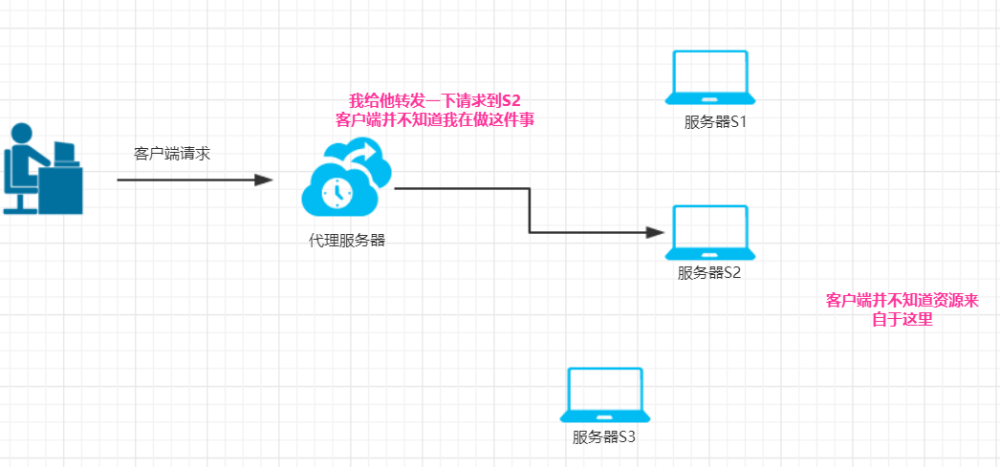
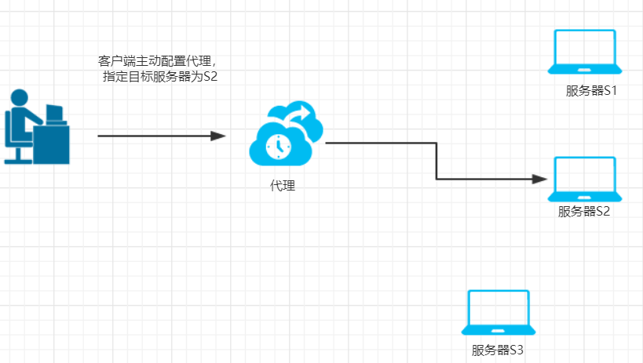
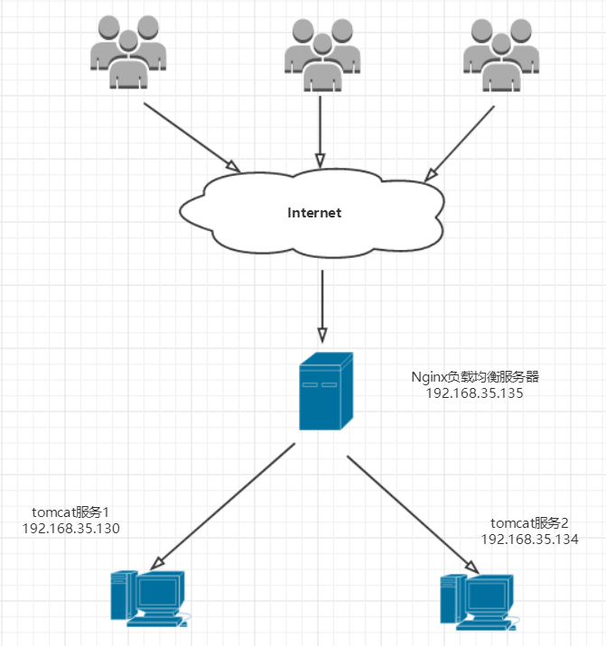
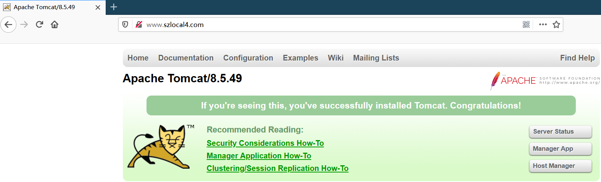
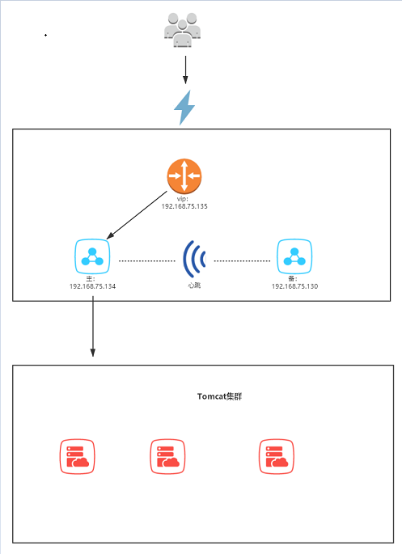
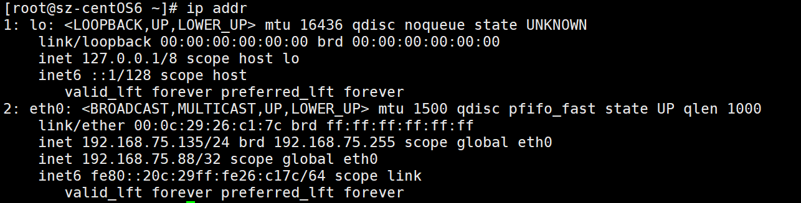
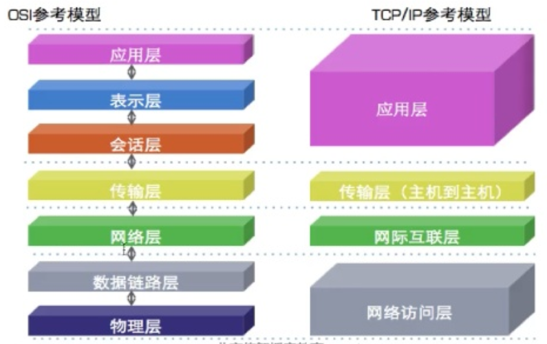

# 目标

:yellow_heart:**虚拟主机配置**

:yellow_heart:**反向代理配置**

:yellow_heart:**负载均衡配置**

:hear_no_evil:**负载均衡高可用**

:hear_no_evil:**nginx实现web缓存**


# 一 虚拟主机

概念： 

​		虚拟主机是一种特殊的模拟硬件的软件技术，它可以将网络上的一台物理计算机映射成多个虚拟主机，每个虚拟主机可以独立对外提供www服务，这样就可以实现一台物理主机对外提供多个web服务了。并且每个虚拟主机之间是独立的，互不影响的。


概念视图：


nginx支持三种类型的虚拟主机配置：

- 1、基于ip的虚拟主机
- 2、基于域名的虚拟主机 
- 3、基于端口的虚拟主机


这里我们主要讲一下基于域名的虚拟主机配置，也是使用最多的。

##  基于域名的虚拟主机配置

### 需求

两个域名都指向一台机器， 使用不同的域名访问会得到不同的内容。

### 分析

- 使用一台虚拟机作为物理机。
- 使用两个域名：www.szlocal1.com、www.szlocal2.com
- 分别为两个域名创建访问资源目录：  usr/local/szlocal1/index.html、usr/local/szlocal2/index.html

usr/local/szlocal1/index.html、usr/local/szlocal2/index.html内容如下：

```html
<h3>
    szlocal1
</h3>

<h3>
    szlocal2
</h3>
```

### 实战

**虚拟主机配置**

在`/usr/local/nginx/conf/nginx.conf`文件，添加两个虚拟主机，即添加两个server配置项：

```nginx
	# 添加szlocal1
	server {
        listen       80;
        server_name  www.szlocal1.com;

        location / {
            root   /usr/local/szlocal1;
            index  index.html index.htm;
        }
    }
	
	# 添加szlocal2
	server {
        listen       80;
        server_name  www.szlocal2.com;

        location / {
            root   /usr/local/szlocal2;
            index  index.html index.htm;
        }
    }
```

**在宿主机中访问**

​		这样我们的基于域名的虚拟主机就配置好了，但是在浏览中会访问不到，因为DNS服务器中并没有我们刚配置的的两个域名，我们要模拟的话，可以配置我们宿主机的hosts文件，windows系统hosts所在的路径是： 

`C:\Windows\System32\drivers\etc`

在hosts文件中添加以下内容：

```
192.168.75.135 www.szlocal1.com
192.168.75.135 www.szlocal2.com
```

在浏览器中访问www.szlocal1.com、www.szlocal2.com，即可分别看到页面输出： szlocal1、szlocal2

# 二 反向代理

概念：

​		**反向代理**（Reverse Proxy）：指以代理服务器来接受internet上的连接请求，然后将请求转发给==内部网络==上的服务器，并将从服务器上得到的结果返回给internet上请求连接的客户端，此时代理服务器对外就表现为一个反向代理服务器。==反向代理，客户端并不知道目标资源在哪里，主动权也不在客户端==。

​		反向代理特点： 保护和隐藏原始资源服务器。



​		**正向代理**：和反向代理不同之处在于，典型的==正向代理是一种用户知道目标地址并主动使用的代理方式==。例如Chrome浏览器中安装了switchysharp以后，通过switchysharp方便地进行代理转发服务。而为此用户必须要提前在switchysharp中做好设置才能达到相应的效果。



### 需求

在一台虚拟机中使用nginx配置反向代理，代理到tomcat服务。

### 分析

一台虚拟机：192.168.75.135

安装了nginx、tomcat

需要使用虚拟主机的配置，这里增加一个配置为 www.szlocal3.com

### 实战

在`/usr/local/nginx/conf/nginx.conf`文件，添加一个server配置项，并且增加==proxy_pass（反向代理）==的配置。

```nginx
# 添加szlocal3 虚拟主机
	server {
        listen       80;
        server_name  www.szlocal3.com;

        location / {
			proxy_pass http://localhost:8080;
        }
    }
```

在宿主机windows的hosts配置: 

```
192.168.75.135 www.szlocal3.com
```

然后浏览器访问： www.szlocal3.com 即可。

说明： 访问www.szlocal3.com时，是监听了80端口，然后反向代理到了该机器的8080端口。用户并不知道资源在8080的tomcat服务中。

# 三 负载均衡

概念：

​		负载均衡（Load Balance，LB）：意思是当一台机器支撑不住访问流量的时候，可以通过水平扩展、增加廉价的机器设备来分担访问请求。

​		举个栗子：假设你开发了一个web应用，使用的是单机的tomcat，并发请求仅仅能支撑400，做活动期间达到了900的请求，这时候，一台机器搞不定，就需要再扩展2台，可以支撑1200的请求，最开始的1台+后面的2台就可以分摊请求，达到负载均衡的目的。

​		所以说，负载均衡可以增加系统的吞吐。


Nginx就是一个负载均衡服务器：

​		


> 数据转发功能，为nginx提供了跨越单机的横向处理能力，使nginx摆脱只能为终端节点提供单一功能的限制，而使它具备了网路应用级别的拆分、封装和整合的战略功能。在云模型大行其道的今天，数据转发是nginx有能力构建一个网络应用的关键组件。

Nginx中upstream模块就拥有数据转发功能，实现负载均衡。upstream不产生自己的内容，而是通过请求后端服务器得到内容，所以才称为upstream（上游）。upstream按照轮询（默认）方式进行负载，每个请求按时间顺序逐一分配到不同的后端服务器，如果后端服务器down掉，能自动剔除。

​		

Nginx负载均衡配置步骤：

1. 在http节点添加upstream节点，如：

```nginx
upstream myapp{
	server 192.168.75.130:8080;
    server 192.168.75.134:8080;
}
```


2. 在server节点下的location节点中添加 proxy_pass 配置项， 格式：  proxy_pass  http://upstream后面的名字

```nginx
# 添加szlocal4 虚拟主机
	server {
        listen       80;
		# 虚拟主机
        server_name  www.szlocal4.com;

        location / {
			root   html;
			index  index.html index.htm;
			# 反向代理到upstream
			proxy_pass http://myapp;
        }
    }
```


## 需求

实现一个简单的负载均衡，访问www.szlocal4.com，会在两台机器之间来回切换。

## 分析

- 需要设置基于域名的虚拟主机www.szlocal4.com
- 负载均衡使用 upstream
- 结合反向代理 proxy_pass 

## 实战

1. 在192.168.75.130、192.168.75.134 两台虚拟机中开启tomcat服务, tomcat版本号不一致，便于后面访问时观察页面变化。

2. 在Nginx负载均衡服务器中配置：

   ```nginx
   # 在http节点中配置
   upstream myapp{
   	server 192.168.75.130:8080;
       server 192.168.75.134:8080;
   }
   ```

3. 配置一个server节点，配置了虚拟主机www.szlocal4.com ;  并且反向代理结合upstream的名字myapp。

   ```nginx
   # 添加szlocal4 虚拟主机
   	server {
           listen       80;
   		# 虚拟主机
           server_name  www.szlocal4.com;
   
           location / {
   			root   html;
   			index  index.html index.htm;
   			# 反向代理到upstream
   			proxy_pass http://myapp;
           }
       }
   ```

4. 设置宿主机，修改windows的hosts，添加：

   ```
   192.168.75.135 www.szlocal4.com
   ```

5. 重启192.168.75.135的nginx

6. 浏览器访问； 会看到在两个tomcat服务之间来回切换，见下图：（这里为了以示区分，在2台机器上的tomcat版本不一致）。





# 四 高可用

如果nginx服务存在异常，上面的负载均衡架构就面临问题，服务不可用。

这个时候就会采用高可用方案了，简单的高可用是一般主从备份机制。

> 我们可以使用2台机器，作为主、备服务器，各自运行nginx服务。
>
> 需要一个监控程序，来控制传输主、备之间的心跳信息（我是否还活着的信息），如果备份机在一段时间内没有收到主的发送信息，则认为主已经挂了，自己上去挑大梁，接管主服务继续提供负载均衡服务。
>
> 当备再次可以从主那里获得信息时，释放主服务，这样原来的主又可以再次提供负载均衡服务了。

这里有3个角色： 一主、一备、监控程序。其中的监控程序或者软件我们可以采用Keepalived。

## Keepalived


### Keepalived工作原理

> Keepalived类似一个工作在layer3,4&7的交换机。
>
> 
>
> Layer3,4&7工作在IP/TCP协议栈的IP层，TCP层，及应用层,原理分别如下：
>
> Layer3：Keepalived使用Layer3的方式工作式时，Keepalived会定期向服务器群中的服务器发送一个ICMP的数据包（既我们平时用的Ping程序）,如果发现某台服务的IP地址没有激活，Keepalived便报告这台服务器失效，并将它从服务器群中剔除，这种情况的典型例子是某台服务器被 非法关机。Layer3的方式是以服务器的IP地址是否有效作为服务器工作正常与否的标准。
>
> Layer4:如果您理解了Layer3的方式，Layer4就容易了。Layer4主要以TCP端口的状态来决定服务器工作正常与否。如web server的服务端口一般是80，如果Keepalived检测到80端口没有启动，则Keepalived将把这台服务器从服务器群中剔除。
>
> Layer7：Layer7就是工作在具体的应用层了，比Layer3,Layer4要复杂一点，在网络上占用的带宽也要大一些。Keepalived将根据用户的设定检查服务器程序的运行是否正常，如果与用户的设定不相符，则Keepalived将把服务器从服务器群中剔除。
>
> ---- 来自搜狗百科

### Keepalived作用

主要用作真实服务器的健康状态检查以及负载均衡的主机和备机之间故障切换实现。

一般的高可用web架构组件：LVS+keepalived+nginx

### Keepalived高可用架构

Keepalived高可用简单架构概念视图：



当主down机后，会提升备为主，保证服务可用。

当主再次上线时，备会退位，主继续服务。


### Keepalived组成

Keepalived 模块化设计，主要有三个模块，分别是`core`、`check`和 `vrrp`。 

- core
  - **keepalived的核心，负责主进程的启动和维护、全局配置文件的加载解析** 
- check
  - **负责healthchecker(健康检查)，包括各种健康检查方式，以及对应的配置的解析包括LVS的配置解析；可基于脚本检查对IPVS后端服务器健康状况进行检查。** 
- vrrp
  - **VRRPD子进程就是来实现VRRP（虚拟路由冗余协议）协议的**

### 安装Keepalived

- 方式一：可以直接使用yum安装。

```bash
yum install -y keepalived
```


- 方拾二： 使用源码安装方式。

```bash
#下载
wget http://www.keepalived.org/software/keepalived-1.2.23.tar.gz
#解压
tar -zxvf keepalived-1.2.23.tar.gz
cd keepalived-1.2.23
#安装
./configure --prefix=/usr/local/keepalived   #prefix指定安装目录
make
make install


vi /usr/local/keepalived/etc/keepalived/keepalived.conf
替换为你的配置文件的内容。


vi /usr/local/keepalived/etc/sysconfig/keepalived
添加以下内容：
KEEPALIVED_OPTIONS="-D -f /usr/local/keepalived/etc/keepalived/keepalived.conf" #指定keepalived配置文件路径


因为我们使用非默认路径（/usr/local）安装keepalived，需要设置一些软链接以保证keepalived能正常启动：
ln -s /usr/local/keepalived/sbin/keepalived  /usr/bin #将keepalived主程序加入到环境变量
ln -s /usr/local/keepalived/etc/rc.d/init.d/keepalived  /etc/init.d/ #keepalived启动脚本，放到/etc/init.d/目录下就可以使用service命令便捷调用
ln -s /usr/local/keepalived/etc/sysconfig/keepalived  /etc/sysconfig/ #keepalived启动脚本变量引用文件，默认文件路径是/etc/sysconfig/，也可以不做软链接，直接修改启动脚本中文件路径即可


启动服务
service keepalived start

chkconfig keepalived on

# 测试
使用配置好的虚拟ip，在浏览器访问测试一下即可。

```

**配置文件**：安装完成之后，可以在目录：  `/etc/keepalived` 看到配置文件：`keepalived.conf`

后面则统一修改 `/etc/keepalived/keepalived.conf` 配置文件即可。


**启动|停止|重启服务**

```bash
service keepalived start|stop|restart
```

**检查服务**

```bash
chkconfig keepalived on
```


## 需求

使用keepalived结合nginx，搭建一套简单的高可用集群方案。

并且测试主宕机的情况；

演示主上线的情况。

## 分析

- 选择4台虚拟机：2台做nginx的主、备；2台做tomcat集群。
- 选择192.168.75.132、192.168.75.135安装keepalived和nginx并分别做主、备。
- 选择192.168.75.130、192.168.75.134安装tomcat做应用集群。

## 实战

1. 在192.168.75.132、192.168.75.135分别安装keepalived并配置

   ```bash
   #下载
   mkdir /usr/local/keepalived
   cd /usr/local/keepalived
   wget http://www.keepalived.org/software/keepalived-1.2.23.tar.gz
   # 或者 wget http://www.keepalived.org/software/keepalived-1.2.23.tar.gz --no-check-certificate  跳过证书验证
   #解压
   tar -zxvf keepalived-1.2.23.tar.gz
   # cd 到解压后的目录
   cd keepalived-1.2.23
   # 源码安装三板斧搞起来
   ./configure --prefix=/usr/local/keepalived   #prefix指定安装目录
   make
   make install
   ```

   安装好后，可以看到以下目录：

   


​	在192.168.75.132(作为主)修改配置文件 keepalived.conf：

```bash
! Configuration File for keepalived

# 全局配置
global_defs {
   # 发生切换时，需要通知的邮件； 一行一个用户的email地址；这里假定了几个人..
   notification_email {
     zs@163.com
     ls@163.com
     ww@163.com
   }
   
   notification_email_from admin@163.com    				# 发件人，谁发的；这里假定了一个管理员邮箱admin@163.com
   smtp_server smtp.163.com                                 # smtp服务器地址，这里示例使用163的公开地址
   smtp_connect_timeout 30									# smtp连接超时时间设置
   router_id LVS_DEVEL										# 运行keepalived的一个路由标志id
}

# VRRP 配置
vrrp_instance VI_1 {
    state MASTER											# 配置标志，MASTER 为主；BACKUP 为备
    interface eth0						# 该keepalived实例绑定的网卡; RHEL7以前可以设置为eth0,7以及之后可以设置为ens33
    virtual_router_id 51				#VRRP组名，两个节点的设置必须一样，以指明各个节点属于同一VRRP组
    priority 100											# 主节点的优先级（1-254之间），备用节点必须比主节点优先级低
    advert_int 1											# 主、备之间检查是否一致的时间间隔：单位秒
    
	# 认证配置   设置验证信息，主、备节点必须一致
	authentication {
        auth_type PASS
        auth_pass 1111
    }
    virtual_ipaddress {					# 指定虚拟IP, 主、备节点设置必须一样
		# 可以设置多个虚拟ip，换行即可；随便写；这个地址是虚拟的，并不需要实体机器
		# 会将该vip绑定到当前机器的网卡eth0上
        192.168.75.88					
    }
}
```

在192.168.75.135（作为备）修改配置文件 keepalived.conf：

- vrrp_instance 下面的state改为了 **BACKUP**。
- vrrp_instance  下面的额priority改为了**90** ，比主的100低即可。

- 其他的配置项一样。

2. 启动keepalived服务

```bash
service keepalived start
```

- 可以使用 ip  addr 命令查看vip是否已经绑定

  


3. **测试正常情况**

   在Master和Backup上分别启动keepalived。此时VIP(192.168.75.88)是可访问的，也可以ping通，通过虚拟ip（192.168.75.88）访问，可以看到一直访问的是主（192.168.75.132）：

   

4.  **测试Master宕掉的情况**

**现在把主（192.168.75.132）的keepalived关掉**，在浏览器上再次访问192.168.75.88，会发现此时访问的是备（192.168.75.135）了：


# 附录

OSI七层模型、TCP/IP 四层模型概念视图：

