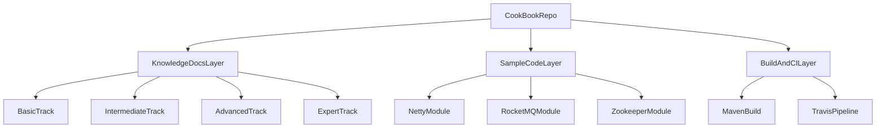

# CookBook 项目总览

## 1. 项目定位与价值

`CookBook` 是一个以 Java 技术体系为核心的混合型仓库：上层以知识文档沉淀为主，下层以示例代码工程为辅助。  
它既可作为作者持续维护的技术地图，也可作为读者分层学习路径。

- **定位**：知识文档主导 + 示例工程辅助。
- **受众**：Java 读者（基础、中级、高级、资深专家）与项目维护者。
- **价值**：将“理论专题”和“代码样例”放在同一仓库，便于从认知到实操闭环学习。

---

## 2. 全局目录地图

### 2.1 三层结构

1. **文档层（主题库）**  
   以技术域组织的 Markdown 文档目录，例如：`Java核心`、`JVM`、`Spring`、`SpringCloud`、`Redis`、`RocketMQ`、`架构`、`分布式高并发`。
2. **代码层（示例工程）**  
   位于 `src/main/java/org/byron4j/cookbook`，按主题分包（如 `netty`、`rocketmq`、`zk`、`javacore`、`designpattern`）。
3. **构建层（工程化）**  
   以 Maven + Spring Boot 组织，关键入口包括 `pom.xml`、`mvnw`、`.travis.yml`。

### 2.2 结构关系图



---

## 3. 技术栈与工程能力

### 3.1 核心技术栈

- **Java / JVM**：`pom.xml` 中 `java.version` 为 `1.8`。
- **Spring Boot**：`spring-boot-starter-parent:2.0.6.RELEASE`，入口类为 `src/main/java/org/byron4j/cookbook/CookbookApplication.java`。
- **Spring 生态**：`web`、`webflux`、`aop`、`jdbc`、`actuator`、`test` 相关 starter。
- **中间件与框架**：MyBatis、RocketMQ、ZooKeeper、Dubbo、Javassist、Hibernate、Atomikos。
- **数据与连接池**：MySQL、HikariCP。

### 3.2 工程能力特征

- 具备可运行的 Spring Boot 入口和基础测试入口（`CookbookApplicationTests`）。
- 具备 Maven Wrapper（`mvnw` / `mvnw.cmd`）与 CI 配置（`.travis.yml`）。
- 同时覆盖“文档知识体系”和“核心技术样例”两种内容形态。

---

## 4. 四层能力分级阅读路径

> 路径原则：先建立概念，再补齐中间件与分布式治理，最后进入架构与源码深潜。

### 4.1 基础层

- **目标**：掌握 Java 基础语法与框架入门认知。
- **建议主题**：
  - `Java核心/1-Java枚举.md`
  - `Java核心/2-Java注解.md`
  - `Java核心/3-Java反射.md`
  - `Spring/1-IOC相关.md`
  - `数据结构和算法/数据结构/01-线性表.md`

### 4.2 中级层

- **目标**：形成并发、JVM、数据库与常用框架的系统理解。
- **建议主题**：
  - `Java核心/5-线程池.md`
  - `JVM/1-JVM参数.md`
  - `Spring/3-SpringAOP.md`
  - `Spring/6-Spring事务.md`
  - `MyBatis/2-MyBatis使用介绍.md`
  - `Redis/3-Redis缓存.md`

### 4.3 高级层

- **目标**：掌握分布式系统核心组件与治理能力。
- **建议主题**：
  - `Java核心/6-AQS-抽象队列同步器.md`
  - `分布式高并发/1-令牌桶算法.md`
  - `SpringCloud/4-Hystrix熔断器.md`
  - `SpringCloud/8-SpringCloud-Config高可用架构.md`
  - `RocketMQ/1-RocketMQ核心知识.md`
  - `Nginx/007-Nginx实现虚拟主机、反向代理、负载均衡、高可用.md`

### 4.4 资深专家层

- **目标**：建立架构方法论、性能调优与源码级分析能力。
- **建议主题**：
  - `架构/内容/架构内容.md`
  - `架构/高可用/01-高可用、负载均衡不得不说的事.md`
  - `架构/云原生/00-什么是云原生.md`
  - `RocketMQ/4-RocketMQ源码片段阅读(一).md`
  - `javassist指南/0-javassist编程指南概览.md`

---

## 5. 示例代码主链路

本仓库的“代码学习主链路”建议聚焦 Netty、RocketMQ、Zookeeper 三组样例。

### 5.1 Netty 消息编解码链路

- 服务端入口：`src/main/java/org/byron4j/cookbook/netty/message/server/MessageServer.java`
- 客户端入口：`src/main/java/org/byron4j/cookbook/netty/message/client/MessageClient.java`
- 编解码协议：`src/main/java/org/byron4j/cookbook/netty/apidemo/protocol/PacketCodeC.java`
- 服务端处理：`src/main/java/org/byron4j/cookbook/netty/message/server/MessageServerHandler.java`

**链路说明**：  
客户端通过 `MessageClient` 建连并发送 `MessageRequestPacket`；服务端在 `MessageServerHandler` 中解码、处理并回包 `MessageResponsePacket`；双方统一通过 `PacketCodeC` 完成协议编码/解码。

### 5.2 RocketMQ 生产消费链路

- 普通消息生产：`src/main/java/org/byron4j/cookbook/rocketmq/MQProducerDemo.java`
- 普通消息消费：`src/main/java/org/byron4j/cookbook/rocketmq/MQConsumerDemo.java`
- 事务消息生产：`src/main/java/org/byron4j/cookbook/rocketmq/transaction/MQTransactionProducerDemo.java`
- 事务消息消费：`src/main/java/org/byron4j/cookbook/rocketmq/transaction/MQTransactionConsumerDemo.java`

**链路说明**：  
普通场景中，Producer 向指定 Topic 发送消息，Consumer 订阅 Topic 并按监听器回调消费；事务场景中，`sendMessageInTransaction` 触发本地事务执行与事务回查。

### 5.3 Zookeeper 主从协调链路

- 主节点竞选与监视：`src/main/java/org/byron4j/cookbook/zk/chapter4/Master5.java`
- Worker 注册与状态更新：`src/main/java/org/byron4j/cookbook/zk/zkFollow/Worker.java`

**链路说明**：  
`Master5` 通过创建 `/master` 临时节点参与主节点选举，并监视节点变化；`Worker` 在 `/workers/worker-*` 下注册临时节点并上报状态，形成主从协调基础模型。

---

## 6. 构建与运行方式

### 6.1 构建与测试

- **Maven 构建入口**：`pom.xml`
- **Wrapper**：`mvnw`、`mvnw.cmd`
- **CI**：`.travis.yml` 中执行 `mvn clean package -DskipTests=true`
- **测试入口**：`src/test/java/org/byron4j/cookbook/CookbookApplicationTests.java`

常用命令示例：

```bash
./mvnw clean package -DskipTests=true
./mvnw test
```

### 6.2 运行入口

- 应用入口：`src/main/java/org/byron4j/cookbook/CookbookApplication.java`
- 关键配置：`src/main/resources/application.yml`（含 MySQL 数据源配置）

---

## 7. 当前风险与改进建议

### 7.1 已识别风险

- **导航一致性风险**：历史目录存在重复入口与个别失效链接，长期维护容易漂移。
- **内容时效风险**：部分依赖与中间件版本较老（如 Spring Boot 2.0.6、Java 8），与当前生产最佳实践存在差距。
- **配置安全风险**：`application.yml` 中存在示例数据库账号口令，需避免在真实环境沿用。
- **验证深度风险**：CI 当前以 `-DskipTests=true` 打包为主，自动化验证覆盖有限。

### 7.2 改进建议

1. 建立 README 维护规范：新增专题时同步更新总览、分层路径和跳转锚点。
2. 增加定期链接校验和目录巡检，降低文档导航老化。
3. 按“基础→中级→高级→专家”设计统一模板，减少专题间风格差异。
4. 为关键样例（Netty/RocketMQ/ZK）补充最小可运行说明和输入输出示例。
5. 逐步升级依赖版本，并在 CI 中加入基础测试与静态检查任务。

---

## 8. 推荐阅读起步顺序

- **新读者**：先读 `Java核心`、`数据结构和算法`、`Spring`，再进入 `JVM` 与中间件专题。
- **进阶读者**：并行阅读 `SpringCloud`、`RocketMQ`、`Zookeeper` 与 `NIO/Netty` 示例代码。
- **作者/维护者**：优先维护 README 导航一致性，再持续补充专家向“架构+源码”专题。

