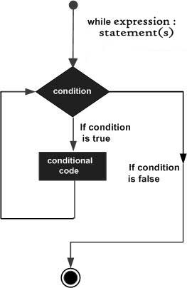

# Python3 基本语法、常见数据类型、基本的操作符

## 第一个 Python 程序

我们来看一看在不同编程模式下的执行Python程序。

### 交互模式编程

调用解释器，不需要传递脚本文件作为参数。

```python
# Linux:
python
Python 2.6.6 (r266:84292, Jul 23 2015, 15:22:56) 
[GCC 4.4.7 20120313 (Red Hat 4.4.7-11)] on linux2
Type "help", "copyright", "credits" or "license" for more information.
>>> 

# Windows:
C:\Users\BYRON.Y.Y>python
Python 3.6.3 (v3.6.3:2c5fed8, Oct  3 2017, 18:11:49) [MSC v.1900 64 bit (AMD64)] on win32
Type "help", "copyright", "credits" or "license" for more information.
>>>
```


#### Hello,Python! 程序

在 Python 提示符中输入以下代码并按 Enter 键。

```python
>>> print("Hello, Python!")
# 输出结果为：
Hello, Python!
```

### 脚本模式编程

通过语法 **python script.py** 执行script.py文件中的python脚本。
新建一个文件 hello.txt，里面写入一行代码：
```python
print ("Hello,Python!")
```
然后在命令行执行(Windows下的演示)：
```bat
C:\Users\BYRON.Y.Y>python C:\\Users\\BYRON.Y.Y\\Desktop\\hello.py
Hello,Python!
```

Linux下：

```shell
# 使用awk写入文本到hello.txt
awk 'BEGIN {print "print(\"Hello,Python!\")" > "hello.txt"}'
# 查看文件内容
cat hello.txt
# 当前文件内容 
print("Hello,Python!")
# 使用python执行脚本文件
$ python hello.txt 
# 输出结果：
Hello,Python!
```

## Python 标识符

Python 标识符以 小写字母a-z，大写字母A-Z， 下划线 _ 开头，后面跟着数字或者字母。
Python 不允许使用标点符号 如 &、$ 和 % 作为标识符的组成部分。
Python 是大小写敏感的编程语言。

一些标识符的命名规范：

- 类名的首字母大写。其他的标识符都是小写开头。
- 用一个下划线开始的标识符表示是私有的。
- 用两个下划线开始的标识符表示是强私有的。
- 如果标识符也是以两个下划线结尾的，表示是语言定义的规范。

## 保留关键字

Python 有一些关键字。这些关键字你不能将他们作为标识符，这些关键字都是小写的。

||||
|----|-----|----|
|and|exec|not|
|as|finally|or|
|assert|for|pass|
|break|from|print|
|class|global|<font color=red>raise</font>|
|continue|if|return|
|def|import|try|
|del|in|while|
|elif|is|with|
|else|lambda|yield|
|except|||


## 行缩进

Python 不是使用花括号作为代码块界定符的。Python 中的代码块是使用行缩进来表示的，行缩进在Python中是强制要求的。
缩进中的空格数是可变的，但是代码块中的所有语句都需要保持同样的空格数目。例如：

```python
if True:
   print ("True")

else:
   print ("False")
```

以下则是错误的代码书写方式：

```python
if True:
   print ("Answer")
   print ("True")

else:
   print "(Answer")
   print ("False")
```

下面看一段较长的缩进代码示例，以下代码仅仅用来展示行缩进示例而已：

```python
import sys

try:
   # open file stream
   file = open(file_name, "w")

except IOError:
   print ("There was an error writing to", file_name)
   sys.exit()
print ("Enter '", file_finish,)
print ("' When finished")

while file_text != file_finish:
   file_text = raw_input("Enter text: ")
   
   if file_text == file_finish:
      # close the file
	  file.close
      break
   file.write(file_text)
   file.write("\n")
file.close()
file_name = input("Enter filename: ")

if len(file_name) == 0:
   print ("Next time please enter something")
   sys.exit()

try:
   file = open(file_name, "r")

except IOError:
   print ("There was an error reading file")
   sys.exit()
file_text = file.read()
file.close()
print (file_text)
```

## 多行语句

Python 中的语句通常以新行结束。Python 允许连续行字符 **\\** 表示行在继续。例如：

```python
>>> a = 14+\
    12+\
    20
# 输出结果为：
>>> a
46
```

如果语句包含 **[]、{}** ，则不需要使用连续行字符了。例如以下示例演示了给一个数组 arr 赋值：

```python
>>> arr = [1,
       2,
       4]
>>> arr
[1, 2, 4]
```


## Python 中的引号

Python 接收单引号 （**'**） ， 双引号 （**"** ）和 三引号 （**'''**、**"""**）表示字符字面量，以什么符号开始就应该以什么符号结束。
三引号符一般用于跨多行使用的场景。例如：

```python
word = 'word'
sentence = "This is a sentence."
paragraph = """This is a paragraph. It is
made up of multiple lines and sentences."""
```

## Python 中的注释

**#**  符号并且不是在一个字符串字面量中间，是在开始，则表示注释。所有在 **#** 后面物理行的所有内容都会被解释器忽略。

```python
# 第一个注释
print ("Hello, Python!") # 第二个注释
```


## 空白行

一行只有空白字符，也许存在注释，都会被Python解释器忽略。

在解释器交互时，你需要输入一空行去终止一个多行语句。

## 等待用户输入

下面的一行程序提示了：输入回车关闭。然后等待用户做出动作。

```python
input("\n\nPress the enter key to exit.")
```

input()函数从控制台获取用户输入的内容：
```python
>>> input("你好，请输入你的名字：")
你好，请输入你的名字：Byron
'Byron'
```

## 在一行中有多个语句

分号 **;** 允许在单行中编写多条语句，可以使用分号分隔多条语句。示例如下：
```python
import sys; x = 'foo'; sys.stdout.write(x + '\n')

>>> a = 1; b = 2; c = 3
>>> a
1
>>> b
2
>>> c
3
```


## 多个语句组作为套件

组成单个代码块的语句组在Python中称为套件。混合或复杂的语句，例如 if、while、def 和 class 需要标题行和套件。
标题行起始于关键字，终止于冒号 **:** ，接着一行或更多的语句组成套件。如下示例：

```python
if expression : 
   suite
elif expression : 
   suite 
else : 
   suite
```


## 命令行参数

许多程序运行时可以提供给你一些它们如何运行的基本信息。Python 可以允许你做到这一点，使用 **-h** 命令查看一些帮助信息。

```python
C:\Users\BYRON.Y.Y>python -h
usage: python [option] ... [-c cmd | -m mod | file | -] [arg] ...
Options and arguments (and corresponding environment variables):
-b     : issue warnings about str(bytes_instance), str(bytearray_instance)
         and comparing bytes/bytearray with str. (-bb: issue errors)
-B     : don't write .pyc files on import; also PYTHONDONTWRITEBYTECODE=x
-c cmd : program passed in as string (terminates option list)
-d     : debug output from parser; also PYTHONDEBUG=x
-E     : ignore PYTHON* environment variables (such as PYTHONPATH)
-h     : print this help message and exit (also --help)
-i     : inspect interactively after running script; forces a prompt even
         if stdin does not appear to be a terminal; also PYTHONINSPECT=x
-I     : isolate Python from the user's environment (implies -E and -s)
-m mod : run library module as a script (terminates option list)
-O     : optimize generated bytecode slightly; also PYTHONOPTIMIZE=x
-OO    : remove doc-strings in addition to the -O optimizations
-q     : don't print version and copyright messages on interactive startup
-s     : don't add user site directory to sys.path; also PYTHONNOUSERSITE
-S     : don't imply 'import site' on initialization
-u     : unbuffered binary stdout and stderr, stdin always buffered;
         also PYTHONUNBUFFERED=x
         see man page for details on internal buffering relating to '-u'
-v     : verbose (trace import statements); also PYTHONVERBOSE=x
         can be supplied multiple times to increase verbosity
-V     : print the Python version number and exit (also --version)
         when given twice, print more information about the build
-W arg : warning control; arg is action:message:category:module:lineno
         also PYTHONWARNINGS=arg
-x     : skip first line of source, allowing use of non-Unix forms of #!cmd
-X opt : set implementation-specific option
file   : program read from script file
-      : program read from stdin (default; interactive mode if a tty)
arg ...: arguments passed to program in sys.argv[1:]

Other environment variables:
PYTHONSTARTUP: file executed on interactive startup (no default)
PYTHONPATH   : ';'-separated list of directories prefixed to the
               default module search path.  The result is sys.path.
PYTHONHOME   : alternate <prefix> directory (or <prefix>;<exec_prefix>).
               The default module search path uses <prefix>\lib.
PYTHONCASEOK : ignore case in 'import' statements (Windows).
PYTHONIOENCODING: Encoding[:errors] used for stdin/stdout/stderr.
PYTHONFAULTHANDLER: dump the Python traceback on fatal errors.
PYTHONHASHSEED: if this variable is set to 'random', a random value is used
   to seed the hashes of str, bytes and datetime objects.  It can also be
   set to an integer in the range [0,4294967295] to get hash values with a
   predictable seed.
PYTHONMALLOC: set the Python memory allocators and/or install debug hooks
   on Python memory allocators. Use PYTHONMALLOC=debug to install debug
   hooks.

```

## 变量类型

变量只是存储值的**预留内存**位置。这意味着当你创建一个变量的时候，则在内存中预留了一些空间。

基于变量的数据类型，解释器会分配内存并决定预留内存存储什么内容。因此，通过分配不同的数据类型给变量，可以存储integer、decimal 和字符串。

## 分配值给变量

Python 变量不需要显示指定内存空间，当你分配一个值给一个变量时就会自动分配内存空间。等于符号 **=** 用于分配值给变量。

**=** 操作符左边是变量名，右边是需要分配给左边变量的值。例如：
```python
counter = 100          # An integer assignment
miles   = 1000.0       # A floating point
name    = "John"       # A string

print (counter)
print (miles)
print (name)
```

## 多重赋值

Python 支持将一个值同时分配给多个变量。
```python
a = b = c = 1
```

还支持将多个值分配给多个变量，例如：
```python
a, b, c = 1, 2, "John"
```

## 标准数据类型

存储在内存中的数据可能是多种类型的。例如，一个人的年龄，存放的是一个数值类型的值，他的地址存储为字符类型的。Python 有多种标准数据类型，用于定义他们可能的操作和可能的存储方法。
Python 有5种标准数据类型：

- Numbers 数值类型
- String 字符串类型
- List 列表
- Tuple 元组
- Dictionary 字典

## Python 的数值类型

Number 数据类型用于存储数值类型。当你分配一个值给变量的时候，一个Number对象就创建了。
例如：
```python
var1 = 1
var2 = 2
```

你可以使用 **del** 语句删除对象引用。**del** 语法如下：

```python
del var1[, var2[, var3[, ..., varN]]]
```

```python
del var1,var2
```

Python 支持3种不同类型的数值类型：

- **int** 符号整数 : 1、-1、0 、080、-0x260、0x69 等
- **float** 浮点数 ： 15.2、-21.9、0.0、32.3+e18、70.2-E12、-32.54e100 等
- **complex** 复数 ： 3.14j、9.322e-36j、.876j、-.6545+0J、 4.53e-7j 等； 复数是 **x + yj** 的形式，x表示实部，y表示虚部。

**Python3 种所有的整型数都是长整型的。因此，并没有像long这样的类型。**

## Python 字符串类型

Python中的字符串被引号包围的连续的字符集。允许使用单引号或者双引号。
子串可以使用 **[ ] 或者 [ : ]** 操作联合索引，0开始，-1表示末尾 来截取。
**+** 可以作为字符串连接操作符，* 符号 表示字符串的重复操作。

```python
str = 'Hello World!'
>>> print(str)
Hello World!
>>> print(str[0])
H
>>> print(str[2:5])
llo
>>> print(str[2:])
llo World!
>>> print(str * 2)
Hello World!Hello World!
>>> print(str + "TEST")
Hello World!TEST
```

## Python 列表类型

列表是Python最通用的复合数据类型。
列表包含以逗号分隔开，且以方括号[]闭合的数据项。在一定程度上，列表有点类似C语言中的数组，只是Python列表中的元素可以是不同的数据类型。
列表中的元素访问可以使用 **[ ]** 、**[ : ]** 操作联合索引下标，和字符串一样，0表示起始位置，-1表示末尾位置。
**+** 符号可以将2个列表进行连接操作，* 符号是重复操作符。

```python
>>> list = ['abcd', 786, 2.23, 'john', 70.2]
>>> tinylist = [123, 'john']
>>> print(list)
['abcd', 786, 2.23, 'john', 70.2]
>>> print(list[0])
abcd
>>> print(list[1:3])
[786, 2.23]
>>> print(list[2:])
[2.23, 'john', 70.2]
>>> print(tinylist * 2)
[123, 'john', 123, 'john']
>>> print(tinylist + list)
[123, 'john', 'abcd', 786, 2.23, 'john', 70.2]
```

## Python 中的元组数据类型

元组是另外一个序列数据类型，和列表类似，元素以逗号分隔，以圆括号()包围结束。
列表是以[]包围，而元组是以()包围的。
元组是只读列表，初始化之后，不能再对其进行变更。

```python
>>> tuple = ('abcd', 786, 2.23, 'john', 70.2)
>>> tinytuple = (123, 'john')
>>> print(tuple)
('abcd', 786, 2.23, 'john', 70.2)
>>> print(tuple[0])
abcd
>>> print(tuple[1:3])
(786, 2.23)
>>> print(tuple[2:])
(2.23, 'john', 70.2)
>>> print(tinytuple * 2)
(123, 'john', 123, 'john')
>>> print(tinytuple + tuple)
(123, 'john', 'abcd', 786, 2.23, 'john', 70.2)
```

示例，列表在初始化后可以进行变更，但是元组不能再支持元素变更：

```python
>>> tinylist
[123, 'john']
>>> tinylist[0] = 7
>>> tinylist
[7, 'john']
>>> tinytuple
(123, 'john')
>>> tinytuple[0] = 7
Traceback (most recent call last):
  File "<pyshell#50>", line 1, in <module>
    tinytuple[0] = 7
TypeError: 'tuple' object does not support item assignment
```

## Python 字典数据类型

Python 字典是一种哈希表类型。
他们的工作方式类似于Perl中的联合数组或者哈希表，由键值对组成。
字典类型的 key 可以是任意的Python数据类型， 但是通常使用数值或者字符串类型。value 可以是任意的Python对象。
字典类型以花括号 **{}** 包围，值可以使用方括号 **[]** 进行访问或者分配值。

```python
>>> dict = {}
>>> dict['one'] = "This is one"
>>> dict[2] = "This is two"
>>> tinydict = {'anme': 'john', 'code': 6743, 'dept': 'sales'}
>>> print(dict['one'])
This is one
>>> print(dict[2])
This is two
# 不存在key为two，则访问发生错误
>>> print(dict['two'])
Traceback (most recent call last):
  File "<pyshell#81>", line 1, in <module>
    print(dict['two'])
KeyError: 'two'
>>> print(tinydict)
{'anme': 'john', 'code': 6743, 'dept': 'sales'}
>>> print(tinydict.keys())
dict_keys(['anme', 'code', 'dept'])
>>> print(tinydict.values())
dict_values(['john', 6743, 'sales'])
```

## Python 数据类型转换

有时候，可能需要在内置数据类型之间进行转换。你只需要使用 类型名 的函数即可。
一些内置函数，可以完成数据类型间的转换。

|序号|函数|描述|
|----|----|----|
|1|**int(x [, base])**| 将x转换为一个整数。基数由可选参数base指定|
|2|**float(x)**|将x转换为一个浮点数|
|3|**complex(real [, imag]**)|创建一个复数|
|4|**str(x)**|将一个对象x转换成其字符串表示|
|5|**repr(x)**|将一个对象x转换成一个字符串表达式|
|6|**eval(str)**|评估一个字符串，并返回一个对象|
|7|**tuple(s)**|转换成一个元组|
|8|**list(s)**|转换成一个列表|
|9|**set(s)**|转换成一个set集合|
|10|**dict(d)**|创建一个字典，d必须是键值对的一个元组序列|
|11|**frozenset(s)**|转换为一个冻结集合，冻结后集合不能再添加或删除任何元素|
|12|**chr(x)**|将一个整数转换为一个字符|
|13|**unichr(x)**|将一个整数转换为一个unicode字符|
|14|**ord(x)**|将单个字符转换为其整型值|
|15|**hex(x)**|将一个整数专程16进制字符串|
|16|**oct(x)**|将整数转换成8进制字符串|


## Python 中的基本操作符

### 操作符类型

Python 支持以下类型的操作符

- 算数操作符
- 比较（关系）运算符
- 赋值运算符
- 逻辑运算符
- 位运算符
- 成员关系运算符
- 标志运算符

### Python 算数运算符

|运算符|描述|示例|
|:----:|:----:|:----:|
|+|加运算|1 + 2 = 3|
|-|减运算|1 - 2 = -1|
|*|乘运算|1 * 2 = 2|
|/|除运算|9 / 2 = 4.5|
|%|取模运算|9 % 4 = 1|
|**|指数运算|2 ** 10 = 1024|
|//|向下除|9 // 2 = 4|

### Python 关系运算符

==、!= 、 >、<、>=、<=

### Python 赋值运算符

和算数运算符配套

|运算符|描述|示例|
|:----:|:----:|:----:|
|=|赋值运算符|c = 1|
|+=|加运算|c +=a 等同于 c = c + a|
|-=|减运算|c -=a 等同于 c = c - a|
|*=|乘运算|c *=a 等同于 c = c * a|
|/=|除运算|c /=a 等同于 c = c / a|
|%=|取模运算|c %=a 等同于 c = c % a|
|**=|指数运算|c **=a 等同于 c = c ** a|
|//=|向下除|c //=a 等同于 c = c // a|


### Python 中的位运算符

位运算符是对二进制补码进行运算的操作符。假设 a = 60； b = 13； 他们的二进制格式如下：

a = 0011 1100

b = 0000 1101

-----------------

a&b = 0000 1100 : 与

a|b = 0011 1101 ： 或

a^b = 0011 0001 ： 异或

~a = 1100 0011 ： 非

a << 2 = 240 ： 左移2位相当于乘以 2的2次方
a >> 2 = 15 : 右移两位相当于除以2的2次方

### Python 逻辑运算符

假设 a 为 True， b 为 False。

a **and** b = False
a **or** b = True
**not** b = True

### Python 成员关系运算符

成员关系运算符是针对于一个序列的成员的关系运算。例如 字符串、列表、元组等。
共 2 种成员关系运算符： **in** 、 **not in**。

```python
>>> tinylist
[7, 'john']
>>> 7 in tinylist
True
>>> 'hello' not in tinylist
True
```

### Python 标识符

python 中的身份标志运算符用来比较两个对象在内存中的位置是否相等。

|运算符|描述|示例|
|:----:|:----:|:----:|
|is|如果两边的操作数是同一个则返回True|x is y, 这里的 **is** 结果由 **id(x)是否等于id(y)** 决定|
|is not|是is运算符的反义|如果 x is y 为 True， 则 x is not y 为 False|


### Python 中的运算符优先级

|优先级1为最高|运算符|
|:----:|:----:|
|1|** 指数运算符|
|2|~ + - 正负号|
|3|* / % // 乘、除、取模、向下除|
|4|+ - 加减运算|
|5|>> << 位移|
|6|& 位与|
|7|^ &#124; 位异或和或 |
|8|<= < > >= 关系运算符|
|9|<> == != 不等、等于|
|10|= %= /= //= -= += *= **= 赋值运算符|
|11|is 、is not 标志运算符|
|12|in 、not in 成员关系运算符|
|13|not or and 逻辑运算符|


## Python 分支决策

决策是对程序运行时发生的条件的预期。

主要语句： if、 else、 elif 


### if 语句

```python
if expression:
   statement(s)
```

### if...else 语句
```python
if expression:
   statement(s)

else:
   statement(s)
```

### 嵌套if...else 组件
```python
if expression1:
   statement(s)
   if expression2:
      statement(s)
   elif expression3:
      statement(s)
   else
      statement(s)
elif expression4:
   statement(s)
else:
   statement(s)
```

## Python 循环

### while 循环

while 循环语法如下：
```python
while expression:
   statement(s)
```

数据流图：



示例：
```python
while(count < 9):
	print("count current value is:" , count)
	count += 1

	
count current value is: 0
count current value is: 1
count current value is: 2
count current value is: 3
count current value is: 4
count current value is: 5
count current value is: 6
count current value is: 7
count current value is: 8
```

**使用带有循环的else语句**:

Python 支持 **else** 语句关联循环语句。
- 如果 else 语句和for循环一起使用，else 语句会在循环语句耗尽时执行。
- 如果 else 语句和while循环一起使用，当while的条件为False时执行

示例：

```python
>>> count = 0
>>> while count < 5:
	print(count, " is less than 5")
	count = count + 1
else : print(count, " is not less than 5")

0  is less than 5
1  is less than 5
2  is less than 5
3  is less than 5
4  is less than 5
5  is not less than 5
```

### for 循环

for 循环语法:

```python
for iterating_var in sequence:
   statements(s)
```

for 循环数据流图：


#### range() 函数

内置函数 **range()** 是迭代一系列数字的函数。会生产一个算术迭代器。

```python
>>> list = [1, 2]
>>> for idx in list:
	print(idx)

	
1
2
```

#### 按序列索引迭代

```python
>>> fruits = ['banana', 'apple',  'mango']
>>> for index in range(len(fruits)):
        print ('Current fruit :', fruits[index])

Current fruit : banana
Current fruit : apple
Current fruit : mango
```

```python
>>> numbers = [11,33,55,39,55,75,37,21,23,41,13]
>>> for num in numbers:
   if num%2 == 0:
      print ('the list contains an even number')
      break
else:
   print ('the list doesnot contain even number')

   
the list doesnot contain even number
```

### 嵌套循环

示例:

```python
for iterating_var in sequence:
   for iterating_var in sequence:
      statements(s)
   statements(s)
```

or

```python
while expression:
   while expression:
      statement(s)
   statement(s)
```

示例：

```python
>>> for i in range(1,11):
   for j in range(1,11):
      k = i*j
      print (k, end=' ')
   print()

   
1 2 3 4 5 6 7 8 9 10 
2 4 6 8 10 12 14 16 18 20 
3 6 9 12 15 18 21 24 27 30 
4 8 12 16 20 24 28 32 36 40 
5 10 15 20 25 30 35 40 45 50 
6 12 18 24 30 36 42 48 54 60 
7 14 21 28 35 42 49 56 63 70 
8 16 24 32 40 48 56 64 72 80 
9 18 27 36 45 54 63 72 81 90 
10 20 30 40 50 60 70 80 90 100 
```

### 循环控制语句

#### break 语句

break 语句会终止当前循环，可用于 while 和 for 循环中。

程序流图:


示例:

```python
>>> for letter in 'Python':     # First Example
   if letter == 'h':
      break
   print ('Current Letter :', letter)

   
Current Letter : P
Current Letter : y
Current Letter : t
```

#### continue 语句

continue 是指跳过本次循环，不再执行continue下面本次剩下的循环内的语句。

示例：

```python
>>> for letter in 'Python':     # First Example
   if letter == 'h':
      continue
   print ('Current Letter :', letter)

   
Current Letter : P
Current Letter : y
Current Letter : t
Current Letter : o
Current Letter : n
```

#### pass 语句

**pass** 语句， 它用于在语法上需要语句，但不希望执行任何命令或代码时。 类似于java代码中的： // TODO。
pass 是一个空操作，不会执行任何动作。
但是当你需要后面再回过头来编写程序时，可以在当前位置编写 pass 语句，用以标记。

```python
>>> for letter in 'Python': 
   if letter == 'h':
      pass
      print ('This is pass block')
   print ('Current Letter :', letter)

   
Current Letter : P
Current Letter : y
Current Letter : t
This is pass block
Current Letter : h
Current Letter : o
Current Letter : n
```

## 迭代器和生成器

### 迭代器

Iterator 迭代器是一个对象，它允许程序员遍历集合的所有元素，而不关心具体实现。
在 Python 中，一个迭代器对象需要实现2个方法： **iter()、next()**。
字符串、列表和元组都可以用来创建一个迭代器。

示例：

```python
>>> list = [1, 2, 3, 4]
>>> it = iter(list)
>>> it
<list_iterator object at 0x000001BCB210A7F0>
>>> print(next(it))
1
>>> 
>>> for x in it:
	print(x, end = ' ')

	
2 3 4 
```

### 生成器

>生成器是使用 **yield** 方法生成或生成一系列值的函数。

当一个生成器函数被调用时，它不开始执行函数就会返回一个生成器对象。
当 next 函数被第一次调用时，生成器函数则开始执行直到它到达 **yield** 语句，会返回生成的值。
yield 会保持跟踪，即记住最后一次执行，当第二次执行next()的时候会继续从前一个值开始。

示例，定义一个生成器，生成一个所有斐波那契数列的迭代器：

```python
def fibonacci(n): # 定义一个生成器函数
	a, b, counter = 0, 1, 0
	while True:
		if counter > n:
			return
		yield a
		a, b = b, a + b
		counter += 1
		
f = fibonacci(5) # f 是一个迭代器对象

while True:
	try:
		print (next(f), end = ' ')
	except StopIteration:
		break
		
0 1 1 2 3 5
````

再看一个实例用于生成2的整型指数值：

```python
>>> def myGenerator(n):
	a, cnt = 1, 0
	while True:
		if cnt > n:
			return
		yield a # 保存a的值返回
		a *= 2
		cnt += 1

		
>>> gen = myGenerator(10)
>>> for ele in gen:
	print(ele, end = ' ')

	
1 2 4 8 16 32 64 128 256 512 1024 
```
