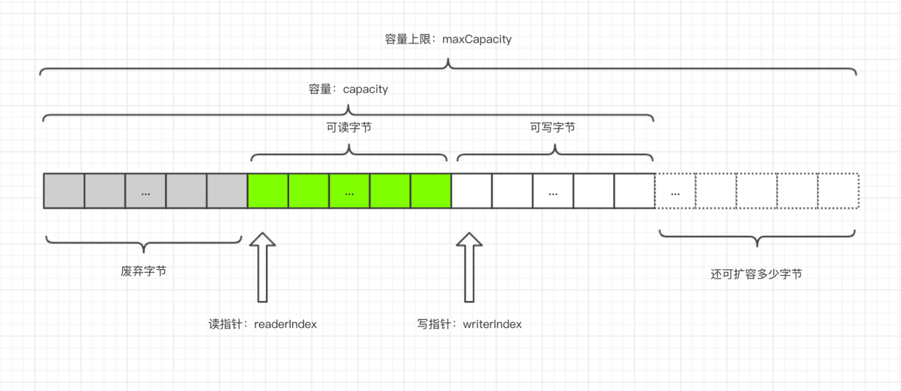

# CookBook 技术栈手册

>任何技能通过 “刻意练习” 都可以达到融会贯通的境界，就像烹饪一样，这里有一份食谱，你只需要增加自己练习的次数。

- MySQL
    - 1.[MySQL数据库锁、事务隔离级别详解](MySQL/1-MySQL数据库读写锁示例详解、事务隔离级别示例详解.md)
- Spring
- Nginx
- Maven
- Git
    - 步步为赢：搭建个人博客
- Jenkins
- 设计模式
    - 1.[单例模式](设计模式/1-单例模式/1-单例模式.md)
    - 2.[观察者模式](设计模式/2-观察者模式/2-观察者模式.md)
    - 3.[适配器模式](设计模式/3-适配器模式/3-适配器模式.md)
    - 4.[原型模式](设计模式/4-原型模式/4-原型模式.md)
    - 5.[建造者模式](设计模式/5-建造者模式/5-建造者模式.md)
    - 6.[工厂方法、抽象工厂模式](设计模式/6-工厂方法模式/6-工厂方法模式.md)
    - 7.[模板模式](设计模式/7-模板方法/7-模板模式.md)
    - 8.[状态模式](设计模式/8-状态模式/8-状态模式.md)
    - 9.[策略模式](设计模式/9-策略模式/9-策略模式.md)
    - 10.[对象池模式](设计模式/10-对象池设计模式/10-对象池设计模式.md)
- MyBatis
- Redis
- RabbitMQ
    - 参与开源
        - 1.[翻译客户端配置部分-中文翻译成英文](RocketMQ/参与阿里巴巴RocketMQ项目/1-客户端配置_en.md)
- NIO/Netty
    - 0.ByteBuf数据结构
    - 1.[Netty第一个程序示例](org.byron4j.cookbook.netty.first)
    - 2.[Netty自定义传输协议](org.byron4j.cookbook.netty.PacketCodeCTest)
    - 3.[Netty登陆请求、验证登陆、获取响应示例](org.byron4j.cookbook.netty.login.Server)
- Tomcat
- JVM知识点总结
- Zookeeper
    - 1.[ZK概览](Zokeeper/Zookeeper分布式过程协同技术详解Note/第1章-Zk概览.md)
    - 2.[了解Zk与Zk集群配置、主从模式案例演示](Zokeeper/Zookeeper分布式过程协同技术详解Note/第2章-了解Zk与Zk集群配置、主从模式案例演示.md)
    - 3.[使用Zk的API进行开发](Zokeeper/Zookeeper分布式过程协同技术详解Note/第3章-使用Zk的API进行开发.md)
- Dubbo
- RPC
    - Protobuf
        - [Protobuf基础教程](Protobuf/ProtobufTutorial/Protobuf基础教程.md)
- Code Refactoring 代码重构
- Linux
    - [Linux基础](Linux/1-Linux基础.md)
    - [Linux用户磁盘管理](Linux/2-Linux用户磁盘管理.md)
    - [Linux的vi、vim使用](Linux/3-Linux的vi、vim使用.md)
    - [Linux的yum命令](Linux/4-Linux的yum命令.md)
    - awk 脚本语言
        - [AWK 脚本语言](Linux/awk/1-awk入门.md)
    - Shell 脚本编程语言
        - [shell基础入门知识](Linux/shell/1-shell基础教程.md)
        - [shell基本语法](Linux/shell/2-shell基本语法.md)
        - [shell运算符汇总](Linux/shell/3-shell运算符汇总.md)
        - [shell的echo、printf、test详细介绍](Linux/shell/4-shell的echo、printf、test详细介绍.md)

- Python3 编程语言
    - 1.[概览](Python3/1-Python3概览.md)
    - 2.[Python3 基本语法、操作运算符](Python3/2-Python3基本语法.md)
    - 3.[Python3 分支决策、循环控制](Python3/2-Python3基本语法.md)
    - 4.[Python3 迭代器、生成器](Python3/2-Python3基本语法.md)
    
    
- Lua 编程语言
    - 1.[Lua 编程语言入门指南](Lua/1-Lua语言入门指南.md)
    
- JSON
    - [阿里巴巴 fastjson 框架](https://github.com/alibaba/fastjson)