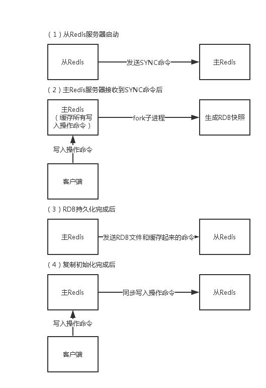

# Redis 哨兵Sentinel、复制Replication

哨兵顾名思义就是站在瞭望塔上，检视敌情的士兵；
在redis中，哨兵同样具有监控、提醒以及自动转移故障的功能。
而复制replication则负责让一个redis配置多个备份的服务器。

这两个机制可以保证redis高可用。

## 哨兵的作用

哨兵是Redis集群架构的一个非常重要的组建，可以解决主从复制时出现故障需要运维同事干预的问题。


哨兵提供的功能主要有：

- 监控集群： 监控主从是否运行正常
- 通知消息： 某个实例故障了，可以发送消息给管理员
- 转移故障： 主挂了，可以切换到从节点
- 配置变更： 转移故障了，会通知客户端当前新的主的地址


哨兵也存在集群的概念：哨兵机制可以建立多个哨兵节点，集群监控数据节点运行情况。
哨兵集群内部交换信息，交换主从监控情况。
每隔一秒，每个哨兵向整个集群：Master+Slave+哨兵，发送ping作为一次心跳检测。


这里可能还牵扯2个概念：```主观下线```、```客观下线```：
- **主观下线**： 哨兵认为你挂了那你就是挂了
- **客观下线**： 只有过半哨兵认为你挂了，才认为客观下线


### 下线原理

是采用**Raft**算法判定的，如果某个哨兵认为当前主节点挂了，就会在各个哨兵节点中开始发起选举投票，最终由选为leader的哨兵节点完成主从自动切换的过程。


### 快速开始

#### 获取哨兵

当前哨兵版本是第二版；自Redis 2.8以来，发布了一个稳定的Redis Sentinel版本。

#### 运行哨兵

如果你使用```redis-sentinel```可执行命令（或者你有一个链接```redis-server```的方式），你可以通过以下命令运行哨兵：

```
# 使用sentinel.conf作为配置文件启动哨一个兵
redis-sentinel /path/to/sentinel.conf
```

或者 

```
redis-server /path/to/sentinel.conf --sentinel
```

但是，在运行Sentinel时必须使用配置文件，因为系统将使用该文件来保存在重新启动时要重新加载的当前状态。
如果没有配置文件或者文件不可写，则哨兵会拒绝启动。

**哨兵默认监听TCP端口是26379**。

#### 部署哨兵之前需要了解的基本知识

- 你必须至少有3个哨兵实例作为鲁棒部署（健壮）。
- 3个哨兵实例部署在独立的计算机或者虚拟机中。
- 哨兵+Redis 分布式系统不保证在故障期间保留已确认的写操作，因为Redis使用异步复制。但是，有一些部署方式可以使得在某个时间都是有限的写操作。
- 你的客户端需要支持哨兵。
- 需要在开发环境中测试。可能会有一些配置在发生问题时才发现，这个请记得严格测试覆盖场景。
- 注意Docker、或者其它端口映射工具的使用，Docker执行端口重映射，中断对其他哨点进程的哨点自动发现和主进程的从进程列表。

#### 配置哨兵

Redis源发行版包含一个名为```Sentinel.conf```的文件，是一个配置示例；以下是一个典型的小型配置示例：

```
sentinel monitor mymaster 127.0.0.1 6379 2
sentinel down-after-milliseconds mymaster 60000
sentinel failover-timeout mymaster 180000
sentinel parallel-syncs mymaster 1

sentinel monitor resque 192.168.1.3 6380 4
sentinel down-after-milliseconds resque 10000
sentinel failover-timeout resque 180000
sentinel parallel-syncs resque 5
 ```

## Redis复制

Redis为了解决单点故障问题，会把数据复制到多个副本部署到其他节点，通过数据冗余来实现高可用。




- 1. 从redis节点首先发送```sync```到主redis节点
- 2. 主节点接收到从节点sync命令后；客户端发送写请求时，主节点会```缓存所有的写命令```；然后主节点会```fork子进程生成一个RDB快照```
- 3. RDB持久化完成后，主节点发送RDB文件和缓存起来的命令给从节点
- 4. 复制初始化完成后，客户端向主节点写入的每条指令，，主节点接收到后，都会同步的发送到从节点

>Redis2.8以后主从断开重连后会根据断开之前最新的命令偏移量进行增量复制。


## Redis主从、哨兵、集群之间的差异

- **主从**: 读写分离，备份，一个master可以有多个从节点
- **哨兵**：监控、故障自动转移，烧饼发现主节点挂掉，会从从节点通过raft算法选举一个作为主节点
- **集群**：将数据按一定规则分配到多台机器，不受限于单机，可以分布式集群扩展。

**哨兵目标是高可用；**
**集群目的是提高并发量；**


  


#### 参考资料

- [Redis-Sentinel哨兵](https://redis.io/topics/sentinel)
- [Redis官方文档](https://redis.io/documentation)
- [Redis复制](https://redis.io/topics/replication)
- [Redis-Windows版本](https://github.com/microsoftarchive/redis/releases)