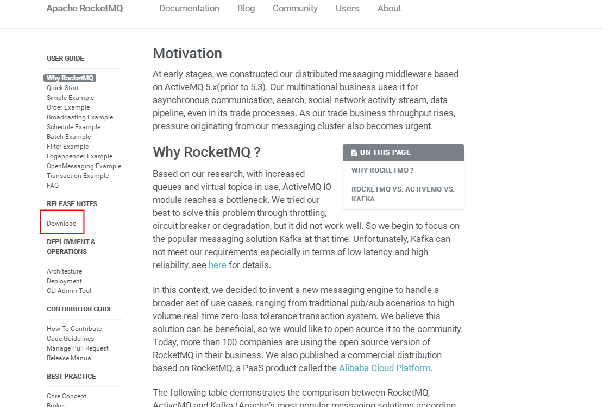
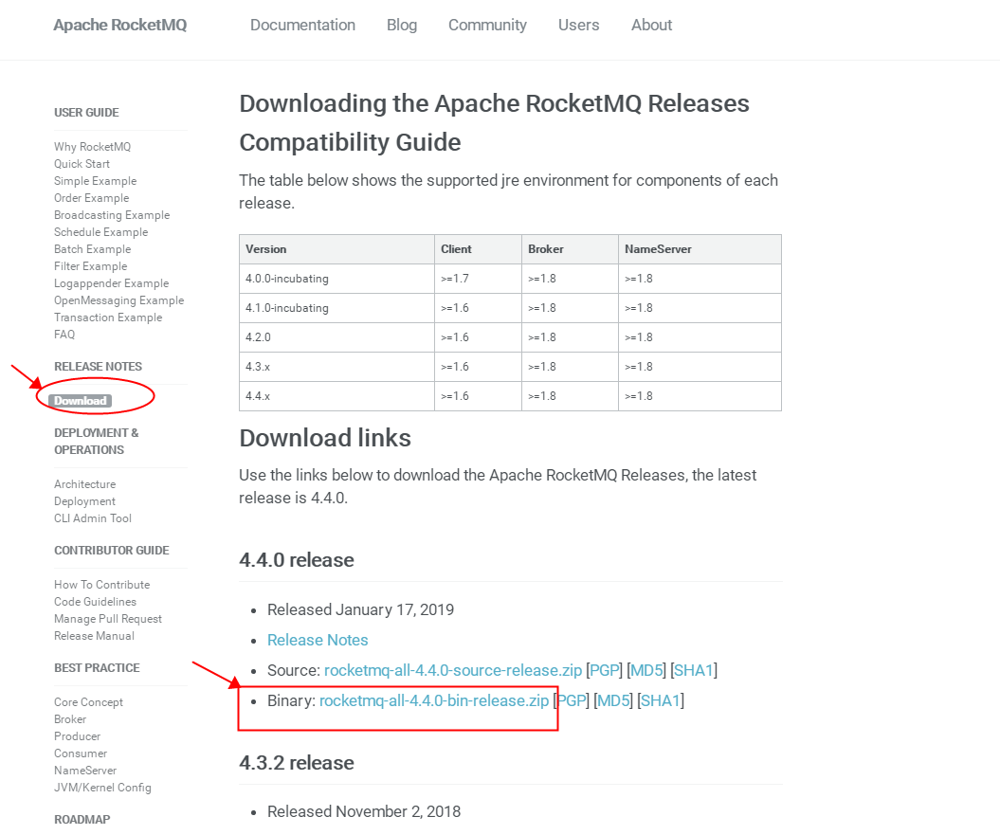
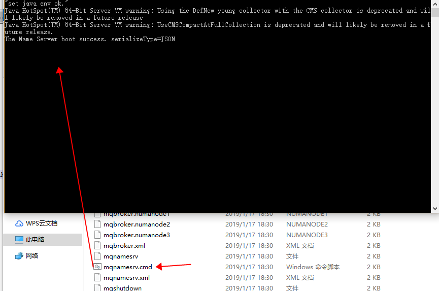
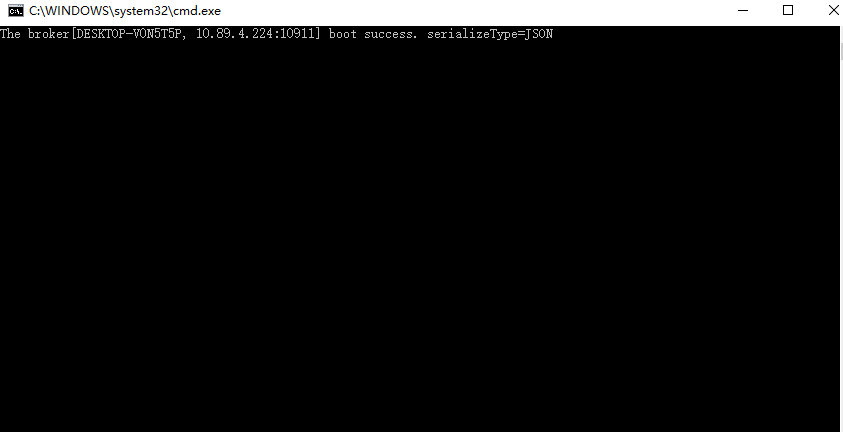

# windows安装RocketMQ以及运行第一个MQ程序

## 下载安装包






## 设置环境变量

设置 **ROCKETMQ_HOME** 环境变量。

## 启动NameSercer



## 启动Broker

启动Broker需要注意的地方：将 ```runbroker.cmd```中的 

set "JAVA_OPT=%JAVA_OPT% -cp %CLASSPATH%" 

改为： 

```set "JAVA_OPT=%JAVA_OPT% -cp "%CLASSPATH%"" ```

删除C:\Users\”当前系统用户名”\store目录下的所有文件。
执行 ```mqbroker.cmd```：



## 以可以自动创建Topic方式启动

有可能会遇到 ```org.apache.rocketmq.client.exception.MQClientException: No route info of this topic, ``` 的错误，需要设置程序可以创建Topic属性：

``` .\mqbroker -n localhost:9876 autoCreateTopicEnable=true```


## 手动创建topic

创建Topic使用的命令 ```mqadmin updateTopic```。

比如，你想创建一个名为"tx-mq-TOPIC" 的主题。可以使用如下命令：
```
./mqadmin updateTopic -n localhost:9876  -b localhost:10911  -t tx-mq-TOPIC
```

## 运行第一个MQ程序


### 引入依赖

```xml
<dependency>
    <groupid>org . apache . rocketmq</groupid>
    <artfactid>rocketmq client</artfactid>
    <version>4.2.0</version>
</dependency> 
```

### 生产者发送消息

示例代码参见：[```org.byron4j.cookbook.rocketmq.MQProducerDemo```](../src/main/java/org/byron4j/cookbook/rocketmq/MQProducerDemo.java)


### 消费者消费消息

示例代码参见：[```org.byron4j.cookbook.rocketmq.MQConsumerDemo```](../src/main/java/org/byron4j/cookbook/rocketmq/MQConsumerDemo.java)


### 事务消息生产者

示例代码参见： [```org.byron4j.cookbook.rocketmq.transaction.MQTransactionProducerDemo```](../src/main/java/org/byron4j/cookbook/rocketmq/transaction/MQTransactionProducerDemo.java)

### 事务消息消费者

示例代码参见： [```org.byron4j.cookbook.rocketmq.transaction.MQTransactionConsumerDemo```](../src/main/java/org/byron4j/cookbook/rocketmq/transaction/MQTransactionConsumerDemo.java)


在事务消息示例中，模拟了在生产者端发送标签为Transaction1的消息回滚，则该消息不会发送给消费者。

