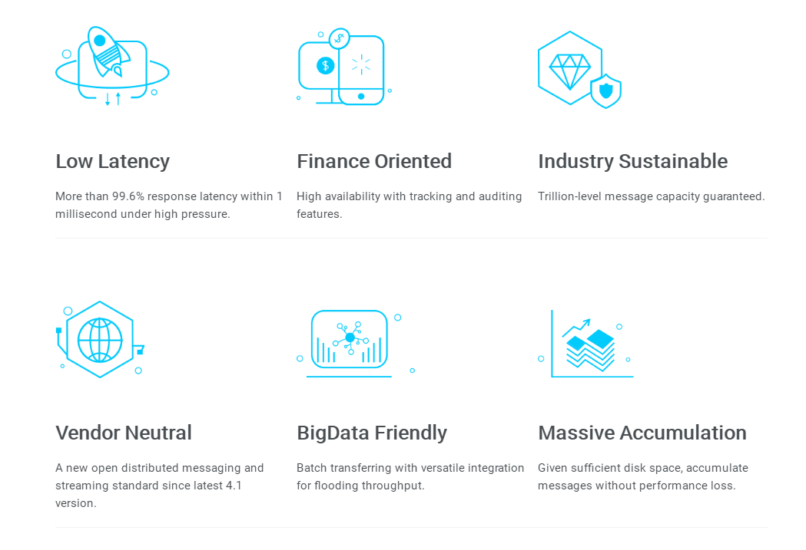
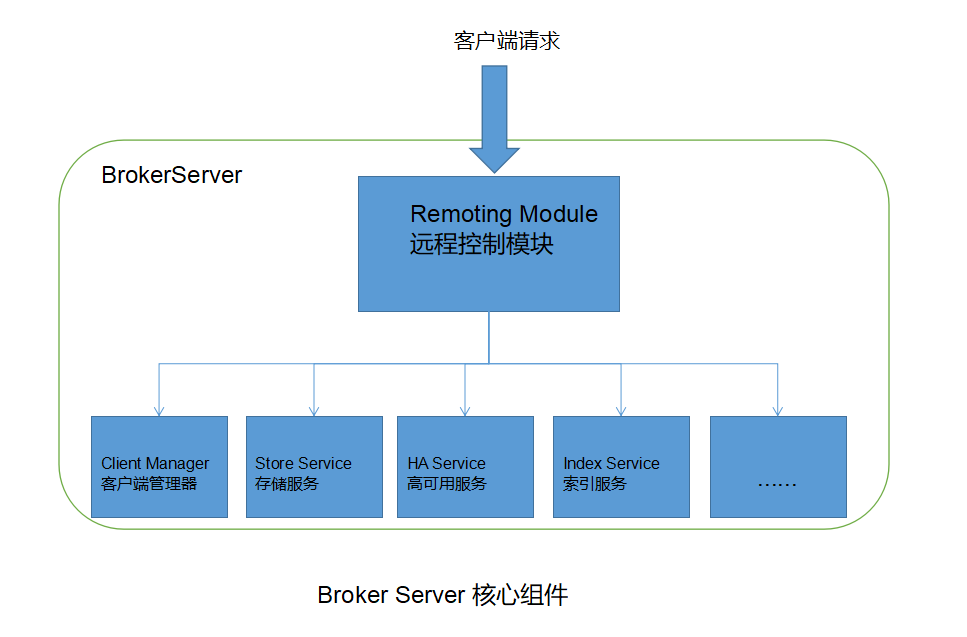
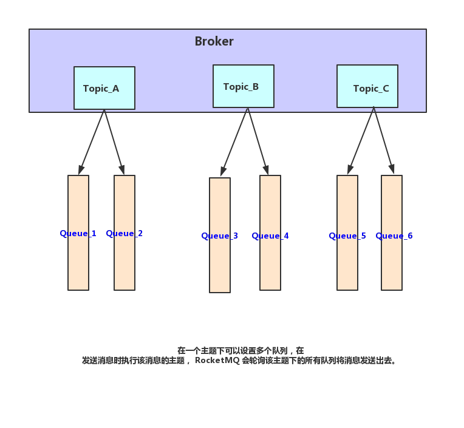
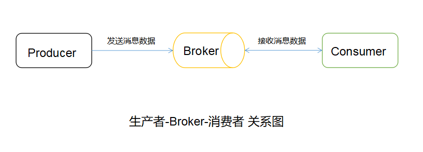
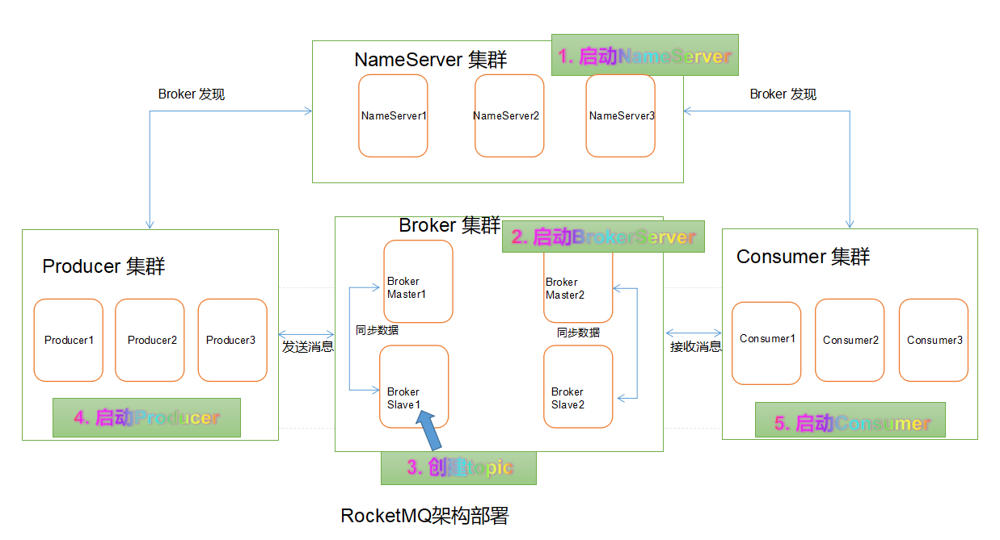

# RocketMQ核心知识

## 背景需求

## RocketMQ 特点

- 海量消息堆积能力。采用[零拷贝](../Advance高级知识/IO知识/0-零拷贝.md)原理实现了超大消息的堆积能力。单机支持亿级消息堆积。
- 支持顺序消息。可以保证消息按发送的顺序进行消费。
- 支持消息过滤。服务端过滤、消费端过滤。
- 支持事务消息。对于分布式事务来说提供了一种解决思路。
- 支持回溯消息。对于已经消费过的消息，由于业务需求可以重新消费。按时间（维度可以精确到毫秒）支持向前回溯、向后回溯。

## RocketMQ 的优势

## RocketMQ 技术架构以及四大组件

RocketMQ 技术设计架构如图：

RocketMQ 架构主要有四大模块：

- NameServer

- BrokerServer

- 生产者

- 消费者

### NameServer

NameServer 是服务注册与发现组件，是一个简单的主题路由注册表，类似于 Dubbo 中的 Zookeeper 的角色。支持动态注册、Broker 发现。主要包括两个功能：

- Broker 管理
  
  NameServer 接收 Broker 集群的注册信息，并作为路由信息的基本数据保存。也提供了一个心跳保护机制，用以检查broker是否存活。

- 路由信息管理

  每一个 NameServer 将保存供客户端查询的关于 Broker 集群和队列信息的全部路由信息。
  生产者和消费者就能通过 NameServer 知道全部 Broker 集群的路由信息，以便传送和消费消息。
  NameServer 通常是集群模式部署的，并且每个实例都是互不通信的，是各自独立的。
  Broker 在每个 NameServer 上注册自己的路由信息，所以每一个 NameServer 都存储了完整的路由信息。
  当一个 NameServer 由于某些原因掉线时，Broker 还是可以同步自己的路由信息到其它的 NameServer 上的，生产者、消费者仍然可以动态感知 Broker 的路由信息。

### BrokerServer

Broker 是MQ的核心组件，用于消息数据的传输、存储以及高可用性的保证等。为了达到这些目的，Broker 包括了以下几个子模块：

- **Remoting Module 远程控制模块**： 整个 Broker 的实体，负责处理来自客户端的请求。
- **Client Manager 客户端管理器**： 负责管理客户端（生产者、消费者）和维护消费者的主题订阅信息。
- **Store Service**：提供方便简洁的 API 接口处理消息存储到物理硬盘和查询的功能。
- **HA Service**： 高可用服务， 提供 Master Broker、Slave Broker 之间的数据同步功能。
- **Index Service**： 提供特定的 Message Key 对投递到 Broker 的消息进行索引服务，以提供消息的快速查询。

   

#### Broker-Topic-Queue关系图

### 生产者

生产者是发布消息的角色，支持分布式集群模式部署。生产者选择相应的 broker 集群队列通过MQ的负载均衡模块进行消息传递。传输过程支持快速失败和低延迟。
RocketMQ提供了3种发送消息的方式：同步、异步和单向。

- 同步方式
    - 发送后等接收方响应之后才发送下一个数据包。一般适用于重要通知邮件、营销短信等。

- 异步方式
    - 发送数据后，不等接收方响应即接着发送下一个数据包。适用于链路可能比较长对响应时间比较敏感的场景，例如上传视频后通知启动转码服务。
    
- 单向方式
    - 只负责发送消息不等待响应且无回调函数触发。适用于耗时短但是对可靠性要求不高的场景，如日志收集。

### 消费者

消费者是消费消息的角色，支持分布式集群模式部署。支持 push（推送）、pull（拉取）两种消费模式。 也支持集群模式、广播模式的消费方式，且提供了一个实时的消息订阅机制以满足大都数用户的需求。

- 拉取型消费者（ Pull Consumer）
    - 主动从消息务器拉取消息，只要批量拉取到消息，用户应用就会启动消费过程，所以称为主动消费类型。

- 推送型消费者（ Push Consumer）
    - 推送型消费者（ Push Consumer ）封装了消息的拉取、消费进度和其他内部维护工作 ，将消息到达时执行的回调接口留给用户应用程序来实现。所以 Push 被称为被动消费类型。但从实现上看，还是从消息服务器拉取消息的。不同于 Pull 的是， Push 要注册消费监昕器， 当监听器被触发后才开始消费消息。

## RocketMQ 架构部署

### RocketMQ 网络部署特点

- NameServer 是一个无状态的节点，可以集群部署，各个 NameServer 节点是没有任何交互，无信息同步的

- Broker 部署

  Broker 分为 Master 和 Slave，一个 Master 可以对应多个 Slave，但是一个 Slave 只能对应一个 Master。
  Master 与 Slave 的对应关系通过指定相同的 BrokerName，不同的 BrokerId 来定义，BrokerId 为 0 表示 Master， 非 0 表示 Slave。
  Master 也可以部署多台。
  每个 Broker 与 NameServer 集群中的所有NameServer节点建立长连接，定时注册 Topic 信息到所有的NameServer中。
  
  >注意事项
  >
  >当前RocketMQ版本（截至写作时间版本为 rocketmq-all-4.4.0）在部署架构上支持一 Master 多 Slave，但只有 BrokerId=1 的服务器才会参与消息的读负载。
  
- Producer 

  与 NameServer 集群中的其中一个节点（随机选择）建立长连接，定期从 NameServer 获取 Topic 路由信息，并向提供 Topic 服务的Broker Master 建立长连接，且定时向 Master 发送心跳。
  Producer 完全无状态，可集群部署。
  
- Consumer

  与 NameServer 集群中的其中一个节点（随机选择）建立长连接，定期从 NameServer 获取 Topic 路由信息，并向提供 Topic 服务的Broker Master 建立长连接，且定时向 Master 发送心跳。
  Consumer 既可以从 Master 订阅消息，也可以从 Slave 订阅消息，消费者在向 Master 拉取消息时，Master 服务器会根据拉取偏移量与最大偏移量的距离（来判断是否读老消息，产生读IO），以及从服务器是否可读等因素建议下一次是从 Master 还是 Slave 拉取。  
  
结合部署架构图，描述集群工作流程：

>- 启动 NameServer， NameServer 起来后监听端口，等待 Broker、Producer、Consumer
 连上来，相当于一个路由注册控制中心。
>
>- Broker 启动，跟所有的的 NameServer 保持长连接，定时发送心跳包。心跳包中包含当前Broker信息（IP + 端口等）以及存储所有 Topic 信息。 注册成功后，NameServer 集群中就有 Topic 和 Broker 的映射关系。
>
>- 收发消息前，先创建 Topic， 创建 Topic 时需要指定该 Topic 要存储在哪些 Broker 上，也可以在发送消息时自动创建 Topic。
>
>- Producer 发送消息。启动时先和 NameServer 集群中的一个建立长连接，并从 NameServer 中获取当前发送的 Topic 存在哪些 Broker 上，轮询从队列列表中选择一个队列，然后与队列所在的 Broker 建立长连接从而向 Broker 发消息。
>
>- Consumer 与 Producer 类似， 先根 NameServer 集群中的一台建立长连接，获取当前订阅 Topic 存在哪些 Beoker 上，然后直接跟 Broker 建立连接通道，开始消费消息。

参考资料：

- RocketMQ官方文档：https://github.com/apache/rocketmq/tree/develop/docs

