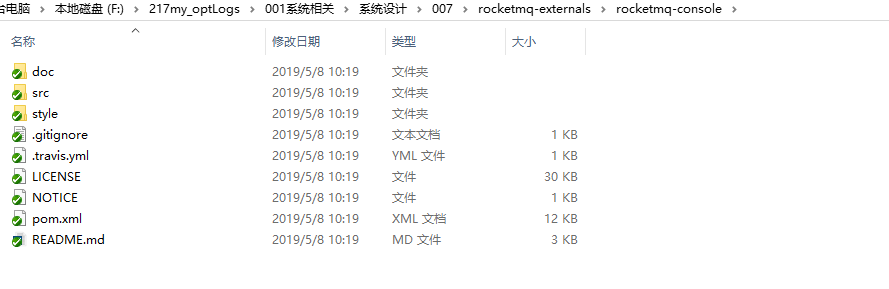
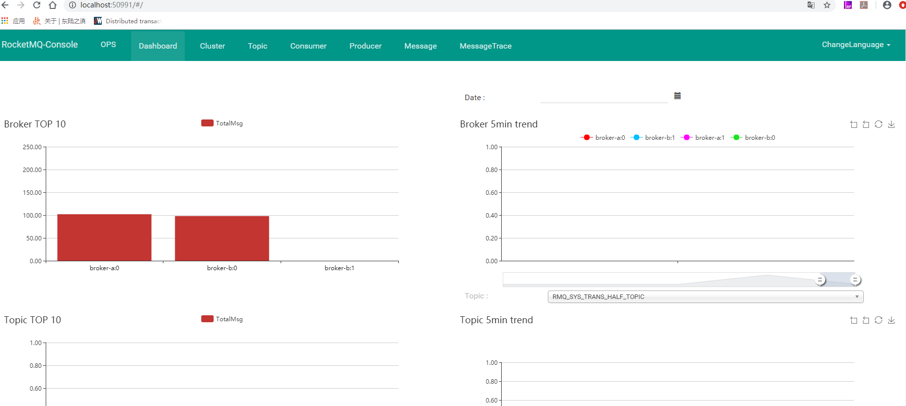
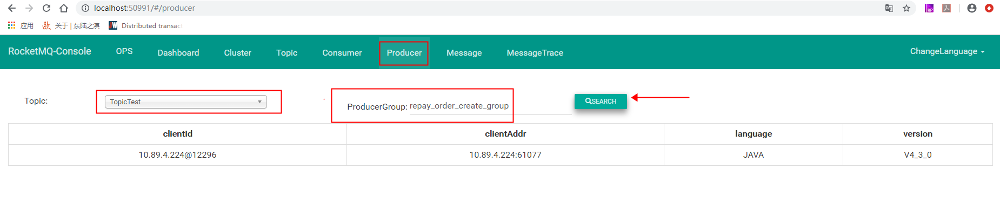
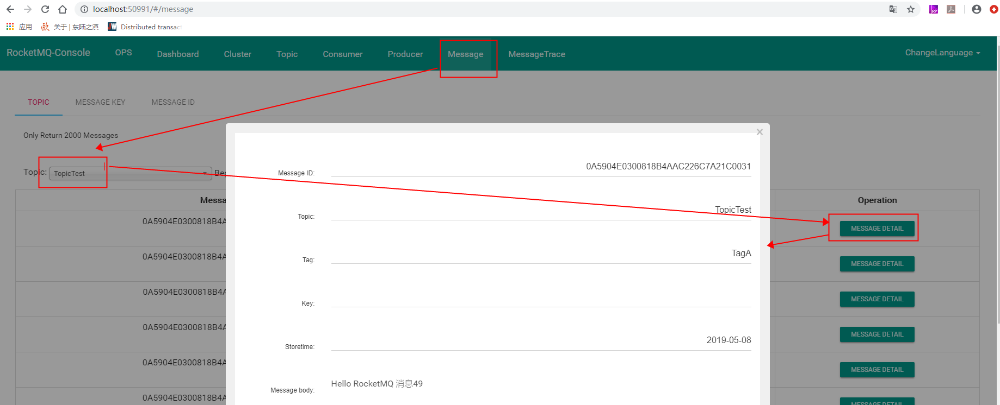

# RocketMQ控制台搭建

[官网https://github.com/apache/rocketmq-externals/tree/master/rocketmq-console](https://github.com/apache/rocketmq-externals/tree/master/rocketmq-console)


## 1. 克隆到本地： https://github.com/apache/rocketmq-externals.git

## 2. 进入rocketmq-console模块，修改pom，设置排除单元测试的插件：



```xml
<plugin>
    <groupId>org.apache.maven.plugins</groupId>
    <artifactId>maven-surefire-plugin</artifactId>
    <configuration>
        <skip>true</skip>
    </configuration>
</plugin>
```

## 3. 修改配置文件application.properties:

在最后面增加两行：

```properties
# 指定nameserver地址
rocketmq.config.namesrvAddr=localhost:9876;localhost:2058
# 表示控制台启动的端口，默认为8080，可以自行设置。
server.port=50991
```


## 4. 对其进行打包：

```mvn package```

```mvn clean package -Dmaven.test.skip=true```   : 该命令在win10 的 powershell中可能无法使用。

```mvn clean install package '-Dmaven.test.skip=true'``` : 建议使用这个。

## 5. 此时在rocketmq-console/target目录下生成了一个 rocketmq-console-ng-1.0.1.jar 的jar包(版本号以后可能继续升级)


进入target目录，执行jar，并指定命令行参数：

```java -jar rocketmq-console-ng-1.0.1.jar ```


## 6. 启动完成后，打开浏览器输入：http://localhost:50991

启动完成后，打开浏览器输入：http://localhost:50991



还可以看看其他的详情信息：


