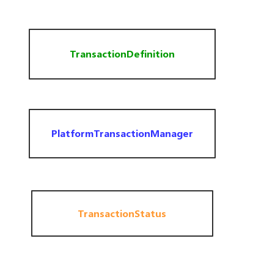

# Spring事务

关于数据库事务、锁可以先行查看此文：[MySQL数据库读写锁示例详解、事务隔离级别示例详解](https://github.com/Byron4j/CookBook/blob/master/MySQL/1-MySQL数据库读写锁示例详解、事务隔离级别示例详解.md)。

Spring事务属于Data Access模块中的内容，该模块包含事务管理支持以及其它数据访问的集成。

## 事务管理

全面的事务支持是使用Spring框架的最重要原因之一。Spring为事务管理提供了一个始终如一的抽象，优点如下：
- 提供不同事务的API但是一致的编程模型，如Java事务API（JTA）、JDBC、Hibernate和Java持久化API（JPA）。
- 支持声明式事务
- 比JTA更简单的编程式事务API
- 与Spring数据访问抽象的优秀集成

### Spring框架事务模型的优点

习惯上，Java EE 开发者有两种事务管理方式：全局事务管理、本地事务管理，两者都有很大的局限性。

#### 全局性事务管理

全局事务允许你操作多个事务资源，典型的是关系型数据库和消息队列。应用服务器通过JTA管理全局性事务，而JTA API是非常笨重的。另外，一个JTA的```UserTransaction```通常需要从JNDI中加载资源，意味着使用JTA必须配置JNDI。全局性事务限制了代码的重用性，因为JTA通常只在应用服务器环境中可用。


#### 本地事务管理

本地事务是特定于资源的，例如与JDBC关联的事务。本地事务更容易使用，但是也有一个重大的缺陷：不能跨多个事务资源工作。例如，使用JDBC连接的事务管理代码不能在一个JTA的全局性事务中使用。因为应用服务器不参与事务管理，它不能帮助确保跨多个资源的正确性。


#### Spring框架一致性编程模型

Spring解决了全局性事务和本地事务的缺陷，它可以让应用开发者在任何环境下使用一致的编程模型API。你在一个地方编写你的代码，它可以在不同环境的不同事务管理策略中工作。Spring框架提供了```声明式事务```和```编程式事务```。大都数用户偏爱声明式事务，因为编码更简单。

通过编程式事务，开发者通过Spring框架事务抽象来进行开发，可以运行在任何底层事务基础设施上。
使用首选的声明式事务模型，开发者仅需要编写一点点与事务管理关联的代码，因此，不需要依赖Spring框架事务的API或其他事务API。

## Spring事务相关的类


- ```org.springframework.transaction.PlatformTransactionManager```
- ```org.springframework.transaction.TransactionDefinition```
- ```org.springframework.transaction.TransactionStatus```
- ```org.springframework.transaction.support.TransactionSynchronization```
- ```org.springframework.transaction.support.AbstractPlatformTransactionManager``` 其它框架集成Spring一般会继承该类




Spring框架事务抽象的关键点是事务策略的概念。一个事务策略通过```org.springframework.transaction.PlatformTransactionManager```接口来定义，像以下所展示的：


```java
/**事务管理器*/
public interface PlatformTransactionManager {
    /**根据事务定义获取事务状态*/
    TransactionStatus getTransaction(TransactionDefinition definition) throws TransactionException;
    /**提交事务*/
    void commit(TransactionStatus status) throws TransactionException;
    /**回滚事务*/
    void rollback(TransactionStatus status) throws TransactionException;
}
```

这主要是一个服务提供者接口(**SPI**)，尽管你可以使用编程方式使用它。因为```PlatformTransactionManager```是一个接口，它可以根据需要很容易地被mock或作为存根使用。它没有绑定到查找策略，比如JNDI等。
PlatformTransactionManager 实现的定义与Spring框架IOC容器中其他任何bean是一样的，仅这一点就使得Spring事务是一个有价值的抽象，甚至你在使用JTA的时候。

同样，为了保持和Spring理念一致，PlatformTransactionManager 接口的方法可以抛出 ```TransactionException ```异常。
**getTransaction(..)** 方法返回一个 ```TransactionStatus```对象，依赖于一个 ```TransactionDefinition```参数，返回的TransactionStatus可能代表一个新的事务或者一个已经存在的事务（如果当前调用堆栈中存在事务）。后一种情况的含义是，与Java EE事务上下文一样，事务状态与执行线程相关联。


```TransactionDefinition ``` 接口指定了：

- **传播性Propagation**：通常，在事务范围内执行的所有代码都在该事务中运行。但是，事务方法在已存在事务上下文执行时，你可以指定其行为。例如，代码可以继续在已经存在的事务中运行（通过是这样的），或者已存在的事务会挂起然后创建一个新的事务。Spring提供了和EJM CMT类似的所有事务传播性操作。
    - **PROPAGATION_REQUIRED**：支持当前事务，如果当前没有事务则新建一个事务。这是默认的事务传播行为。
    - **PROPAGATION_SUPPORTS**：支持当前事务，如果不存在事务则以非事务形式执行。
    - **PROPAGATION_MANDATORY**：支持当前事务，如果没有事务则抛出异常，transaction synchronization还是可用的。
    - **PROPAGATION_REQUIRES_NEW**：新建一个事务，如果当前存在事务则还会挂起已经存在的事务。
    - **PROPAGATION_NOT_SUPPORTED**：不支持当前事务，总是以非事务方式执行。
    - **PROPAGATION_NEVER**：不支持事务，存在事务则抛出异常，transaction synchronization不可用。
    - **PROPAGATION_NESTED**：如果当前存在事务则在嵌套事务中执行，有点类似PROPAGATION_REQUIRED。

- **隔离性Isolation**：指定了事务的隔离性。
    - **ISOLATION_READ_UNCOMMITTED**：读未提交。可能出现脏读、不可重复读、幻读。这个隔离级别，一个事务可以读取另一个事务未提交的内容。
    - **ISOLATION_READ_COMMITTED**：读已提交。阻止了脏读，但是不可重复读、幻读可能会发生。此级别仅禁止事务读取包含未提交更改的行。
    - **ISOLATION_REPEATABLE_READ**：可重复度。阻止了脏读、不可重复度，但是幻读可能会发生。这个级别禁止事务读取包含未提交更改的行，还禁止一个事务读取行、第二个事务更改行、第一个事务重新读取行，第二次获得不同的值(“不可重复读取”)。
    - **ISOLATION_SERIALIZABLE**：串行化。解决了脏读、不可重复度和幻读的问题。效率低，一般生产不用。

- **超时Timeout**：此事务在超时并由事务基础设施自动回滚之前运行多长时间。

- **是否只读Read-only**：当你的代码仅仅读取数据不会更改数据时可以设置只读属性。

这些设置反映了标准的事务概念。理解这些概念，是使用Spring框架或其它事务管理解决方案的基本前提。

**TransactionStatus** 接口为事务代码提供了一种简单的方法来控制事务执行和查询事务状态。

```java
public interface TransactionStatus extends SavepointManager {

    boolean isNewTransaction();

    boolean hasSavepoint();

    void setRollbackOnly();

    boolean isRollbackOnly();

    void flush();

    boolean isCompleted();

}
```

无论您在Spring中选择声明式事务管理还是编程式事务管理，定义正确的PlatformTransactionManager实现都是绝对必要的。通常是通过依赖注入来定义此实现。

```PlatformTransactionManager``` 实现通常需要了解他们的环境：JDBC，JTA，Hibernate等等。以下示例展示了定义了一个本地的```PlatformTransactionManager```实现（此例中，使用了简单的JDBC）。
你可以像以下一样创建一个类似的beam，定义一个

- 1.```JDBC DataSource```配置如下：

```xml
<bean id="dataSource" class="org.apache.commons.dbcp.BasicDataSource" destroy-method="close">
    <property name="driverClassName" value="${jdbc.driverClassName}" />
    <property name="url" value="${jdbc.url}" />
    <property name="username" value="${jdbc.username}" />
    <property name="password" value="${jdbc.password}" />
</bean>
```

与之关联的 ```PlatformTransactionManager ``` bean定义则可以引用 DataSource的定义，例如：

```xml
<bean id="txManager" class="org.springframework.jdbc.datasource.DataSourceTransactionManager">
    <property name="dataSource" ref="dataSource"/>
</bean>
```

注解方式：
```java
@Bean(name = "myTxManager")
public PlatformTransactionManager txManager(DataSource dataSource) {
    return new DataSourceTransactionManager(dataSource);
}
```


如果你是在Java EE容器中使用JTA，你可以使用一个容器DataSource，可以通过JNDI获取数据源，再结合Spring框架的```JtaTransactionManager```。
- 2.```JTA和JDNI查找配置如下```：

```xml
<?xml version="1.0" encoding="UTF-8"?>
<beans xmlns="http://www.springframework.org/schema/beans"
    xmlns:xsi="http://www.w3.org/2001/XMLSchema-instance"
    xmlns:jee="http://www.springframework.org/schema/jee"
    xsi:schemaLocation="
        http://www.springframework.org/schema/beans
        https://www.springframework.org/schema/beans/spring-beans.xsd
        http://www.springframework.org/schema/jee
        https://www.springframework.org/schema/jee/spring-jee.xsd">

    <jee:jndi-lookup id="dataSource" jndi-name="jdbc/jpetstore"/>

    <bean id="txManager" class="org.springframework.transaction.jta.JtaTransactionManager" />

    <!-- other <bean/> definitions here -->

</beans>
```

```JtaTransactionManager``` 不需要知道DataSource（或其他指定的数据源）因为它使用了容器的全局事务管理基础设施。


你也可以使用Hibernate本地事务，像以下示例展示的一样。在此案例中，你需要定义一个Hibernate的```LocalSessionFactoryBean``` bean，则你的应用可以使用来获取Hibernate的会话```session```实例，而DataSource bean则和本地JDBC示例类似。

>❕ ❕
>
>如果```DataSource```(被任何非JTA事务管理器使用的)是在一个Java EE容器中管理且通过JNDI查找到的，则它应该是非事务的，因为Spring框架(而不是Java EE容器)负责管理事务。

在这个案例中的 ```txManager``` bean是一个```HibernateTransactionManager```类型。和```DataSourceTransactionManager```类似，也需要依赖一个DataSource的引用，```HibernateTransactionManager```需要一个```SessionFactory```的引用。示例如下：

```xml
<bean id="sessionFactory" class="org.springframework.orm.hibernate5.LocalSessionFactoryBean">
    <property name="dataSource" ref="dataSource"/>
    <property name="mappingResources">
        <list>
            <value>org/springframework/samples/petclinic/hibernate/petclinic.hbm.xml</value>
        </list>
    </property>
    <property name="hibernateProperties">
        <value>
            hibernate.dialect=${hibernate.dialect}
        </value>
    </property>
</bean>

<bean id="txManager" class="org.springframework.orm.hibernate5.HibernateTransactionManager">
    <property name="sessionFactory" ref="sessionFactory"/>
</bean>
```

如果你是使用Hibernate和Java EE容器管理JTA事务，你应该和之前一样使用```JtaTransactionManager```：
```xml
<bean id="txManager" class="org.springframework.transaction.jta.JtaTransactionManager"/>
```

>❕ ❕
>
>如果你使用的是JTA，你的事务管理器则应该看起来很像，不管使用什么数据访问技术，不管是JDBC、Hibernate JPA还是任何其他受支持的技术。这是因为JTA事务是全局性事务，它可以征募任何事务资源。

在这些案例中，应用的代码是不需要变更的。您可以仅通过更改配置来更改事务的管理方式，即使这种变化意味着从本地事务转移到全局事务，或者反之亦然。


## 事务资源同步

怎样创建不同的事务管理器和它们是怎样关联那些需要同步到事务中的资源的（例如，```DataSourceTransactionManager```之余一个JDBC DataSource，```HibernateTransactionManager```之于一个Hibernate的```SessionFactory，等等）现在应该是比较清晰的了。

这个部分描述应用代码（直接或间接使用持久化API如JDBC、Hibernate，或者JPA）怎样确保这些资源是如何创建、复用和清除的。

也讨论事务同步（transaction synchronization）是如何通过关联的```PlatformTransactionManager```触发的。


### 高级同步方法

首选的方法是使用Spring最高级的基于模板的持久性集成api或者使用基于transaction-aware factory的原生的ORM API ben 或者代理 去管理本地资源工厂。
这种transaction-aware（事务感知）解决方案是在内部处理资源、重用、清除，资源的可选事务同步，异常映射。
因此，用户数据访问代码可以不用关心这些处理而仅仅将关注持久化逻辑的编写。
一般而言，你可以使用原生ORM API或者使用JdbcTemplate处理JDBC数据访问。

### 低级同步方法

像```DataSourceUtils```类（for JDBC）一样，```EntityManagerFactoryUtils```类(for JPA),```SessionFactoryUtils```类(for Hibernate  )，等等就是比较低级的API了。
当你想在应用代码中直接处理原生持久API的资源类型的时候，你可以使用这些类确保实例是由Spring框架管理的、事务同步是可选的、异常映射到合适的持久化API中。

例如，在 JDBC 的案例中，在DataSource中用于替代传统的 JDBC的```getConnection()```的方法，可以使用 ```org.springframework.jdbc.datasource.DataSourceUtils```类：

```java
Connection conn = DataSourceUtils.getConnection(dataSource);
```

如果一个已经存在的事务已经有一个连接connection同步给它了，则会返回该connection。否则，该方法会触发创建一个新的connection，它(可选地)同步到任何现有事务，并可用于该事务的后续重用。
像之前提到过的一样，任何 SQLException 都被包装在Spring框架中的```CannotGetJdbcConnectionException```（这是一个Spring框架的未检查unchecked的DataAccessException类型的层次结构之一）。
这种方法提供的信息比从SQLException获得的信息要多，并且确保了跨数据库甚至跨不同持久性技术的可移植性。
这种方式是没有在Spring事务管理机制下工作的，因此，无论你是否使用Spring事务管理机制都可以使用它。

### ```TransactionAwareDataSourceProxy``` 事务感知数据源代理类

在最底层存在 ```TransactionAwareDataSourceProxy```类。这是一个数据源DataSource的代理类，包装了一个数据源并且将其添加到Spring事务的感知中。在这方面，类似于Java EE服务器提供的传统的JNDI数据源。

你应该几乎从不会使用这个类，除非当前的代码必须通过一个标准的JDBC数据源接口调用实现。在这个场景中，这些代码是有用的，但是它参与了Spring管理的事务。你可以使用高级的抽象编写新的代码。

## 声明式事务管理

>❕ ❕
>
>大部分的Spring框架使用者会选择声明式事务管理。这个选择对应用代码影响更小，因此，它更符合非侵入式轻量级容器理念。

<u>**Spring框架的声明式事务管理是通过Spring面向切面编程（AOP）实现的。**</u>

然而，因为事务相关的代码是随Spring框架发行版本一块发布的，可以以样板方式使用，通常不需要理解AOP的概念就可以使用这些代码了。

Spring框架的声明式事务管理机制类似于EJB CMT，在这种情况下，你可以将事务行为(或缺少事务行为)指定到单个方法级别。如果有必要的话，你可以在一个事务上下文中调用```setRollbackOnly()```方法。这两种类型的事务管理的差异在于：

- 不像EJB CMT是绑定了JTA的。Spring框架的声明式事务管理可以在任何环境中工作，它可以通过调整配置文件就可以轻易地和JTA事务、使用JDBC的本地事务、JPA或者Hibernate一块工作。
- 你可以在任何类中使用Spring框架声明式事务，而不是像EJB一样只能指定某些类。
- Spring框架提供了声明式回滚规则，这是和EJB等同的特性。编程式、声明式的回滚规则都提供了。
- Spring框架可以让你通过AOP自定义事务行为。例如，你可以在事务回滚的时候插入自定义行为。还可以添加任意的advice(通知)，以及事务advice。而如果是EJB CMT的话，你不可能影响容器的事务管理机制，除非使用```setRollbackOnly()```。
- Spring框架不像高端应用服务器那样支持在远程调用之间传播事务上下文。如果你需要这个特性，推荐你使用EJB。但是，在你使用该特性之前需要慎重，因为，正常情况下，是不想在远程调用之间传播事务的。

<u>**回滚规则的概念是非常重要的。**</u> 它们可以让你指定哪些异常应该引发自动回滚。你可以在配置中而不是Java代码中指定这些声明。所以，尽管你可以在```TransactionStatus```对象中调用```setRollbackOnly()```方法去回滚当前的事务，大都数情况下你可以指定一个规则，即可以自定义异常必须导致事务回滚。这种选择的重要优点是业务对象不依赖事务基础设施。例如，它们通常不需要导入Spring事务API或者其它Spring API。

尽管EJB容器默认行为是在事务发生系统异常（通常是运行时异常）时自动回滚，EJB CMT并不会在出现应用异常时自动回滚。但是Spring声明式事务的默认行为是允许自定义异常变更回滚策略的。

### 理解Spring声明式事务实现

仅仅告诉你使用 ```@Transactional```注解标注你的类是不够的，添加```EnabledTransactionManagement```到你的配置中，并希望你理解它是如何工作的。为了提供一个深刻的理解，这个部分解释在发生与事务相关的问题时，Speing声明式事务机制的内部工作原理。

掌握Spring框架声明式事务的最重要的概念是通过AOP代理实现的，事务通知由元数据（XML或者基于注解的）驱动。

<u>**AOP与事务元数据的结合产生了一个AOP代理，它使用一个事务拦截器```TransactionInterceptor```和一个适当的```PlatformTransactionManager```实现来驱动围绕方法调用的事务。**</u>

以下是通过事务代理调用方法的概念视图：


### 声明式事务实现示例

考虑以下接口以及它的实现，这个示例使用了```Foo```和```Bar```类，这样你就可以专注于事务的实现而不用关注具体的域模型了。就这个示例而言，```DefaultFooService```类的每个方法抛出```UnsupportedOperationException```异常是OK的。该行为允许创建事务，然后回滚以响应UnsupportedOperationException实例。

```java
// 我们想进行事务性操作的目标接口

package x.y.service;

public interface FooService {

    Foo getFoo(String fooName);

    Foo getFoo(String fooName, String barName);

    void insertFoo(Foo foo);

    void updateFoo(Foo foo);

}
```

实现类：

```java
package x.y.service;

public class DefaultFooService implements FooService {

    public Foo getFoo(String fooName) {
        throw new UnsupportedOperationException();
    }

    public Foo getFoo(String fooName, String barName) {
        throw new UnsupportedOperationException();
    }

    public void insertFoo(Foo foo) {
        throw new UnsupportedOperationException();
    }

    public void updateFoo(Foo foo) {
        throw new UnsupportedOperationException();
    }

}
```

假设FooService接口的前两个方法getFoo(String)和getFoo(String, String)必须在具有只读语义的事务上下文中执行，而其他方法insertFoo(Foo)和updateFoo(Foo)必须在具有读写语义的事务上下文中执行。以下是符合要求的配置信息：

```xml

<?xml version="1.0" encoding="UTF-8"?>
<beans xmlns="http://www.springframework.org/schema/beans"
    xmlns:xsi="http://www.w3.org/2001/XMLSchema-instance"
    xmlns:aop="http://www.springframework.org/schema/aop"
    xmlns:tx="http://www.springframework.org/schema/tx"
    xsi:schemaLocation="
        http://www.springframework.org/schema/beans
        https://www.springframework.org/schema/beans/spring-beans.xsd
        http://www.springframework.org/schema/tx
        https://www.springframework.org/schema/tx/spring-tx.xsd
        http://www.springframework.org/schema/aop
        https://www.springframework.org/schema/aop/spring-aop.xsd">

    <!-- 将进行事务性操作的bean -->
    <bean id="fooService" class="x.y.service.DefaultFooService"/>
    
    <!-- 数据源配置 -->
    <bean id="dataSource" class="org.apache.commons.dbcp.BasicDataSource" destroy-method="close">
        <property name="driverClassName" value="oracle.jdbc.driver.OracleDriver"/>
        <property name="url" value="jdbc:oracle:thin:@rj-t42:1521:elvis"/>
        <property name="username" value="scott"/>
        <property name="password" value="tiger"/>
    </bean>
    
    <!-- 配置事务管理器 PlatformTransactionManager -->
    <bean id="txManager" class="org.springframework.jdbc.datasource.DataSourceTransactionManager">
        <property name="dataSource" ref="dataSource"/>
    </bean>

    <!-- 配置事务通知 (将会发生什么，查看下面的 <aop:advisor/> 配置) -->
    <tx:advice id="txAdvice" transaction-manager="txManager">
        <!-- 事务性语义配置 -->
        <tx:attributes>
            <!-- 所有get开头的方法都是只读性事务 -->
            <tx:method name="get*" read-only="true"/>
            <!-- 其他的方法使用默认的事务性行为 -->
            <tx:method name="*"/>
        </tx:attributes>
    </tx:advice>

    <!-- 确保上面配置的事务通知可以在FooService接口的任意操作中执行-->
    <aop:config>
        <!-- 配置切面(切点集合) -->
        <aop:pointcut id="fooServiceOperation" expression="execution(* x.y.service.FooService.*(..))"/>
        
        <!-- 配置AOP通知 -->
        <aop:advisor advice-ref="txAdvice" pointcut-ref="fooServiceOperation"/>
    </aop:config>
</beans>

```


检查上面的配置，假设你想使一个service对象（fooService bean）可以进行事务性操作。事务性语义可以使用```<tx:advice/>```定义来封装。```<tx:advice/>```定义会读取所有的方法，如果是 get 开头的方法则执行只读性事务，其它的方法则执行默认的事务语义。```<tx:advice/>```的```transaction-manager```属性标签会设置为将要驱动事务的```PlatformTransactionManager```实现bean的name。

>🎻
>如果你配置的```PlatformTransactionManager```的name或者id是```transactionManager```的话，事务通知(```<tx:advice/>```)的```transaction-manager```属性则可以忽略，如果不是的话则必须配置该属性标签。

```<aop:config>```定义确保```txAdvice```bean事务通知可以在适当的切点执行。
首先，首先，定义一个切点，它匹配在FooService接口(```fooServiceOperation```)中定义的任何操作的执行；
然后，使用一个advisor关联切点和事务通知。
结果就是，只要切点fooServiceOperation匹配的方法执行了，txAdvice中定义的事务通知就会运行。

```<aop:pointcut/>```元素定义是AspectJ的切点表达式。可以查看[AOP](3-SpringAOP.md)获取Spring-AOP的信息。

一个常见的需求是使整个service具有事务性。最好的方式就是改变切点表达式：

```xml
<aop:config>
    <aop:pointcut id="fooServiceMethods" expression="execution(* x.y.service.*.*(..))"/>
    <aop:advisor advice-ref="txAdvice" pointcut-ref="fooServiceMethods"/>
</aop:config>
```

现在我们分析过了配置信息了，你也许会问自己：这些配置将会做什么？

```java
public final class Boot {

    public static void main(final String[] args) throws Exception {
        ApplicationContext ctx = new ClassPathXmlApplicationContext("context.xml", Boot.class);
        FooService fooService = (FooService) ctx.getBean("fooService");
        fooService.insertFoo (new Foo());
    }
}
```

运行后查看输出信息可以发现事务性操作的整个流程：
```xml
<!--  Spring 容器启动... -->
[AspectJInvocationContextExposingAdvisorAutoProxyCreator] - Creating implicit proxy for bean 'fooService' with 0 common interceptors and 1 specific interceptors

<!-- DefaultFooService 被动态代理 -->
[JdkDynamicAopProxy] - Creating JDK dynamic proxy for [x.y.service.DefaultFooService]

<!-- ... the insertFoo(..) 在代理中开始调用-->
[TransactionInterceptor] - Getting transaction for x.y.service.FooService.insertFoo

<!-- 事务通知在这里起作用... -->
[DataSourceTransactionManager] - Creating new transaction with name [x.y.service.FooService.insertFoo]
[DataSourceTransactionManager] - Acquired Connection [org.apache.commons.dbcp.PoolableConnection@a53de4] for JDBC transaction

<!--  DefaultFooService 的 insertFoo(..) 抛出一个异常... -->
[RuleBasedTransactionAttribute] - Applying rules to determine whether transaction should rollback on java.lang.UnsupportedOperationException
<!-- 事务拦截器，抛出异常，则回滚insertFoo方法上的事务 -->
[TransactionInterceptor] - Invoking rollback for transaction on x.y.service.FooService.insertFoo due to throwable [java.lang.UnsupportedOperationException]

<!-- 事务回滚，事务完毕后释放连接 -->
[DataSourceTransactionManager] - Rolling back JDBC transaction on Connection [org.apache.commons.dbcp.PoolableConnection@a53de4]
[DataSourceTransactionManager] - Releasing JDBC Connection after transaction
<!-- 归还连接给数据源 -->
[DataSourceUtils] - Returning JDBC Connection to DataSource

Exception in thread "main" java.lang.UnsupportedOperationException at x.y.service.DefaultFooService.insertFoo(DefaultFooService.java:14)
<!-- 为了清晰起见，AOP基础设施堆栈跟踪元素被删除 -->
at $Proxy0.insertFoo(Unknown Source)
at Boot.main(Boot.java:11)
```

### 回滚声明式事务

向Spring框架的事务基础结构表明要回滚事务的推荐方法是从当前正在事务上下文中执行的代码中抛出异常.
Spring框架事务基础结构代码会捕获任何没有处理的异常因为它会从堆栈中冒泡出来从而决定是否标记该事务需要回滚。

在默认配置中，Spring框架事务基础机构代码标记事务回滚只会在运行时异常、非检查异常时回滚。```RuntimeException```（Error实例默认会导致事务回滚）。检查的异常在默认情况下不会引起事务回滚操作。

你可以在配置中准确指明哪种异常类型会导致事务回滚，可以包括检查异常（checked exception），例如：

```xml
<tx:advice id="txAdvice" transaction-manager="txManager">
    <tx:attributes>
    <tx:method name="get*" read-only="true" rollback-for="NoProductInStockException"/>
    <tx:method name="*"/>
    </tx:attributes>
</tx:advice>
```

<u>**如果你想在异常抛出时让一个事务回滚，你也可以指定回滚规则。**</u> 如下示例告诉Spring框架事务基础结构，即使面对未处理的```InstrumentNotFoundException```异常，也要提交事务：

```xml
<tx:advice id="txAdvice">
    <tx:attributes>
    <tx:method name="updateStock" no-rollback-for="InstrumentNotFoundException"/>
    <tx:method name="*"/>
    </tx:attributes>
</tx:advice>
```

当Spring事务框架基础结构捕获一个异常时，它会咨询配置的事务回滚规则从而决定是否回滚事务，最强的匹配的规则获胜。所以，以下示例中，所有除了InstrumentNotFoundException的异常均会导致事务回滚：

```xml
<tx:advice id="txAdvice">
    <tx:attributes>
    <tx:method name="*" rollback-for="Throwable" no-rollback-for="InstrumentNotFoundException"/>
    </tx:attributes>
</tx:advice>
```

你也可以通过编程式指定一个需要的回滚机制，尽管简单但是耦合了Spring框架事务基础结构在你的代码中：

```java
public void resolvePosition() {
    try {
        // some business logic...
    } catch (NoProductInStockException ex) {
        // trigger rollback programmatically
        TransactionAspectSupport.currentTransactionStatus().setRollbackOnly();
    }
}
```

强烈推荐你使用声明式方式处理回滚。编程式回滚可以使用，但是它的使用与面向一个纯净的POJO架构背道而驰。


### 为不同的bean配置不同的事务语义

考虑您拥有许多service层对象的场景，并且你想对他们使用完全不同的事务配置。你可以定义不同的```<aop:advisor/>```元素通过```advice-ref```关联不同的```pointcut```。

作为个比较点，首先假设你所有的service层都位于x.y.service包下面。使这个包下面的类所有以Service结尾的类的所有方法都有默认的事务配置，可以如下配置：

```xml
<?xml version="1.0" encoding="UTF-8"?>
<beans xmlns="http://www.springframework.org/schema/beans"
    xmlns:xsi="http://www.w3.org/2001/XMLSchema-instance"
    xmlns:aop="http://www.springframework.org/schema/aop"
    xmlns:tx="http://www.springframework.org/schema/tx"
    xsi:schemaLocation="
        http://www.springframework.org/schema/beans
        https://www.springframework.org/schema/beans/spring-beans.xsd
        http://www.springframework.org/schema/tx
        https://www.springframework.org/schema/tx/spring-tx.xsd
        http://www.springframework.org/schema/aop
        https://www.springframework.org/schema/aop/spring-aop.xsd">

    <aop:config>
        <!-- 定义切点，所有Service结尾的类的所有方法 -->
        <aop:pointcut id="serviceOperation"
                expression="execution(* x.y.service..*Service.*(..))"/>

        <!-- 定义AOP通知，引用事务通知和切点 -->
        <aop:advisor pointcut-ref="serviceOperation" advice-ref="txAdvice"/>

    </aop:config>

    <!-- 这两个bean会被事务性控制 -->
    <bean id="fooService" class="x.y.service.DefaultFooService"/>
    <bean id="barService" class="x.y.service.extras.SimpleBarService"/>

    <!-- 这些bean不会被事务性处理 -->
    <bean id="anotherService" class="org.xyz.SomeService"/> <!-- (包名不匹配) -->
    <bean id="barManager" class="x.y.service.SimpleBarManager"/> <!-- (类名不是Service结尾) -->

    <!-- 事务通知 -->
    <tx:advice id="txAdvice">
        <tx:attributes>
            <tx:method name="get*" read-only="true"/>
            <tx:method name="*"/>
        </tx:attributes>
    </tx:advice>

    <!-- PlatformTransactionManager 配置省略... -->

</beans>
```

以下则是两个不同的bean使用不同的事务配置信息，定义了两组事务通知、两组AOP通知、两个切点：
```xml
<?xml version="1.0" encoding="UTF-8"?>
<beans xmlns="http://www.springframework.org/schema/beans"
    xmlns:xsi="http://www.w3.org/2001/XMLSchema-instance"
    xmlns:aop="http://www.springframework.org/schema/aop"
    xmlns:tx="http://www.springframework.org/schema/tx"
    xsi:schemaLocation="
        http://www.springframework.org/schema/beans
        https://www.springframework.org/schema/beans/spring-beans.xsd
        http://www.springframework.org/schema/tx
        https://www.springframework.org/schema/tx/spring-tx.xsd
        http://www.springframework.org/schema/aop
        https://www.springframework.org/schema/aop/spring-aop.xsd">

    <aop:config>

        <aop:pointcut id="defaultServiceOperation"
                expression="execution(* x.y.service.*Service.*(..))"/>

        <aop:pointcut id="noTxServiceOperation"
                expression="execution(* x.y.service.ddl.DefaultDdlManager.*(..))"/>

        <aop:advisor pointcut-ref="defaultServiceOperation" advice-ref="defaultTxAdvice"/>

        <aop:advisor pointcut-ref="noTxServiceOperation" advice-ref="noTxAdvice"/>

    </aop:config>

    <!-- this bean will be transactional (see the 'defaultServiceOperation' pointcut) -->
    <bean id="fooService" class="x.y.service.DefaultFooService"/>

    <!-- this bean will also be transactional, but with totally different transactional settings -->
    <bean id="anotherFooService" class="x.y.service.ddl.DefaultDdlManager"/>

    <tx:advice id="defaultTxAdvice">
        <tx:attributes>
            <tx:method name="get*" read-only="true"/>
            <tx:method name="*"/>
        </tx:attributes>
    </tx:advice>

    <tx:advice id="noTxAdvice">
        <tx:attributes>
            <tx:method name="*" propagation="NEVER"/>
        </tx:attributes>
    </tx:advice>

    <!-- other transaction infrastructure beans such as a PlatformTransactionManager omitted... -->

</beans>
```

### ```<tx:advice/>``` 事务通知配置选项详解

这个部分总结了使用```<tx:advice/>```标签的多种类型的事务配置操作。默认的```<tx:advice/>```配置如下：

- 事务传播类型默认是 PROPAGATION_REQUIRED。
- 隔离级别是 DEFAULT。
- 事务是可读可写的。
- 事务超时为底层事务系统的默认超时，如果不支持超时，则为none。
- 任意```RuntimeException```触发回滚，checked 异常则不会导致回滚。

你可以修改这些默认配置，下表总结了```<tx:advice/>```和```<tx:attributes/> ```标签嵌套的```<tx:method/>```标签的各个属性:

|属性|必须？|默认值|描述|
|---|---|---|---|
|name|Yes||方法名。占位符(*)表示全符合（例如，*表示所有方法、get*表示所有get开头的方法，on*Event表示on开头且Event结尾的方法等等）|
|propagation|No|REQUIRED|和前面的事务传播行为PROPAGATION_REQUIRED一样|
|isolation|No|DEFAULT|事务隔离级别。仅适用于REQUIRED或REQUIRES_NEW的传播设置。|
|timeout|No|-1|事务超时设置。仅适用于REQUIRED或REQUIRES_NEW的传播设置。|
|read-only|No|false|设置为只读事务。仅适用于REQUIRED或REQUIRES_NEW的传播设置。|
|rollback-for|No||指定需要回滚事务的异常|
|no-rollback-for|No||指定不回滚事务的异常|

### 使用 ```@Transaction``` 注解

除了基于XML声明事务配置外，还可以使用基于注解的方式配置事务。
声明式事务语义直接在Java源代码中声明。
不存在过度耦合的危险，因为用于事务的代码几乎总是这样部署的。

>标准的```javax.transaction.Transactional```注解还支持作为Spring自身注解```org.springframework.transaction.annotation.Transactional```的一个替代。

最好的关于```@Transactional```注解的最容易使用的方式：

```java
// 在你想事务性操作的类或者方法标注 @Transactional 注解 
@Transactional
public class DefaultFooService implements FooService {

    Foo getFoo(String fooName);

    Foo getFoo(String fooName, String barName);

    void insertFoo(Foo foo);

    void updateFoo(Foo foo);
}
```

上面的示例使用了类级别的注解，则注解默认在所有的方法中使用。你还可以在每个方法中单独标注使用。注意，类级别的注解并不会对其祖先类作用，在这种情况下，需要在祖先类本地重新声明方法，以便参与子类级别的注释。

当一个POJO类类似上面作为一个bean在Spring上下文中定义的一样，你可以在一个```@Configuration```的配置类中通过一个```@EnableTransactionManagerment```注解使bean实例具有事务性。更多细节可以查看[```org.springframework.transaction.annotation.EnableTransactionManagement```](https://docs.spring.io/spring-framework/docs/5.1.6.RELEASE/javadoc-api/org/springframework/transaction/annotation/EnableTransactionManagement.html)。
该注解启用Spring的注释驱动的事务管理功能，类似于Spring的<tx:*> XML名称空间中的支持，@Configuration 类中可以如下编写代码：
```java
@Configuration
@EnableTransactionManagement
public class AppConfig {

   @Bean
   public FooRepository fooRepository() {
       // 配置并返回具有@Transactional方法的类
       return new JdbcFooRepository(dataSource());
   }

   @Bean
   public DataSource dataSource() {
       // 配置并返回必要的 JDBC DataSource
   }

   @Bean
   public PlatformTransactionManager txManager() {
       return new DataSourceTransactionManager(dataSource());
   }
}
``` 

类似XML中的配置：
```xml
   <beans>

     <tx:annotation-driven/>

     <bean id="fooRepository" class="com.foo.JdbcFooRepository">
         <constructor-arg ref="dataSource"/>
     </bean>

     <bean id="dataSource" class="com.vendor.VendorDataSource"/>

     <bean id="transactionManager" class="org.sfwk...DataSourceTransactionManager">
         <constructor-arg ref="dataSource"/>
     </bean>

 </beans>
```

>**方法可见性和```@Transactional```**
>
>当你使用代理时，你应该将```@Transactional```注解应用于public方法中。如果注解到protected、private或者包级别的方法中，不会报异常，但是事务配置不会生效。可以查看```org.springframework.transaction.annotation.SpringTransactionAnnotationParser#parseTransactionAnnotation方法```。
>
>该方法调用```org.springframework.core.annotation.AnnotationUtils#getAnnotatedMethodsInBaseType```方法。如果你需要使用非public方法中，请考虑使用 AspectJ。


你可以把@Transactional标注到接口定义上、接口中的方法、类定义上、或者类的public方法上。但是仅存在@Transactional注释不足以激活事务行为。@Transactional注解只是元数据会在运行时被事务基础设施感知然后使用元数据配置合适的bean产生事务行为。在前面的示例中，```<tx:annotation-driven/>```元素会开启事务行为。

>🔕🔕🔕
>
>Spring组推荐你将```@Transactional```注解使用在具体的类上，而不是接口。当然，您可以将@Transactional注释放在接口(或接口方法)上，但是只有在使用基于接口的代理时，才会像您所期望的那样工作。事实上Java注解并不会从接口中继承意味着，如果你使用基于类的代理（```proxy-target-class="true"）或者基于aspect的织入，事务设置不会被代理和aspect织入机制识别，则对象就不会被包装进事务代理中。

>🔕🔕🔕
>
>在代理模式中(默认)，只有通过代理传入的外部方法调用才会被拦截。这意味着自身调用（实际上，目标对象的一个方法调用该目标对象的另一个方法）在运行时是不会产生真实事务的，即使被调用的方法被```@Transactional```标注了。而且，代理必须完全初始化以提供预期行为，因此，您不应该在初始化代码(即```@PostConstruct```)中依赖该特性。

考虑使用 AspectJ 模式如果你希望自身调用可以进行事务性操作的话。在这个情况下，没有代理。而目标类是被织入（字节码被修改）后的任何方法的运行时将@Transactional加入其中。

<tx:annotation-driven/> 注解驱动事务设置清单：

|XML属性|注解属性|默认值|描述|
|---|---|---|---|
|transaction-manager|N/A（查看[TransactionManagementConfigurer](https://docs.spring.io/spring-framework/docs/5.1.6.RELEASE/javadoc-api/org/springframework/transaction/annotation/TransactionManagementConfigurer.html)）|transactionManager|事务管理器的name。当不是transactionManager时则需要配置|
|mode|mode|proxy|默认模式(proxy)处理注解bean，使用Spring AOP框架代理。可选项模式（aspectj）通过织入（修改字节码）改变事务行为|
|proxy-target-class|proxyTargetClass|false|仅仅在proxy模式下有用。控制使用@Transactional注释为类创建什么类型的事务代理。如果设置为```true```，基于类的代理会被创建。为false或者忽略设置，则基于JDK接口动态代理的类被创建。可以查看[Spring AOP](3-SpringAOP.md)获取更多关于代理机制的信息。|
|order|order|Ordered.LOWEST_PRECEDENCE|定义@Transactional标注的事务通知的顺序。更多关于通知顺序的信息可以参考[Spring AOP](3-SpringAOP.md)|


## Spring框架事务配置总结

- 配置数据源DataSource
- 配置事务管理器即```PlatformTransactionManager```相应的合适实现
- 有必要则配置事务通知（或者注解 @Transactional）
- 有必要则配置自定义AOP通知

## Spring框架事务读源码类

- org.springframework.jdbc.datasource.DataSourceTransactionManager#doGetTransaction
- org.springframework.jdbc.datasource.DataSourceTransactionManager.DataSourceTransactionObject
- org.springframework.jdbc.datasource.JdbcTransactionObjectSupport#createSavepoint
- org.springframework.jdbc.datasource.JdbcTransactionObjectSupport#rollbackToSavepoint
- org.springframework.jdbc.datasource.ConnectionHolder 事务提交、回滚的委托类，占有一个java.sql.Connection

- org.springframework.transaction.annotation.EnableTransactionManagement
## Spring事务监听器

### 相关类

- org.springframework.transaction.event.TransactionalEventListener
- org.springframework.transaction.event.TransactionPhase

### 事务监听器示例

