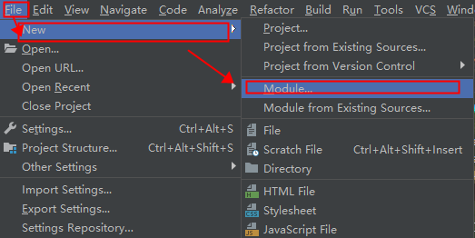
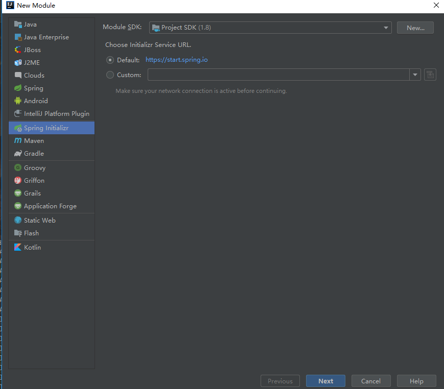
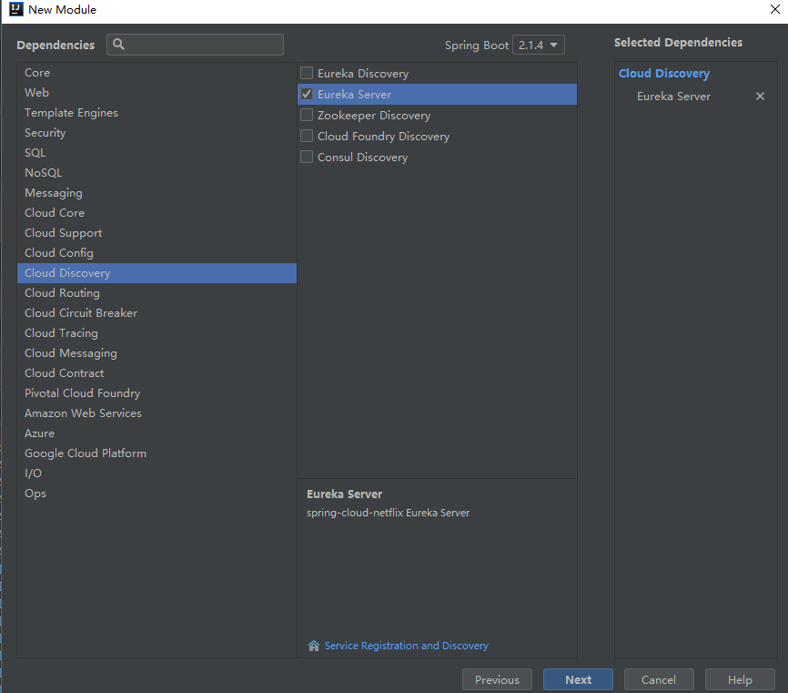
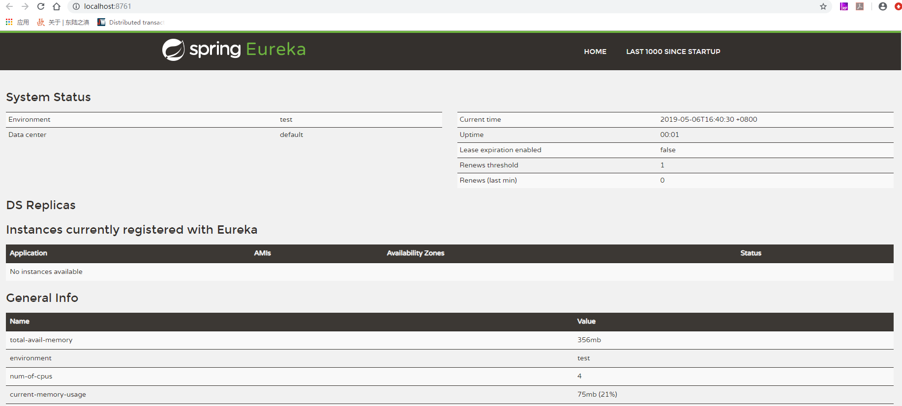
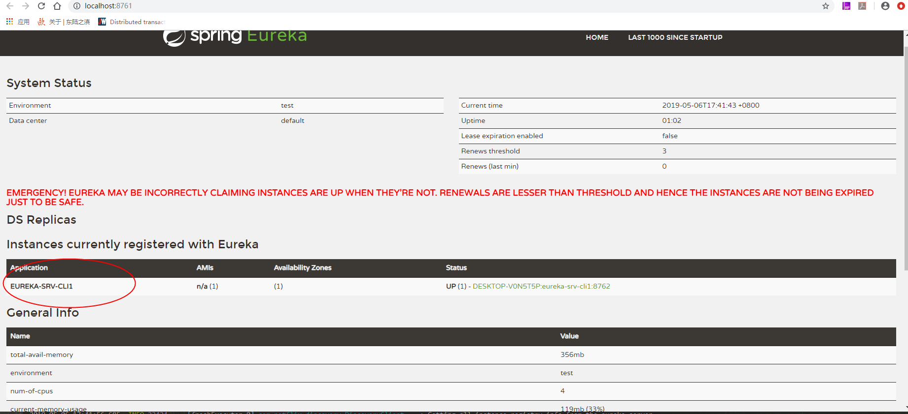

# Eureka服务注册发现

## 项目创建

### 使用IDEA创建一个**project**。

### 创建module作为【服务注册中心】

一个model工程作为服务注册中心，即Eureka Server,另一个作为Eureka Client。
使用Spring Initializr, cloud discovery->eureka server 。







创建完后，完整的pom文件内容：

```xml
<?xml version="1.0" encoding="UTF-8"?>
<project xmlns="http://maven.apache.org/POM/4.0.0" xmlns:xsi="http://www.w3.org/2001/XMLSchema-instance"
         xsi:schemaLocation="http://maven.apache.org/POM/4.0.0 http://maven.apache.org/xsd/maven-4.0.0.xsd">
    <modelVersion>4.0.0</modelVersion>
    <parent>
        <groupId>org.springframework.boot</groupId>
        <artifactId>spring-boot-starter-parent</artifactId>
        <version>2.1.4.RELEASE</version>
        <relativePath/> <!-- lookup parent from repository -->
    </parent>
    <groupId>org.byron4j</groupId>
    <artifactId>eureka-srv</artifactId>
    <version>0.0.1-SNAPSHOT</version>
    <name>eureka-srv</name>
    <description>Demo project for Spring Boot</description>

    <properties>
        <java.version>1.8</java.version>
        <spring-cloud.version>Greenwich.SR1</spring-cloud.version>
    </properties>

    <dependencies>
        <dependency>
            <groupId>org.springframework.cloud</groupId>
            <artifactId>spring-cloud-starter-netflix-eureka-server</artifactId>
        </dependency>

        <dependency>
            <groupId>org.projectlombok</groupId>
            <artifactId>lombok</artifactId>
            <optional>true</optional>
        </dependency>
        <dependency>
            <groupId>org.springframework.boot</groupId>
            <artifactId>spring-boot-starter-test</artifactId>
            <scope>test</scope>
        </dependency>
    </dependencies>

    <dependencyManagement>
        <dependencies>
            <dependency>
                <groupId>org.springframework.cloud</groupId>
                <artifactId>spring-cloud-dependencies</artifactId>
                <version>${spring-cloud.version}</version>
                <type>pom</type>
                <scope>import</scope>
            </dependency>
        </dependencies>
    </dependencyManagement>

    <build>
        <plugins>
            <plugin>
                <groupId>org.springframework.boot</groupId>
                <artifactId>spring-boot-maven-plugin</artifactId>
            </plugin>
        </plugins>
    </build>

</project>

```

### 配置文件application.properties或者application.yml

编写配置文件 resources/application.properties：

```properties
server.port=8761
eureka.instance.hostname=localhost
# 通过eureka.client.registerWithEureka：false和fetchRegistry：false来表明自己是一个eureka server.
eureka.client.registerWithEureka=false
eureka.client.fetchRegistry=false
eureka.client.serviceUrl.defaultZone=http://${eureka.instance.hostname}:${server.port}/eureka/
```


### 启动注册中心

启动一个服务注册中心，在SpringBoot工程的application类上注解```@EnableEurekaServer```标记：

```java
package org.byron4j.eurekasrv;

import org.springframework.boot.SpringApplication;
import org.springframework.boot.autoconfigure.SpringBootApplication;
import org.springframework.cloud.netflix.eureka.server.EnableEurekaServer;

/**
 * 启动一个服务注册中心，只需要一个注解@EnableEurekaServer，
 * 这个注解需要在springboot工程的启动application类上加
 */
@EnableEurekaServer
@SpringBootApplication
public class EurekaSrvApplication {

    public static void main(String[] args) {
        SpringApplication.run(EurekaSrvApplication.class, args);
    }

}

```

### 浏览器查看Eureka注册中心控制台

启动application类后，通过浏览器访问：  http://localhost:8761 ，界面如下：




### 创建一个module作为eureka client【服务提供者】

当client向server注册时，它会提供一些元数据，例如主机和端口，URL，主页等。Eureka server 从每个client实例接收心跳消息。 如果心跳超时，则通常将该实例从注册server中删除。

和注册中心类似，创建一个module，pom内容如下：

```xml
<?xml version="1.0" encoding="UTF-8"?>
<project xmlns="http://maven.apache.org/POM/4.0.0" xmlns:xsi="http://www.w3.org/2001/XMLSchema-instance"
         xsi:schemaLocation="http://maven.apache.org/POM/4.0.0 http://maven.apache.org/xsd/maven-4.0.0.xsd">
    <modelVersion>4.0.0</modelVersion>
    <parent>
        <groupId>org.springframework.boot</groupId>
        <artifactId>spring-boot-starter-parent</artifactId>
        <version>2.1.4.RELEASE</version>
        <relativePath/> <!-- lookup parent from repository -->
    </parent>
    <groupId>org.byron4j</groupId>
    <artifactId>eureka-cli-1</artifactId>
    <version>0.0.1-SNAPSHOT</version>
    <name>eureka-cli-1</name>
    <description>Demo project for eureka</description>

    <properties>
        <java.version>1.8</java.version>
        <spring-cloud.version>Greenwich.SR1</spring-cloud.version>
    </properties>

    <dependencies>
        <dependency>
            <groupId>org.springframework.cloud</groupId>
            <artifactId>spring-cloud-starter-netflix-eureka-client</artifactId>
        </dependency>
        <!--<dependency>
            <groupId>org.springframework.cloud</groupId>
            <artifactId>spring-cloud-starter-netflix-eureka-server</artifactId>
        </dependency>-->
        <dependency>
            <groupId>org.springframework.boot</groupId>
            <artifactId>spring-boot-starter-web</artifactId>
        </dependency>
        <dependency>
            <groupId>org.springframework.boot</groupId>
            <artifactId>spring-boot-starter-test</artifactId>
            <scope>test</scope>
        </dependency>
    </dependencies>

    <dependencyManagement>
        <dependencies>
            <dependency>
                <groupId>org.springframework.cloud</groupId>
                <artifactId>spring-cloud-dependencies</artifactId>
                <version>${spring-cloud.version}</version>
                <type>pom</type>
                <scope>import</scope>
            </dependency>
        </dependencies>
    </dependencyManagement>

    <build>
        <plugins>
            <plugin>
                <groupId>org.springframework.boot</groupId>
                <artifactId>spring-boot-maven-plugin</artifactId>
            </plugin>
        </plugins>
    </build>

</project>

```

#### 配置信息

application.properties:

```properties
# 这个表示服务实例应用名，后面调用方可以使用
spring.application.name=eureka-srv-cli1
# 当前实例暴露的端口
server.port=8762
# 注册中心的端口（前面一个注册中心的端口）
registry.port=8761
eureka.instance.hostname=localhost
# registerWithEureka、fetchRegistry 表示是客户端，会注册到注册中心上
eureka.client.registerWithEureka=true
eureka.client.fetchRegistry=true
eureka.client.serviceUrl.defaultZone=http://${eureka.instance.hostname}:${registry.port}/eureka/
```

#### 编写测试application类使用```@EnableEurekaClient```注解

```@EnableEurekaClient```注解标记，表示自己是一个eureka client。

```java
package org.byron4j.eurekacli1;

import org.springframework.beans.factory.annotation.Value;
import org.springframework.boot.SpringApplication;
import org.springframework.boot.autoconfigure.SpringBootApplication;
import org.springframework.cloud.netflix.eureka.EnableEurekaClient;
import org.springframework.web.bind.annotation.RequestMapping;
import org.springframework.web.bind.annotation.RequestParam;
import org.springframework.web.bind.annotation.RestController;

@RestController
@EnableEurekaClient
@SpringBootApplication
public class EurekaCli1Application {

    @Value("${server.port}")
    String port;

    public static void main(String[] args) {
        SpringApplication.run(EurekaCli1Application.class, args);
    }


    @RequestMapping("/hi")
    public String home(@RequestParam String name) {
        return "hi "+name+",i am from port:" +port;
    }
}

```

### 启动eureka client实例

启动eureka client实例，访问http://localhost:8761，查看注册中心，发现已经注册了一个新的客户端：



访问： http://localhost:8762/hi?name=Byron， 可以看到输出：

```
hi Byron,i am from port:8762
```


#### 参考资料

- [【方志朋的博客】](https://www.fangzhipeng.com/springcloud/2017/06/01/sc01-eureka.html)
- [baeldung](https://www.baeldung.com/spring-cloud-netflix-eureka)