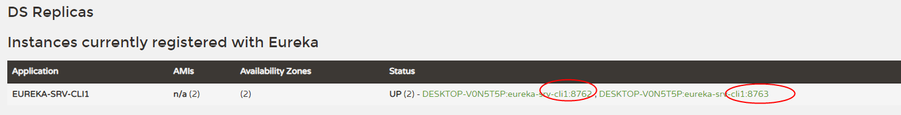
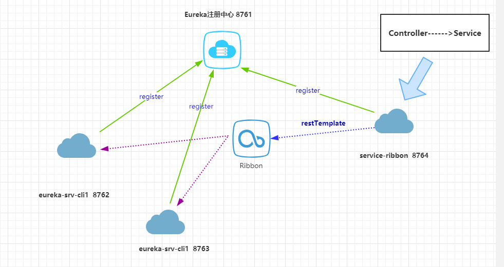

# Ribbon负载均衡

在微服务架构中，业务都会被拆分成一个独立的服务，服务与服务的通讯是基于http restful的。

**Spring cloud有两种服务调用方式，一种是ribbon+restTemplate，另一种是feign。**

## Ribbon 简介

Ribbon是一个负载均衡客户端，可以很好的控制htt和tcp的一些行为。Feign默认集成了ribbon。所以如果你使用了 ```@FeignClient```，这部分也是适用的。


## 准备

基于[eureka](1-Eureka服务注册发现.md)中示例的两个示例：启动eureka-srv（8761）作为注册中心；启动eureka-cli-1（端口8762）作为客户端，然后再修改eureka-cli-1的配置文件端口改为8763新启一个服务；

再访问 ```localhost:8761```，可以看到eureka-srv-cli1在eureka server中注册了两个实例：




## 建立一个服务消费者

- 引入依赖信息:

新建一个boot工程：service-ribbon；
需要引入： ```eureka-client```、```web```、```ribbon```：

```xml
<dependency>
    <groupId>org.springframework.boot</groupId>
    <artifactId>spring-boot-starter-web</artifactId>
</dependency>
<dependency>
    <groupId>org.springframework.cloud</groupId>
    <artifactId>spring-cloud-starter-netflix-eureka-client</artifactId>
</dependency>
<dependency>
    <groupId>org.springframework.cloud</groupId>
    <artifactId>spring-cloud-starter-netflix-ribbon</artifactId>
</dependency>
```

- 修改配置文件 application.properties:
    - 应用名指定为：service-ribbon
    - 指定本实例端口： 8764
    - 指定eureka注册中心地址： http://localhost:8761/eureka/

```properties

spring.application.name=service-ribbon
# 本实例端口
server.port=8764

# eureka注册中心的配置信息
registry.port=8761
eureka.instance.hostname=localhost
eureka.client.serviceUrl.defaultZone=http://${eureka.instance.hostname}:${registry.port}/eureka/
```

## 编码实现

### 编写工程的启动类即SpringBootApplication类

- ```@Bean``` : 向IOC注册一个bean
- ```@LoadBalanced```  : 对这个restTemplate开启负载均衡功能

```java
//@EnableDiscoveryClient // 使用非eureka服务发现的时候可以使用该注解
@EnableEurekaClient
@SpringBootApplication
public class ServiceRibbonApplication {

    @Bean // 向IOC注册一个bean
    @LoadBalanced   // 对这个restTemplate开启负载均衡功能
    RestTemplate restTemplate(){
        return new RestTemplate();
    }

    public static void main(String[] args) {
        SpringApplication.run(ServiceRibbonApplication.class, args);
    }

}

```

### 编写一个service类，使用restTemplate调用前面两个eureka的实例

这里使用了服务名： ```eureka-srv-cli1```。

```java
@Service
public class HelloService {

    @Autowired
    RestTemplate restTemplate;

    public String hiService(String name){
        return restTemplate.getForObject("http://eureka-srv-cli1/hi?name=" + name, String.class);
    }
}

```

### 编写一个controller，调用service

```java
@RestController
public class HelloController {

    @Autowired
    HelloService helloService;


    @GetMapping("/hi")
    public String hi(@RequestParam String name){
        return helloService.hiService(name);
    }
}
```

## 测试Ribbon负载均衡结果

启动service-ribbon实例的启动类，在浏览器多次访问： http://localhost:8764/hi?name=forezp，会看到控制台的输出结果：

>hi forezp,i am from port:8763
>
>hi forezp,i am from port:8762
>
>hi forezp,i am from port:8763
>
>hi forezp,i am from port:8762

这个现象表明，当我们使用 ```restTemplate.getForObject("http://eureka-srv-cli1/hi?name=" + name, String.class);``` 时，Ribbon已经帮我们做了负载均衡，做到了在不同的实例之间切换（细心的你会发现目前两台实例是轮流切换响应的）。


## 当前项目架构




- 一个服务注册中心 eureka-srv，端口 8761
- eureka-srv-cli1 服务跑了两个实例，端口分别为 8762、8763，分别向注册中心注册
- service-ribbon 端口为8764，向注册中心注册
- 当service-ribbon通过 restTemplate调用 eureka-srv-cli1 的 /hi 服务时，使用了 ribbon 负载均衡，会轮流调用 8762、8763 两个实例。

