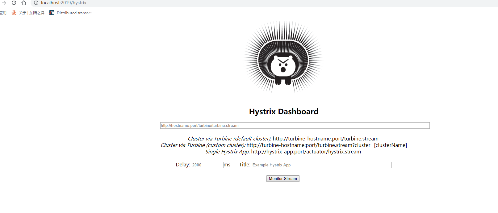
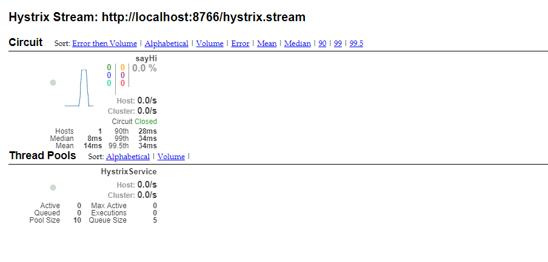

# Hystrix Dashboard仪表盘

创建一个子模块，service-hystrix-dashboard

## 引入3个依赖

```xml
<!-- hystrixdashboard  start-->
<dependency>
    <groupId>org.springframework.cloud</groupId>
    <artifactId>spring-cloud-starter-hystrix</artifactId>
</dependency>
<dependency>
    <groupId>org.springframework.cloud</groupId>
    <artifactId>spring-cloud-starter-netflix-hystrix-dashboard</artifactId>
</dependency>
<dependency>
    <groupId>org.springframework.boot</groupId>
    <artifactId>spring-boot-starter-actuator</artifactId>
</dependency>
<!-- hystrixdashboard  end-->

```


## 在启动类加上注解 ```@EnableHystrixDashboard```

在启动类上加上 ```@EnableHystrixDashboard``` 注解，开启Hystrix Dashboard功能。

```java
import org.springframework.boot.SpringApplication;
import org.springframework.boot.autoconfigure.SpringBootApplication;
import org.springframework.cloud.netflix.hystrix.dashboard.EnableHystrixDashboard;

@SpringBootApplication
@EnableHystrixDashboard
public class ServiceHystrixDashboardApplication {

    public static void main(String[] args) {
        SpringApplication.run(ServiceHystrixDashboardApplication.class, args);
    }

}
```

## 修改配置文件

修改application.properties文件:

```properties
spring.application.name=service-hystrix-dashboard
server.port=2019
```


## 测试

启动应用，在浏览器访问：  http://localhost:2019/hystrix




## Hystrix Dashboard 监控

Hystrix Dashboard共支持三种不同的监控方式

☞默认的集群监控：通过URL:http://turbine-hostname:port/turbine.stream开启，实现对默认集群的监控。

☞指定的集群监控：通过URL:http://turbine-hostname:port/turbine.stream?cluster=[clusterName]开启，实现对clusterName集群的监控。

☞单体应用的监控：通过URL:http://hystrix-app:port/hystrix.stream开启，实现对具体某个服务实例的监控。

☞Delay：控制服务器上轮询监控信息的延迟时间，默认为2000毫秒，可以通过配置该属性来降低客户端的网络和CPU消耗。

☞Title:该参数可以展示合适的标题。

## 将服务纳入监控

以[service-hystrix](4-Hystrix熔断器.md) 为例，在其上面进行改造。

- 首先我们还是启动 eureka-srv注册中心、eureka-srv-cli1 实例2个8762、8763；
- 然后操作service-hystrix实例：
    - 添加以上3个依赖 启动类加上 
    - 在启动类添加注解 `````@EnableCircuitBreaker````` 开启断路器功能
    - 在启动类注入Servlet bean， springboot 版本如果是2.0，则需要添加 ServletRegistrationBean 因为springboot的默认路径不是 "/hystrix.stream"，只要在自己的项目里配置上下面的servlet就可以了：
    
        ```java
            @SpringBootApplication
            @EnableEurekaClient
            @EnableHystrix
            @EnableCircuitBreaker // 断路器开启
            public class ServiceHystrixApplication {
            
                @Autowired
                HystrixService hystrixService;
            
                @Bean
                @LoadBalanced  // 基于Ribbon+RestTemplate实现负载均衡
                RestTemplate restTemplate(){
                    return new RestTemplate();
                }
            
                public static void main(String[] args) {
                    SpringApplication.run(ServiceHystrixApplication.class, args);
                }
            
            
                /**
                 * Hystrix-dashboard；springboot2.0以后需要注入Servlet
                 * @return
                 */
                @Bean
                public ServletRegistrationBean getServlet() {
                    HystrixMetricsStreamServlet streamServlet = new HystrixMetricsStreamServlet();
                    ServletRegistrationBean registrationBean = new ServletRegistrationBean(streamServlet);
                    registrationBean.setLoadOnStartup(1);
                    registrationBean.addUrlMappings("/hystrix.stream");
                    registrationBean.setName("HystrixMetricsStreamServlet");
                    return registrationBean;
                }
            
            }
         ```

- 其他的配置和代码保持不变。
- 在application.properties中增加配置： ```hystrix.command.default.execution.isolation.thread.timeoutInMilliseconds=2000``` 。
- 启动 service-hystrix 服务。
- 启动 service-hystrix-dashboard 服务。
- 在浏览器输入http://localhost:2019/hystrix 。
- http://localhost:8766/hi?name=forezp。
- 在Hystrix-Dashboard的主界面上输入: http://localhost:8766/hystrix.stream ， 然后点击 Monitor Stream按钮


可以看到：




#### 参考资料

- [hystrix dashboard Unable to connect to Command Metric Stream解决办法](https://www.cnblogs.com/mark7/p/8920288.html)