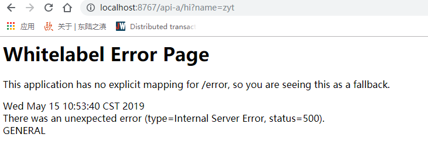

# Zuul动态路由转发-过滤

>[Zuul是一个边缘服务，提供动态路由、监视、弹性、安全性等等](https://github.com/Netflix/zuul)

回顾一下，微服务需要的几大组件： 
- 服务注册与发现
- 服务消费
- 负载均衡
- 断路器
- 服务路由
- 配置管理

一种常见的SpringCloud为服务体系中负载均衡方式是： 客户端经由负载均衡（Nginx、zuul），再到达服务网关（zuul集群），然后再到具体的服务，服务同意注册到高可用的服务注册中心集群，服务的所有配置文件由配置服务管理。

Zuul 主要功能是转发、过滤器， 如 /api/pay 转发到 pay 服务， /api/repay 转发到 repay 服务。
Zuul默认和Ribbon结合实现了负载均衡的功能。

Zuul 功能：

- 授权验证
- 压力测试
- [金丝雀测试-灰度测试](https://www.cnblogs.com/apanly/p/8784096.html)
- 动态路由
- 服务迁移
- 卸载
- 安全机制
- 静态响应处理
- 主动交互管理


## 准备

### 创建工程

创建一个 service-zuul 工程。

引入依赖：

```xml
<dependency>
    <groupId>org.springframework.boot</groupId>
    <artifactId>spring-boot-starter-web</artifactId>
</dependency>
<dependency>
    <groupId>org.springframework.cloud</groupId>
    <artifactId>spring-cloud-starter-netflix-eureka-client</artifactId>
</dependency>
<dependency>
    <groupId>org.springframework.cloud</groupId>
    <artifactId>spring-cloud-starter-netflix-zuul</artifactId>
</dependency>
```

### 在启动累使用 ```@EnableZuulProxy``` 注解，开启 zuul 功能

```java
@EnableZuulProxy
@EnableEurekaClient
@SpringBootApplication
public class ServiceZuulApplication {

	public static void main(String[] args) {
		SpringApplication.run(ServiceZuulApplication.class, args);
	}

}

```

### 服务路由配置

修改application.properties文件；

```properties


spring.application.name=service-zuul
#  本实例端口
server.port=8767

# eureka 注册中心
registry.port=8761
eureka.instance.hostname=localhost
eureka.client.serviceUrl.defaultZone=http://${eureka.instance.hostname}:${registry.port}/eureka/

# 添加zuul路由配置

# 将 api-a 的请求都转发给 service-ribbon
zuul.routes.api-a.path=/api-a/**
zuul.routes.api-a.serviceId=service-ribbon


# 将 api-a 的请求都转发给 service-fign
zuul.routes.api-b.path=/api-b/**
zuul.routes.api-b.serviceId=service-feign

```

会将 localhost:8768/api-a/ 的所有请求都转发给 service-ribbon；

会将 localhost:8768/api-a/ 的所有请求都转发给 service-feign；

### 测试

启动服务注册中心： eureka-srv、eureka-srv-cli1 的两个实例、service-ribbon、service-feign 实例。

我们把 service-ribbon 关闭，来测试一下服务挂掉的场景，访问 localhost:8767/api-a/hi?name=zyt：




重新启动service-ribbon实例，

在浏览器访问： localhost:8767/api-a/hi?name=zyt , 看到：

>hi zyt,i am from port:8762

在浏览器访问： localhost:8767/api-b/hi?name=zyt ， 看到：

>hi zyt,i am from port:8762

就可以看到zuul实现了服务路由了。

## 过滤配置

zuul 除了路由功能之外，还能过滤，做一些安全验证。

编写自定义过滤器继承自 ```ZuulFilter```  ：

```java

/**
 * 自定义Zuul过滤器
 */
@Slf4j
@Component
public class MyZuulFilter extends ZuulFilter {

    /**
     * 按类型对过滤器进行分类。
     * Zuul中的标准类型包括用于路由前过滤的“pre”、
     * 用于路由到源的“route”、用于路由后过滤器的“post”和用于错误处理的“error”
     * @return
     */
    @Override
    public String filterType() {
        // 我们使用前置过滤器，在请求前进行过滤
        return "pre";
    }

    /**
     * 还必须为过滤器定义filterOrder()。
     * 如果优先级对筛选器不重要，则筛选器可能具有相同的筛选顺序。过滤器的顺序不需要是顺序性的。
     * @return
     */
    @Override
    public int filterOrder() {
        return 0;
    }

    /**
     * 是否调用run方法，返回true则会调用run方法
     * @return
     */
    @Override
    public boolean shouldFilter() {
        return true;
    }

    /**
     * shouldFilter() 方法返回true则必定调用该方法；
     * run方法是ZuulFilter的核心
     * @return
     * @throws ZuulException
     */
    @Override
    public Object run() throws ZuulException {
        // 这里对请求做一个token的简单的模拟，并返回响应码
        // RequestContext 对象持有请求、响应、状态信息和数据，以便zuulfilter访问和共享
        RequestContext currentContext = RequestContext.getCurrentContext();
        HttpServletRequest request = currentContext.getRequest();
        log.info(String.format("%s>>>%s", request.getMethod(), request.getRequestURL().toString()));

        // 模拟客户端传进来一个token
        String token = request.getParameter("token");
        if( null == token ){
            log.warn("token is empty!");
            // 不再次发送zuul响应
            currentContext.setSendZuulResponse(false);
            // 设置状态码
            currentContext.setResponseStatusCode(401);

            try {
                currentContext.getResponse().getWriter().write("your token is empty!");
            } catch (IOException e) {
                log.error("访问出错：", e);
            }
        }
        log.info("ok");

        return null;
    }
}
```

重新启动 service-zuul 实例，
在浏览器访问： http://localhost:8767/api-b/hi?name=zyt ， 输出：

>your token is empty!

在浏览器访问： http://localhost:8767/api-b/hi?name=zyt&token=22 ， 输出：

>hi zyt,i am from port:8762

可以看到过滤器拦截成功了。

#### 参考资料

- [Zuul概览图](http://www.cnblogs.com/davidwang456/p/6411016.html)
- [Zuul wiki](https://github.com/Netflix/zuul/wiki/Getting-Started-2.0)
- [金丝雀测试即灰度测试](https://www.cnblogs.com/apanly/p/8784096.html)

