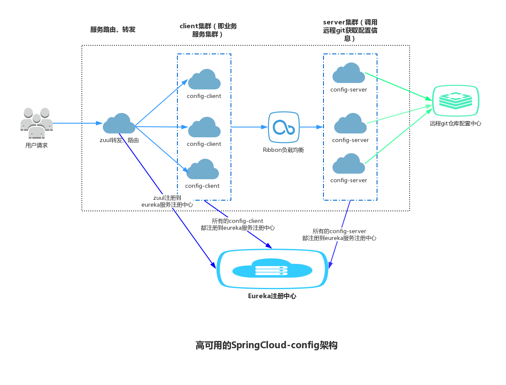

# SpringCloud-Config高可用架构

我们利用 **eureka服务注册中心**、**ribbon负载均衡**、**zuul服务路由、过滤**、**springcloud config** 组件来实现一个高可用的Spring Config架构：

- 建立远程git仓库
- 搭建eureka服务发现注册中心
- config-server集群注册到eureka中，config-server连接到远程git仓库
- 搭建config-client集群（即业务服务）
- config-client 通过 ribbon负载均衡调用 config-server
- 搭建zuul路由转发服务，映射到config-client的配置
- 用户请求，通过zuul路由转发

**总览**

用户发起请求，通过zuul转发到config-client的某一个实例，config-client通过负载均衡调用config-server从远程git获取配置信息。