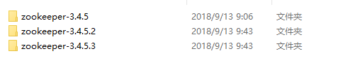
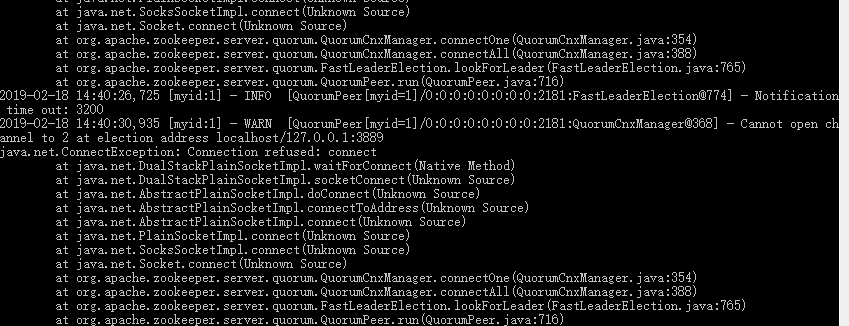
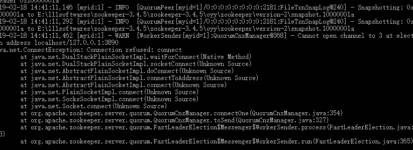
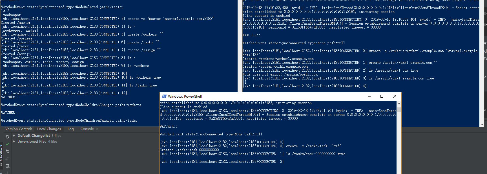

## 单机Zookeeper集群

### 单机Zk集群配置

复制Zk，并重命名如下：


第1个zk的zoo.cfg:


```
...
# dataDir=/tmp/zookeeper 示例：快照的存储目录
dataDir=E:\\111softwares\\zookeeper-3.4.5\\zookeeper-3.4.5\\oyy\\zookeeper
# the port at which the clients will connect 供客户端连接
clientPort=2181
...
# 伪集群设置
# 第一个端口是节点连接其他节点的端口，用于节点间通信，具体的讲，zk server 使用这个端口连接follower和leader。
# 当一个新的leader诞生，一个follower 打开一个TCP连接到leader，使用这个端口2888.
#因为选举leader也是使用TCP，所以需要另一个端口3888来做选举用。
#server.1=zoo1:2888:3888
#server.2=zoo2:2888:3888
#server.3=zoo3:2888:3888
#示例
server.1=localhost:2888:3888
server.2=localhost:2889:3889
server.3=localhost:2890:3890

```

需要在E:\111softwares\zookeeper-3.4.5\zookeeper-3.4.5\oyy\zookeeper下面创建 ```myid``` 文件，里面写入```1```。


第2个zk的zoo.cfg:
```
...
# dataDir=/tmp/zookeeper 示例：快照的存储目录
dataDir=E:\\111softwares\\zookeeper-3.4.5\\zookeeper-3.4.5.2\\oyy\\zookeeper
# the port at which the clients will connect 供客户端连接
clientPort=2182
...
# 伪集群设置
# 第一个端口是节点连接其他节点的端口，用于节点间通信，具体的讲，zk server 使用这个端口连接follower和leader。
# 当一个新的leader诞生，一个follower 打开一个TCP连接到leader，使用这个端口2888.
#因为选举leader也是使用TCP，所以需要另一个端口3888来做选举用。
#server.1=zoo1:2888:3888
#server.2=zoo2:2888:3888
#server.3=zoo3:2888:3888
#示例
server.1=localhost:2888:3888
server.2=localhost:2889:3889
server.3=localhost:2890:3890
```
需要在E:\111softwares\zookeeper-3.4.5\zookeeper-3.4.5.2\oyy\zookeeper下面创建 ```myid``` 文件，里面写入```2```。

第3个zk的zoo.cfg:

```
...
# dataDir=/tmp/zookeeper 示例：快照的存储目录
dataDir=E:\\111softwares\\zookeeper-3.4.5\\zookeeper-3.4.5.3\\oyy\\zookeeper
# the port at which the clients will connect 供客户端连接
clientPort=2183
...
# 伪集群设置
# 第一个端口是节点连接其他节点的端口，用于节点间通信，具体的讲，zk server 使用这个端口连接follower和leader。
# 当一个新的leader诞生，一个follower 打开一个TCP连接到leader，使用这个端口2888.
#因为选举leader也是使用TCP，所以需要另一个端口3888来做选举用。
#server.1=zoo1:2888:3888
#server.2=zoo2:2888:3888
#server.3=zoo3:2888:3888
#示例
server.1=localhost:2888:3888
server.2=localhost:2889:3889
server.3=localhost:2890:3890
```
需要在E:\111softwares\zookeeper-3.4.5\zookeeper-3.4.5.3\oyy\zookeeper下面创建 ```myid``` 文件，里面写入```3```。

至此，单机集群环境配置完成了。

### 单机Zk集群部署

启动Zk1的时候如下（提示错误：无法打开选举的第二个通道3889，这是因为我们的Zk2还没有启动）：



继续启动Zk2（同样提示错误：无法打开第三个选举通道3890）：



继续启动Zk3，再看下Zk1、Zk2的输出信息已经恢复正常：


经过选举完成后，ZK2成了leader，Zk1、Zk3为follower。

### 客户端连接Zk集群

```shell
zkCli -server localhost:2181,localhost:2182,localhost:2183
```

连接OK：

```
2019-02-18 16:02:44,449 [myid:] - INFO  [main-SendThread(0:0:0:0:0:0:0:1:2181):ClientCnxn$SendThread@1207] - Session establishment complete on server 0:0:0:0:0:0:0:1/0:0:0:0:0:0:0:1:2181, sessionid = 0x168ff5647df0001, negotiated timeout = 30000

WATCHER::
[zk: localhost:2181,localhost:2182,localhost:2183(CONNECTED) 0]
WatchedEvent state:SyncConnected type:None path:null
```

>**注意：简单的随机负载均衡机制**
>默认客户端以随机顺序连接到集群服务器中，可以多次关闭后再重连（Ctrl+C 或者 连接成功后输入quit退出），可以看到在集群的2181-2183之间来回切换连接。

## 一个主-从模式例子的实现

使用 ZkCli 来演示主从模式示例，实际生产中不推荐。

我们知道，主-从模式包括三个角色：

***主节点***
  主节点负责监视新的从节点和任务，分配任务给可用的从节点
  
***从节点***
  从节点会通过系统注册自身，确保主节点可以看到它们能执行任务，然后开始监视新任务
  
***客户端***
  客户端创建新任务并等待系统响应
  
我们再以生活中的场景来描述这三个角色的分工（有点残酷...）:

>主节点是Boss，从节点是工厂工人，客户端是商户。
>
>老板监视工人、查看新订单（任务），如果有新的订单，然后看一下是否有工人是手上没事的，就把新的订单交给他去干。
>
>工人通过应聘进入工厂（注册），这样老板就知道他们是自己工厂的人了就可以分配任务给他们。工人需要一直监视自己的任务并上报老板自己完成了手头上的事了。
>
>客户端（商户）给该工厂下单，然后等待该工厂的生产结果...

### 主节点角色

因为只有一个进程会成为主节点，所以一个进程称为Zk的主节点后必须锁定管理权。为此，进程需要创建一个 临时Znode，名为 /master:

```
create -e /master "master1.example.com:2182"
Created /master

[zk: localhost:2181,localhost:2182,localhost:2183(CONNECTED) 3] ls /
[zookeeper, master]
[zk: localhost:2181,localhost:2182,localhost:2183(CONNECTED) 4] get /master
"master1.example.com:2182"
cZxid = 0x20000000a
ctime = Mon Feb 18 16:35:26 CST 2019
mZxid = 0x20000000a
mtime = Mon Feb 18 16:35:26 CST 2019
pZxid = 0x20000000a
cversion = 0
dataVersion = 0
aclVersion = 0
ephemeralOwner = 0x368ff574d120000
dataLength = 26
numChildren = 0
```

- 创建主节点znode，获得管理权。 使用 **- e** 创建临时节点，一个临时节点会在会话过期或者关闭时自动被删除
- 列出Zk树的根
- 获取 **/master** znode的元数据和数据

接下来我们启用一个新的进程，尝试创建一个 /master 节点：

```
create -e /master "master1.example.com:2182"
Node already exists: /master
[zk: localhost:2181,localhost:2182,localhost:2183(CONNECTED) 1]
```

Zk 告诉我们 /master 节点已经存在。

然而，一个活动的节点可能会崩溃，备份节点需要接替活动主节点的角色。为了监测这些，需要在 /master 节点上设置一个监视点，操作如下：

```
create -e /master "master1.example.com:2182"
Node already exists: /master
[zk: localhost:2181,localhost:2182,localhost:2183(CONNECTED) 1] stat /master true
cZxid = 0x20000000a
ctime = Mon Feb 18 16:35:26 CST 2019
mZxid = 0x20000000a
mtime = Mon Feb 18 16:35:26 CST 2019
pZxid = 0x20000000a
cversion = 0
dataVersion = 0
aclVersion = 0
ephemeralOwner = 0x368ff574d120000
dataLength = 26
numChildren = 0
[zk: localhost:2181,localhost:2182,localhost:2183(CONNECTED) 2]
```

**stat** 命令可以得到一个节点的属性，并允许我们在已经存在的znode节点上设置监视点。设置参数 **true** 来添加监视点，当主节点崩溃的时候，我们会观察到以下情况：


我们关闭第一个会话，在第二个进程可以看到：

```
[zk: localhost:2181,localhost:2182,localhost:2183(CONNECTED) 2]
WATCHER::

WatchedEvent state:SyncConnected type:NodeDeleted path:/master
ls /
[zookeeper]
[zk: localhost:2181,localhost:2182,localhost:2183(CONNECTED) 3]
```

发生了 **NodeDeleted** 事件，同时 /master 节点已经不存在了。
现在备份主节点亦即第二个进程再次创建 **/master** 接管主节点角色。

```
[zk: localhost:2181,localhost:2182,localhost:2183(CONNECTED) 3] create -e /master "master1.example.com:2182"
Created /master
[zk: localhost:2181,localhost:2182,localhost:2183(CONNECTED) 4] ls /
[zookeeper, master]
[zk: localhost:2181,localhost:2182,localhost:2183(CONNECTED) 5]
```

### 从节点、任务和分配

在讨论从节点、客户端采取的步骤之前，我们先创建三个重要的父 znode：

**/workers**、 **/tasks** 和 **/assign**

```
[zk: localhost:2181,localhost:2182,localhost:2183(CONNECTED) 3] create -e /master "master1.example.com:2182"
Created /master
[zk: localhost:2181,localhost:2182,localhost:2183(CONNECTED) 4] ls /
[zookeeper, master]
[zk: localhost:2181,localhost:2182,localhost:2183(CONNECTED) 5] create /workers ""
Created /workers
[zk: localhost:2181,localhost:2182,localhost:2183(CONNECTED) 6] create /tasks ""
Created /tasks
[zk: localhost:2181,localhost:2182,localhost:2183(CONNECTED) 7] create /assign ""
Created /assign
[zk: localhost:2181,localhost:2182,localhost:2183(CONNECTED) 8] ls /
[zookeeper, workers, tasks, master, assign]
[zk: localhost:2181,localhost:2182,localhost:2183(CONNECTED) 9]
```

这三个节点为持久化节点，且不包含任何数据。通过这些节点，我们可以得知 哪些节点当前有效、当前有哪些任务需要分配、并向从节点分配任务。

**注意**： 在真实环境中，这些znode可能由主进程在分配任务之前创建，也可能由一个引导程序创建，一旦这些节点创建好了，主节点就需要监视 /workers 、 /tasks 的子节点的变化情况了：

```
[zk: localhost:2181,localhost:2182,localhost:2183(CONNECTED) 10] ls /workers true
[]
[zk: localhost:2181,localhost:2182,localhost:2183(CONNECTED) 11] ls /tasks true
[]
[zk: localhost:2181,localhost:2182,localhost:2183(CONNECTED) 12]
```

通过 ls 可选的参数 true，可以设置对应的znode的子节点变化的监视点。

### 从节点角色

从节点首先要通知主节点，告知主节点可以执行任务。从节点通过 /workers 子节点下创建临时的znode来通知，并在子节点中使用主机名来标志自己：

新起一个进程：

```
[zk: localhost:2181,localhost:2182,localhost:2183(CONNECTED) 0] create -e /workers/worker1.example.com "worker1.example.com:2183"
Created /workers/worker1.example.com
[zk: localhost:2181,localhost:2182,localhost:2183(CONNECTED) 1]
```

因为前面主节点已经监视了 /workers 子节点变化情况。所以一旦从节点在 /workers 下创建了子节点，主节点就会观察到以下通知信息：

```
[zk: localhost:2181,localhost:2182,localhost:2183(CONNECTED) 12]
WATCHER::

WatchedEvent state:SyncConnected type:NodeChildrenChanged path:/workers

```

下一步，从节点需要创建一个父znode **/assign/worker1.example.com** 来接收任务分配，并通过 ls true 来监视这个节点的变化，以便等待新的任务：

```
[zk: localhost:2181,localhost:2182,localhost:2183(CONNECTED) 1] create /assign/work1.example.com ""
Created /assign/work1.example.com

[zk: localhost:2181,localhost:2182,localhost:2183(CONNECTED) 3] ls /assign/work1.example.com true
[]
[zk: localhost:2181,localhost:2182,localhost:2183(CONNECTED) 4]
```

如此，从节点已经准备就绪，可以接收任务分配。

### 客户端角色

客户端负责向系统中添加任务，使用 **create -s**：

```
[zk: localhost:2181,localhost:2182,localhost:2183(CONNECTED) 0] create -s /tasks/task- "cmd"
Created /tasks/task-0000000000
[zk: localhost:2181,localhost:2182,localhost:2183(CONNECTED) 1]
```

需要按任务添加的顺序来添加 znode，本质上是一个队列。
客户端现在必须等待任务执行完毕。
执行任务的从节点执行完后，会创建一个 znode 表示任务的执行状态。
客户端通过查看任务状态的 znode 是否创建完成来确定任务是否执行完毕，因此客户端需要监听状态 znode 的创建事件：

```
[zk: localhost:2181,localhost:2182,localhost:2183(CONNECTED) 1] ls /tasks/task-0000000000 true
[]
[zk: localhost:2181,localhost:2182,localhost:2183(CONNECTED) 2]
```

执行任务的从节点会在任务节点 /tasks/task-0000000000 下创建状态znode节点，所以需要使用 ls true 监视任务节点 /tasks/task-0000000000 的子节点。

一旦创建完任务节点，主节点会观察到以下事件：

```
WATCHER::

WatchedEvent state:SyncConnected type:NodeChildrenChanged path:/tasks
```

目前我们的进程截图如下，第一个是主节点，第二个是从节点，第三个是客户端：




### 分配任务

主节点之后会检查这个新的任务，获取可用的从节点列表，之后分配这个任务给 worker1.example.com ：

- 在主节点进程查看：

```
[zk: localhost:2181,localhost:2182,localhost:2183(CONNECTED) 12]
[zk: localhost:2181,localhost:2182,localhost:2183(CONNECTED) 12] ls /tasks
[task-0000000000]
[zk: localhost:2181,localhost:2182,localhost:2183(CONNECTED) 13] ls /workers
[worker1.example.com]
[zk: localhost:2181,localhost:2182,localhost:2183(CONNECTED) 14]
[zk: localhost:2181,localhost:2182,localhost:2183(CONNECTED) 14] create /assign/worker1.example.com/task-0000000000 ""
Node does not exist: /assign/worker1.example.com/task-0000000000
[zk: localhost:2181,localhost:2182,localhost:2183(CONNECTED) 15] create /assign/work1.example.com/task-0000000000 ""
Created /assign/work1.example.com/task-0000000000
[zk: localhost:2181,localhost:2182,localhost:2183(CONNECTED) 16]
```

- 从节点接收到任务分配的通知：

```
WATCHER::

WatchedEvent state:SyncConnected type:NodeChildrenChanged path:/assign/work1.example.com

```

- 从节点开始检查新任务，并确认是否分配给自己：

```
[zk: localhost:2181,localhost:2182,localhost:2183(CONNECTED) 4] ls /assign/work1.example.com
[task-0000000000]
[zk: localhost:2181,localhost:2182,localhost:2183(CONNECTED) 5]
```

- 一旦从节点处理完新任务，它就会在 /tasks 中添加一个状态 znode：

```
[zk: localhost:2181,localhost:2182,localhost:2183(CONNECTED) 5] create /tasks/task-0000000000/status "done"
Created /tasks/task-0000000000/status
[zk: localhost:2181,localhost:2182,localhost:2183(CONNECTED) 6]
```

- 之后，客户端接收到通知，并检查执行结果：

```
WATCHER::

WatchedEvent state:SyncConnected type:NodeChildrenChanged path:/tasks/task-0000000000

[zk: localhost:2181,localhost:2182,localhost:2183(CONNECTED) 2] get /tasks/task-0000000000
"cmd"
cZxid = 0x200000019
ctime = Mon Feb 18 17:41:18 CST 2019
mZxid = 0x200000019
mtime = Mon Feb 18 17:41:18 CST 2019
pZxid = 0x20000001c
cversion = 1
dataVersion = 0
aclVersion = 0
ephemeralOwner = 0x0
dataLength = 5
numChildren = 1
[zk: localhost:2181,localhost:2182,localhost:2183(CONNECTED) 3] get /tasks/task-0000000000/status
"done"
cZxid = 0x20000001c
ctime = Mon Feb 18 18:11:59 CST 2019
mZxid = 0x20000001c
mtime = Mon Feb 18 18:11:59 CST 2019
pZxid = 0x20000001c
cversion = 0
dataVersion = 0
aclVersion = 0
ephemeralOwner = 0x0
dataLength = 6
numChildren = 0
[zk: localhost:2181,localhost:2182,localhost:2183(CONNECTED) 4]
```

客户端检查状态 znode 的信息，并确认任务的执行结果。本例中我们看到任务执行成功，状态为 "done"。 当然真实环境中，任务执行是很复杂的，但是我们已经理解了一个主-从模式案例了，难道不是吗？

