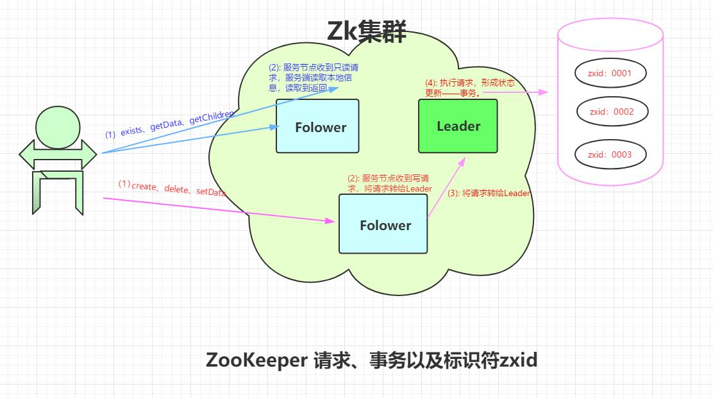
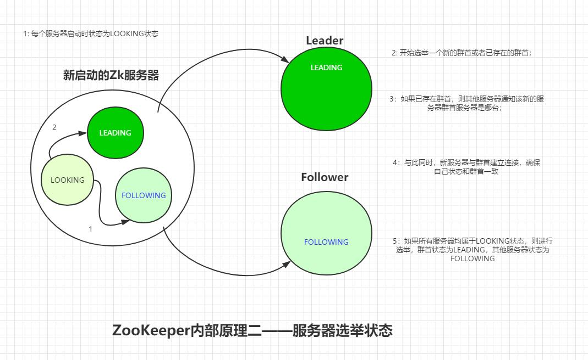
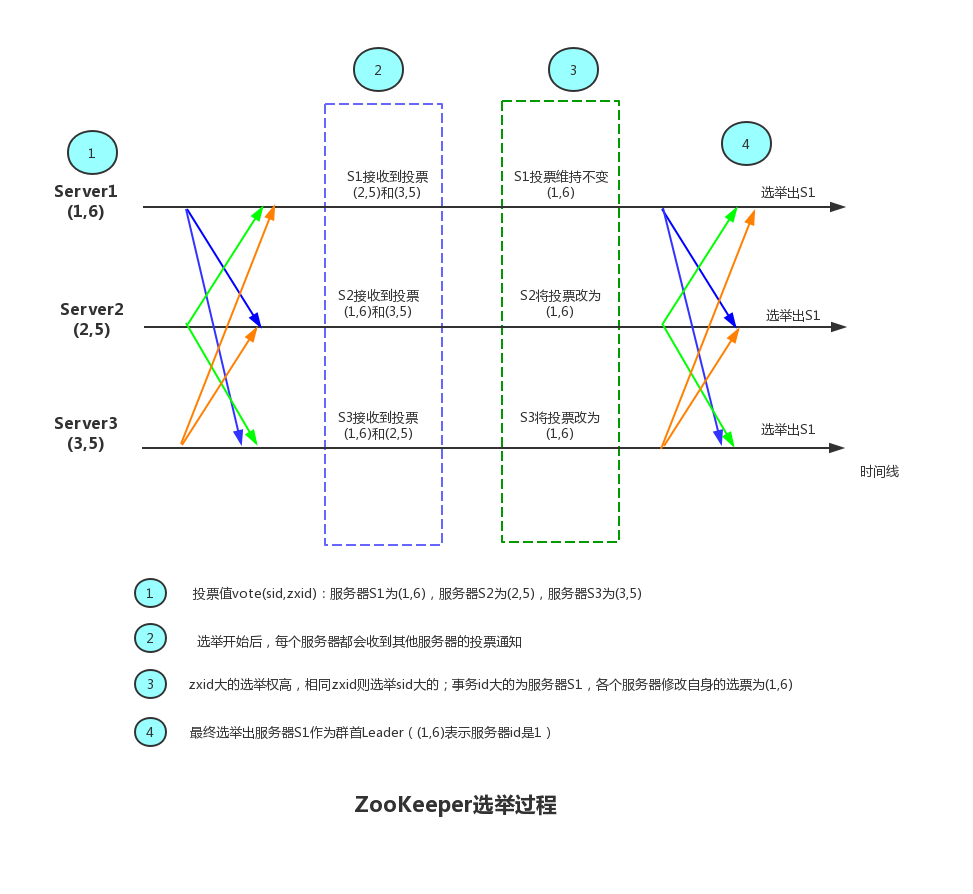

## 群首Leader选举

### 请求、事务标识符




### 服务器选举中节点的状态



### ZooKeeper实现选举的类是```org.apache.zookeeper.server.quorum.QuorumPeer```

>查找群首leader
>
>```QuorumPeer``` 类的 run 方法实现了服务器的主要循环工作。当进入 <font color=blue>**LOOKING**</font> 状态，将会执行```org.apache.zookeeper.server.quorum.Election.lookForLeader```方法进行leader的选举，该方法返回前会将服务器状态设置为<font color=blue>**LEADING**</font> 或者<font color=blue>**FOLLOWING**</font> 状态，也可能是<font color=blue>**OBSERVING**</font>。


   

### 一图胜千言--ZooKeeper选举过程

以下是正常情况下的选举过程，确实很顺利：


但是实际中可能存在各种场景，以下是其中一种S2接收S1投票延迟的情况：
.jpg)

虽然最后没有影响选举结果，但是S2选择S3，S3并不会以群首身份响应S2的请求，S2会在等待S3的响应而超时，并开始再一次的重试，这期间S2是无法处理任何客户端的请求的。
如果可以让S2在进行选举群首时多等待一会，等到S1的投票。

.jpg)

>默认的群选举实现类为```org.apache.zookeeper.server.quorum.FastLeaderElection implements Election```，如果想自定义群首选举算法，需要实现 ***quorum*** 包中的```Election```接口。


## Zab:状态更新的广播协议


