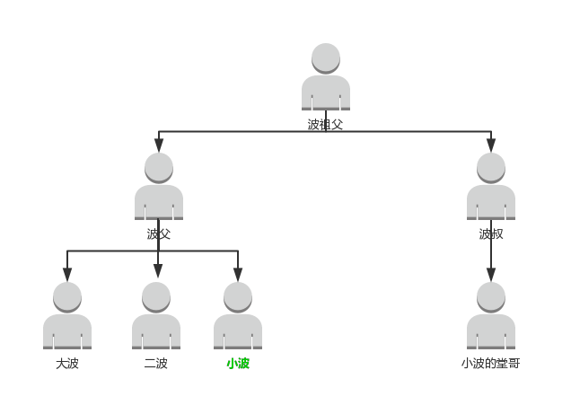
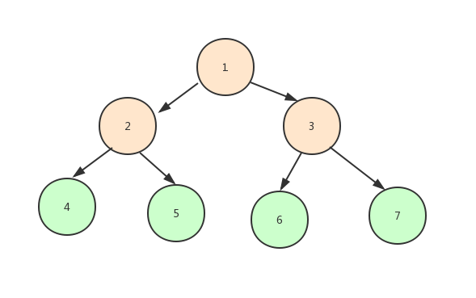
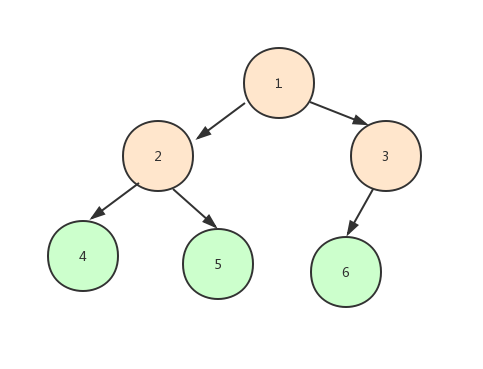
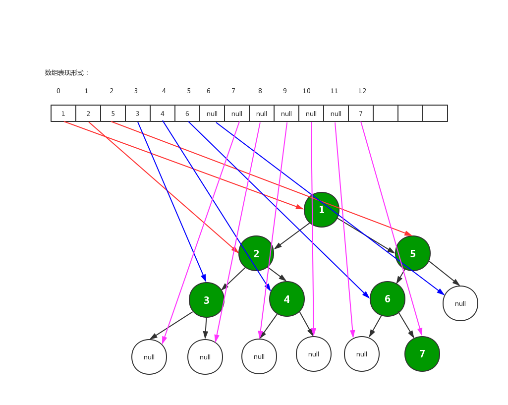
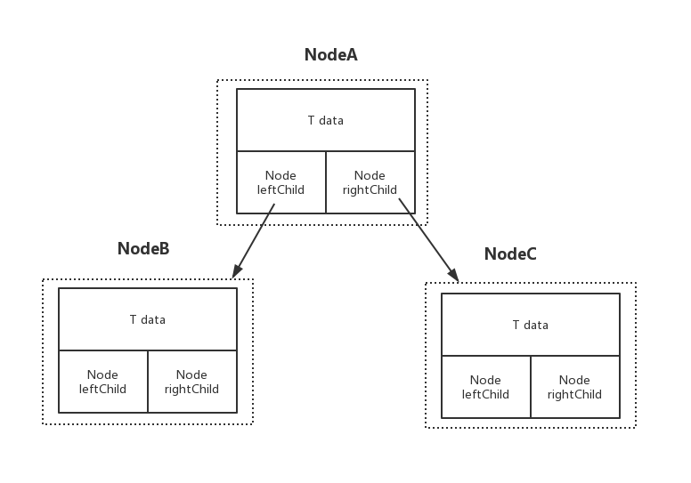
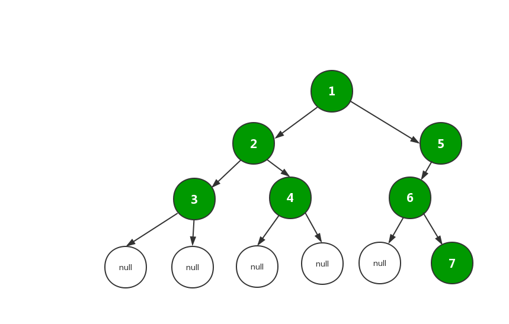

# 树

树是非线性的数据结构。树的抽象来自于现实中的“树”，树先有树根、主干、分支干、分支干继续分叉......。
人类传承中的族谱也同样是树的形式：



## 树的一些基本术语

- **节点**：树的每一个节点。
- **度**：子节点的个数。树的度是指其中节点的最大的度。前面的族谱中的度为3。
- **深度**：树的层级，像前面的族谱深度为3。
- **父节点**：相对于子节点而言，子节点的上一层节点就叫做它的父节点。
- **叶子节点**：没有子节点的节点。大波、二波、小波、小波的堂哥就叫做叶子节点。
- **子树**：每一个节点及其子节点都可以算作一棵“子树”。


## 二叉树

树的每个节点最多只含有2个子节点。
二叉树节点有两个孩子节点：左孩子（leftChild）、右孩子（rightChild），左孩子、右孩子是有顺序性的。

### 满二叉树

满二叉树指的是，除了叶子节点外，每个节点都有两个子节点，并且所有的叶子节点都在最后一层。



深度为N的满二叉树的特点：

- 节点总数为 2^N - 1。

### 完全二叉树

完全二叉树就是满二叉树按层级编号的部分：




### 二叉树的存储方式

二叉树是逻辑结构，其物理结构的表现形式有：

- 数组存储形式
- 链式存储形式


#### 数组表现形式



数组表示的形式，节点的索引下表为n，则其左孩子下标为```2*n+1```，右孩子下标为```2*n+2```。

从数组的存储形式来看，假如树是比较稀疏的情况，就比较浪费空间了。
但是如果是完全二叉树，就可以使用数组形式存储了。

#### 链表形式



链表可以组建一个内部类Node，拥有三个属性：

- 数据：```T data```
- 左孩子： ```Node leftChild```
- 右孩子： ```Node rightChild```

### 二叉树的3种深度遍历方式

根据链表 ```LinkedList linkedList = new LinkedList(Arrays.asList(1, 2, 3, null, null, 4, null, null, 5, 6, null, 7));```
创建完成后的二叉树如下所示：



先序（前序）遍历结果如下：
1 --》 2 --》 3 --》 4 --》 5 --》 6 --》 7.

中序遍历结果如下：
3 --》 2 --》 4 --》 1 --》 6 --》 7 --》 5.

后序遍历结果如下：
3 --》 4 --》 2 --》 7 --》 6 --》 5 --》 1.


### 链表方式编码实现二叉树的深度遍历方式

```java
package org.byron4j.cookbook.algrithms.tree;

import java.util.ArrayList;
import java.util.Arrays;
import java.util.Collections;
import java.util.LinkedList;

/**
 * 二叉树遍历实例--深度遍历：
 * 前序遍历
 * 中序遍历
 * 后序遍历
 */
public class BinaryTree {

    public static class TreeNode{
        int data;
        TreeNode leftChild;
        TreeNode rightChild;

        public TreeNode(int data) {
            this.data = data;
        }
    }


    /**
     * 前序遍历
     * @param treeNode
     */
    public static void preOrderTraveral(TreeNode treeNode){
        if(null == treeNode){
            return;
        }
        System.out.println(treeNode.data);
        preOrderTraveral(treeNode.leftChild);
        preOrderTraveral(treeNode.rightChild);
    }

    /**
     * 中序遍历
     * @param treeNode
     */
    public static void middleOrderTraveral(TreeNode treeNode){
        if(null == treeNode){
            return;
        }
        middleOrderTraveral(treeNode.leftChild);
        System.out.println(treeNode.data);
        middleOrderTraveral(treeNode.rightChild);
    }

    /**
     * 后序遍历
     * @param treeNode
     */
    public static void backOrderTraveral(TreeNode treeNode){
        if(null == treeNode){
            return;
        }
        backOrderTraveral(treeNode.leftChild);
        backOrderTraveral(treeNode.rightChild);
        System.out.println(treeNode.data);
    }

    /**
     * 使用提供的链表创建二叉树
     * @param linkedList
     * @return
     */
    public static TreeNode createBinaryTree(LinkedList<Integer> linkedList){
        TreeNode node = null;
        if(null == linkedList || linkedList.isEmpty()){
            return null;
        }

        // 移除首节点并返回
        Integer data = linkedList.removeFirst();
        if( null != data ){
            node = new TreeNode(data);
            node.leftChild = createBinaryTree(linkedList);
            node.rightChild = createBinaryTree(linkedList);

        }
        return node;
    }


    public static void main(String[] args) {
        LinkedList linkedList = new LinkedList(Arrays.asList(1, 2, 3, null, null, 4, null, null, 5, 6, null, 7));
        TreeNode tree = createBinaryTree(linkedList);
        System.out.println("前序遍历：");
        preOrderTraveral(tree);
        System.out.println("中序遍历：");
        middleOrderTraveral(tree);
        System.out.println("后序遍历：");
        backOrderTraveral(tree);
    }
}


```

