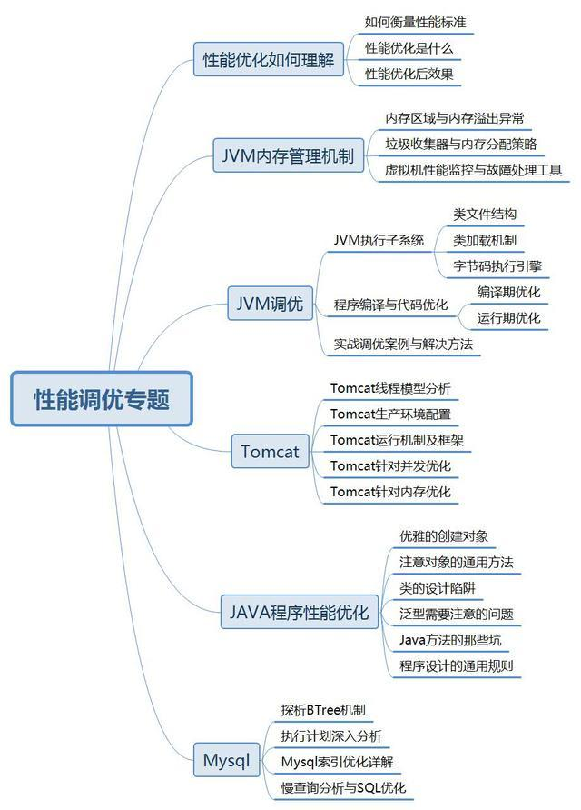
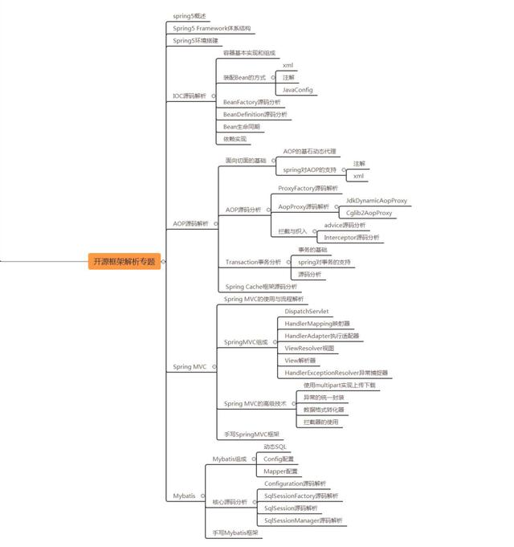

### 1. 性能调优专题

1.1.**性能优化如何理解**

1.1.1. 如何衡量性能标准

1.1.2. 性能优化是什么

1.1.3. 性能优化后效果

1.2. JVM调优

1.2.1. JVM内存管理机制

1.2.2. JVM执行子系统

1.2.3. 程序编译与代码优化

1.2.4. 实战调优案例与解决方法

1.3.**JAVA程序性能优化**

1.3.1. 优雅的创建对象

1.3.2. 注意对象的通用方法

1.3.3. 类的设计陷阱

1.3.4. 泛型需要注意的问题

1.3.5. Java方法的那些坑

1.3.6. 程序设计的通用规则

1.4. Tomcat

1.4.1. Tomcat线程模型分析

1.4.2. Tomcat生产环境配置

1.4.3. Tomcat运行机制及框架

1.4.4. Tomcat针对并发优化

1.4.5. Tomcat针对内存优化

1.5. Mysql

1.5.1. 探析BTree机制

1.5.2. 执行计划深入分析

1.5.3. Mysql索引优化详解

1.5.4. 慢查询分析与SQL优化

### 2. 常用框架源码分析

**2.1. spring概述**

2.1.1. Spring Framework体系结构

2.1.2. 环境搭建

2.2. Spring 容器

2.2.1. 容器基本实现和组成

2.2.2. 装配Bean的方式

2.2.3. BeanFactory源码分析

2.2.4. BeanDefinition源码分析

2.2.5. Bean生命同期

2.2.6. 依赖实现

2.3. Spring AOP

2.3.1. 面向切面的基础

2.3.3. Transaction事务分析

2.3.4. Spring Cache框架源码分析

2.4. Spring MVC

2.4.1. Spring MVC的使用与流程解析

2.4.2. SpringMVC组成

2.4.3. Spring MVC的高级技术

2.5. Spring 5新特性

2.5.1. 容器增强

2.5.2. 函数式编程

2.5.3. webFlux模块介绍

2.5.4. kotlin介绍

2.5.5. Testing改进

2.5.6. 兼容性问题

2.6. Mybatis

2.6.1. Mybatis组成

2.6.2. 核心源码分析

2.6.3. 手写mybatis框架

###  3. 互联网分布式架构专题

3.1. 分布式架构思维

3.1.1. 大型互联网架构演进过程

3.1.2. 架构师应具备的分布式知识

3.1.3. 主流分布式架构设计详解

3.2. 架构开发基础

3.2.1. 并发编程

3.2.2. 高性能NIO框架

3.3. 架构核心服务层技术

3.3.1. 服务的前世今生

3.3.2. 深入理解通讯协议

3.3.3. 基于分布式思想下的RPC解决方案

3.3.4. Dubbo全解析

3.4. 架构关键基础设施

3.4.1. 分布式环境指挥官Zookeeper

3.4.2. 分布式消息通讯 异步与MQ

3.4.6. 分布式文件存储fastdfs

3.5. 分布式常见场景解决方案

3.5.1. 分布式主键生成方案

3.5.2. Session跨域共享实战

3.5.3. 分布式事务解决方案实战

3.5.4. 分布式锁解决方案实战

3.5.5. 分布式单点登录实战 SSO

3.5.6. 分布式调度任务系统

3.5.7. 分布式配置中心

### 4. 微服务专题

4.1. SpringBoot

4.1.1. SpringBoot与微服务的区别与联系

4.1.2. 快速构建SpringBoot工程

4.1.3. SpringBoot核心组件start、actuator等剖析

4.1.4. 快速集成Mybatis实战

4.1.5. 快速集成Dubbo及案例实战

4.1.6. 快速集成redis及案例实战

4.1.7. 构建Swagger插件实现API管理及接口测试体系

4.2. SpringCloud

4.2.1. Zuul路由网关详解及源码探析

4.2.2. Ribbon客户端负载均衡原理与算法详解，与服务端负载均衡区别

4.2.3. Feign声明式服务调用方式实现

4.2.4. Hystrix服务熔断及服务降级实战

4.2.5. Eureka注册中心构件及源码分析

4.2.6. Config配置服务中心与svn、git快速集成

4.2.7. Sleuth调用链路跟踪

4.2.8. BUS消息总线技术

4.2.9. Stream 消息驱动的微服务

4.3. Docker虚拟化技术

4.3.1. Docker介绍、安装与使用

4.3.2. Docker组成

4.3.3. Docker Compose部署脚本

4.3.4. Docker Service 服务编排

4.3.5. Docker Redis分布式集群部署

4.3.6. Docker File构建

4.3.7. 通过Maven插件打包Docker镜像

4.3.8. Docker部署及运行应用程序

4.3.9. Kubernetes编配

4.3.10.基于Docker构建Mysql集群实战

4.3.11.高可用SpringCloud微服务与Docker集成实现动态扩容实战

### 5. 团队协作开发专题

5.1. Git

5.1.1. Git基本工作原理

5.1.2. Git常用操作及问题处理

5.2. Maven

5.2.1. Maven重要指令(clean、complie、test、package、install、deploy)

5.2.2. 私服－Nexus

5.2.3. Maven流行插件实战、手写自己的插件

5.2.4. 架构师如何理解ScopeLifecyclePhaseGoal

5.3. Jenkins

5.3.1. Jenkins服务部署

5.3.2. Jenkins持续集成

5.4. Sonar

5.4.1. 静态代码检查，代码更健壮

5.4.2. 代码走查

### 6. B2C商城项目实战

6.1. 系统设计

6.1.1. 架构设计

6.1.2. 数据库设计

6.1.3. 部署设计

6.1.4. 基础开发框架讲解

6.2. 用户管理子系统

6.2.1. 用户注册 登录（二维码技术）

6.2.2. 权限控制（shiro）

6.2.3. 单点登录（session统一缓存、sso）

6.3. 商品管理子系统

6.3.1. 商品管理（mongodb）

6.3.2. 商品分类（mongodb）

6.3.3. 商品发布（nosql与mysql数据同步）

6.3.4. 热卖商品排行（redis）

6.4. 搜索子系统

6.4.1. 基于ElasticSearch搜索引擎的全文检索

6.4.2. 检索需求分析

6.4.3. 检索策略

6.4.4. 索引设置

6.4.5. 分词算法

6.4.6. 命中率优化

6.4.7. 订单实时统计

6.5. 订单子系统

6.5.1. 分布式环境生成唯一编号（ZooKeeper）

6.5.2. 下单业务流程（消息中间件）

6.5.3. 订单可靠性

6.5.4. 秒杀功能（Redis）

6.5.5. 订单管理

6.5.6. 购物车功能（MongoDB）

6.6. 支付系统

6.6.1. 微信支付对接

6.6.2. 支付宝对接

6.6.3. 银联对接开发

6.7. 分布式调度系统

6.7.1. 数据统计

6.7.2. 数据同步

6.7.3. 任务调度配置

6.8. 后台系统

6.8.1. 日常管理

6.8.2. 在线IM系统 （WebSocket NIO）

6.8.3. 用户行为分析

6.8.4. 报表大数据查询优化

