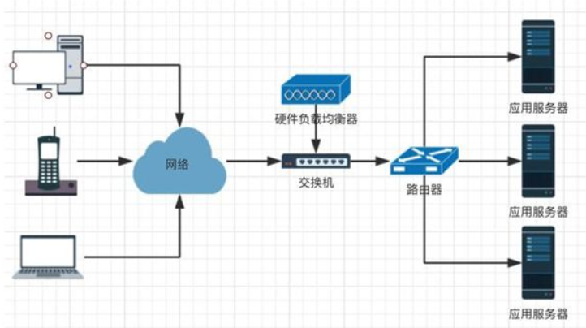
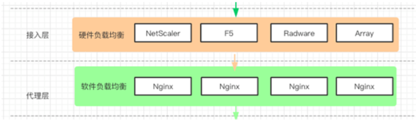
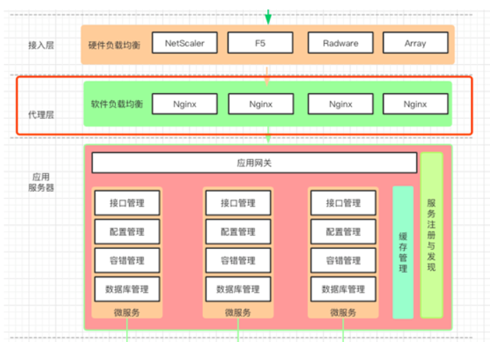
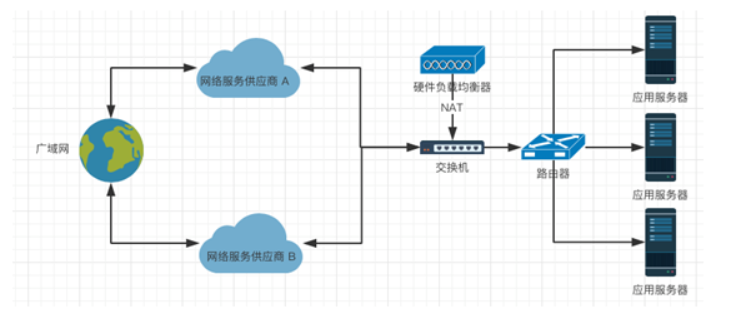
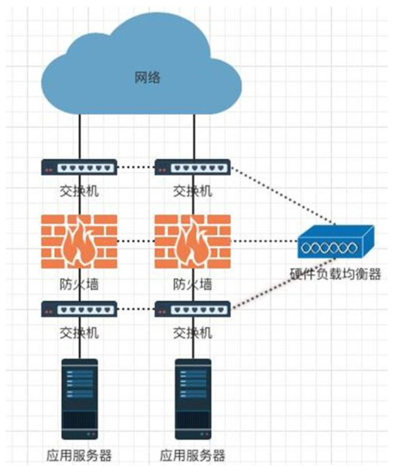
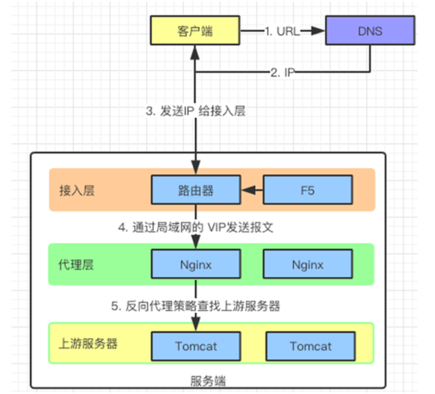
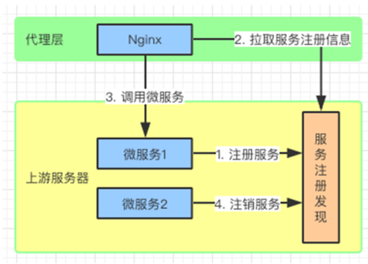
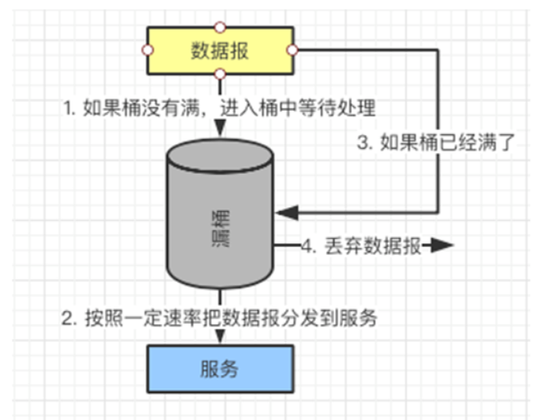
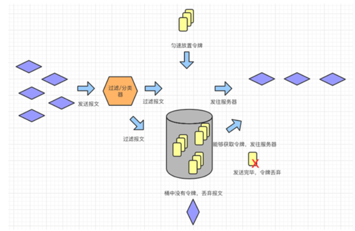
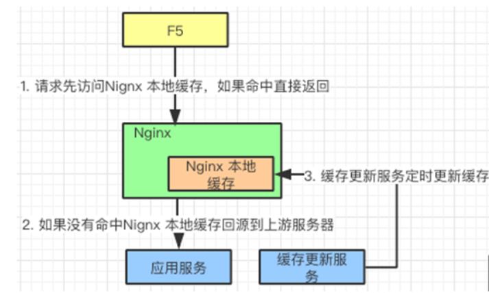

# 高可用、负载均衡不得不说的事

为了实现高可用，高性能我们采用了很多的技术手段，负载均衡就是其中之一。作为外部流量与内部应用的“接引者”，它占据了重要的地位。

我们是否了解整个负载均衡技术？它的分类？它的原理？它的特点？今天让我们一起来漫谈负载均衡吧。

负载均衡的分类

谈到负载均衡，大家都会想到 Nginx，通常我们会用它做应用服务的负载均衡。

一般它的并发量在 5W 左右，如果并发量再高就需要做 Nginx 的集群了。但 Nginx 之上还有一层负载均衡器，是它把网络请求转发给 Nginx 的，同时还会肩负网络链路，防火墙等工作。

它就是“硬件负载均衡器”，一般安装在外部网络与内网服务器之间。比较流行的有 NetScaler，F5，Radware，Array 等产品。

硬件负载均衡器在外网和内网之间

相对于“硬件负载均衡器”来说，对内网服务器进行负载均衡就属于“软件负载均衡器”。例如：LVS，HAProxy，Nginx。

**硬件负载均衡工作在“接入层”，**主要任务是多链路负载均衡，防火墙负载均衡，服务器负载均衡。

**软件负载均衡工作在“代理层”，**主要任务是反向代理，缓存，数据验证等等。

硬件负载均衡和软件负载均衡工作在不同的层

硬件负载均衡在接入层获得网络请求，然后转交给软件负载均衡，用同样的方式处理返回的请求。

接入层，代理层，应服务器示意图

我们知道了负载均衡分为“硬件负载均衡”和“软件负载均衡”，那么来逐一看看他们是如何工作的吧。

硬件负载均衡

既然前面提到了负载均衡器的分类，那么我们就来聊聊他们的特点。硬件负载均衡技术只专注网络判断，不考虑业务系统与应用使用的情况。

看上去它对处理网络请求是非常专业的，但有趣的是，如果应用服务出现了流量瓶颈，而“接入层”的硬件负载均衡没有发现异常，还是让流量继续进入到应用服务器，并没有阻止，就会造成应用服务器流量过大。

所以，为了保证高可用，可以在“接入层”和“代理层”同时考虑限流的问题。

作为硬件负载均衡器，常在大企业使用。下面我们以 F5 公司的“F5 BIG-IP”产品为蓝本给大家介绍（下面简称 F5）。

实际上它是一个集成的结局方案，对于研发的同学来说，主要理解其原理。

**硬件负载均衡器三大功能**

上面谈到硬件负载均衡器的作用和特点，它具备哪三大功能？实现原理又是怎样的？

**①多链路负载均衡**

关键业务都需要安排和配置多条 ISP（网络服务供应商）接入链路来保证网络服务的可靠性。

如果某个 ISP 停止服务或者服务异常了，那么可以利用另一个 ISP 替代服务，提高了网络的可用性。

不同的 ISP 有不同自治域，因此需要考虑两种情况：

- INBOUND
- OUTBOUND

**INBOUND，来自网络的请求信息。**F5 分别绑定两个 ISP 服务商的公网地址，解析来自两个 ISP 服务商的 DNS 解析请求。

F5 可以根据服务器状况和响应情况对 DNS 进行发送，也可以通过多条链路分别建立 DNS 连接。

**OUTBOUND，返回给请求者的应答信息。**F5 可以将流量分配到不同的网络接口，并做源地址的 NAT（网络地址转换），即通过 IP 地址转换为源请求地址。

也可以用接口地址自动映射，保证数据包返回时能够被源头正确接收。

多路负载的方式增强了网络接入层的可靠性

**②防火墙负载均衡**

针对大量网络请求的情况，单一防火墙的能力就有限了，而且防火墙本身要求数据同进同出，为了解决多防火墙负载均衡的问题，F5 提出了防火墙负载均衡的“防火墙三明治"方案。

防火墙会对用户会话的双向数据流进行监控，从而确定数据的合法性。如果采取多台防火墙进行负载均衡，有可能会造成同一个用户会话的双向数据在多台防火墙上都进行处理。

而单个防火墙上看不到完成用户会话的信息，就会认为数据非法因此抛弃数据。

所以在每个防火墙的两端要架设四层交换机，可以在作流量分发的同时，维持用户会话的完整性，使同一用户的会话由一个防火墙来处理。而这种场景就需要 F5 负载均衡器协助才能完成转发。

有趣的是，F5 协调上述方案的配置和实现后，会把“交换机”，“防火墙”，“交换机”夹在了一起好像三明治一样。

防火墙“三明治”

**③服务器负载均衡**

在硬件负载均衡器挂接多个应用服务器时，需要为这些服务做负载均衡，根据规则，让请求发送到服务器上去：

- 对于服务器的负载均衡的前提是，服务器都提供同样的服务，也就是同样的业务同时部署在多个服务器上。
- 对于应用服务器可以在 F5 上配置并且实现负载均衡，F5 可以检查服务器的健康状态，如果发现故障，将其从负载均衡组中移除。
- F5 对于外网而言有一个真实的 IP，对于内网的每个服务器都生成一个虚拟 IP，进行负载均衡和管理工作。因此,它能够为大量的基于 TCP/IP 的网络应用提供服务器负载均衡服务。
- 根据服务类型不同定义不同的服务器群组。
- 根据不同服务端口将流量导向对应的服务器。甚至可以对 VIP 用户的请求进行特殊的处理，把这类请求导入到高性能的服务器使 VIP 客户得到最好的服务响应。
- 根据用户访问内容的不同将流量导向指定服务器。

**优缺点总结**

聊完了硬件负载均衡器的特点和功能以后，让我们来总结一下它的优缺点：

- 优点：直接连接交换机，处理网络请求能力强，与系统无关，负载性能强。可以应用于大量设施，适应大访问量、使用简单。
- 缺点：成本高，配置冗余。即使网络请求分发到服务器集群，负载均衡设施却是单点配置；无法有效掌握服务器及应使用状态。

软件负载均衡

说完硬件负载均衡，再来谈谈软件负载均衡。软件负载均衡是指在一台或多台服务器的操作系统上安装一个或多个软件来实现负载均衡。

它的优点是基于特定环境，配置简单，使用灵活，成本低廉，可以满足一般的负载均衡需求。

代理层通常起到承上启下的作用，上连“接入层”，下接应用服务器（上游服务器），可以做反向代理，缓存，数据验证，限流。本文会一一为各位介绍。

目前市面上比较流行的软件负载均衡有 LVS，HAProxy，Ngnix。由于篇幅有限我们通过应用广泛的 Nginx 为切入点，给大家讲解，之后会把上面三类软件进行一个对比。

**功能描述和原理分析**

对于程序员来说，接触最多的就是软件负载均衡。不仅要知道如何使用，同时也要了解背后的原理，下面列举了其最常用到的 4 大功能。

**①反向代理与负载均衡**

第一个功能是反向代理与负载均衡，如下图：

客户端是如何把请求发送到应用服务器的

客户端把请求发送到应用服务器有如下几个步骤：

- 客户端请求 URL 给 DNS。
- DNS 将 URL 转化成对应的 IP。
- 通过 IP 找到服务器。
- 服务器接受到请求的报文，转交给接入层处理，接入层由于采用了硬件负载均衡器，所以能够扛住大数据量。
- 接入层把报文再次转交给代理层（并发 5W），代理层的 Nginx 收到报文再根据反向代理的策略发送给上游服务器（应用服务器）。

**负载均衡的算法/策略**

实际上负载均衡的算法是很多的，这里以 Nginx 为例，介绍五种算法：

- Round-Robin：轮询算法，默认算法。对上游的服务器进行挨个轮询，这个算法是可以配合 Weight（权重）来实现的。
- Weight：权重算法，给应用服务器设置 Weight 的值。Weight 默认值为 1，Weight 参数越大被访问的几率越大。可以根据服务器的配置和资源情况配置 Weight 值，让资源情况乐观的服务器承担更多的访问量。
- IP-Hash：这个算法可以根据用户 IP 进行负载均衡，同一 IP 的用户端请求报文是会被同一台上游服务器响应的。也就是让同一客户端的回话（Session）保持一致。
- Least_conn：把请求转发给连接数较少的后端服务器。轮询算法是把请求平均的转发给各个后端，使它们的负载大致相同；但是，有些请求占用的时间很长，会导致其所在的后端负载较高。这种情况下，Least_conn 这种方式就可以达到更好的负载均衡效果。
- Hash Key：这个算法是对 Hash 算法的补充，主要是考虑当出现上游服务器增加/删除的情况，请求无法正确的被同一服务器处理。 所以对每个请求都设置 Hash Key，这样就算服务器发生了变化，Key 的值没有变，也可以找到对应的服务器。

**②动态负载均衡**

一般上游服务器都采用微服务的架构，那么负载均衡会把数据报发给哪个服务呢？如果服务出现了问题如何通知负载均衡器呢？有新的服务注册怎么办呢？

动态负载均衡流程

微服务首先会注册到“服务注册发现”中心（Consul，Eureka）。注册中心包含微服务的信息，Nginx 会定期从这里拉取服务信息（Lua）。

获取微服务信息以后，Nginx 收到数据报的时候，就可以从注册中心获取的服务地址，把信息传递给服务了。

**③限流**

限流的工作可以在接入层用硬件负载均衡器来完成，也可以在代理层来完成。

限流实际上就是限制流入请求的数量，其算法不少，有令牌桶算法，漏桶算法，连接数限制等等。这里我们就介绍三个常用的。一般通过 Nignx+Lua 来实现。

**连接数限流：**通过 ngx_http_limit_conn_module 模块实现。设置最大的连接数以及共享内存的区域大小，请求的时候判断是否超过了最大连接数。

如果超过最大连接数就被限流，否则针对连接数就 +1，请求结束以后会将连接数 -1。

**漏桶算法：**通过 ngx_http_limit_req_module 模块实现。一个固定容量的桶，数据报按照固定的速度流出。

数据报可以按照任意的速度流入桶中，如果数据报的容量超过了桶的容量，再流入的数据报将会被丢弃。

按照这个规则，需要设置限流的区域以及桶的容量，以及是否延迟。

漏桶策略

**令牌桶算法，**桶的大小是固定的，以固定的速度往桶里丢令牌。桶满了后，后面添加的令牌无法添加。

数据报到来时从桶中取令牌，如果桶中有令牌，凭借令牌处理请求，处理完毕令牌销毁；数据报到来时发现桶中没令牌，该请求将被拒绝。

请求在发往令牌桶之前需要经过过滤/分类器，可以对报文进行分类，例如：某类报文可以直接发往应用服务器，某类报文需要经过令牌桶获取令牌以后才能发。

又例如：VIP 就可以直接把请求发往服务器，用不着经过令牌桶。

令牌桶示意图

**④缓存**

Nginx 本地缓存机制

接入层发送请求，如果能够在 Nginx 本地缓存命中，直接返回缓存数据，如果没有命中回源到应用服务器。

缓存更新服务器定时更新 Nginx 本地缓存信息。这些需要考虑数据的一致性，何时更新以及何时失效等情况。

Nginx 缓存可以大大提高请求响应时间，可以把不经常更改的信息，例如：用户信息，提前放入缓存中，每次请求就不用再去请求应用服务器了。一旦用户信息更新，可以按照一定时钟频率写入缓存中。

另外，一般 HTTPHEAD 中都带有一些信息更新的信息。Nginx 也可以通过 expires，etag，if-modified-since 来实现浏览器缓存的控制。

其他的几个功能如下：

- 客户端超时重试
- DNS 超时重试
- 代理超时重试
- 失败重试
- 心跳检测
- 配置上有服务器

流行的软件负载均衡器

目前比较流行的有 LVS，Nginx 和 HAProxy，逐个看看他们的特点。

**LVS**

LVS（Linux Virtual Server） 是使用 Linux 内核集群实现的一个高性能、高可用的负载均衡服务器，它具有很好的可伸缩性（Scalability)、可靠性（Reliability)和可管理性（Manageability)。

LVS 特点是：

- 仅作分发之用，即把请求直接分发给应用服务器，因此没有流量的产生，对资源的消耗低。
- 配置简单，能够配置的项目少。
- 工作在第四层（传输层），支持 TCP/UDP，对应用的支持广泛。

**HAProxy**

HAProxy 实现了一种事件驱动, 单一进程模型，此模型支持非常大的并发连接数。

多进程或多线程模型受内存限制 、系统调度器限制以及无处不在的锁限制，很少能处理数千并发连接。

HAProxy 特点是：

- 支持虚拟主机。
- 支持 Session 保持，Cookie 引导。
- 通过指定的 URL 来检测应用服务器的状态。
- 支持 TCP/HTTP 协议转发。

**Nginx**

Nginx 是一款轻量级的 Web 服务器/反向代理服务器及电子邮件（IMAP/POP3）代理服务器，并在一个 BSD-like 协议下发行。

Nginx 特点是：

- 工作在网络的 4/7 层，对 HTTP 应用做负载均衡策略，如：域名、目录结构。
- 对网络的稳定性依赖小，可以区分内网和外网的访问。
- 安装和配置相对简单。
- 能承受很高负载且稳定，处理的流量依赖于按照 Nginx 服务器的配置。
- 可以检测服务器的问题，可以对服务器返回的信息进行处理和过滤，避免让无法工作的服务器响应请求。
- 对请求可以进行异步处理。
- 支持 HTTP、HTTPS 和 EMAIL。

网络负载均衡的技术选型

既然上面对软/硬件负载均衡有了总体的了解，那么按照“技术服务业务”的原则，在业务发展的不同阶段，如何使用这两类负载均衡技术呢？

**发展阶段**

企业业务从 0 到 1，从无到有，数据量和访问量都不大。Nginx 或 HAProxy 进行单点的负载均衡就已经足够了。

这阶段刚刚采用多台应用服务器、数据库，需要一定的负载均衡做支撑。由于业务量不大，所以没有专业的维护团队来维护，也没有大规模的网站部署的需求。

因此 Nginx 或 HAproxy 是第一选择，因为其上手快， 配置容易，在七层之上利用 HTTP 协议就能满足要求了。

**扩张阶段**

随着业务量增大，用户访问和交易量也在逐步增加，这时单点的 Nginx 或 HAProxy 已经无法满足之前的需求了。

使用 LVS 或者硬件负载均衡（F5/Array）就是架构师需要考虑的问题了，Nginx 此时就作为 LVS 或者硬件负载均衡（F5/Array）的节点来处理。

软件负载均衡+硬件负载均衡的架构配置在这个阶段就需要考虑了，也是对架构设计者的挑战。

**成熟阶段**

随着公司业务扩张到达顶峰，之前的网络服务已经升级成主流服务产品，需要考虑在开源产品上进行业务定制，所以开源的 LVS，已经成为首选。其在深度定制之后依旧会和硬件负载均衡器配合完成业务服务。

总结

今天内容比较多，总结下来，三句话：

- 硬件和软件负载均衡，分别工作在“接入层”和“代理层”。
- 一个专注于网络，负责多链路，防火墙以及服务器的负载均衡，例如：F5 BIG-IP。
- 另一个偏向于业务，主要功能是反向代理，动态代理，缓存，限流，例如：LVS，Nginx，HAProxy。

> 资料参考
>
> [http://www.sohu.com/a/335928516_463994](http://www.sohu.com/a/335928516_463994)