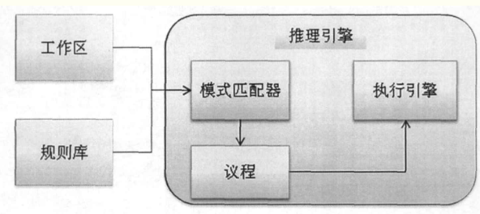
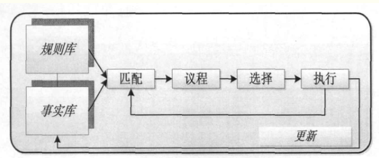

# 一.规则引擎基础

## 1.1 概念

> 规则引擎由推理引擎(Inference Engine)发展而来，是一种嵌入在应用程序中的组件，实现了将业务决策从应用程序代码中分离出来，并使用预定义的语义模块编写业务决策。接受数据输入，解释业务规则，并根据业务规则做出业务决策。

在规则引擎中，将知识定义为规则，要分析的情况定义为事实，在内存中的存储分别称为Production Memory和Working Memory。

## 1.2 背景

企业级管理者对企业IT系统的开发有着如下的要求：

- 1.为提高效率，管理流程必须自动化，即使现代商业规则异常复杂。

- 2.市场要求业务规则经常变化，IT系统必须依据业务规则的变化快速、低成本的更新。

- 3.为了快速、低成本的更新，业务人员应能直接管理IT系统中的规则，不需要程序开发人员参与。

于是出现了一些基于规则的专家系统。

## 1.3 基于规则的专家系统

>专家系统是人工智能的主要研究领域之一，是基于行业规则进行业务处理的计算机程序。这些规则来源于行业知识，用于描述特定条件下所要执行的动作，并且定义了相关动作对于数据的影响。因此，专家系统可以利用其推理能力得出结论或者执行相关分析任务。在专家系统中，解决问题所需的知识，作为一个规则集合存储在知识库中，形成知识库系统。

### 1.3.1 术语

- 事实： 表示已知的数据或者信息

- 规则： 规则由条件、动作组成；通常表示为：

  ​	if	条件

  ​	then	动作

基于规则的专家系统主要包括以下三个部分：

1. ==规则库(Rule Base)==： 一个用规则来表达的知识集，包括执行推理所需要的知识。**通常用一些规则文件保存，实现与程序的分离**
2. ==工作区(Working Memory)==： 一个事实的集合，包含执行推理所需要的数据。
3. ==推理引擎(Inference Engine)==： 完成推理的过程，找出当前周期中哪条规则需要激活。

结构图如下：

## 1.4 规则引擎

规则引擎主要包含三个部分：

​    模式匹配器(Pattern Matcher)、议程(Agenda)和执行引擎(Execution Engine)。

以下是规则引擎的执行流程简图

简单理解：==规则引擎就是将一些条件判断放到了一个规则文件中，从而在程序中分离出来，便于维护以及扩展，甚至业务人员也能直接参与管理系统中的规则。==规则引擎则是解决平台的高可配置性。

## 1.5 规则引擎开发的标准化

2003年11月定稿并于2004年8月最终发布的JSR 94（Java规则引擎API）使得Java规则引擎的实现得以标准化。

JSR 94中没有涉及用来创建规则和动作的语言.规则语言是规则引擎应用程序的重要组成部分,所有的业务规则都必须用某种语言定义并且存储于规则执行集中,从而规则引擎可以装载和处理他们。规则语言的详情这里不作详细介绍。

- 规则的执行

  - 在规则定义阶段，根据响应的业务情况定义相应的规则，可以使用规则语言来描述。多个规则组成一个集合。
  - 当引擎执行时，会根据规则队列中的优先顺序执行，执行过程中又可能改变工作区的数据对象，则会使得原本需要执行的规则取消、或者激活原来并不满足条件的规则。就产生了一种“动态的”规则执行链，形成推理机制。

- 规则匹配算法

  - 规则条件匹配的小绿决定了引擎性能。目前主要的商用引擎规则产品基本上都采用卡内基梅隆大学发明的 Rete 算法。

- **规则引擎产品**

  主要介绍一些开源产品

  - ==**Drools**== ：最常用的；应用Rete算法的改进形式Rete-II算法，脱胎于rete算法，但是增加了可与面向对象语言无缝连接的节点类型。

    Drools 是用 Java 语言编写的开放源码规则引擎，基于Apache协议，于2005年被JBoss收购，目前版本是5.0.1，Drools从5.0后分为四个模块：

    - Drools Guvnor (BRMS/BPMS)
    - Drools Expert (rule engine),
    - Drools Flow (process/workflow)
    - Drools Fusion (cep/temporal reasoning)

    其中Expert 是传统的规则引擎，Guvnor是一个完整的业务规则管理系统。Drools的主要功能及特点有：

    - 使用 RETE算法对所编写的规则求值；
    - 具有Web2.0 Ajax特性的用户友好的Web界面；
    - 通过向导编辑器与文本编辑器，规则的作者更容易修改规则；
    - 支持规则调试；
    - 支持规则流；
    - 自带一种非XML格式的规则语言DRL，并且通过DSL（域规则语言）支持自然语言的扩展；
    - 支持xls或csv文件格式的决策表；
    - 可版本化，你可以很容易的使用之前保存的版本替换现在的一套规则；
    - 与JCR兼容的规则仓库；
    - 提供了一个Java规则引擎API（JSR94）的实现；

  - `easy-rules` ：简单易用傻瓜式的；https://github.com/j-easy/easy-rules

- Java规则引擎的规范是JSR94
  - Java规则引擎API由javax.rules包定义，是访问规则引擎的标准企业级API。Java规则引擎API允许客户程序使用统一的方式和不同厂商的规则引擎产品交互，就像使用JDBC编写独立于厂商访问不同的数据库产品一样。

## 1.6 畅想场景

系统上线后，业务人员需要新增一种规则；

登录系统界面，拖拽一个界面，编辑规则（可能是拖拽选项、填写简单的内容等等），确定；

即时生效或者延时生效。

这就是一个相对而言比较理想的规则引擎系统，业务人员脱离开发人员，可以管理业务规则。

# 二 Drools 实战

# 三 easy-rules实战

Easy-Rules 提供了一个抽象 `Rule` abstraction to create rules with conditions and actions, and the `RulesEngine` API that runs through a set of rules to evaluate conditions and execute actions

> 参考资料
>
> 1:  https://www.cnblogs.com/hanmeina/p/5948478.html
>
> 