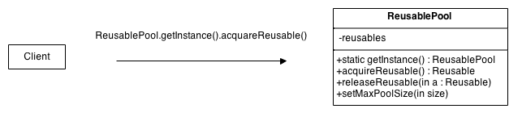
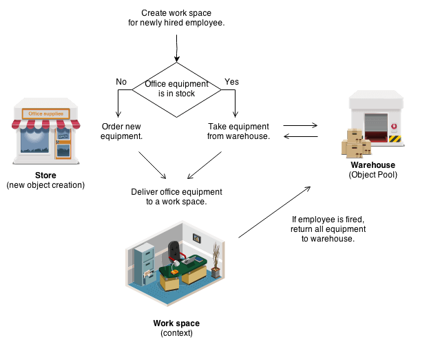

## 对象池设计模式

### 对象池设计模式的目标

对象池可以显著提高性能，在那些初始化一个类实例的代价比较高、但是使用频率比较低的场景时，对象池模式是非常高效的。

### 问题

对象池(资源池)常用于管理对象缓存。一个客户端通过对象池访问已经存在的实例从而避免创建新的对象。
一般而言，对象池会持续生成对象，例如，如果对象池空了，则会创建新的对象。或者有一个对象池，限制了对象创建的数量。
如果想要保持对象的可重用性，最好将当前未使用的所有可重用对象保存在同一个对象池中。

### 讨论

对象池允许其它地方从其中“检出”对象，当这些对象不再需要的时候，它们则会回收到对象池中以便重用。

不管怎样，我们不希望一个线程必须等待获得一个对象，所以对象池也会生成新的对象如果需要的话，但是必须实现定期清理不再使用的对象。

### 结构

连接池模式的一般思想是如果一个类的实例是可以重用的，你应该避免创建类的实例而是尽量重用它们。



- **Reusable**   这个角色中的类实例与其他对象协作的时间是有限的，之后它们不再需要工作。

- **Client**    这个角色中的类实例使用可重用的对象。

- **ReusablePool**  这个角色中的类实例管理供Client使用的可重用对象。

通常，为了能够保持所有的 ```Reusable``` 对象在不使用的时候，可以保存在同一个对象池中，这样它们可以被统一管理起来。
为了达到这个目标， ```Reusable``` 池类将被设计为一个单例类。其构造器是private修饰的，以强制客户端调用它的 getInstance 方法去获取一个对象实例。

一个 Client 对象需要一个 Reusable 对象的时候，可以调用一个 ReusablePool 对象的 acquireReusable 方法。
一个 ReusablePool 对象会维护一个 Reusable 对象的集合。
如果当 acquireReusable 方法被调用时，且存在 Reusable 对象在池中，则会从池中移除一个 Reusable 对象并且返回。如果 acquireReusable 方法不能创建新的 Reusable 对象，将会等待直到有一个 Reusable 对象返回到集合中。

当客户端完成使用对象后，客户端对象通过传递一个 Reusable 对象到 ReusablePool 对象的 releaseReusable 方法来释放该对象。
releaseReusable 方法会返回一个 Reusable 对象到对象池中。

在很多存在对象池的应用中，可能存在这些原因限制 Reusable 对象的数量。在这种情况下，当数量不够的时候，ReusablePool 对象可以创建新的 Reusable 对象，所以应该为其添加一个限制最大数量的方法例如 setMaxPoolSize。

### 示例



对象池模式类似于办公室仓库。当招聘了一个新的员工，办公室经理必须为他准备一个工位。她想知道办公室是否有多余的办公设备，如果有的话，她就先使用，如果没有，则先占据一个购买新设备的名额。
如果一个员工被解聘了，他的办公设备就会被转移到仓库中，当有新的需要时又会拿来使用。

### 核验单

- 1.创建一个 ObjectPool 类，内部包含一个 private 的对象数组成员。
- 2.在 ObjectPool 类中创建 acquire 和 release 方法。
- 3.确保 ObjectPool 是单例的。

### 经验法则

- 工厂方法模式经常用于封装对象的创建逻辑。然而，在它们创建后并没有很好的管理起来，对象池模式则可以保持对象的跟踪。
- 对象池一版使用单例实现。

### 连接池模式示例代码

#### ObjectPool.java

```java

package org.byron4j.cookbook.designpattern.objectpool;

import java.util.Enumeration;
import java.util.Hashtable;

/**
 * 对象池
 */
public abstract  class ObjectPool<T> {

    /**过期时间*/
    private int expirationTime;

    /**unlocked 是可用对象列表*/
    private Hashtable<T, Long> locked, unlocked;

    /**初始化默认超时时间、初始化可用对象列表、已锁定列表*/
    public ObjectPool(){
        expirationTime = 30000;// 30 seconds
        locked = new Hashtable<>();
        unlocked = new Hashtable<>();
    }

    /**创建一个对象*/
    protected abstract T create();

    /**校验对象是否还是有效的*/
    public abstract  boolean validate(T o);

    /**超时移除对象*/
    public abstract void expire(T o);

    /**
     * 从对象池中获取一个可用对象
     *
     * */
    public synchronized  T checkout(){
        // 新的起始时间，当前有使用且有效，则延长其有效时间
        long now = System.currentTimeMillis();
        T t;

        if( unlocked.size() > 0 ){
            Enumeration<T> e = unlocked.keys();
            while( e.hasMoreElements() ){
                t = e.nextElement();
                if( (now - unlocked.get(t)) > expirationTime ){
                    // 存在时间过长了，移除对象
                    unlocked.remove(t);
                    // 且关闭连接
                    expire(t);
                    t = null;
                }else{
                    if( validate(t) ){
                        // 可用，则将其从可用列表中移除
                        unlocked.remove(t);
                        // 并且放入锁定列表中，表示该对象已经被占用了
                        locked.put(t, now);
                        // 返回该可用对象
                        return (t);
                    }else{
                        // 校验不通过，则从可用列表中移除
                        unlocked.remove(t);
                        // 且关闭连接
                        expire(t);
                        t = null;
                    }
                }
            }
        }

        // 没有找到可用的对象，则创建新的对象
        t = create();
        // 将新对象放入锁定列表中
        locked.put(t, now);
        // 返回新对象
        return (t);
    }


    /**
     * 归还对象
     * @param t
     */
    public synchronized void checkin(T t){
        // 将对象从锁定列表中移除
        locked.remove(t);
        // 将对象加入到可用列表中，时间从当前开始
        unlocked.put(t, System.currentTimeMillis());
    }


}

```

#### JDBCConnectionPool.java

```java

package org.byron4j.cookbook.designpattern.objectpool;

import java.sql.Connection;
import java.sql.DriverManager;

public class JDBCConnectionPool extends ObjectPool<Connection> {

    private String dsn, username, pwd;

    public JDBCConnectionPool(String driver, String dsn, String username, String pwd) {
        super();
        System.out.println("获取JDBC连接池.");
        try{
            Class.forName(driver).newInstance();
        }catch (Exception e){
            e.printStackTrace();;
        }

        this.dsn = dsn;
        this.username = username;
        this.pwd = pwd;
    }

    @Override
    protected Connection create() {
        System.out.println("创建新的连接.");
        try{
            return DriverManager.getConnection(dsn, username, pwd);
        }catch (Exception e){
            e.printStackTrace();
            return null;
        }
    }

    @Override
    public boolean validate(Connection o) {
        System.out.println("检查连接是否有效.");
        try{
            return !o.isClosed();
        }catch (Exception e){
            e.printStackTrace();
            return false;
        }
    }

    @Override
    public void expire(Connection o) {
        System.out.println("关闭连接.");
        try{
            o.close();
        }catch (Exception e){
            e.printStackTrace();
        }
    }
}


```

#### ObjectPoolTest.java

```java

package org.byron4j.cookbook.designpattern;

import org.byron4j.cookbook.designpattern.objectpool.JDBCConnectionPool;
import org.junit.Test;

import java.sql.Connection;

public class ObjectPoolTest {

    @Test
    public void test(){

        // 创建JDBC连接池
        JDBCConnectionPool pool = new JDBCConnectionPool(
                "com.mysql.jdbc.Driver", "jdbc:mysql://localhost/mypydb",
                "root", "11111111");

        // 从连接池中获取一个连接
        Connection con = pool.checkout();


        // 连接回收
        pool.checkin(con);
    }
}


```

#### JDBC连接池实现总结

- 对象池建立并维护 ```可用对象列表```、```锁定对象列表```(此例实现使用 Hashtable); 可用对象列表中地对象都可以使用，锁定列表中地对象表示已经有线程在使用了当前不可用。
- 当可用列表中没有对象时，可以选择新建对象以应对客户端的请求，并将新对象放入锁定列表中。
- 可用列表中存在可用对象，则判断其是否可用，可用则当如锁定列表中，并返回该对象。
- 使用完对象后，注意将该对象回收到池中，从锁定列表中移除，放入可用列表中且更新有效时间。


##  对象池源码解读


### org.apache.commons.pool2.ObjectPool


该类使用示例:

```java

Object obj = null;

 try {
     // 从对象池中获取一个可用对象
     obj = pool.borrowObject();
     try {
         //...use the object...业务逻辑实现
     } catch(Exception e) {
         // invalidate the object 检验对象状态
         pool.invalidateObject(obj);
         // do not return the object to the pool twice
         obj = null;
     } finally {
         // make sure the object is returned to the pool
         if(null != obj) {
             // 对象不为null，则使用完后会受到对象池中
             pool.returnObject(obj);
        }
     }
 } catch(Exception e) {
       // failed to borrow an object
 }

```


org.apache.commons.pool2.ObjectPool 源码如下：

```java


```