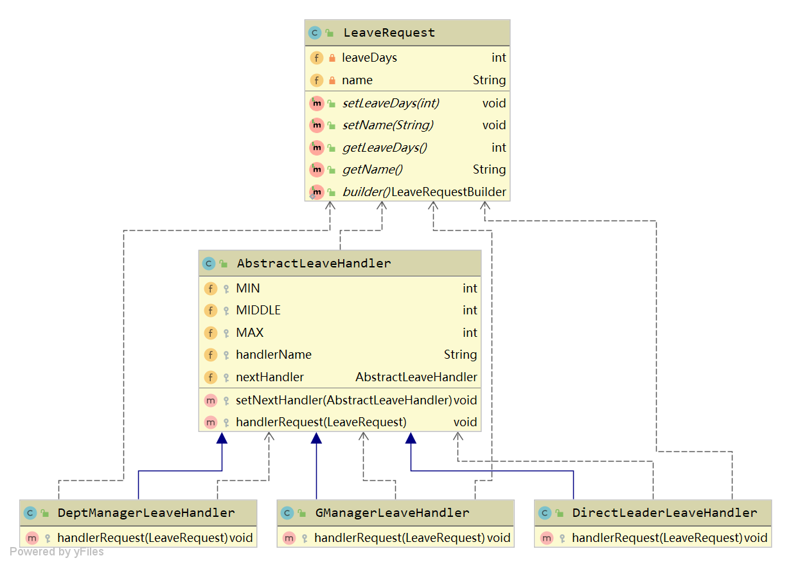

# 责任链模式

## 概念描述

责任链，顾名思义，就是用来处理相关事务责任的一条执行链，执行链上有多个节点，每个节点都有机会（条件匹配）处理请求事务，如果某个节点处理完了就可以根据实际业务需求传递给下一个节点继续处理或者返回处理完毕。


## 适用场景

现实中，请假的OA申请，请假天数如果是半天到1天，可能直接主管批准即可；
如果是1到3天的假期，需要部门经理批准；
如果是3天到30天，则需要总经理审批；
大于30天，正常不会批准。


## 类图设计

为了实现上述场景，我们可以采用责任链设计模式。

- 员工提交请求类：LeaveRequest。
- 抽象的请假责任处理类：AbstractLeaveHandler。
- 直接主管审批处理类：DirectLeaderLeaveHandler。
- 部门经理处理类：DeptManagerLeaveHandler。
- 总经理处理类： GManagerLeaveHandler。

员工请求发起申请到抽象的责任处理类中，根据员工的请假天数，对应的处理类完成处理。
每一个责任处理类设置下面的节点。自身处理不了则传递给下一个节点处理。



## 编程实现

### LeaveRequest.java:

```java
@Setter
@Getter
@NoArgsConstructor
@AllArgsConstructor
@Builder
public class LeaveRequest {
    /**天数*/
    private int leaveDays;

    /**姓名*/
    private String name;
}

```


### AbstractLeaveHandler.jav；

```java
/**
 * @program: cookbook
 * @description: 请假责任链抽象处理类
 * @author: Byron
 * @create: 2019/07/11 09:34
 */
public class AbstractLeaveHandler {
    /**直接主管审批处理的请假天数*/
    protected int MIN = 1;
    /**部门经理处理的请假天数*/
    protected int MIDDLE = 3;
    /**总经理处理的请假天数*/
    protected int MAX = 30;

    /**领导名称*/
    protected String handlerName;

    /**下一个处理节点（即更高级别的领导）*/
    protected AbstractLeaveHandler nextHandler;

    /**设置下一节点*/
    protected void setNextHandler(AbstractLeaveHandler handler){
        this.nextHandler = handler;
    }

    /**处理请假的请求，子类实现*/
    protected void handlerRequest(LeaveRequest request){

    }


}
```


### DirectLeaderLeaveHandler.jav：

```java
/**
 * @program: cookbook
 * @description: 直接主管处理类
 * @author: Byron
 * @create: 2019/07/11 09:46
 */
public class DirectLeaderLeaveHandler extends AbstractLeaveHandler{
    public DirectLeaderLeaveHandler(String name) {
        this.handlerName = name;
    }

    @Override
    protected void handlerRequest(LeaveRequest request) {
        if(request.getLeaveDays() <= this.MIN){
            System.out.println("直接主管:" + handlerName + ",已经处理;流程结束。");
            return;
        }

        if(null != this.nextHandler){
            this.nextHandler.handlerRequest(request);
        }else{
            System.out.println("审批拒绝！");
        }

    }
}
```


### DeptManagerLeaveHandler.java：
```java
/**
 * @program: cookbook
 * @description: 部门经理处理类
 * @author: Byron
 * @create: 2019/07/11 09:48
 */
public class DeptManagerLeaveHandler extends AbstractLeaveHandler {

    public DeptManagerLeaveHandler(String name) {
        this.handlerName = name;
    }

    @Override
    protected void handlerRequest(LeaveRequest request) {
        if(request.getLeaveDays() >this.MIN && request.getLeaveDays() <= this.MIDDLE){
            System.out.println("部门经理:" + handlerName + ",已经处理;流程结束。");
            return;
        }

        if(null != this.nextHandler){
            this.nextHandler.handlerRequest(request);
        }else{
            System.out.println("审批拒绝！");
        }
    }
}

```

### GManagerLeaveHandler.java：

```java
/**
 * @program: cookbook
 * @description: 总经理处理类
 * @author: Byron
 * @create: 2019/07/11 09:49
 */
public class GManagerLeaveHandler extends AbstractLeaveHandler {
    public GManagerLeaveHandler(String name) {
        this.handlerName = name;
    }

    @Override
    protected void handlerRequest(LeaveRequest request) {
        if(request.getLeaveDays() > this.MIDDLE && request.getLeaveDays() <= this.MAX){
            System.out.println("总经理:" + handlerName + ",已经处理;流程结束。");
            return;
        }

        if(null != this.nextHandler){
            this.nextHandler.handlerRequest(request);
        }else{
            System.out.println("审批拒绝！");
        }
    }
}
```


## 演示

### ResponsibilityTest.java：

```java
public class ResponsibilityTest {
    public static void main(String[] args) {
        LeaveRequest request = LeaveRequest.builder().leaveDays(20).name("小明").build();


        AbstractLeaveHandler directLeaderLeaveHandler = new DirectLeaderLeaveHandler("县令");
        DeptManagerLeaveHandler deptManagerLeaveHandler = new DeptManagerLeaveHandler("知府");
        GManagerLeaveHandler gManagerLeaveHandler = new GManagerLeaveHandler("京兆尹");

        directLeaderLeaveHandler.setNextHandler(deptManagerLeaveHandler);
        deptManagerLeaveHandler.setNextHandler(gManagerLeaveHandler);

        directLeaderLeaveHandler.handlerRequest(request);


    }
}
```

- 20天，运行输出： 总经理:京兆尹,已经处理;流程结束。
- 1天，运行输出： 直接主管:县令,已经处理;流程结束。
- 3天，运行输出： 部门经理:知府,已经处理;流程结束。
- 35天，运行输出： 审批拒绝！

## 总结

- 责任链主要重在责任分离处理，让各个节点各司其职。
- 责任链上的各个节点都有机会处理事务，但是也可能不会受理请求。
- 责任链比较长，调试时可能会比较麻烦。
- 责任链一般用于处理流程节点之类的实际业务场景中。
- Spring拦截器链、servlet过滤器链等都采用了责任链设计模式。