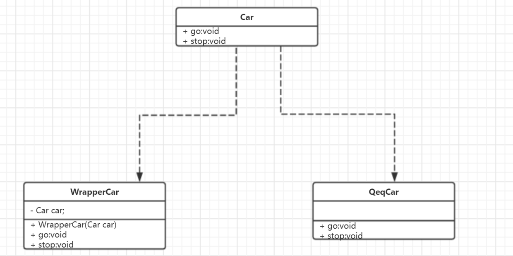
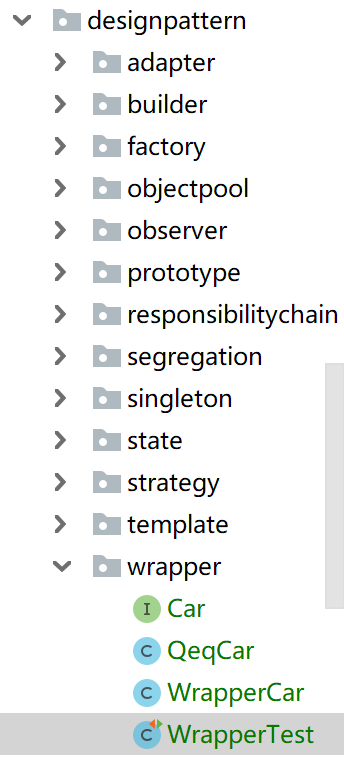
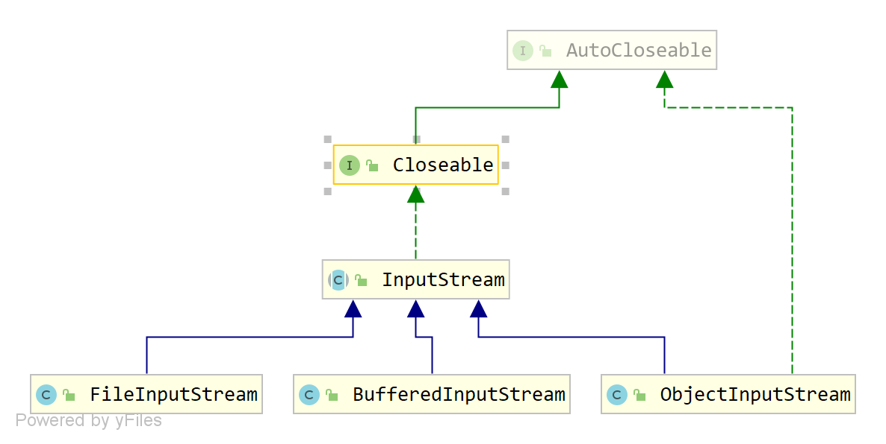

# 装饰器设计模式的概念
在实际生产中，某个类的行为（它所提供的方法）已经没法满足当前的需要了，但是又需要使用原有的部分功能，因此需要对原有对象进行增强——装饰器设计模式（Decorator Pattern）也叫包装器模式就是为解决此问题而诞生的，它是对原有类的一个包装，属于结构性设计模式。

装饰器模式在不改变现有类方法签名的前提下，对当前的类进行了增强。

>Tips
>
>我们使用继承也可以实现，但是会导致类型结构的膨胀，难以维护。

# 装饰器设计模式的生活场景

我们来看一个现实中的例子，老李头家大儿子去年谈了个朋友，女方要求有车才能领证，所以老李家买了一辆奇瑞eQ1，但是女方嫌车速太慢喜欢开快车的感觉...现在老李家正苦恼中...直到有一天在市里工作的大表哥回来听说该情况后，大表哥说这个好整啊，搞到车行去改装一下，把速度提上去就可以了啊。

于是乎，老李家去车行把车进行了改装，车速上去了，媳妇也领到了，皆大欢喜...

这其实就是一个装饰器的使用案例，原来的eQ1车已经没法满足了，所以进行了速度增强，其他功能并没有改变。


# 装饰器设计模式的特征

- 被增强类、增强类实现同一个接口
- 增强类持有被增强类的引用
- 被增强的方法调用增强类的方法，其他方法保持原有的继续使用被增强类的旧方法


# 装饰器模式的设计

- 编写一个接口Car
- 被增强类 QeqCar 实现 Car接口
- 增强类 Wrapper 实现 Car接口
- 增强类 Wrapper持有被增强类 QeqCar 的引用






#装饰器设计模式的实现

- Car.java

```java
public interface Car {
    void run();

    void stop();
}

```

- QeqCar.java
```java
public class QeqCar implements Car {
    @Override
    public void run() {
        System.out.println("Qeq go...");
    }

    @Override
    public void stop() {
        System.out.println("Qeq stop!");
    }
}
```
- WrapperCar.java
```java
public class WrapperCar implements Car {

    private Car car;

    public WrapperCar(Car car) {
        this.car = car;
    }

    @Override
    public void run() {
        System.out.println("wapper run...");
    }

    @Override
    public void stop() {
        car.stop();
    }
}
```

- WrapperTest .java
```java
public class WrapperTest {

    @Test
    public void 装饰器模式测试(){
        Car car = new WrapperCar(new QeqCar());
        car.run();
        car.stop();
    }

}
```

测试输出：
>wapper run...
Qeq stop!


# IT人员使用装饰器模式的编码场景


## IO框架



在InputStream类的子类中各自引用了其他的子类的引用，如：
```java
BufferedInputStream bis = new BufferedInputStream(InputStream in);
```
在创建一个BufferedInputStream的时候，就可以传入一个FileInputStream来作为构造参数，这就是装饰器模式的使用。

## 自定义数据连接池

自定义数据库连接池的时候我们可能会编写一个 MyConnection 类实现 ```java.sql.Connection```类。
以此来增强原有的mysql驱动的Connection的实现的close方法，原来是将数据库连接直接关闭，现在可以利用自定义的MyConnection的close方法仅仅将数据库连接扔回数据库连接池，而不再是关闭连接，节省了网络IO连接。


自定义的连接类：
```java
public class MyConnection implements Connection {

    // 被增强的引用 （QQ）
    private Connection connection;
    private LinkedList<Connection> pool;

    public MyConnection(Connection connection, LinkedList<Connection> pool) {
        this.connection = connection;
        this.pool = pool;
    }

    @Override
    public void close() throws SQLException {
        // 如何改写我们的原有逻辑
        // connection.close();
        pool.addLast(connection);
    }
    //...
}
```

数据库连接池：
```java
public class MyDataSourceFinal implements DataSource {
    // 数据库连接池
    private static LinkedList<Connection> pool = new LinkedList<>();

    static {
        // 创建一些连接对象---池化
        //int initSize = Integer.valueOf(properties.getProperty("initSize"));
        for (int i = 1; i <=  5; i++){

            pool.add(JdbcUtil.getConnection());
        }
    }

    /**
    * 对外暴露的是MyConnection
    * @return 
    * @throws SQLException
    */
    @Override
    public MyConnection getConnection() throws SQLException {
        Connection connection = pool.removeFirst();
        return new MyConnection(connection, pool);
    }


    public static void returnConnection(Connection connection){
        pool.addLast(connection);
    }


    public static int sie(){
        return pool.size();
    }
    // ...
}
```

单元测试：
```java
public class MyDataSourceFinalTest {
    @Test
    public void test() throws SQLException {


        // 获取链接
        DataSource dataSource = new MyDataSourceFinal();
        Connection connection = dataSource.getConnection();


        String sql = "select * from user where id = ?";

        PreparedStatement preparedStatement = connection.prepareStatement(sql);

        preparedStatement.setInt(1, 1);


        ResultSet resultSet = preparedStatement.executeQuery();

        while(resultSet.next()){
            System.out.println(resultSet.getString("nickname"));
        }

        // 关闭资源
        JdbcUtil.closeAll(resultSet, preparedStatement, null);

        // 使用的是MyConnection的close方法，其实是将连接属性丢回到了数据库连接池
        connection.close();
    }
}

```

>更多关于设计模式的资料请参考：[JAVA高级架构师技术栈](https://github.com/Byron4j/CookBook)
