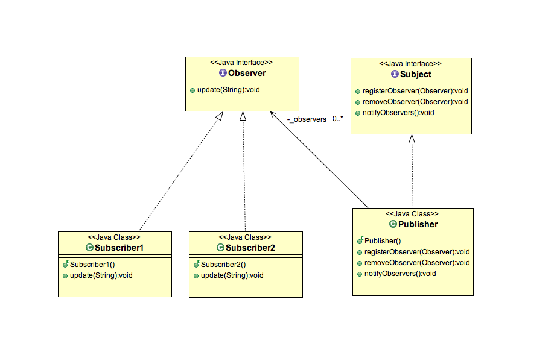

## 观察者模式

### 什么是观察者模式

- 观察者模式属于行为模式的一种，定义了对象的通用交流方式。
- 观察者模式定义了一对多的关系，一个对象改变了状态，则其它所有依赖它的对象都会收到通知。
- 观察者模式有时候在网络模型中也叫做发布-订阅模式。
- 原来的对象叫做观察者，观察者们注册的对象叫做主体。当主体状态变更的时候，所有的观察者都会收到通知。


### 观察者模式的特点

- 观察者们注册到主体对象中去。
- 主体维护一个观察者的列表，并且在其状态发生变更的时候会广播通知所有的观察者。
- 当明确不需要被通知的时候，观察者可以注销。

### 观察者模式的使用场景

- 这种模式广泛运用于用户接口框架中。
- 在很多MVC框架模型中经常使用。
- 考虑一个excel文档中的表格的应用场景。一个表格中的图标是根据其数据构建出来的，如果数据有任何变更，表格都会自动重绘。

### 观察者模式类图




### 观察者模式示例

在这个示例中，描述了新闻发布者。在典型的流程中，新闻阅读者订阅新闻。
一单一个新的新闻被出版商发布了，所有的观察者都会收到通知。
在这里出版商的角色就是一个主体，订阅者就是观察者。
一个出版商可以有一个或者多个订阅者。

上面的类图中表现了2个观察者 ```Subscriber1``` 和 ```Subscriber2``` 均注册到了publisher。
一旦Publisher状态发生变更，两个订阅者都会收到通知。


#### Observer.java

```java
package org.byron4j.cookbook.designpattern.observer;

/**
 * 观察者接口类
 */
public interface Observer {
    public void update(String editon);
}

```


#### Subscriber1.java

```java
package org.byron4j.cookbook.designpattern.observer;

import lombok.AllArgsConstructor;
import lombok.Builder;
import lombok.Data;

/**
 * 观察者1
 */
@AllArgsConstructor
@Data
@Builder
public class Subscriber1 implements  Observer {
    @Override
    public void update(String editon) {
        System.out.println("Subscriber1收到新的版本通知。" + editon);
    }
}

```


### Subscriber2.java

```java
package org.byron4j.cookbook.designpattern.observer;

import lombok.AllArgsConstructor;
import lombok.Builder;
import lombok.Data;

/**
 * 观察者2
 */
@AllArgsConstructor
@Data
@Builder
public class Subscriber2 implements  Observer {
    @Override
    public void update(String editon) {
        System.out.println("Subscriber2收到新的版本通知。" + editon);
    }
}

```

### Subject.java

```java
package org.byron4j.cookbook.designpattern.observer;

/**
 * 主体
 */
public interface Subject {

    /**
     * 注册主体
     * @param observer
     */
    public void registerObserver(Observer observer);

    /**
     * 移除订阅
     * @param observer
     */
    public void removeObserver(Observer observer);

    /**
     * 移除所有的观察者
     */
    public void notifyObservers();

    /**
     * 初始化主体相关信息
     */
    public void initObservers();
}

```

#### Publisher.java

```java
package org.byron4j.cookbook.designpattern.observer;

import lombok.AllArgsConstructor;
import lombok.Builder;
import lombok.Data;
import lombok.NoArgsConstructor;

import java.util.ArrayList;
import java.util.List;

/**
 * 出版商--发布者
 */

@AllArgsConstructor
@NoArgsConstructor
@Data
@Builder
public class Publisher implements Subject{

    /**
     * 已注册的观察者列表
     */
    private List<Observer> _observers = new ArrayList<>();


    @Override
    public void registerObserver(Observer observer) {
        System.out.println("注册观察者:" + observer);
        _observers.add(observer);
    }

    @Override
    public void removeObserver(Observer observer) {
        System.out.println("注销观察者:" + observer);
        _observers.remove(observer);
    }

    @Override
    public void notifyObservers() {
        for (Observer observer : _observers) {
            observer.update("广播消息通知给:" + observer);
        }
    }

    @Override
    public void initObservers() {
        if( null == _observers ){
            _observers = new ArrayList<>();
        }
    }
}

```


#### ObserverTest.java

```java
package org.byron4j.cookbook.designpattern;

import org.byron4j.cookbook.designpattern.observer.*;
import org.junit.Test;

public class ObserverTest {

    @Test
    public void test(){

        // 主体
        Subject publisher = Publisher.builder().build();
        publisher.initObservers();

        // 观察者注册
        Observer subscriber1 = Subscriber1.builder().build();
        publisher.registerObserver(subscriber1);

        Observer subscriber2= Subscriber2.builder().build();
        publisher.registerObserver(subscriber2);

        // 通知当前已注册的观察者
        publisher.notifyObservers();

        // 移除观察者
        publisher.removeObserver(subscriber2);

        // 通知当前已注册的观察者
        publisher.notifyObservers();
    }


}

```


#### 测试用例输出结果

```java
注册观察者:Subscriber1()
注册观察者:Subscriber2()
Subscriber1收到新的版本通知。广播消息通知给:Subscriber1()
Subscriber2收到新的版本通知。广播消息通知给:Subscriber2()
注销观察者:Subscriber2()
Subscriber1收到新的版本通知。广播消息通知给:Subscriber1()
```


### 观察者模式的优点

- 提供观察者和可观察者之间的松散耦合。主体仅仅需要知道观察者列表而不关心他们的具体实现。所有的观察者都是经主体通过单个消息广播广而告之的。
- 在任何时候都可以添加或者移除观察者。当主体需要添加新的观察者时主体不需要做任何改动。

### 观察者模式的缺陷

- 如果有时候出现问题的话，需要在观察者链进行debug是非常麻烦的。
- 主体持有所有观察者的引用，如果不用的观察者没有及时从主体中注销，很可能会导致内存泄漏。这个问题通常称之为失效的监听器问题。

### 经验法则

- 当不需要再监听主体时，需要明确地注销观察者。
- 推荐主体使用弱引用维持观察者列表，以避免内存泄漏。

### 弱引用版本的主体实现

```java
package org.byron4j.cookbook.designpattern.observer;

import lombok.AllArgsConstructor;
import lombok.Builder;
import lombok.Data;
import lombok.NoArgsConstructor;

import java.lang.ref.WeakReference;
import java.util.ArrayList;
import java.util.List;

/**
 * 出版商--发布者---弱引用观察者列表--防止内存泄漏
 */

@AllArgsConstructor
@NoArgsConstructor
@Data
@Builder
public class Publisher2WeakReference implements Subject{

    /**
     * 已注册的观察者列表
     */
    private List<WeakReference<Observer>> _observers = new ArrayList<>();


    @Override
    public void registerObserver(Observer observer) {
        System.out.println("注册观察者:" + observer);
        _observers.add(new WeakReference<Observer>(observer));
    }

    @Override
    public void removeObserver(Observer observer) {
        System.out.println("注销观察者:" + observer);
        _observers.remove(observer);
    }

    @Override
    public void notifyObservers() {
        for (WeakReference<Observer> observer : _observers) {
            observer.get().update("广播消息通知给:" + observer.get());
        }
    }

    @Override
    public void initObservers() {
        if( null == _observers ){
            _observers = new ArrayList<>();
        }
    }
}

```


### 观察者模式的另一个示例

```java

abstract class Observer {
    protected Subject subject;
    public abstract void update();
}

class Subject {
    private List<Observer> observers = new ArrayList<>();
    private int state;

    public void add(Observer o) {
        observers.add(o);
    }

    public int getState() {
        return state;
    }

    public void setState(int value) {
        this.state = value;
        execute();
    }

    private void execute() {
        for (Observer observer : observers) {
            observer.update();
        }
    }
}

class HexObserver extends Observer {
    public HexObserver(Subject subject) {
        this.subject = subject;
        this.subject.add(this);
    }

    public void update() {
        System.out.print(" " + Integer.toHexString(subject.getState()));
    }
}

class OctObserver extends Observer {
    public OctObserver(Subject subject) {
        this.subject = subject;
        this.subject.add( this );
    }

    public void update() {
        System.out.print(" " + Integer.toOctalString(subject.getState()));
    }
}

class BinObserver extends Observer {
    public BinObserver(Subject subject) {
        this.subject = subject;
        this.subject.add(this);
    }

    public void update() {
        System.out.print(" " + Integer.toBinaryString(subject.getState()));
    }
}

public class ObserverTest {
    public static void main( String[] args ) {
        Subject sub = new Subject();
        // Client configures the number and type of Observers
        new HexObserver(sub);
        new OctObserver(sub);
        new BinObserver(sub);
        Scanner scan = new Scanner(System.in);
        for (int i = 0; i < 5; i++) {
            System.out.print("\nEnter a number: ");
            sub.setState(scan.nextInt());
        }
    }
}

```
