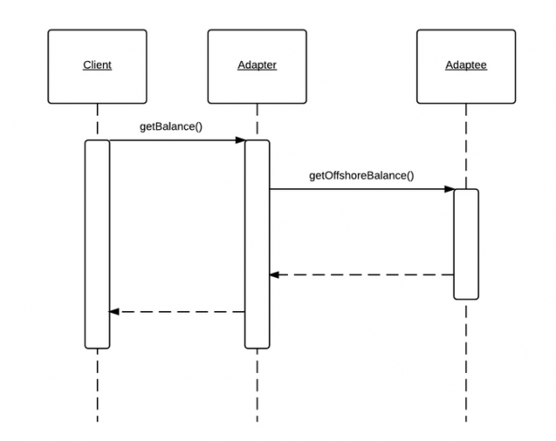
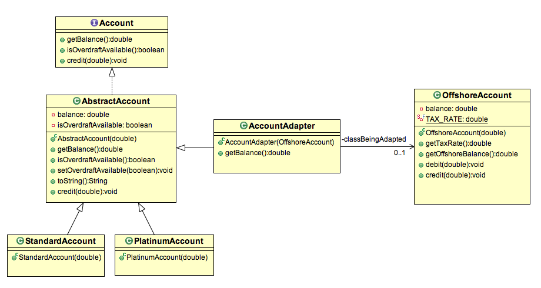

## 适配器模式

### 什么是适配器模式

- 适配器模式属于结构型模式，可以使得两个不匹配的接口可以协同工作。
- 适配器模式允许两个不匹配的类通过将其中一个接口类型转换成另一个客户端期望的接口类型，从而达到二者协同工作。
- 适配器模式也叫包装器。
适配器模式在 Gang of Four 书中原始的定义如下：
>将一个类的接口类型转换成另一个客户端期望的接口类型。
>适配器可以让多个类协同工作即使他们本来是不匹配的接口类型。

### 适配器模式的应用场景

- 考虑一个这样的场景，你在印度购买了一个轻便的笔记本，最近你刚搬到英国。但是英国的电子插座和印度的不一样。因此，你的笔记本不能直接工作了。
你必须去购买一个适配器，可以为你的印度笔记本可以在英国的插座上充电。

- 当你有一个需要与新系统集成的遗留接口时，新系统不能直接接收遗留库的工作方式。由于遗留库不再进行开发了，所以我们需要使用适配器促使两种不同的类型进行工作。

- 你使用 Mac 时，经常需要转接头才能连接到会议室的投影仪，这个转接头，就是适配器，使得原本 Mac 、投影仪互不相容的两个物件可以协同工作。

### 适配器模式的特点

- 客户端通过使用目标接口调用适配器的方法向适配器发起请求。
- 适配器通过适配器接口将请求转换成适配者的一个或多个调用。
- 客户端收到调用结果，并且不感知存在一个适配器在做这个转换工作。

### 何时使用适配器模式

- 如果你想要将已经存在的类和他们的接口类型去匹配你最后需要的接口类型，就可以使用适配器模式。
- 如果你想创建可重用类以帮助在不匹配的两个类之间进行接口式交互。

### 适配器模式示例

劳埃德银行是一家提供全球性服务的国际性银行。境外账户持有人的税率为 0.03%。
在印度，它提供2种类型的账户，普通和白金。税法不适用于印度账户。
现在离岸账户就匹配不了印度账户了。
所以需要设计出一个账户适配器 AccountAdapter 促使2种不同的账户类型还可以继续一块工作。

这个示例的交互图如下所示。
在这里，客户端仅仅需要调用适配器的 ```getBalance()``` 方法。
适配器调用适配者的 ```getOffshoreBalance()``` 方法并返回客户端期望的结果。
适配器内部的 getBalance() 方法将会通过扣除税金来计算账户余额。




这个对象适配器使用组合方式去将一个不匹配的接口适配到另一个接口。
适配器继承了客户端期望的目标接口，同时它持有适配者的一个实例。
这样使得客户端和适配者完全解耦。只有适配器知道它们两个（客户端、适配者）。




#### OffshoreAccount.java

```java
package org.byron4j.cookbook.designpattern.adapter;


/**
 * 离岸账户
 */
public class OffshoreAccount {

    private double balance;

    /**税率*/
    private static final double TAX_RATE = 0.04;

    public OffshoreAccount(final double balance) {
        this.balance = balance;
    }

    public double getTaxRate() {
        return TAX_RATE;
    }

    public double getOffshoreBalance() {
        return balance;
    }

    public void debit(final double debit) {
        if (balance >= debit) {
            balance -= debit;
        }
    }

    public void credit(final double credit) {
        balance += balance;
    }
}


```


#### Account.java

```java
package org.byron4j.cookbook.designpattern.adapter;

/**
 * 账户接口类型
 */
public interface Account {
    /**
     * 获取账户余额
     * @return
     */
    public double getBalance();

    /**
     * 是否可以透支
     * @return
     */
    public boolean isOverdraftAvailable();

    /**
     * 贷款; 贷款后账户余额增多
     * @param credit
     */
    public void credit(final double credit);
}


```

#### AbstractAccount.java

```java
package org.byron4j.cookbook.designpattern.adapter;

public class AbstractAccount implements Account {
    /**
     * 账户余额
     */
    private double balance;
    /**
     * 是否可以透支
     */
    private boolean isOverdraftAvailable;

    public AbstractAccount(final double size) {
        this.balance = size;
    }

    @Override
    public double getBalance() {
        return balance;
    }

    @Override
    public boolean isOverdraftAvailable() {
        return isOverdraftAvailable;
    }

    public void setOverdraftAvailable(boolean isOverdraftAvailable) {
        this.isOverdraftAvailable = isOverdraftAvailable;
    }

    @Override
    public String toString() {
        return getClass().getSimpleName() + " Balance=" + getBalance()
                + " Overdraft:" + isOverdraftAvailable();
    }

    @Override
    public void credit(final double credit) {
        balance += credit;
    }
}


```

#### PlatinumAccount.java

```java
package org.byron4j.cookbook.designpattern.adapter;

/**
 * 白金帐户: 可以透支
 */
public class PlatinumAccount extends AbstractAccount {

    public PlatinumAccount(final double balance) {
        super(balance);
        // 可以透支
        setOverdraftAvailable(true);
    }
}


```


#### StandardAccount.java

```java
package org.byron4j.cookbook.designpattern.adapter;

/**
 * 普通账户： 不能透支
 */
public class StandardAccount extends AbstractAccount {

    public StandardAccount(final double balance) {
        super(balance);
        // 不能透支
        setOverdraftAvailable(false);
    }
}


```

#### AccountAdapter.java

```java
package org.byron4j.cookbook.designpattern.adapter;

/**
 * 账户适配器； 适配器继承于目标账户。
 * 适配器（转接头）的目标是将离岸账户(会议室中的Mac电脑)转为 AbstractAccount(可以连接投影仪)
 */
public class AccountAdapter extends AbstractAccount {

    /**需要被适应的账户--适配者*/
    private OffshoreAccount offshoreAccount;

    /**
     *
     * @param offshoreAccount  适配者--会议室中的 mac 电脑
     */
    public AccountAdapter(final OffshoreAccount offshoreAccount) {
        super(offshoreAccount.getOffshoreBalance());

        // 适配器持有适配者的引用
        this.offshoreAccount = offshoreAccount;
    }

    /**
     * 计算扣除税款后的离岸账户余额
     * @return
     */
    @Override
    public double getBalance() {
        // 离岸税率
        final double taxRate = offshoreAccount.getTaxRate();

        // 离岸账户余额
        final double grossBalance = offshoreAccount.getOffshoreBalance();

        // 需要扣除的税款
        final double taxableBalance = grossBalance * taxRate;

        // 扣除离岸税款后的账户余额
        final double balanceAfterTax = grossBalance - taxableBalance;

        return balanceAfterTax;
    }
}


```

#### AdapterTest.java

```java

package org.byron4j.cookbook.designpattern;

import org.byron4j.cookbook.designpattern.adapter.AccountAdapter;
import org.byron4j.cookbook.designpattern.adapter.OffshoreAccount;
import org.byron4j.cookbook.designpattern.adapter.StandardAccount;
import org.junit.Test;

public class AdapterTest {
    @Test
    public void test(){
        StandardAccount sa = new StandardAccount(2000);
        System.out.println("Account Balance= " + sa.getBalance());

        //Calling getBalance() on Adapter
        AccountAdapter adapter = new AccountAdapter(new OffshoreAccount(2000));
        System.out.println("Account Balance= " + adapter.getBalance());
    }
}

```