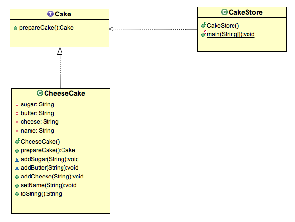

## 原型模式

### 什么是原型模式？

原型模式属于创造型模式。当要创建的对象类型可以由已经存在的原型对象确定时，就可以使用它。简单来说，使用原型模式，我们是通过clone已经存在的实例来完成的。

在 Java 中，创建一个实例是需要花费很大代价的,耗时耗资源。如果存在一种避免创建对象的处理方式，仅仅是复制已经存在的对象，何乐而不为？原型模式给出了这种解决方案。

### 什么时候使用原型模式？

- 当通过更改现有对象更新指定的对象时。
- 加速大型动态加载类的实例化

### 原型模式示例

汉普斯特德蛋糕公司是一家在伦敦非常有名的提供品质的生日芝士蛋糕公司。
对于每一个需要根据收货方姓名自定义的芝士蛋糕，它们的配料和口味是一样的。
蛋糕公司接到了大量的订单却难以送货，原因在于，为每个订单指定配料和制作奶酪蛋糕花费的时间太长。这样他们就不能生产足够的蛋糕。
如果仅仅是生产一个蛋糕，然后通过多次clone，然后再为每一个蛋糕自定义收货人姓名呢？




在这个示例中， ***CakeStore*** 类是客户端。客户端通过调用 ```prepareCake()``` 方法创建多个原型实例。

#### Cake.java

```java

package org.byron4j.cookbook.designpattern.prototype;

/**
 * 蛋糕的接口类型；可以clone
 */
public interface Cake extends  Cloneable{
    /**
     * 准备生产蛋糕
     * @return
     */
    public Cake prepareCake();
}

```


#### CheeseCake.java

```java

package org.byron4j.cookbook.designpattern.prototype;

import lombok.AllArgsConstructor;
import lombok.Builder;
import lombok.Data;

@AllArgsConstructor
@Data
@Builder
public class CheeseCake implements  Cake{

    /**
     * 糖果
     */
    private String sugar;

    /**
     * 黄油
     */
    private String butter;

    /**
     * 芝士
     */
    private String cheese;

    /**
     * 用户姓名
     */
    private String name;

    @Override
    public Cake prepareCake() {
        Cake cake = null;

        /**
         * 克隆存在的实例
         */
        try {
            cake = (Cake)super.clone();
        } catch (CloneNotSupportedException e) {
            e.printStackTrace();
        }
        return cake;
    }
}


```


#### CakeStore.java

```java
package org.byron4j.cookbook.designpattern.prototype;

public class CakeStore {
    public static void main(String[] args){
        CheeseCake cheeseCake = CheeseCake.builder()
                .sugar("100g")
                .butter("200g")
                .cheese("Acapella")
                .build();
        System.out.println("已存在的实例:" + cheeseCake);

        // 利用原型模式自定义多个蛋糕
        CheeseCake cheeseCake1 = (CheeseCake) cheeseCake.prepareCake();
        cheeseCake1.setName("Byron");
        System.out.println("原型模式的第一个实例:" + cheeseCake1);

        CheeseCake cheeseCake2 = (CheeseCake) cheeseCake.prepareCake();
        cheeseCake2.setName("Joy");
        System.out.println("原型模式的第二个实例:" + cheeseCake2);
    }
}


```

### 原型模式总结

- 创建新对象实例代价太高，所以使用clone已存在的实例对象来实现，clone得到的是已存在实例的副本
- 原型类使用接口，以便在多个不同具体实现中自由切换
- 接口类提供一个通用方法，提供clone实例完成原型模式的实现

