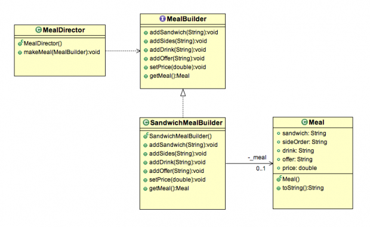

## 建造者模式

### 什么是建造者模式？

建造者模式属于创建型模式的一员，可以控制对象的实例化过程。
建造者模式简化了复杂对象的实例化过程。
建造者模式的经典定义如下：

>将复杂对象的构造和其表示分开，如此一来，相同的构造处理过程可以创建不同的表现。

### 建造者模式的特点

在Java中通过构造器创建对象实例时，我们一般会传递属性参数。会存在不同的参数组合去创建对象，并且其中一些是必须的还有一些是可选的。我们可以通过重载类的构造器来实现不同的参数组合。
建造者模式不适用大量的构造器，而是使用另一个对象，一个建造者builder，它会一步一步的接收每个初始化参数，并返回生成的构造对象。


### 建造者模式示例

让我们举一个咖啡馆准备晚餐的例子。为了准备一份晚餐，有很多步骤需要执行，比如，选择三明治、添加杂碎、饮料等等。
在这个过程中，可能会有不同的食物组合，这样看来，准备一顿晚餐比期望的要困难得多。
让我们用建造者模式来解决这个问题吧。

### 建造者模式类图



在这个类图中，描述了以下几点：

- ```MealBuilder``` 指定了创建晚餐中的一部分食物的的接口。
- ```SandwichMealBuilder``` 是一个具体的建造者，可以通过实现 ```MealBuilder``` 接口来构建和收集晚餐的部分食物。
- ```MealDirector``` 使用 ```MealBuilder``` 接口构造一个对象实例。
- ```Meal``` 是我们在这个过程中想创建的对象实例。


#### Meal.java

```java
package org.byron4j.cookbook.designpattern.builder;

/**
 * 晚餐实体类
 */
public class Meal {

    private String sandwich;
    private String sideOrder;
    private String drink;
    private String offer;
    private double price;

    @Override
    public String toString() {
        return "Meal{" +
                "sandwich='" + sandwich + '\'' +
                ", sideOrder='" + sideOrder + '\'' +
                ", drink='" + drink + '\'' +
                ", offer='" + offer + '\'' +
                ", price='" + price + '\'' +
                '}';
    }

    public void setSandwich(String sandwich) {
        this.sandwich = sandwich;
    }

    public void setSideOrder(String sideOrder) {
        this.sideOrder = sideOrder;
    }

    public void setDrink(String drink) {
        this.drink = drink;
    }

    public void setOffer(String offer) {
        this.offer = offer;
    }

    public void setPrice(double price) {
        this.price = price;
    }
}


```

#### MealBuilder.java

```java
package org.byron4j.cookbook.designpattern.builder;

/**
 * 建造者接口类
 */
public interface MealBuilder {

    void addSandwich(String sandwich);
    void addSides(String sides);
    void addDrink(String drink);
    void addOffer(String offer);
    void setPrice(double price);
    Meal getMeal();
}


```


#### SandwichBuilder.java

```java
package org.byron4j.cookbook.designpattern.builder;

/**
 * 建造者实现类
 */
public class SandwichBuilder implements MealBuilder{

    /**
     * 依赖组合模式， 该Builder的操作实际是对meal进行的操作
     */
    private Meal meal = new Meal();

    @Override
    public void addSandwich(String sandwich) {
        meal.setSandwich(sandwich);
    }

    @Override
    public void addSides(String sides) {
        meal.setSideOrder(sides);
    }

    @Override
    public void addDrink(String drink) {
        meal.setDrink(drink);
    }

    @Override
    public void addOffer(String offer) {
        meal.setOffer(offer);
    }

    @Override
    public void setPrice(double price) {
        meal.setPrice(price);
    }

    @Override
    public Meal getMeal() {
        return meal;
    }
}


```

#### MealDirector.java

```java
package org.byron4j.cookbook.designpattern.builder;

/**
 * 角色扮演： 咖啡餐馆
 */
public class MealDirector {

    public static void makeMeal(MealBuilder mealBuilder){
        mealBuilder.addSandwich("Hamburger");
        mealBuilder.addSides("Fries");
        mealBuilder.addDrink("Coke");
        mealBuilder.addOffer("Weekend Bonanza");
        mealBuilder.setPrice(5.99);
    }
}


``` 

#### BuilderTest.java

```java
package org.byron4j.cookbook.designpattern.builder;

/**
 * 角色扮演： 咖啡餐馆
 */
public class MealDirector {

    public static void makeMeal(MealBuilder mealBuilder){
        mealBuilder.addSandwich("Hamburger");
        mealBuilder.addSides("Fries");
        mealBuilder.addDrink("Coke");
        mealBuilder.addOffer("Weekend Bonanza");
        mealBuilder.setPrice(5.99);
    }
}


```

单元测试演示结果：
>建造者模式得到的对象实例：Meal{sandwich='Hamburger', sideOrder='Fries', drink='Coke', offer='Weekend Bonanza', price='5.99'}


### 经典建造者模式的缺点

通过上述示例，我们发现

- 经典建造者模式太过繁杂，需要编写的类太多了。
- 经典建造者模式将对象的构造、表示分离开来，具体的建造者实现类需要依赖于具体的目标对象（SandwichBuilder被迫依赖于Meal类）

### 实际中常用的建造者模式--反编译查看lombok框架生成的类

这里我们借助在原型模式中使用的一个芝士蛋糕类:

```java
package org.byron4j.cookbook.designpattern.prototype;

import lombok.AllArgsConstructor;
import lombok.Builder;
import lombok.Data;

@AllArgsConstructor
@Data
@Builder
public class CheeseCake implements  Cake{

    /**
     * 糖果
     */
    private String sugar;

    /**
     * 黄油
     */
    private String butter;

    /**
     * 芝士
     */
    private String cheese;

    /**
     * 用户姓名
     */
    private String name;

    @Override
    public Cake prepareCake() {
        Cake cake = null;

        /**
         * 克隆存在的实例
         */
        try {
            cake = (Cake)super.clone();
        } catch (CloneNotSupportedException e) {
            e.printStackTrace();
        }
        return cake;
    }
}


```

```CheeseCake``` 类使用了lombok框架的注解 **@Builder**。

使用JD-GUi反编译打开CheeseCake.class如下：

```java

package org.byron4j.cookbook.designpattern.prototype;

public class CheeseCake
  implements Cake
{
  private String sugar;
  private String butter;
  private String cheese;
  private String name;
  
  public CheeseCake(String sugar, String butter, String cheese, String name)
  {
    this.sugar = sugar;this.butter = butter;this.cheese = cheese;this.name = name;
  }
  
  public void setSugar(String sugar)
  {
    this.sugar = sugar;
  }
  
  public void setButter(String butter)
  {
    this.butter = butter;
  }
  
  public void setCheese(String cheese)
  {
    this.cheese = cheese;
  }
  
  public void setName(String name)
  {
    this.name = name;
  }
  
  public boolean equals(Object o)
  {
    if (o == this) {
      return true;
    }
    if (!(o instanceof CheeseCake)) {
      return false;
    }
    CheeseCake other = (CheeseCake)o;
    if (!other.canEqual(this)) {
      return false;
    }
    Object this$sugar = getSugar();Object other$sugar = other.getSugar();
    if (this$sugar == null ? other$sugar != null : !this$sugar.equals(other$sugar)) {
      return false;
    }
    Object this$butter = getButter();Object other$butter = other.getButter();
    if (this$butter == null ? other$butter != null : !this$butter.equals(other$butter)) {
      return false;
    }
    Object this$cheese = getCheese();Object other$cheese = other.getCheese();
    if (this$cheese == null ? other$cheese != null : !this$cheese.equals(other$cheese)) {
      return false;
    }
    Object this$name = getName();Object other$name = other.getName();return this$name == null ? other$name == null : this$name.equals(other$name);
  }
  
  protected boolean canEqual(Object other)
  {
    return other instanceof CheeseCake;
  }
  
  public int hashCode()
  {
    int PRIME = 59;int result = 1;Object $sugar = getSugar();result = result * 59 + ($sugar == null ? 43 : $sugar.hashCode());Object $butter = getButter();result = result * 59 + ($butter == null ? 43 : $butter.hashCode());Object $cheese = getCheese();result = result * 59 + ($cheese == null ? 43 : $cheese.hashCode());Object $name = getName();result = result * 59 + ($name == null ? 43 : $name.hashCode());return result;
  }
  
  public String toString()
  {
    return "CheeseCake(sugar=" + getSugar() + ", butter=" + getButter() + ", cheese=" + getCheese() + ", name=" + getName() + ")";
  }
  
  public static class CheeseCakeBuilder
  {
    private String sugar;
    private String butter;
    private String cheese;
    private String name;
    
    public String toString()
    {
      return "CheeseCake.CheeseCakeBuilder(sugar=" + this.sugar + ", butter=" + this.butter + ", cheese=" + this.cheese + ", name=" + this.name + ")";
    }
    
    public CheeseCake build()
    {
      return new CheeseCake(this.sugar, this.butter, this.cheese, this.name);
    }
    
    public CheeseCakeBuilder name(String name)
    {
      this.name = name;return this;
    }
    
    public CheeseCakeBuilder cheese(String cheese)
    {
      this.cheese = cheese;return this;
    }
    
    public CheeseCakeBuilder butter(String butter)
    {
      this.butter = butter;return this;
    }
    
    public CheeseCakeBuilder sugar(String sugar)
    {
      this.sugar = sugar;return this;
    }
  }
  
  public static CheeseCakeBuilder builder()
  {
    return new CheeseCakeBuilder();
  }
  
  public String getSugar()
  {
    return this.sugar;
  }
  
  public String getButter()
  {
    return this.butter;
  }
  
  public String getCheese()
  {
    return this.cheese;
  }
  
  public String getName()
  {
    return this.name;
  }
  
  public Cake prepareCake()
  {
    Cake cake = null;
    try
    {
      cake = (Cake)super.clone();
    }
    catch (CloneNotSupportedException e)
    {
      e.printStackTrace();
    }
    return cake;
  }
  
  private CheeseCake() {}
}

```

#### 分析反编译后的使用@Builder注解的类


##### CheeseCake的全参构造器

我们发现存在一个全参构造器

```java
public CheeseCake(String sugar, String butter, String cheese, String name)
  {
    this.sugar = sugar;this.butter = butter;this.cheese = cheese;this.name = name;
  }

```

##### 静态内部类 CheeseCakeBuilder

我们发现生成了一个 静态内部类 CheeseCakeBuilder:

```java

public static class CheeseCakeBuilder
  {
    private String sugar;
    private String butter;
    private String cheese;
    private String name;
    
    public String toString()
    {
      return "CheeseCake.CheeseCakeBuilder(sugar=" + this.sugar + ", butter=" + this.butter + ", cheese=" + this.cheese + ", name=" + this.name + ")";
    }
    
    public CheeseCake build()
    {
      return new CheeseCake(this.sugar, this.butter, this.cheese, this.name);
    }
    
    public CheeseCakeBuilder name(String name)
    {
      this.name = name;return this;
    }
    
    public CheeseCakeBuilder cheese(String cheese)
    {
      this.cheese = cheese;return this;
    }
    
    public CheeseCakeBuilder butter(String butter)
    {
      this.butter = butter;return this;
    }
    
    public CheeseCakeBuilder sugar(String sugar)
    {
      this.sugar = sugar;return this;
    }
  }
```

- 目标类CheeseCake拥有一个获取其builder的方法返回 CheeseCakeBuilder对象。
- CheeseCakeBuilder 内部类拥有和目标类 CheeseCake 一样的属性。
- build() 方法调用目标类 CheeseCake 的全参构造器得到一个 CheeseCake 对象。
- 每一个方法设置属性值时，同时返回builder对象。


这样我们创建 CheeseCake 对象时：

```java
CheeseCake cheeseCake = CheeseCake.builder()
                .sugar("100g")
                .butter("200g")
                .cheese("Acapella")
                .build();

```

个人感觉这是建造者模式一个很好的改良方案，简单易用。