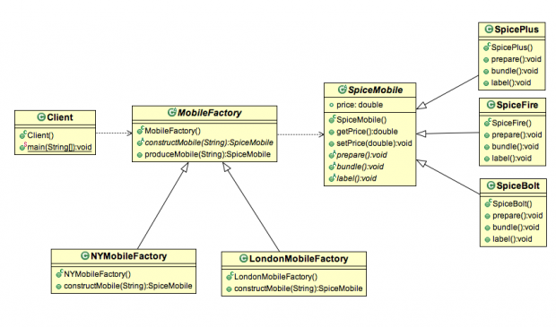

## 工厂方法设计模式

软件系统经常不断变化，而且不稳定。我们必须考虑对象和关系的松耦合。
松耦合是软件设计时一个非常重要的特性，可以帮助系统不做或者做很少的变更就能扩展新功能。

>工厂方法设计模式提供了一种将一个对象实例作为一个对象工厂的方式。
>工厂可以根据提供给它的参数返回类层次结构中可能的几个类中一个类实例。


工厂设计模式属于创造型模式。工厂设计模式分为**简单工厂**、**工厂方法**和**抽象工厂设计模式**。

- **简单工厂设计模式**：简单工厂并不是严格意义上的设计模式。它更多的是一种用于封装对象实例化过程的编程技术。
- **工厂方法设计模式**：定义了一个创建对象的接口，决定哪个类实例化，工厂方法允许将类的实例化延迟到子类。
- **抽象工厂设计模式**：提供一个接口，用于创建相关或依赖对象，而无需指定它们。


### 工厂设计模式的好处

- 客户端不需要知道它创建的每一个子类。仅仅需要一个抽象类或者接口的引用和工厂对象。
- 工厂封装了对象的创建。当创建过程非常复杂的时候，这是非常有用的。


### 简单工厂模式

Spice Digital Inc.是印度最大的智能手机制造商之一。他们是在印度市场生产和销售智能手机的先锋。
目前，他们拥有两种成功的产品 SpiceFire  和 SpiceBolt。 ```productMobile()``` 方法可以根据它们的型号生产不同的手机。
现在的实现是这样的：

```java

public SpiceMobile produceMobile(String model) {
		SpiceMobile mobile = null;

		if (model.equalsIgnoreCase("SpiceBolt")) {
			mobile = new SpicePlus();
		} else if (model.equalsIgnoreCase("SpiceFire")) {
			mobile = new SpiceBolt();
		}
		mobile.prepare();
		mobile.bundle();
		mobile.label();

		return mobile;
}

```

SpiceMobile 的实现:

```java
public abstract class SpiceMobile {
	public abstract void prepare();
	public abstract void bundle();
	public abstract void label();
}

public class SpiceFire extends SpiceMobile {
	@Override
	public void prepare() {
	}

	@Override
	public void bundle() {
	}

	@Override
	public void label() {
	}
}

public class SpiceBolt extends SpiceMobile {

	@Override
	public void prepare() {
	}

	@Override
	public void bundle() {
	}

	@Override
	public void label() {
	}
}

```

上述实现方式存在的问题：

- 上述实现目前工作的很欢快。但是，在某个时间点，这家公司想要发行一个新的产品到市场的时候，他们必须去修改 ```produceMobile()``` 方法的代码。
- 上述设计扩展性是非常差的，封闭改造。
- 每当添加新产品时，都会增加代码重构的复杂性。

### 工厂设计模式示例

上面的例子在生产手机方面确认是很有效。但是，我们也提出了一些问题。现在我们给上面的需求添加一些复杂的功能。
Spice Digital Inc. 公司现在决定发展全球业务了。它们想扩展在伦敦和纽约的业务。根据市场需求，在伦敦只会生产 SpiceBolt、SpiceFire，而在纽约则会生产 SpiceFire和SpicePlus。
现在，用例图就变得复杂了，我们看一下下面使用工厂设计模式的类图吧：



#### SpiceMobile.java

```java

package org.byron4j.cookbook.designpattern.factory;

public abstract  class SpiceMobile {
    public double price;

    public double getPrice() {
        return price;
    }

    public void setPrice(double price) {
        this.price = price;
    }

    public abstract void prepare();
    public abstract void bundle();
    public abstract void label();
}

```

现在来创建3种不同的Spice Mobile实现。为了方便演示，SpiceBolt、SpiceFire 和 SpicePlus 这三个实现类都是一样的代码，就不全部展示了。


#### SpiceBolt.java

```java

package org.byron4j.cookbook.designpattern.factory;

public class SpiceBolt extends  SpiceMobile {
    @Override
    public void prepare() {

    }

    @Override
    public void bundle() {

    }

    @Override
    public void label() {

    }
}

``` 


#### MobileFactory.java

```java

package org.byron4j.cookbook.designpattern.factory;

public abstract  class MobileFactory {
    public abstract SpiceMobile constructMobile(String model);

    /**
     * 这可以算是模板方法了...^_*
     * @param model
     * @return
     */
    public SpiceMobile produceMobile(String model){
        SpiceMobile spiceMobile = constructMobile(model);
        spiceMobile.prepare();
        spiceMobile.bundle();
        spiceMobile.label();
        return spiceMobile;
    }
}

```

#### LondonMobileFactory.java

```java

package org.byron4j.cookbook.designpattern.factory;

public class LondonMobileFactory extends  MobileFactory {
    @Override
    public SpiceMobile constructMobile(String model) {
        SpiceMobile spiceMobile = null;

        if( "SpiceFire".equalsIgnoreCase(model) ){
            spiceMobile = new SpicePlus();
            spiceMobile.setPrice(300);
        }else if("SpiceBolt".equalsIgnoreCase(model)){
            spiceMobile = new SpiceBolt();
            spiceMobile.setPrice(400);
        }
        
        return spiceMobile;
    }
}


```

####  NYMobileFactory.java

```java
package org.byron4j.cookbook.designpattern.factory;

public class NYMobileFactory extends  MobileFactory {
    @Override
    public SpiceMobile constructMobile(String model) {
        SpiceMobile spiceMobile = null;

        if( "SpiceFire".equalsIgnoreCase(model) ){
            spiceMobile = new SpicePlus();
            spiceMobile.setPrice(200);
        }else if("SpiceMono".equalsIgnoreCase(model)){
            spiceMobile = new SpiceFire();
            spiceMobile.setPrice(200);
        }

        return spiceMobile;
    }
}


```

#### FactoryTest.java

```java
package org.byron4j.cookbook.designpattern;

import org.byron4j.cookbook.designpattern.factory.LondonMobileFactory;
import org.byron4j.cookbook.designpattern.factory.MobileFactory;
import org.byron4j.cookbook.designpattern.factory.NYMobileFactory;
import org.byron4j.cookbook.designpattern.factory.SpiceMobile;
import org.junit.Test;

public class FactoryTest {

    @Test
    public void test() {
        MobileFactory factory = new LondonMobileFactory();
        SpiceMobile spiceMobile1 = factory.produceMobile("SpiceFire");
        System.out.println(spiceMobile1);

        MobileFactory factory2 = new NYMobileFactory();
        SpiceMobile spiceMobile2 = factory2.produceMobile("SpiceMono");
        System.out.println(spiceMobile2);

    }
}


```

#### 工厂方法模式的好处

工厂方法模式增强了可扩展性，现在如果Spice Digital Inc. 公司需要在其他城市扩展业务，则只需要新增加一个新的工厂实现即可。