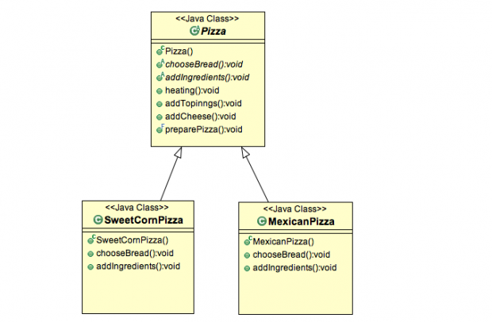

## 模板模式

模板模式属于行为模式，它定义了一系列的算法步骤，允许子类提供一个或多个步骤的自己实现。
模板设计模式最大程度上实现了代码的可重用性。

### 模板模式的工作方式

- 定义一个附带全部限定的方法，包含了通用实现的业务逻辑。
- 声明需要被子类重写的指定行为的方法
- 在父类中声明的**模板方法**，包含了核心算法和实现步骤
- 派生类（子类）可以覆盖占位符方法。
- 派生类（子类）可以覆盖父类已经实现的方法

### 模板模式用例

我们来看一个关于披萨店的实例。
披萨的制作步骤包含：
选择面包、添加配料、加热、添加配料等。所有的这些步骤都是有顺序的。
我们用模板模式来实现这个用例。



- 我们定义了一个所有披萨实现的抽象类 ```Pizza``` 。 披萨店现在提供两种类型的披萨： ```SweetCornPizza``` 和 ```MexicanPizza``` 。这两个类均实现了 Pizza 这个类。
- Pizza 类包含 ```chooseBread()```、```addIngredients()``` 抽象方法。每一个 Pizza 实现都会覆盖它们，提供指定的业务逻辑实现。
- ```heating()```、```addTopinngs()``` 和 ```addCheese()``` 方法对于所有的Pizza都是通用的，因此他们使用的是父类中的实现。
- 注意到  preparePizza() 方法被声明为final类型的，因为我们不想client去变更pizza的准备步骤。

这就是我们使用模板模式的所有步骤和注意事项。

#### Pizza.java

```java
public abstract class Pizza {
	public abstract void chooseBread();
	public abstract void addIngredients();

	public void heating() {
		System.out.println("Heating for 10 minutes!");
	}

	public void addTopinngs() {
		System.out.println("Adding Topinngs!");
	}

	public void addCheese() {
		System.out.println("Adding Cheese!");
	}

	// Template method
	public final void preparePizza() {
		chooseBread();
		addIngredients();
		heating();
		addCheese();
		addTopinngs();
	}
}

```


#### SweetCornPizza.java

```java

public class SweetCornPizza extends Pizza {
	@Override
	public void chooseBread() {
		System.out.println("Choosing SweetCorn Pizza Bread!");
	}

	@Override
	public void addIngredients() {
		System.out.println("Adding SweetCorn Pizza Ingredients!");
	}
}
```


#### MexicanPizza.java

```java
public class MexicanPizza extends Pizza {
	@Override
	public void chooseBread() {
		System.out.println("Choosing Mexican Pizza Bread!");
	}

	@Override
	public void addIngredients() {
		System.out.println("Adding Mexican Pizza Ingredients!");
	}
}

```

#### StrategyTest.java

```java
package org.byron4j.cookbook.designpattern;

import org.byron4j.cookbook.designpattern.strategy.InsertionSort;
import org.byron4j.cookbook.designpattern.strategy.SelectionSort;
import org.byron4j.cookbook.designpattern.strategy.SortingContext;
import org.junit.Test;

public class StrategyTest {

    @Test
    public void test(){
        int numbers[] = {20, 50, 15, 6, 80};

        SortingContext context = new SortingContext();
        context.setSortingMethod(new InsertionSort());
        context.sortNumbers(numbers);

        System.out.println("***********");
        context.setSortingMethod(new SelectionSort());
        context.sortNumbers(numbers);

    }
}


```

>Insertion Sort!
 >[6, 15, 20, 50, 80]
 >***********
 >Selection Sort!
 >[6, 15, 20, 50, 80]
