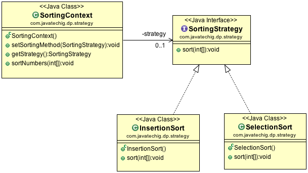

## 策略模式

策略模式属于行为模式，可以在运行时不修改类本身而通过变更内部算法来处理类的行为变更。这允许对象的可扩展性和松耦合性。
经典定义如下:
>定义一系列封装的算法，可以交换这些算法来执行特定的行为。

### 用例

解压软件例如 WinZip，提供了不同的算法去处理 gip、gzip、tar、jar、7zip格式。
在运行时，客户端选择了要执行的算法类型。
Email 客户端像 outlook 支持很多类型的邮件类型例如 HTML 类型。允许客户端选择 email 格式。

### 策略模式是怎样工作的？ 

策略模式是简单而流行的模式，经常与状态模式一起使用。
以下是创建策略设计模式的步骤：

- 1.为你的策略对象实现一个策略接口，这个接口定义了策略对象的行为。
- 2.实现具体的策略类（实现了 定义了上述步骤的策略接口）
- 3.创建一个上下文类，并且维护策略对象的引用。创建getter、setter方法，允许访问策略对象。

### 策略模式示例

我们来看一个示例，演示多种不同的排序算法例如插入排序、选择排序、归并排序等。允许客户端选择他们喜欢的排序类型。
类图如下：



#### SortingStrategy.java

```java
public interface SortingStrategy {

	public void sort(int[] numbers);

}

```

#### SelectionSort.java

```java
public class SelectionSort implements SortingStrategy {

	@Override
	public void sort(int[] numbers) {
		System.out.println("Selection Sort!");

		int i, j, first, temp;
		for (i = numbers.length - 1; i > 0; i--) {
			first = 0;
			for (j = 1; j <= i; j++) {
				if (numbers[j] > numbers[first])
					first = j;
			}
			temp = numbers[first];
			numbers[first] = numbers[i];
			numbers[i] = temp;
		}
		
		System.out.println(Arrays.toString(numbers));
	}
}

```

#### InsertionSort.java

```java
public class InsertionSort implements SortingStrategy {

	@Override
	public void sort(int[] numbers) {
		System.out.println("Insertion Sort!");

		for (int i = 1; i < numbers.length; i++) {
			int temp = numbers[i];
			int j;
			for (j = i - 1; (j >= 0) && (numbers[j] > temp); j--) {
				numbers[j + 1] = numbers[j];
			}
			numbers[j + 1] = temp;
		}

		System.out.println(Arrays.toString(numbers));
	}
}

```

#### SortingContext.java

```java
public class SortingContext {
	
	private SortingStrategy strategy;
	
	public void setSortingMethod(SortingStrategy strategy) {
		this.strategy = strategy;
	}
	
	public SortingStrategy getStrategy() {
		return strategy;
	}
	
	public void sortNumbers(int[] numbers){
		strategy.sort(numbers);
	}
}

```